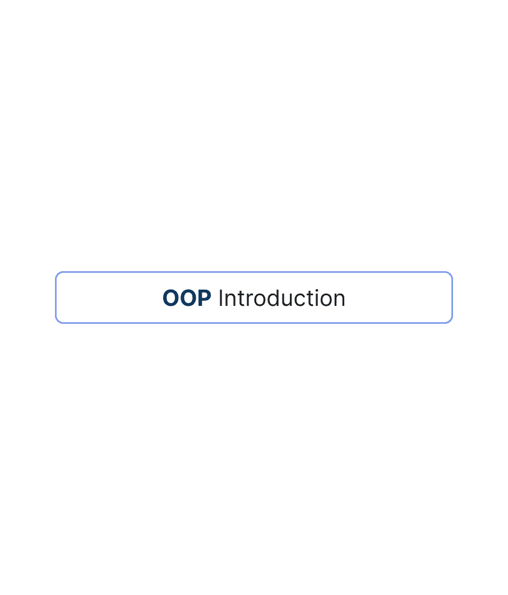

# 面向对象编程基础

> 原文：<https://blog.devgenius.io/object-oriented-programming-basics-e45f4f999fc5?source=collection_archive---------5----------------------->

我们都想学习更多关于面向对象编程的知识，它是什么，是什么让它如此伟大；在这篇文章中，我们将讨论基础知识。

首先，什么是 OOP？这是一个基于“对象”概念的编程范例，汽车是一个具有颜色和重量等属性以及传输换档等行为的对象，我们可以用一个具有汽车属性及其行为(功能)的汽车类来表示。

因此，在这篇短文中，我综合了我从其他文章和书籍中学到的东西。

**基本术语:**

# 对象:

它是一个类的实例，是一个类的工作实体。

# 类别:

它是关于一个对象能做什么的能力的模板或蓝图。

# 方法:

一个班级的行为。它告诉我们一个方法能做什么。

# 实例:

对象和实例都是相同的，只有很小的不同。

# 哎呀概念:

1.  包装
2.  抽象
3.  多态性
4.  遗产

# 封装:

封装是一种将数据(实例变量)和对数据进行操作的代码(方法)封装为单个实体的方式，类似于类。

封装的主要目的是通过使用代码来完全控制数据。

封装允许一个类的变量对其他类隐藏，并且只能通过其当前类的方法来访问。

因此，它有时被称为数据隐藏。

# 抽象:

抽象是对用户隐藏实现细节以便只提供功能的过程。

换句话说，用户将获得对象做什么的信息，而不是它如何做的信息。

抽象有两种类型:

1.  控制抽象。
2.  数据抽象。

## 控制抽象:

控制抽象是编程语言的主要功能之一。计算机设备理解最基本的操作，例如将位从内存中的一个位置移动到另一个位置，并将两个位序列相加。多亏了编程语言，这在更高的层次上是可能的。

## **数据抽象:**

数据抽象是定义数据结构行为的过程。

在具体实现中，数据可以以各种方式在内部表示。

简而言之:数据抽象指的是定义数据结构的行为。在具体实现中，数据可以以不同的方式在内部表示。

示例:集合，数组列表

*   封装和抽象概念之间的区别在于，封装是关于类的封装(比如应该如何访问数据(setter/getter)以及应该访问什么数据(访问说明符))，而抽象更多的是关于类在概念层面上为你做什么。
*   封装是将不必要的数据隐藏在胶囊或单元中，而抽象是显示对象的本质特征
*   抽象包括封装、信息隐藏和概括。
*   抽象是概括的一种形式:编写适用于多种特定情况的代码。
*   抽象就是你只关注那些对你的目的重要的细节。
*   继承也是抽象的一个例子。
*   **封装导致抽象**

# 继承:

继承可以定义为一个类获取另一个类的属性(方法和字段)的过程。

## 继承的类型:

1.  单一遗传
2.  多重遗传
3.  多层次继承
4.  分层继承
5.  混合遗传

# 多态性:

多态性(来自希腊语，意为“具有各种形式”)是在不同环境下赋予事物不同含义或用法的能力，特别是允许一个实体(如函数或对象)具有一种以上的形式。

有两种类型的多态性:

1.  静态多态性
2.  动态多态性

**静态多态性是发生在编译时的多态性，动态多态性是发生在运行时(应用程序执行期间)的多态性**。静态多态性的一个方面是早期绑定。在早期绑定中，要调用的特定方法是在编译时解析的。

多态的工作可以用两种不同的方式来处理；

1.  方法重载
2.  方法覆盖

## 方法覆盖

实现运行时多态性

这在子类从父类继承的方法不适合子类的情况下使用。也就是说，我们必须在子类中重新实现这个方法。

你想改变行为或扩展它。相同的签名不同的功能。

当超类和子类中的方法签名(名称和参数)相同时，这被称为覆盖。

## 方法重载

实现编译时多态性

在编程中，重载指的是一个方法根据传递给它的参数以不同方式运行的能力。

当同一个类中的两个或更多的方法有相同的名字但是不同的参数，甚至不同的返回类型，这就叫做重载。

## 重写与重载

1.  重写实现运行时多态性，而重载实现编译时多态性。
2.  方法覆盖发生在超类和子类之间。同一类中的方法之间会发生重载。
3.  重写方法具有相同的签名，即相同的名称和方法参数。重载方法名称相同，但参数不同。
4.  对于重载，要调用的方法是在编译时确定的。通过重写，方法调用在运行时根据对象类型来确定。
5.  如果覆盖中断，它会在我们的程序中引起严重的问题，因为这种影响在运行时是可见的。反之，如果重载中断，编译时错误就会出现，而且很容易修复。

# 摘要

至此，您已经掌握了基本知识！

我希望你喜欢这篇文章！