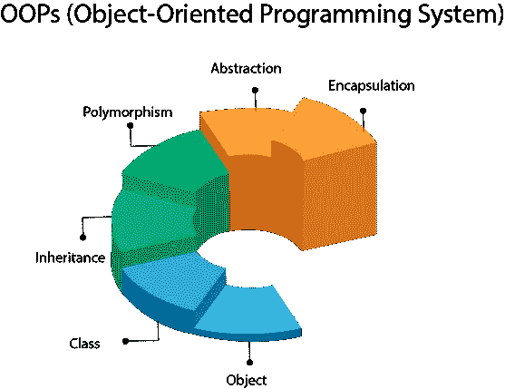
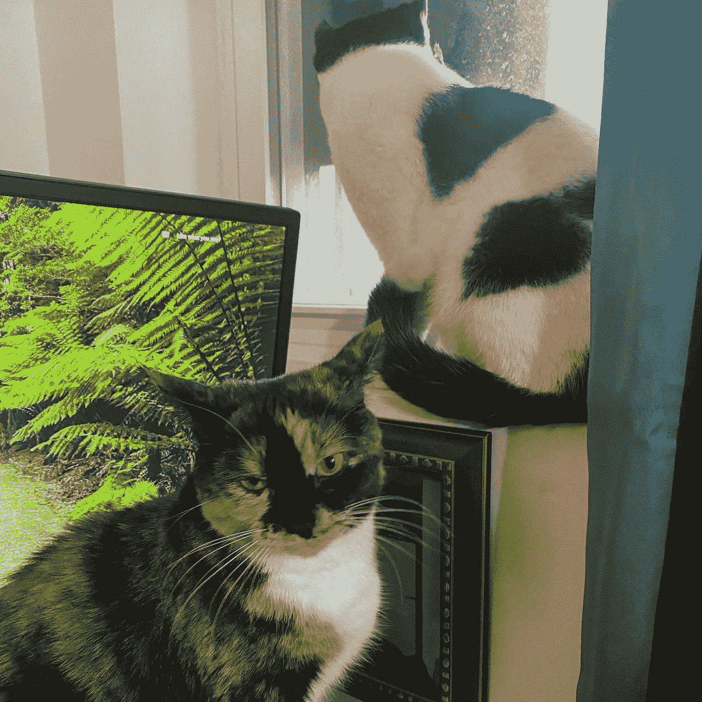
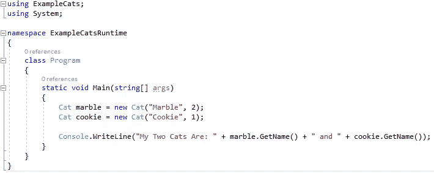
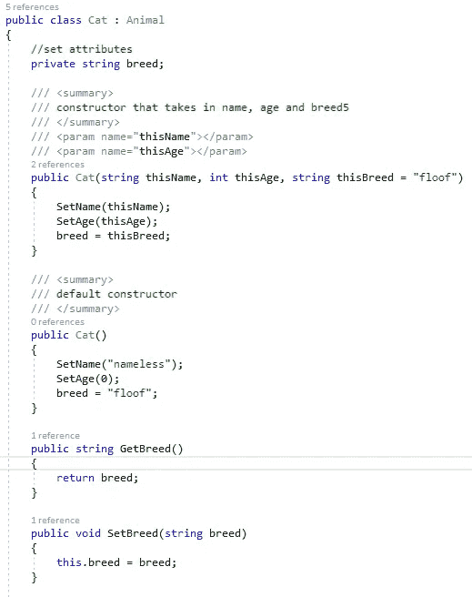
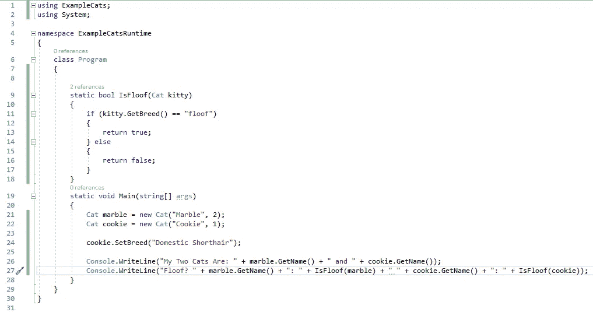

# 面向对象编程

> 原文：<https://blog.devgenius.io/object-oriented-programming-f0107bf139c8?source=collection_archive---------4----------------------->

## 例子和猫

从基础到支柱

*面向对象编程(OOP)* 是一种编程范式，它允许你将相似的数据保存在一起，并提供修改数据的能力，同时将细节隐藏在所谓的黑盒中。这使得创建模块化、易于维护和抽象的代码成为可能，这在创建大型程序时特别有用。听起来不错，对吧？让我们回顾一下 OOP 中一些最重要的概念。在这里，我将使用 C#作为例子，但是这些原则几乎适用于你能找到的任何面向对象的编程语言。

让我们从头开始。首先要考虑的概念是对象和类。我个人喜欢用两种方式来思考对象:作为一个变量和函数(或方法)的桶，以及作为一个类的*实例*。现在，如果一个对象是一个特定的东西，那么类就是这个东西所属的类别。考虑一下:我有两只猫，大理石和饼干。它们……显然不是同一只猫，但它们都是猫。

大理石(左)和饼干(右){关注 insta @ marblecakethecat}

在这个例子中，这个类是 Cat，这个类的实例，也称为 objects，是两只猫 Marble 和 Cookie。如果我们假设类 Cat 具有名称和年龄的属性(桶中的变量),则代码如下所示:

上面有很多东西我们现在不需要担心。上面代码片段中最重要的部分是以 Cat 开头的代码行。在这里，我们创建了两个名为 marble 和 cookie 的 Cat 类型的变量，并设置了它们各自的名称和年龄。为了好玩，我们可以把他们两个的名字写到控制台上！让我们看看 Cat 类，看看我们能从中获得什么。

好的，在左边我们有很多有趣的东西可以看！您应该注意的第一件事是类名 Cat 后面的花哨冒号。这在 C#中告诉我们，猫类是从动物类继承而来的。那是什么意思？首先，请注意年龄和姓名在 Cat 中没有定义。那是因为它们是猫*从其母动物那里继承*的属性。我们在这里也没有明确定义 Set/GetAge 或 Set/GetName，因为它们也属于 Animal。

现在，这一套/得到胡说八道是怎么回事？我们也有它的品种属性！为什么我们不能直接访问变量呢？我们不能这样做，因为在我们的变量名前面有花哨的私有关键字。这些*访问说明符*就是 C#如何实现我们今天要讨论的第二个原则:封装！这是将变量封装在一个逻辑包中的过程。我们的类是公共的，因为我从我的解决方案中的另一个项目访问它。我们的实例变量是私有的，这是最佳实践，然后用 getters 和 setters 访问/更改。例如，我可以将 breed 变量设为只读，换句话说，我可以删除 setter 方法。

这里的封装与*抽象*我们的数据并把它或多或少放在一个需要知道的情况下密切相关。这里的抽象还允许我们将类作为某种黑盒，让我们使用它们，而不需要我们知道类的内部工作原理。

您可以注意到的最后一件有趣的事情是，我们的 cat 类有两个构造函数，一个有两个必需的属性，一个是可选的，还有一个构造函数没有必需的属性。这是我们将在本文中讨论的最后一个原则的一个很好的例子，*多态性*。多态性允许我们有多个同名的函数，它们接受不同类型或不同数量的参数，甚至做完全不同的事情！

好了，你知道了。简单地说，面向对象编程。我将留给你们一个有趣的小控制台应用程序，这是我在这节课结束时使用的:

