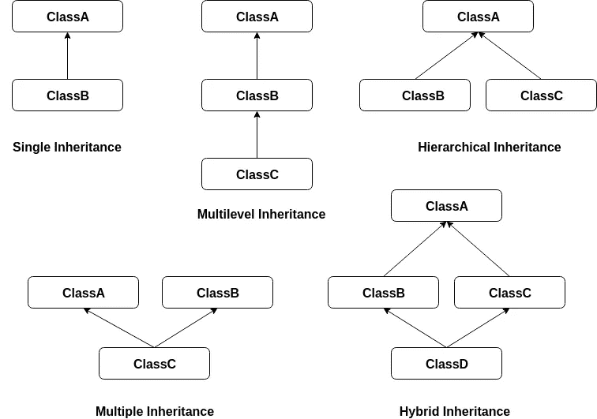

# Java 中的面向对象编程

> 原文：<https://blog.devgenius.io/object-oriented-programming-in-java-57202e7c0abd?source=collection_archive---------5----------------------->

在本文中，我们将探讨与 OOP 相关的各种概念。


除了目前可用的各种编程语言之外，我们还有不同风格的编程来完成不同的任务。这些编程风格被称为编程范例。查看我的另一篇[文章](https://medium.com/@ronij.2508/programming-languages-and-their-types-d6aa9f7a361b?source=friends_link&sk=f4f48c4fb26b06d5e59483513854a93d)，详细了解各种可用范例及其用途。

在开始讨论面向对象编程之前，让我们先想想什么是“对象”。一般的答案是“任何可以被感官感知的东西”。

让我们把“花”看作一个物体。我们可以通过花的某些特性来描述它，如颜色、气味、花瓣数量等。同样，我们可以用每个物体所具有的一些性质来描述它们。

有许多对象具有特定的属性并执行特定的操作。例如，考虑一只鸟。它们有某些特性，如腿、翅膀、喙、颜色等，还能完成某些动作，如飞行、唱歌和进食。

从这些观察中，我们可以说一个物体具有某些属性并执行某些动作。与真实世界的对象类似，我们在计算机世界中有对象，它们具有属性(以数据的形式)并执行某些操作(以方法或过程的形式)。

# 面向对象的四大支柱

面向对象编程(OOP)是一种基于“对象”概念的编程风格。既然我们知道了对象是什么，那么让我们了解一下面向对象编程所基于的四个原则。


我们将详细了解这些原则以及它们在 **Java** 中的实现。如果你对 Java 不熟悉，可以忽略代码，只看一下上面提到的概念，因为它们并不特定于任何特定的语言。

# 包装

当我们提到一个对象时，我们不是指它的特定属性或它执行的某些特定操作。我们将它的所有属性和行为视为一个整体。在某种程度上，这就像把它们都放在一个胶囊里，称之为一个对象。这在技术上叫做封装。

> 封装是将数据(变量)和作用于数据(方法)的代码作为一个单元包装在一起的机制。

让我们把笔记本电脑当作一个对象。你可能知道笔记本电脑由各种部件组成，如处理器、硬盘、内存等。当它们组合在一起时，我们统称它们为笔记本电脑。


Java 本身的语法支持封装。在 Java 中，数据和方法的包装容器被称为**类**。它被认为是一个蓝图，从这里使用`**new**`操作符创建单个对象。Java 中的类定义应该是这样的。

```
class Laptop
{
    Processor processor;
    RAM ram;
    HardDiskDrive hdd;
    // other compononts
    // methods
}
```

在下面的代码中使用 laptop 类创建 laptop 对象。

```
class ComputerWorld {
   public static void main(String []args) {
      Laptop laptop1 = new Laptop();
      Laptop laptop2 = new Laptop();
   }
}
```

# 抽象

许多物体，如汽车、咖啡机或简单的一支笔，隐藏了它们的内部细节和工作机制。这使得使用这些对象变得容易。你根本不用担心汽车的引擎是如何工作的，或者刹车系统是如何工作的，相反，你可以专注于你的驾驶。

> 抽象是对用户隐藏实现细节的过程。

考虑到我们的笔记本对象，我们可以很容易地看到工作中的抽象。向用户提供输入设备(例如键盘、鼠标)和一些输出设备(例如显示器、扬声器),并且从中抽象出如何处理和存储数据的内部工作。

在 Java 中，抽象是通过使用**抽象**类和**接口**实现的。让我们为我们的笔记本对象创建一个接口。

```
interface LaptopInterface{  
   void takeInputFromKeyboard();
   void printOnScreen();
}
```

现在这个接口可以由 Laptop 类实现了。

```
class Laptop implements LaptopInterface
{
    // Laptop properties
    Processor processor;
    RAM ram;
    HardDiskDrive hdd;

    // Laptop Actions
    public void takeInputFromKeyboard(){
        // complex logic
    }
    public void printOnScreen(){
        // complex logic
    }
    public void otherComplexOperations(){
        // complex logic
    }
}
```

由于 Laptop 类实现了 LaptopInterface，我们可以使用该接口只向用户提供`takeInputFromKeyboard()`和`printOnScreen()`方法，并隐藏其他方法，如`otherComplexOperations()`。代码看起来像下面这样。

```
class ComputerWorld {
   public static void main(String []args) {
      // making objects
      LaptopInterface laptop1 = new Laptop();

      // performing actions
      laptop1.takeInputFromKeyboard();
      laptop1.printOnScreen();

      // but we cannot access this
      laptop1.otherComplexOperations();  // shows error
   }
}
```

# 多态性

*多态性*这个词的意思是有多种形式。我们也可以在现实世界的物体中看到这一点，例如，考虑一个当老师的人。对学生来说，这个人是老师，而在家里，这个人可能是他/她的孩子的父母。同一个人也是一个国家的公民。因此，我们可以看到，一个人通过与不同对象的不同关系来表达多态性的概念。


在 Java 中，我们可以通过两种不同的方式实现多态性。第一种方式是使用一个父类引用(Person)来引用子类对象(教师、家长、公民)。这种类型的多态性被称为**运行时多态性**(或**动态多态性**)，这是通过一个叫做 [**方法覆盖**](https://en.wikipedia.org/wiki/Method_overriding) 的概念实现的。

实现多态性的第二种方法是使用 [**方法重载**](https://en.wikipedia.org/wiki/Function_overloading) 的概念，这意味着在一个类中存在几个名称相同但类型/顺序/参数数量不同的方法。这被称为**编译时多态性**(或**静态多态性**)。

> 在编程语言中，**多态性**是为不同类型的对象提供一个单一的接口，或者使用一个单一的符号来表示多个不同的类型。

考虑以下用于求三角形面积的实现。它显示了*静态多态*通过调用`area()`函数使用两种不同的方法来寻找面积。

```
class Triangle
{
    // method 1
    static double area(double width, double height)
    {
        return (width*height)/2;
    }

    // method 2
    static double area(double side1, double side2, double side3)
    {
        double s = (side1+side2+side3)/2;
        return Math.sqrt(s*(s-side1)*(s-side2)*(s-side3));;
    }

    public static void main(String []args) 
    {
        System.out.println(area(5,3));  // calls method 1
        System.out.println(area(10,10,10));  // calls method 2
    }
}
```

# 遗产

继承是一个类获取另一个类的字段和方法的过程。这个概念类似于现实世界中的继承，即子女从父母那里继承财产。

从另一个类派生的类称为*子类*(也称为*派生类*、*扩展类*或*子类*)。子类派生自的类称为*超类*(也称为*基类*或*父类*)。这两个类之间的关系称为**是一种关系**(由从子类到父类的箭头表示)。



继承的类型

Java 只支持三种类型的类继承:单级、多级和分层。仅通过接口支持多重和混合继承。(找出原因？).现在让我们通过一个例子来看看继承的概念。


考虑现实世界中的一个人对象。诸如手、腿、眼睛的属性以及诸如吃饭、睡觉、走路的各种动作都属于人。现在考虑一个老师。他/她也是一个人，因此显示属于一个人的所有属性和动作。除此之外，教师可能有一些额外的属性(教师 ID、学生数量)并显示一些额外的操作(授课、分配分数)。同样，学生也是人，继承了人的所有属性。

```
class Person
{
    // fields
    int hands;
    int legs;
    int eyes;

    // methods
    public void eat()
    {
        // code for eating
    }
    public void sleep()
    {
        // code for sleeping
    }
    public void walk()
    {
        // code for walking
    }
}
```

在 Java 中，我们使用`**extend**`关键字继承类的属性。让我们制作一个`Teacher`课件。

```
class Teacher extends Person
{
    // fields
    int tid;
    int studentCount;

    // unique methods
    public void teach()
    {
        // code for teaching
    }
    public void assignMarks()
    {
        // code for marking
    }
}
```

学生也继承了`Person`类。让我们制作一个名为`Student`的类。

```
class Student extends Person
{
    // fileds
    int rollNumber;
    int teacher;

    // unique methods
    public void study()
    {
        // code for studying
    }
    public void giveExam()
    {
        // code to give exam
    }
}
```

现在让我们看看计算机世界中继承对象的行为。

```
class ComputerWorld {
   public static void main(String []args) {
      // making teacher objects
      Teacher teacher = new Teacher();

      // performing actions
      teacher.teach();
      teacher.assignMarks();
      teacher.eat();    // uses parent class functions
      teacher.sleep();  // uses parent class functions

      // making student objects
      Student student = new Student();

      // performing actions
      student.study();
      student.giveExam();
      student.eat();    // uses parent class functions
      student.sleep();  // uses parent class functions
   }
}
```

> 继承的思想简单而强大:当我们想要创建一个新的类，并且已经有一个类包含了我们想要的一些代码时，我们可以从现有的类中派生出我们的新类(假设它们之间存在某种关系)。这样做，我们可以重用现有类的字段和方法，而不必再次编写(和调试)它们。

# 面向对象与基于对象

某些语言(如 Visual Basic)支持使用对象和封装，但不支持继承或、多态或两者。类是存在的，但是不能互相继承。这些语言被称为基于对象的语言。

面向对象的语言(如 Java、C#)支持 OOP 的所有特性，包括继承和多态。

# 纯面向对象语言

除了 OOP 的四个基本原则之外，一门编程语言要成为一门*纯面向对象语言*，还需要满足另外三个品质。它们是:

1.  所有预定义的类型都必须是对象，

2.所有用户定义的类型都必须是对象，并且

3.对对象的每一个操作都必须借助方法来完成。

Java 满足了 OOP 的所有四个原则。但不满足质量 2 和 3(由于**原始数据类型**和**静态关键字**)。因此，它不能被认为是一种纯粹的面向对象语言，但这只是增加了它的功能，而不是它的挫折。

# 结论

在其他编程范例中(在我的另一篇[文章](https://medium.com/@ronij.2508/programming-languages-and-their-types-d6aa9f7a361b?source=friends_link&sk=f4f48c4fb26b06d5e59483513854a93d)中可以找到)，当问题需要一些真实世界的建模以及当解决方案需要**自底向上**的方法时，OOP 特别有用。代码*可重用性*、代码*可维护性*和*可移植性*等特性使其区别于其他编程风格。