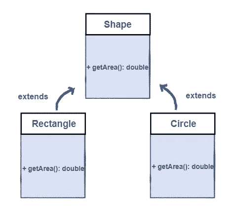
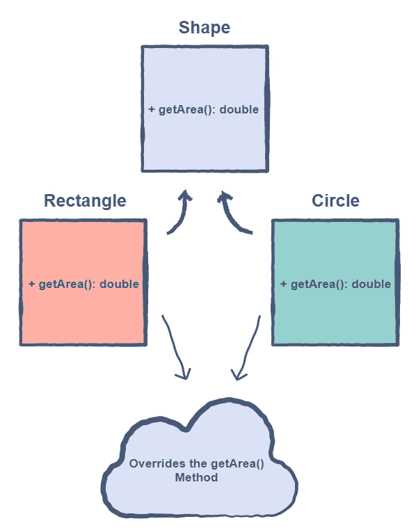

# Java 面向对象编程——方法覆盖

> 原文：<https://blog.devgenius.io/object-oriented-programming-in-java-method-overriding-ed5d4a4eb14e?source=collection_archive---------6----------------------->

## 简单介绍、实现、优点、限制、方法重写的规则以及方法重载和重写之间的区别

## 介绍


米歇尔·勒恩斯在 [Unsplash](https://unsplash.com?utm_source=medium&utm_medium=referral) 拍摄的照片

在子类中重新定义父类方法的过程称为方法重写。换句话说，当子类提供由它的父类之一声明的方法的特定实现时，方法重写就发生了。



具有两个特定形状类的形状类

在这种情况下，Rectangle 和 Circle 类覆盖了 Shape 类的 **getArea()** 方法。

重写是为了让子类可以向父类已经提供的方法提供自己的实现。



具有两个特定形状类的形状类

在这种情况下:

1.  **父类**中的方法被称为**被覆盖的方法**。
2.  **覆盖方法**是**子类**中的方法。

## 履行

输出是

```
Area of the Circle: 12.56
Area of the Rectangle: 4.0
```

## 优势

1.  因为对象解析发生在运行时，所以它有助于基于父类或接口编写泛型代码。
2.  提供同一方法的多个实现，并可用于使用 super 关键字调用父类重写的方法。
3.  定义一个类可以有什么行为，以及实现该行为的类将如何实现该行为。

## 限制

1.  静态方法不能被重写。
2.  我们无法重写构造函数。
3.  重写方法可能不会引发比被重写方法引发的异常更严重的已检查异常。
4.  不能降低被重写方法的可见性。
5.  不可能重写无法继承的方法。

## 方法重写的规则

1.  论点单应该与被覆盖方法的相同。
2.  返回类型必须与超类的实际重写方法中声明的返回类型相同或为其子类型。
3.  访问级别不能比被重写方法的访问级别更严格。举个例子:如果超类中的方法被声明为 public，那么子类中的重写方法既不能是 private 也不能是 protected。
4.  实例方法只有在子类继承它们时才能被覆盖。
5.  不能重写已声明为 final 的方法。
6.  静态方法不能被重写，但可以被重新声明。
7.  如果一个方法不能被继承，它就不能被重写。
8.  任何超类方法，如果没有被与实例超类相同的包中的子类声明为 private 或 final，都可以被与实例超类相同的包中的子类覆盖。
9.  只有声明为 public 或 protected 的非 final 方法可以被不同包中的子类覆盖。
10.  无论被重写的方法是否引发异常，重写的方法都可以引发任何未检查的异常。另一方面，重写方法不应引发比被重写方法声明的异常更新或更广泛的检查异常。重写方法能够引发比被重写方法更窄或更少的异常。
11.  构造函数是不可重写的。

**最后一点提示:****super**关键字在调用被覆盖方法的超类版本时使用。

## 方法的重载和重写之间的区别

## 方法重载示例

这里我们有三个不同版本的 **add()** 函数。在这种情况下， **add()** 函数被重载。

你可以在我的上一篇文章中读到关于 Java 中面向对象编程的知识——多态性。

希望这能有所帮助。也分享你的想法。