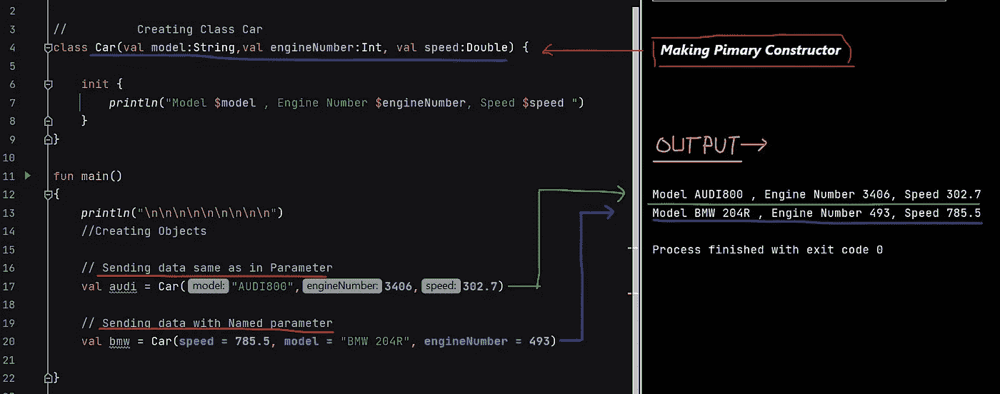
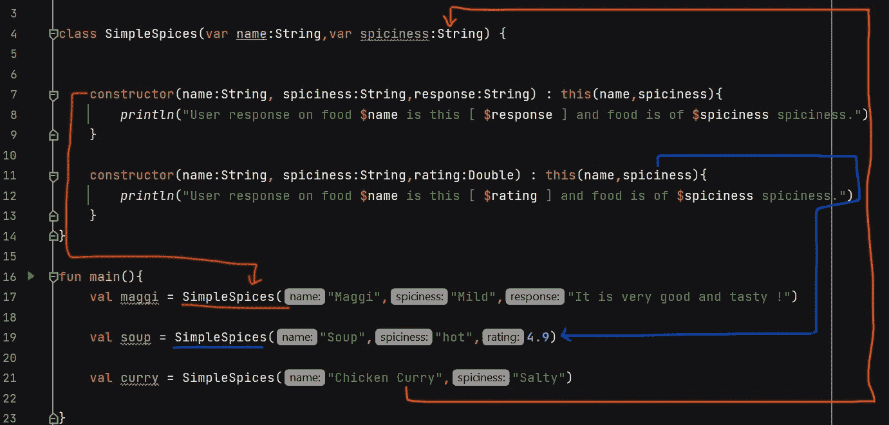
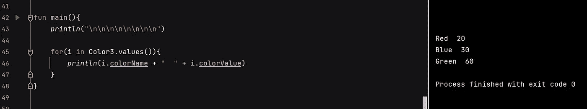
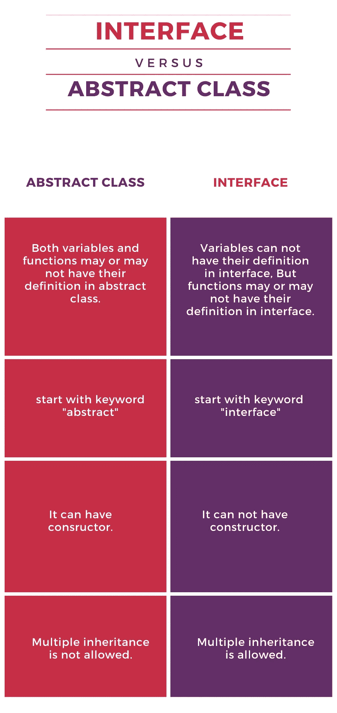

# Kotlin 中的面向对象编程[kot Lin 中的 OOP—2022]

> 原文：<https://blog.devgenius.io/object-oriented-programming-in-kotlin-oop-in-kotlin-2022-90dea0f5776c?source=collection_archive---------1----------------------->


> **内容:-**

1.  ***类*** *和* ***对象*** *。*
2.  ***构造函数*** *:-默认，参数化，主，次。*
3.  ***多态*** *:-运行时和编译时。*
4.  ***继承*** *:-继承的类型。*
5.  *为什么不允许多重继承？→* ***钻石问题***
6.  ***界面***
7.  *类的类型:* ***数据*** *类，* ***枚举*** *类，* ***密封*** *类，* ***单体*** *类，* ***抽象***
8.  ***抽象*** *。*
9.  ***封装*** *:-包，访问修饰符*
10.  *抽象类****VS****接口*

> **面向对象编程** (OOP)就是创建一个模板(不占用宇宙中任何空间)和那些模板的对象(占用空间)。

示例:-

1.  假设我们要造一辆汽车，那么首先我们要做一个名为 ***的设计类*** 和名为 ***的真实汽车对象*** 。


**类:-**

这是一辆汽车的 ***蓝图*** ，不占用宇宙空间。


**对象** :-

这是 ***真正的*** 车，它占据宇宙空间。

我们在编程中应用的类似概念是创建蓝图，然后从这些蓝图中创建产品。

> ***在 Kotlin 中创建类和对象:-***


输出:-


> 2. ***构造函数:-*** 在上面的程序中，我们在创建对象后访问并分配内存给变量，但是如果我们想在创建对象时这样做，我们就使用构造函数。

2.1. ***默认构造函数*** :-


***init*** 调用:- ***init*** 是一种构造函数，我们在创建对象时调用它-self。让我们通过使用 init 来计算一个类创建的对象的数量来理解。在这里，我们将使用 ***伴随对象***:——这意味着*项* *对所有对象都是通用的，并且只能由类*访问。


***伴侣对象:-***


在上面的例子中，n 变量只能被类访问，而不能被它的对象访问。

这里，当我们试图使用类对象访问类变量时，它给出了错误。

2.2 ( *参数化)* ***一级建造师*** :-



2.3 ***二级建造师*** :-

***注意*** :- *val* 或 *var* 不允许出现在二级构造函数参数中。


在这里， ***油耗*** 是我们想在某些车上拥有的附加值。**比如**:——对于**奥迪**我们没有 ***油耗*** 所以我们叫一级构造师，对于**宝马**我们有 ***油耗*** 所以我们叫二级构造师。

注意:-如果主构造函数没有默认值，则次构造函数必须使用“ ***this*** ”调用主构造函数。

因此，在上面的代码中，我们从次要构造函数调用主要构造函数来获取剩余的值。

> ***3。多态性:-***

***3.1 编译时多态性:-*** 当我们有不同类型的构造函数，它们具有相同的名称，但是:-

**一个**。**不同的参数列表**。

→ *重要* :-在主构造函数中，参数中的所有属性都必须初始化。


输出:-注意[每次都会调用 init 块]

**B .主要论点+附加论点。**



输出

***3.2 运行时多态性:-***

在理解这一点之前，我们需要理解**继承**。

> ***4。继承:-*** *表示继承其子节点中的父属性，子节点除了父属性之外还可以有其他属性。*


***一些关键词*** :-

1.  ***open*** →要继承任何类，我们必须使它开放，因为在 Kotlin 中，默认情况下每个类都是公共的和最终的。
2.  ***超级*** →它调用我们当前所在班级的上层。
3.  ***覆盖*** →用于从子类改变/覆盖父类的任何函数或变量的功能。
4.  ***private*** →用于使任何项目只能在该类中访问。


创建父类→哺乳动物


创建子类→人类


对象制作→ main()


输出

**3.2** 。 ***运行时多态性:——所以我们理解了继承***

在上面的例子中，我们从主函数[代码中的第 28 行]调用了“***”human . eating()***，所以在运行时它开始搜索“***”eating()***”。所以在运行时，它首先在子类中搜索，但是因为它不在子类中，所以它转到父类。同样，“***. human . breathing()***”是在运行时搜索它在子类中找到的。因此我们得到相应的输出。这是运行时多态性。

***继承的类型:-***

1.  单一等级 :-表示男孩等级继承自人类等级。


2.**多级** :-表示顶级类继承自学生类，学生类继承自男孩类，男孩类继承自人类类。


3.**倍数** :-表示人类类继承自男孩和女孩两个类。

注意:- *在 KOTLIN* 中不允许【原因在本故事的后续部分】。


4.**等级** :-男孩类和女孩类都继承自人类类。


> **5*。*** ***为什么*** ***不允许多重继承*** *？→* **钻石问题**
> 
> Java 或 Kotlin 中不允许多重继承:-对于多重继承，他们(语言 Java、Kotlin 的创建者)告诉我们使用**接口**。这个问题也称为钻石问题

```
 **Class A**{ 
            fun **demo**(){} 
        } **Class B**{ 
            fun **demo**(){}
        } **Class C** : **A()**, **B()**{ 
            ***override*** fun **demo**(){} 
        }
```

在这里，**编译器**搞不清楚该调用 ***demo()*** 的 ***Class A*** 或 ***Class B*** 的哪个函数，所以 Kotlin 防止用类进行多重继承。这是钻石问题。

> **6*。接口:-*** *用于存储属性的定义。*

→界面的所有内容都是抽象的、开放的、公共的。
→如果现场变量(val，var)无法初始化。
→功能在界面中可能有也可能没有主体部分。
→无法创建对象。
→允许多重继承。

要创建接口:-

```
interface <NAME> { 
     //variables
     //functions 
}
```


Main() :-


***允许不同类型的继承:-***

```
****Class C1() {}
    Class C2() {}
    interface I1() {}
    interface I2() {}****// Allowed -> One class + multiple interface
    Class test2() : C1() , I1(), I2() {}****// Allowed -> multiple interface
    Class test3() : I1() , I2() {}****
```

> ****7。课程类型:-****

1.  *****数据*** *类:-帮助我们保存数据的类。***

********

**[链接 _ 图片](https://www.canva.com/design/DAE2QjYRpP0/iCejAxB3JgLDhFhyN2Uxiw/view?utm_content=DAE2QjYRpP0&utm_campaign=designshare&utm_medium=link&utm_source=publishsharelink)**

***规则:-*
1。数据类必须在参数
2 中有一项。数据类必须有所有参数必须定义 var 或 val
3。数据类不能是抽象的、开放的、密封的或内部的**

***2。****Enum****Class:-用于保存一组常量。***

**→枚举类中的每个常量都是对象。
→枚举类只能从接口继承，不能从类继承。**

****

**我们也可以在枚举类中有构造函数:-**

****

**我们只能继承 Enum 类中的接口，覆盖 Enum 类对象的**中接口的抽象函数和变量:-****

********

***3。* ***密封*** *类:-当我们有有限的一组值时，我们使用这个。***

**我们正在开设一个网站🌐我们试图打开它，这样我们可以面对三种情况 1。正在加载 2。错误 3 .成功。所以我们不能有任何其他价值。因此，我们使用密封类，因为我们有三个值，所以把它密封在包中，这样就不会有其他值添加到包中。**

**→密封类只能在创建它的文件中继承。
→无法创建对象。**

****

**输出:-**

****

*****4。Singleton*** *类:像 Java 中的 static***

**1.在整个应用程序中只能创建一个对象。
2。不允许使用主构造函数和第二构造函数。
3。函数参数不能用 var 或 val 初始化，即 fun name(val name) - >错误。
4。我们使用类名本身直接访问变量和方法。**

****

*****5。抽象*** *类:-当我们声明一个抽象类时，我们必须在它的子类中有声明部分。***

**→抽象类可以有普通的和抽象的方法和字段。我们不能创建抽象类的对象。抽象变量只能使用它的子类来访问。**

********

**输出:-**

****

***6。* ***嵌套*** *类:类内的类是嵌套类。***

****

**7.**内部嵌套**类:-在嵌套类中，我们不能访问外部类的项目。但是当我们在嵌套类前添加“内部”时，我们就可以访问它们了。**

****

****这里不能从嵌套类中访问外部类的“年龄”变量。****

**用“内部”嵌套:-**

****

**这里，外部类的“年龄”变量可以从内部嵌套类中访问。**

****注** :-**

**调用“具有内部的嵌套类”:-当“*内部*”具有嵌套类时，我们必须具有外部类的构造函数。但是我们在正常的内部课程中没有。**

****

> ****8。摘要:-****

**这意味着只使用函数而看不到它的内部实现。**

**例如:- println() →我们只看到它用它来打印，我们没有看到它的内部实现，它如何在内部工作等等。这就是抽象。**

> ****9*9。封装*** *:-访问修饰符***

1.  ****Public** :-默认情况下，这些类型的变量和函数随处可用。**
2.  **私有的:这些类型的变量和函数只在文件中可见。**
3.  ****内部** :-这些类型的变量和函数只在同一个模块内可见，即同一个项目。**
4.  ****受保护的** :-这些类型的变量和函数与 Private 相同，并且在它的子类中可见。**

> ****10*。抽象类 VS 接口*****

****

**感谢阅读…希望你的概念已经清楚。**