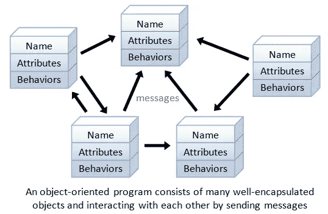
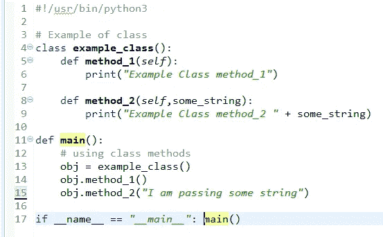
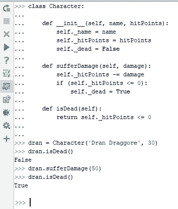
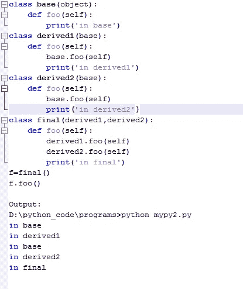

# Python 中的面向对象编程:要知道什么

> 原文：<https://blog.devgenius.io/object-oriented-programming-in-python-what-to-know-9f230a596916?source=collection_archive---------13----------------------->

用于高级编程的中级 python 基础。以下是 python 面向对象编程指南。

## 什么是面向对象编程(OOP)？

面向对象编程是一种近似，其中每个功能都被抽象为对象。

## 面向对象编程中短语的定义有哪些？

**类**是一个可扩展的程序，用于累积公共特征的对象。

**对象**是将被称为类本身的结构。

**Self** 是指我们使用的方法或参数关于相关的类。

在面向对象编程中，所有的类都创建对象，它们的所有特性都被命名为 **属性**。

**方法**是表现为对象属性的行为。

方法的示例:

obj= example class()、obj.method_1()和 obj.method_2()表示对象，因为它们是面向对象编程中的类。

在括号中，您不必填充它，但最好将其命名为一个对象，以便在大型项目中使文本编辑器的工作更容易。这在面向对象编程中叫做类型转换。

让我们定义类型转换，就像我们讨论在 python 中创建程序时为什么使用 object 一样:

**类型转换**是面向对象编程中将一种数据类型转换成另一种数据类型的过程。

***现在打算封装*** ，

**封装**限制对方法或变量的改变。简而言之，这是对访问的限制。同样，初始化器可以像方法一样是私有的。

理解封装的示例:

用 python 做面向对象编程中的封装，需要在 self 之后使用 **_** 。限制进入。

**继承**意味着使用父类的属性创建一个新类

*它有两个属性:*

**1-父类(主类)**

**2-子类** ( *使用父类的属性创建自己的类*。它可以根据需要多次使用。)

作为继承的一个例子:

而父类是网站，登录类是网站的智利类。

**抽象**通过使用为子类创建的模板来保留功能。它们不能被实例化(被创建的对象),该方法必须在其他地方作为子类使用。

为了进行抽象，你需要使用一个装饰器 **@abstractmethod** 。

**覆盖**用于使语句无效。你只需要使用 **toString()** 方法来调用 overriding。

**多态性**是一种方法，用于使子类不同于先前从父类继承的子类。

*根据你的说法，python 中的面向对象编程可以增加什么？在下面的评论区分享你的想法。*