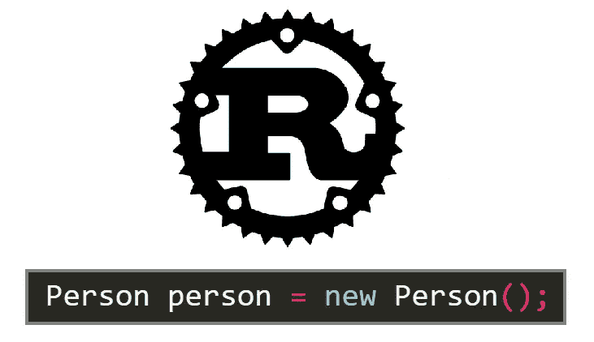

# Rust 中的面向对象编程

> 原文：<https://blog.devgenius.io/object-oriented-programming-in-rust-691baf4d2996?source=collection_archive---------0----------------------->

## 在一个最常见的编程范例中，Rust 与其他语言有何不同。

作者图片

如果你听说过铁锈，那么你可能知道为什么人们对它如此兴奋。通过所有权和借用系统的内存安全、极快的速度、对 WebAssembly 的一流支持等等。

虽然这些东西使 Rust 成为未来伟大的编程语言，但这种语言也有许多细微差别，使它非常适合使用。

许多程序员并没有真正从 Rust 最有利可图的进步中受益，然而，设计这种编程语言的选择使它值得探索。我觉得对于中级程序员来说，和 Rust 一起工作，了解 Rust 的设计，可以加强你的编程直觉。

还有什么比最基本的编程范例之一:面向对象编程更好的方法呢？

在 Rust 中，一个对象的最基本的组件被分离和简化。单独创建一个对象实际上只是一个`[struct](https://doc.rust-lang.org/book/ch05-00-structs.html)`。要实现该结构的方法，可以使用`impl`。

因为对象只是结构，默认情况下，对象是将信息组合在一起的最原始形式。编程语言本身遵循 DRY 原则是一个很好的方式，我认为以这种方式让 struct 特性加倍很有意义。

一个基本对象足够简单，但是当涉及到其他面向对象的概念时，比如继承、接口和抽象类，Rust 做的事情非常不同，在我看来，更优雅。

对于所有这些特性，它实际上归结为想做两件事。

1.  您想要定义一种通用对象类型，并拥有适合该类型的子对象，或者
2.  您希望强制一个对象拥有某种方法或变量的实现。

# 枚举

父对象、接口和抽象类都是为了允许一种带有子对象类型的通用对象类型，子对象类型意味着以类似的方式进行交互。

`[enums](https://doc.rust-lang.org/book/ch06-01-defining-an-enum.html)`也一样。或者至少 Rust 背后的人似乎是这么认为的。

Rust 实际上认为人们可能会更频繁地使用它，并实现了一个更好版本的 switch case，`[match](https://doc.rust-lang.org/book/ch06-02-match.html)`，以实现更好的控制流。

您可能会注意到，在我的枚举声明中，事情并不完全完美。你不能仅仅将对象类型指定为枚举的变量，你只能定义纯变量、值、[结构或元组结构](https://doc.rust-lang.org/book/ch05-00-structs.html)。

最后两个，Cow 和 Goat，都是元组结构，但是 Goat 是一个例子，说明如何定义一个类似于其他语言中的纯对象类型的枚举变量。

尽管 enum 在某种程度上支持通用的父对象类型，但它的主要目的是体现变体。

从第一个例子开始，你可以实现枚举的方法，但是当我们想要一个更通用的接口模型时，我们不得不转向别的东西。

# 特征

输入`[traits](https://doc.rust-lang.org/book/ch10-02-traits.html)`。

在我看来，traits 是大多数语言中更优雅的接口实现。

您定义一个 trait，使用方法的默认或空实现，然后为给定对象定义该 trait 的实现。

这是一个轴对齐的包围盒特征的例子，我在一个 3D 平台游戏中使用它进行碰撞检测。

在为我的 Player 结构实现 AABB 特征时，因为 min 和 max 方法没有默认实现，所以我的代码不会编译，直到我实现了这两个方法。

如果你注意到在 trait 的碰撞方法中，它使用了类型为`&impl AABB`的`other`。这是一个可以传入实现 trait 的类型作为参数的例子，类似于其他语言中的接口。

# 结论

绘制编程语言之间的联系，并了解功能重叠的地方，可以帮助我们作为程序员更好地理解我们经常使用的工具。即使我们不是任何语言背后的人，认识到它们是如何形成的也是很重要的。

Rust 很特别，因为它的开发者做出了不同的设计选择。Rust 没有像父对象、接口和抽象类这样的功能，它们在某种程度上都是一个对象的变体，而是支持独立的功能，在有意义的地方服务于多种目的，而不会弄乱程序员的工具箱。

它的系统并没有像其他语言一样完美地模仿同样的面向对象设计，但我认为它不应该这样。虽然它没有涵盖所有的细微差别，但它支持一个有意义的优雅系统，并满足所有必要的目的，尽管是以不同的方式。