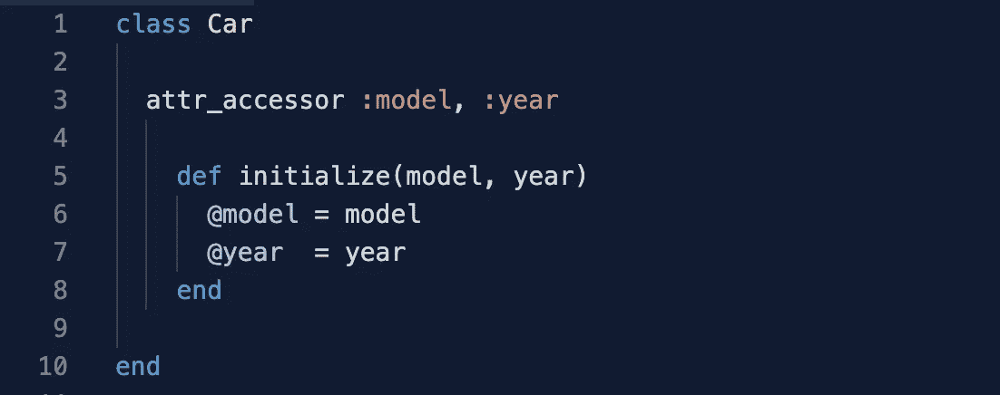
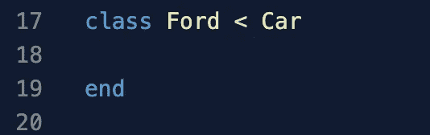
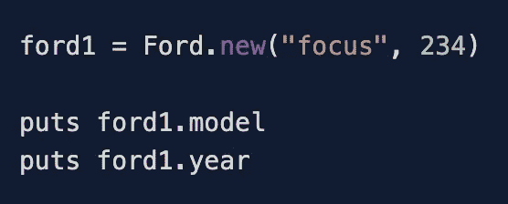
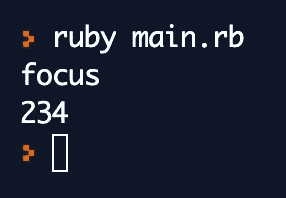
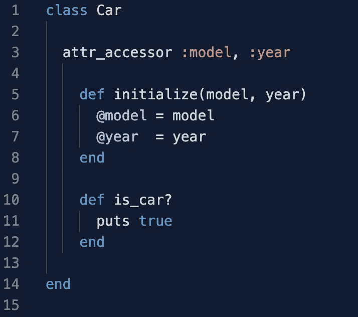
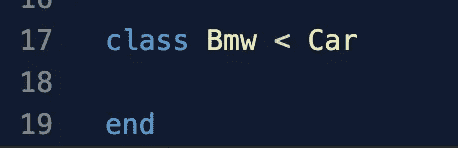
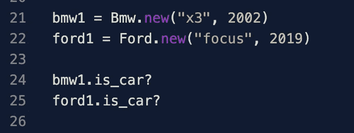
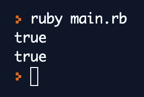

# 面向对象编程:继承(用一个 Ruby 例子)

> 原文：<https://blog.devgenius.io/object-oriented-programming-inheritance-with-a-ruby-example-a498cf0d643f?source=collection_archive---------25----------------------->

## 介绍

什么是继承，为什么方便？为了更好地理解遗传，思考一下**现实生活中的例子**，在现实生活中，有成千上万种不同的汽车、模型和特征，但它们都**有相同的东西它们都是汽车**知道这一点给了我们一个优势，因为我们知道例如所有的汽车都有引擎、门、轮胎、方向盘等。我们可以对植物说同样的话，有成千上万的物种，但它们都需要湿度才能生存。

当我们创建新对象时，我们分配它们的属性并创建它们的结构，有时继承可以节省我们的时间，例如，假设我们正在创建一个名为 BMW 的对象/类，我们知道 BMW 是一个汽车品牌，所以我们知道所有的 BMW 都是汽车，如果我们可以从另一个名为 car 的对象中给这个对象一些属性会怎么样呢？嗯，我们可以，这就是继承的含义，**将属性或方法从一个对象分配给另一个对象。继承可以节省我们很多时间，因为我们可以简单地从另一个类中继承它们，而不是一遍又一遍地编写相同的属性或方法。**

# 继承如何处理对象属性

继承允许对象执行来自另一个对象的相同属性，例如，假设我们的汽车类是用型号和年份初始化的

现在让我们创建一个名为 Ford 的新类，让我们从 Car 类继承，继承的语法可能是"

Here we are inheriting everything from the Car object, so let's create a new Ford instance and try to give it the attributes that were initialized for the class Car.

So now we can create a new instance if the Ford class without even having to set a getter or setter and without having to specify any attribute to initialize that is because the Ford object is inheriting everything from the Car class. If we choose to initialize the Ford class with other attributes we can but then **。该类不会从 Car 类继承属性结构**,但它仍会从其他类继承方法，所以让我们看看继承如何与方法一起工作。

# 继承如何与方法一起工作

继承也允许对象共享方法，例如，让我们将一些方法添加到我们的汽车类，然后通过我们的福特类来尝试它们。让我们创建一个名为 Bmw 的新类，并使它继承汽车类，但让我们为福特和 Bmw 类创建新的不同的方法，这些方法将区分这两个类，并使每个类都是唯一的。

这里我们添加名为“is_car？”

我们创建了 Bmw 类，现在让我们创建一个 Ford 实例和一个 Bmw 实例，并检查它们是否都有 is_car？可用的方法。

瞧啊。这里我们可以看到两个类都有相同的方法从类 Car 开始工作。现在最酷的事情是，我们可以不同地定制每个类，给每个类特定和独特的方法，将它们分开，使它们独特。

# 结论

继承意味着将一个对象的属性分配给另一个对象。继承是一个非常重要的概念，知道它可以节省时间并使我们的代码更有效是很重要的。感谢阅读！