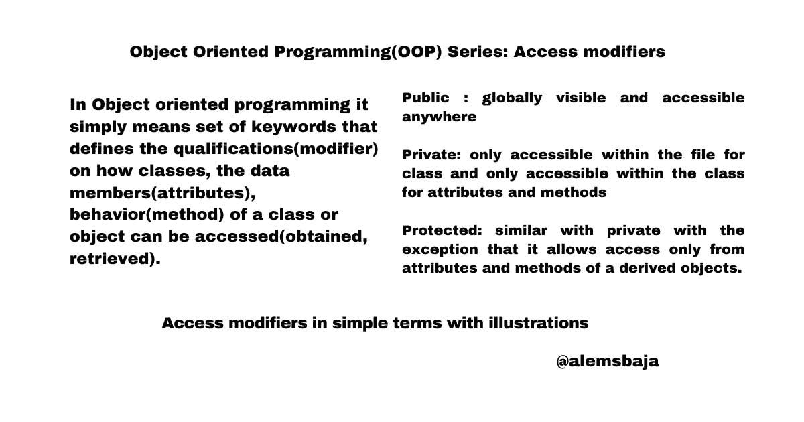

# 面向对象编程(OOP)系列:访问修饰符

> 原文：<https://blog.devgenius.io/object-oriented-programming-oop-series-access-modifiers-d28833a6e466?source=collection_archive---------6----------------------->



在这个系列中，正如之前所承诺的，我们将用 PHP、Javascript 和 Dart 中的例子以最简单的形式复习 OOP 概念。

到目前为止，在这个系列中我们已经介绍了[类&对象](https://alemsbaja.hashnode.dev/object-oriented-programmingoop-series-classes-and-objects)、[属性&方法](https://alemsbaja.hashnode.dev/object-oriented-programmingoop-series-attributes-and-methods)、[构造函数&析构函数](https://alemsbaja.hashnode.dev/object-oriented-programmingoop-series-constructor-and-destructor)。

一个类可以是许多对象的父类，而一个对象是一个类的子类。在类闭包{}内部，变量被称为属性(数据成员)，获取或设置值的函数被称为方法。

构造函数(Constructor ):负责设计和描述类在创建或访问时期望从其对象得到什么或传递给它的对象什么，它也可以被看作是当从类创建对象时自动调用和执行的方法。

析构函数在销毁类对象时反初始化类对象。析构函数也可以称为清理。

> *访问修饰符*

数据共享、访问和重用的简易性是 OOP 方法的关键特性之一。当一组数据成员、方法由一个类定义时，它们都可以被创建的每个实例(对象)访问。对于一个类来说，那些只对该类有意义的属性和方法，或者需要从一个对象中检索一些角色集合的属性和方法呢？

如果一个事物缺少一组可允许的访问准则及其类型的定义，那么误用或漏洞是可能的。因此需要定义对象和类如何共享和更新它们的数据成员和数据方法。

这就是我们使用访问修饰符的原因，这样属性和方法就不会在整个代码片段中徘徊，即使它们并不需要或者不应该被传递给对象。

进入:检索、获得、进入、接近的权利。修饰语:改变者、澄清者、限定者和初始化者。它的定义也与它的使用环境有关。

访问修饰语简单地描述了规则、权限或指导方针的定义，检索、输入或获取某物的性质。

在面向对象编程中，它仅仅意味着一组关键字，这些关键字定义了如何访问(获取、检索)类、类或对象的数据成员(属性)、行为(方法)的资格(修饰符)。

访问修饰符(说明符)是定义类、方法和属性的可访问性的关键字或术语。访问修饰符根据 OOP 语言使用的语法而变化，以增强数据成员和方法的安全性或覆盖范围。

OOP 语言有不同类型的访问修饰符(开放的、内部的、包的、私有保护的、内部保护的),但是在这个系列中我们将关注(公共的、私有的和保护的)

> *公开(一般或对所有人开放)*

使用关键字 public 意味着类、属性或方法可以在代码中的任何地方(全局可见的)以及该类被传递到的其他文件中被访问。如果没有指定，一些 OOP 语言将 Public 作为缺省说明符，而另一些则是 private。Public 是程序中最常用的访问修饰符。例如，一个被称为公共的设施意味着它对所有人开放。

> *私人(在门内或关闭)*

使用私有关键字作为类、属性或方法访问修饰符定义了对外部访问的限制。只有类中的属性和方法可以访问，而对于类，只有同一文件中的类可以访问。例如，一个被称为私人的设施只对里面的人开放。包含另一个文件的私有类的链接文件不能用于创建它们的对象。派生类或对象没有访问权限。

> *受保护(非常私有，但仅对派生类或实例可见)*

类、属性或方法使用 protected 关键字作为访问修饰符定义了该类和通过继承从该类派生的其他类(有时是 object)内的访问。它类似于 private access 修饰符，只是它只对子类、对象或方法可见。不能将类声明为受保护的。

**请注意**:下面的例子只是为了支持概念的解释。更重要的是，对三个访问修饰符的解释适用于所有使用它的语言。有关更多信息，您可以查看编程语言文档。谢谢！

> *Javascript 中的简单插图*

Javascript 没有使用 public、private 或 protected 直接实现访问修饰符的这种用法，但是在 ES5 及以上版本中，有一些实现访问修饰符的方法。了解 JavaScript 原型继承和闭包是如何工作的很重要。

```
//by default classes or objects are public in Javascript const Car= { name: "Camry ", carName: () => { return this.name; } } console.log(Car.name); //output CamryYou can use closures or class Car { return model; } model (){ return 'Not private'; } } let toyota= new Car (); console.log(toyota.model()); toyota.There is really no specified approach defined by the language to directly enforce an access modifier by using keyword. Just a way to demonstrate a protected attribute and how it can be given access. Protected properties are usually prefixed with an underscore _ class Car{ _name; constructor(name) { this._name = name; } get name() { return this._name; } } let Toyota = new Car("Toyota"); console.log(Toyota.name);
```

> *Dart 中的简单插图:*

dart 语言不支持访问修饰符(即私有、公共和受保护)。

使用 **_** 在 dart 中将属性或方法设为私有。

默认情况下，Dart 中的属性和方法是私有的。

> *PHP 中的简单插图*

在 PHP 中，public、protected、private、final 和 abstract 是它的访问修饰符的例子。默认情况下，PHP 类是公共的。在大多数情况下，public、private 和 protected 用于属性和方法，而 abstract 和 final 用于类。但是我们将在接下来的系列文章中研究这些术语。让我们保持简单。

> *待调为 OOP 系列的下一篇:* ***传承***

感谢您阅读这篇文章。请随意在评论区提问、回答和投稿。

你喜欢这篇文章吗？？请在 hashnode 或 twitter [@alemsbaja](https://hashnode.com/@alemsbaja) 上关注我，了解更多关于这些 OOP 系列的更新。

*最初发布于*[*https://alemsbaja . hashnode . dev*](https://alemsbaja.hashnode.dev/object-oriented-programmingoop-series-access-modifiers)*。*