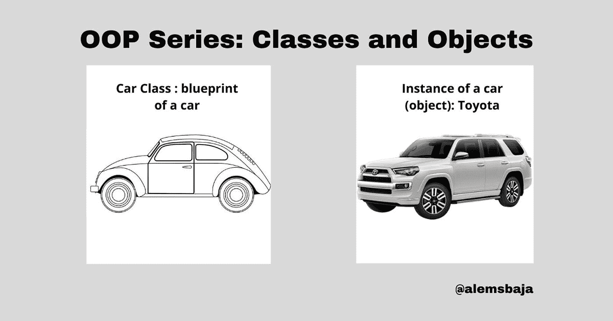
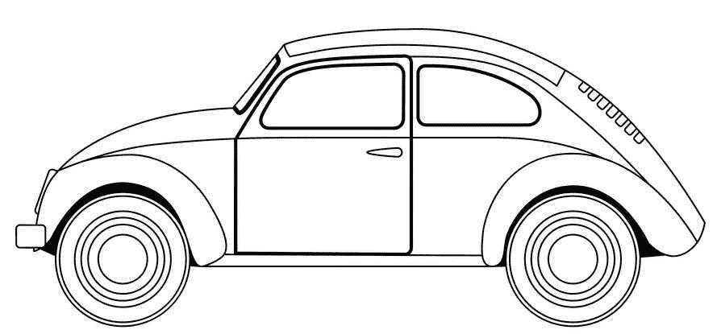
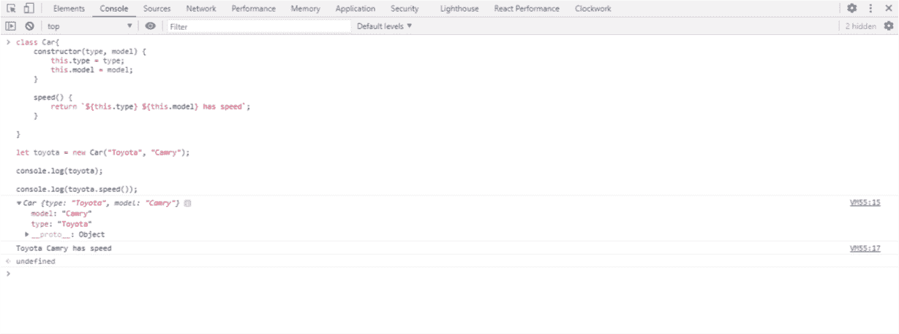

# 面向对象编程(OOP)系列:类和对象

> 原文：<https://blog.devgenius.io/object-oriented-programming-oop-series-classes-and-objects-71b864105954?source=collection_archive---------22----------------------->



在这个系列中，我们将通过 PHP、Javascript 和 Dart 中的例子，以最简单的形式重温 OOP 概念

面向对象编程(OOP)是一种基于使用“对象”来表示现实生活场景的思想的编程风格，其独特或共同的描述被表示为属性，其交互或行为的设定或定义方式被称为方法。

面向对象编程的基本特性之一是通过基于使用中的访问方法的继承，通过自身对象的副本来访问类属性和方法。

在技术领域有许多面向对象的语言，如 C++、Java、PHP、Javascript、Python、Dart、Go 等。

面向对象编程简单地以对象的形式表示现实生活中的情况，这些对象表示成员或属性以及它们的行为。

使用 OOP 风格编写代码的需求主要是由重用和关注点分离驱动的。例如，如果我们需要定义一个叫做汽车的对象。我们可以识别的事物被用来定义它的属性和方法(行为)。汽车的属性或对象成员包括门、轮胎(4 个)、方向盘、座椅(4 个或更多)，而汽车的方法(动作或行为)包括驾驶、按喇叭、倒车、前灯效果、空调、雨刷等。

在 OOP 中，不同的对象属性和方法可以被捆绑在一个类中，这个类又可以是一个对象。让我们用汽车来举例说明。汽车是有 4 个轮胎的运输系统的总称。奔驰或丰田是这类汽车的一个对象。此外，不同的模型是奔驰或丰田的实例或例子，使丰田成为一个阶级。



> *汽车类的例子(对象):丰田*


简单地说，一个对象就是一个类的实例。如果从对象中创建实例，那么对象本身也可以成为类。

> *例如丰田 4Runner 可以成为丰田的一个对象。*


一个实例是一个例子或类似的事件，可以比作其他东西。丰田是汽车的一个例子。这个名为 Toyota 的实例就是我们所说的对象。

Toyota(一个对象)是汽车类别中属性(成员或变量)、方法(行为或动作)和排列风格的组合。

更好的方法是将此与高中的年级或班级联系起来。六年级或三年级是属于这一类别的所有学生的统称，基本上，六年级或三年级的学生是该班级的一个例子，可以被称为一个实例，因为该学生必须拥有一个或多个将该班级与其他班级区分开来的特征和行为。

类:一个代码模板，通过提供状态(特性或属性)和动作(方法)的默认或初始格式，可以扩展为更多的代码模板继承其成员和行为

厉害！！！仅此而已！

> *练习！练习！！练习！！！:让我们简单看看类和对象在一些编程语言中的实际应用*
> 
> ***在本系列的后续部分，我们将了解这些代码的其他部分。现在，请让我们保持简单和客观(为了学习类和对象)。***

**Javascript 中的简单类和对象:**

JS 中的类建立在原型(类似于某物的副本或实例)的基础上，但是也有一些语法(规则)和语义(含义)，这些是与 ES5(2015 版的 Javascript)类语义所不共享的。

```
class Car{
    constructor(type, model) {
        this.type = type;
        this.model = model;
    }speed() {
        return `${this.type} ${this.model} has speed`;
    }}let toyota = new Car("Toyota", "Camry");console.log(toyota);console.log(toyota.speed());
```

班级名称为**车**。

**让丰田=新车(“丰田”、“凯美瑞”)；**这一行代码创建了 Car 类的一个实例，并将其存储在一个变量中。

如果已经安装了节点，您可以在浏览器控制台或命令行提示符下运行上述代码片段。



> ***飞镖中的类和物:***

```
class Car{
   var type;
   var model;info(){
    print("Car ${type} model is: ${model}");
  }
}void main(){
  var toyota = new Toyota();
  toyota.type = "Toyota";
  toyota.model = 2019;
  toyota.info();
}
```

> ***以上镖例中***

班级的名字是**车**。

**var Toyota = new Car()；**这一行代码创建了 Car 类的一个实例，并将其存储在一个名为 toyota 的变量中。

> *以上代码的输出为:* ***汽车丰田车型为:2019***
> 
> **PHP 中的*类和对象:*T33**

```
<?phpclass Car {
    public $type, $model;
    function info() {
        print 'Car '.$this->type.' is: '.$this->model.' ';
    }
}$toyota = new Car;
$toyota->type = 'Toyota';
$toyota->model = '2020';
$toyota->info();?>
```

> ***在上面的 PHP 示例中***

班级名称为**车**。

**让丰田=新车；**这一行代码创建了一个 Car 类的实例，并将其存储在一个名为 Toyota 的变量中。

> *以上代码的输出为:* ***汽车丰田型号为:2020***

以下文章介绍了 **OOP 系列:** [**属性和方法**](https://raphealenike.medium.com/object-oriented-programming-oop-series-attributes-and-methods-5d1e51b11e3e)

谢谢你阅读这篇文章。请随意使用评论部分进行提问、回答和评论。

你喜欢这篇文章吗？？请在 hashnode 或 Twitter [@alemsbaja](https://hashnode.com/@alemsbaja) 上关注我，了解更多关于这些 OOP 系列的最新消息。

*最初发表于*[*https://alemsbaja . hashnode . dev*](https://alemsbaja.hashnode.dev/object-oriented-programmingoop-series-classes-and-objects)*。*