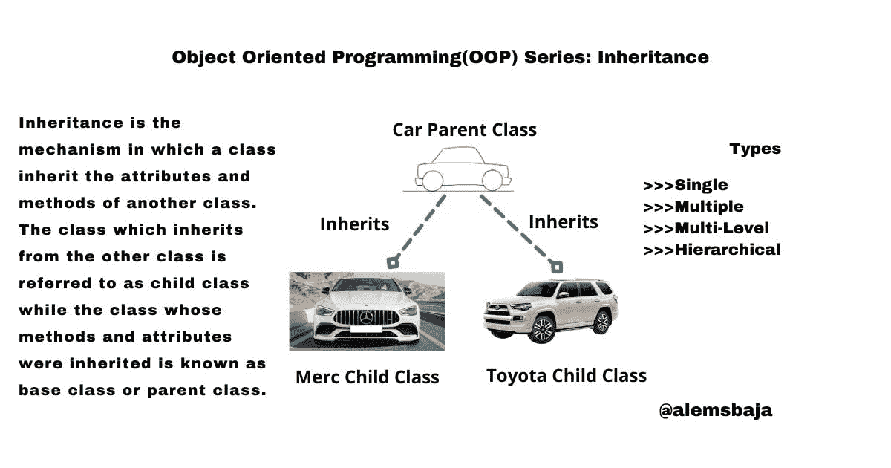

# 面向对象编程(OOP)系列:继承

> 原文：<https://blog.devgenius.io/object-oriented-programming-oop-series-inheritance-750b511b983b?source=collection_archive---------13----------------------->



在这个系列中，正如之前所承诺的，我们将用 PHP、Javascript 和 Dart 中的例子以最简单的形式温习 OOP 概念。

到目前为止，在这个系列中，我们已经介绍了[类&对象](https://alemsbaja.hashnode.dev/object-oriented-programmingoop-series-classes-and-objects)、[属性&方法](https://alemsbaja.hashnode.dev/object-oriented-programmingoop-series-attributes-and-methods)、[构造函数&析构函数](https://alemsbaja.hashnode.dev/object-oriented-programmingoop-series-constructor-and-destructor)和[访问修饰符](https://alemsbaja.hashnode.dev/object-oriented-programmingoop-series-access-modifiers)

访问修饰符(说明符)是定义类、方法和属性的可访问性的关键字或术语。访问修饰符根据 OOP 语言使用的语法而变化，以增强数据成员和方法覆盖的安全性。

> *继承*

在编程中，有一些概念适用于现实生活中的场景。正如我们前面所说的，OOP 是关于以对象形式表示现实生活中的场景。更重要的是，因为我们说一个类是一个对象(子对象)的父对象，这意味着在子对象中有一些属性和行为可以追溯到父对象。

**遗传:**是一个术语，描述某些特征和行为从父母传给子女(这不仅限于人类，所有生物都有)。我们这些来自生物科学领域或者在高中学习过生物学的人很容易理解遗传的概念及其重要性。

不再赘述，看看这个例子:在一个家庭中，孩子从父母那里继承了某些特征(属性)或行为(方式),比如身高、肤色、热情、敏捷、气质等等

这种继承方法在现实生活中默认发生。而在编程中，它可以是默认的，也可以被定义。因此，我们可以决定说，一个孩子只允许有高度和良好的激情，但肤色和灵活性将是父母的隐私。

继承是一个类继承另一个类的属性和方法的机制。从另一个类继承的类称为子类，而其方法和属性被继承的类称为基类或父类。

看看这种方法，继承可以导致一个树形结构。例如，跟踪孙辈到祖辈采用树结构。

在继承中，一个被称为子类、派生类或子类的新类是从一个超类、现有类、父类或基类中创建的。在下一篇文章中，我们将着眼于多态性，因为这个概念与类更相关。

从超类继承属性和方法的一些优点:

*   **子类也可以定义属性和方法**
*   **子类可以覆盖继承的属性和方法**
*   **优化程序员的工作**
*   **有效提高不重复原则**
*   **如果需要修改一个方法，可以从在一个类中创建该方法的地方开始，它将对使用该方法的所有子类生效。**

随着继承的增长，它开始采用树形结构。它越长，树的结构就越深。因此需要依赖注入。

继承的类型:

*   **单一继承:**如果一个子类只继承一个父类，就会出现这种情况。
*   **多重继承:**当一个孩子从多个类中继承时会出现这种情况。
*   **多级继承:**当一个类是从一个被继承的类继承而来时，就会发生这种情况。

> *例如:*

Car 是父类

丰田级继承自汽车

凯美瑞级继承自丰田

> *例如:*

Car 是父类

丰田级继承自汽车

奔驰类是继承自汽车

标致系列继承自汽车

**请注意:**下面的例子只是为了支持对继承的解释。有关更多信息，您可以查看编程语言文档。谢谢！

> *Javascript 中的简单插图:*

Javascript 使用原型链接进行继承。原型也可以被称为副本或样本。如果属性和方法被跟踪或链接到另一个对象，这叫做链接。ECMAScript 子类的新版本可以使用 extends 关键字从父类继承

```
// Super || Parent  || Base class
class Car {
  constructor(name) {
    this.name = name;
  }
  info() {
    return 'Car name: ' + this.name;
  }
}//using extends keyword to inherit the name attribute and info method from class Car.
// Child || sub || derived class 
class Toyota extends Car {
//child class constructor
constructor(name, model) {//the super keyword is used to reference the parent classsuper(name);
    this.carmodel = model;
  }//child class method accessing the inherited method
  details() {
    return this.info() + ' and model is: ' + this.carmodel;
  }}
let toyota = new Toyota("Camry", "2021");
console.log(toyota.details());
```

**输出**

车名:凯美瑞，型号:2021

在内部，extends 关键字使用原型机制工作。它将 Toyota.prototype.[[Prototype]]设置为 Car.prototype。

> *省道中的简单插图:*

```
// Super || Parent  || Base class
class Car{// parent method
void info(){
    print("Practicing inheritance in dart! from parent class");
}
}// Child || sub || derived class 
class Toyota extends Car{//sub class method
void details (){
print("Practicing inheritance in dart! from child class");
}}void main() {var toyota = new Toyota();//accesing inherited info method from parent class    
toyota.info();//accesing details method in child class    
toyota.details();}
```

**输出**在飞镖中练习传承！来自 dart 中练习继承的父类！从子类别

> *PHP 中的简单插图:*

```
<?phpclass Car{
    public $name;
    public $model;public function __construct($name, $model) {
        $this -> name = $name;
        $this -> model= $model;
    }public function info() {
        echo "Car Name: {$this->name} and Model is:  {$this->model}";
    }
}/* Toyota is inherited from Car and is referred to as child class*/
class Toyota extends Car{
// the __construct() and info() is inherited
//child class method
    public function details() {
        echo " <br> I'm the child of Car class";
    }
}$toyota= new Toyota('Camry', 2021);
$toyota->info();
$toyota->details();
```

> 在 PHP 8 中，上述内容可以用这种格式编写..

```
<?phpclass Car{
    public function __construct(public $name, public $model) {}public function info() {
        echo "Car Name: {$this->name} and Model is:  {$this->model}";
    }
}class Toyota extends Car{
    public function details() {
         echo " <br> I'm the child of Car class"; 
    }
}$toyota = new Toyota('Camry', 2021);
$toyota->info();
$toyota->details();?>
```

**输出**

车名:凯美瑞，型号:2021

我是汽车班的孩子

感谢您阅读这篇文章。

OOP 系列下一篇: [**多态性**](https://alemsbaja.hashnode.dev/object-oriented-programmingoop-series-polymorphism)

请与您的网络分享，并随时使用评论区的问题，答案和贡献。

你喜欢这篇文章吗？？请在 [hashnode](https://alemsbaja.hashnode.dev/) 或 Twitter [@alemsbaja](https://hashnode.com/@alemsbaja) 上关注我，了解更多关于这些 OOP 系列的更新。

*最初发布于*[*https://alemsbaja . hashnode . dev*](https://alemsbaja.hashnode.dev/object-oriented-programmingoop-series-inheritance)*。*