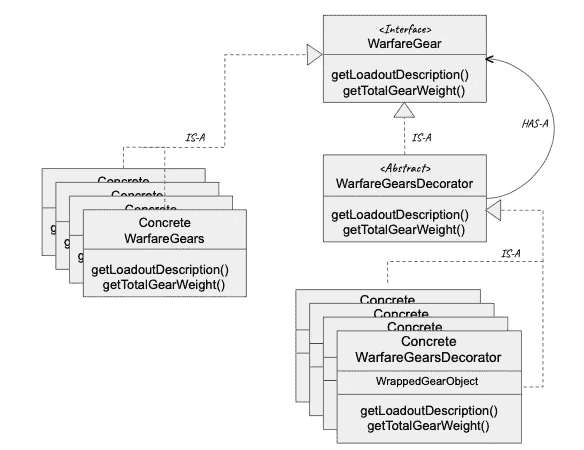

# 面向对象与功能设计模式——第二部分:装饰设计模式

> 原文：<https://blog.devgenius.io/object-oriented-vs-functional-design-patterns-part-ii-the-decorator-design-pattern-502cfc0fff09?source=collection_archive---------6----------------------->

在本文的第一部分 的 [**中，我们首先讨论了按照**面向对象编程**和**函数式编程**范例的设计模式。我们探索了**策略模式**，并使用纯函数简化了它的实现。**](https://medium.com/@alityson.pratik/object-oriented-vs-functional-design-patterns-part-i-the-strategy-design-pattern-d78016afda5e)

在这一部分中，我们将从第 1 部分的地方继续，探索另一种叫做**装饰模式**的模式，以及如何在函数世界中应用它。

# 什么是装饰者模式？

***装饰模式*** 用于在运行时动态扩展对象的功能，而无需触及原始源类或转向继承。

这是通过使用一个名为装饰器对象 的 ***包装器对象来实现的，装饰器对象在客户端之前充当原始对象，但实际上是由它装饰的对象组成的，并在将客户端调用转发到底层原始对象之前或之后添加附加功能。***

为了使装饰对象的行为与其所包装的底层对象完全相同，它 ***必须扩展与实际对象*** 相同的接口。

# 但是，当我们可以在基类之上执行继承和添加额外的功能时，为什么我们需要修饰一个对象呢？

答案是*是的*，我们总是可以使用继承来扩展任何类的行为。但是继承只能在编译时完成，所有更新的方法也可以用于其他不需要它们的类实例。由于涉及代码修改，这直接违反了**开闭原则**。

此外，在开发时，在我们创建一个类之前，我们试图确定我们的类必须具有的属性。但是当我们开始子类化时，我们很快就会创建具有更新/不同属性集的全新类。这违背了**利斯科夫替换原则**的主要思想，后者要求基类属性对所有子类都适用。

# 用面向对象的方法实现装饰模式

假设我们正在构建一个现代战争游戏*，我们扮演特种部队。有几个不同的战争和地形的任务。每场战争都会有一些基本的装备，这些装备将构成游戏角色的 ***装载装备*** 。*

**

*图 1:可玩角色的基本装载装备*

*除了默认的装备之外，玩家还可以选择更多的额外装备、附件或现有装备的功能升级，并且 ***可以扩展其装载装备*** 的功能。*

*根据地形和任务的性质，装载装置可能需要升级，增加新的功能。
例如: ***当游戏性要求在黑夜中执行任务时，装载装备还必须包括夜间&热视觉能力。****

**

*图 2:(从左上顺时针)夜间任务，近距离任务，丛林作战任务，远程任务*

*在开始实现装饰器模式之前，让我们先来看看 ***类图*** 。*

**

*图 3:装饰模式类图*

*让我们为所有的战争装备定义抽象基类。*

*片段 1:抽象的战争装备*

*接下来，我们定义了**具体的战斗装备**等级，其装载适合每场战争。*

*片段 2:具体的战争装备装载*

*根据任务的性质，我们可能希望我们的玩家有一些额外的装备供他使用，或者甚至升级他任何可用的装备。Decorator 类将使玩家能够在运行时动态地扩展他的可用加载装置的功能。*

*对于 decorator 类来说，与它试图修饰的 WarfareGear 接口可互换是很重要的，并且让每个 Decorator 类重新实现***getLoadoutDescription***方法。*

*片段 3:抽象的战争装备装饰*

*接下来我们定义具体的装饰类，它将负责允许玩家 ***有选择地为可玩角色的装载装备选择额外的功能*** 。*

*代码片段 4:具体的战争装备装饰类*

*客户端代码段调用装饰器对象，如下所示:*

*代码片段 5:客户端*

*既然我们已经看到了 Decorator 模式在面向对象世界中的应用，让我们进入函数式编程的领域。*

# *几个函数式编程的概念性测试*

*在我们尝试使用函数式编程来尝试装饰模式之前，我们需要首先掌握以下 FP 概念:*

## *1.Currying*

*Currying 是一种技术，用于将一个接受多个参数的函数转换成一系列每个接受单个参数的函数 。*

*通过 currying 可以将函数 f(x，y，z)转化为函数 g(x)(y)(z)
f0 = f(x，y，z)可以转化为:
h = g(x)
I = h(y)= g(x)(y)
F0 = I(z)= g(x)(y)(z)*

*Currying 在*几种只能应用于单参数函数的分析技术*中发现了它的用处。它还允许我们在现有的框架中使用带有多个参数的函数，在现有的框架中，函数只带有一个参数。*

## *2.部分应用的功能*

*比方说，我们有一个约定俗成的函数:*

> *def f(x:Int)(y:Int)(z:Int):Int = x+y+z*

*所以现在我们可以调用函数 f(5)(5)(6)得到结果为 16。但是当我们不提供一个或两个论点时会发生什么。让我们看看 REPL 的回报:*

> *Scala > val PAF = f(5)(5)_
> PAF:Int =>Int = $ $ Lambda $ 1215/0x 00000008000 c 9040 @ 6bqe 324*

*它返回一个接受 Int 作为参数的 ***函数，并返回一个 Int*** 。让我们看看，当我们漏掉三个论点中的两个时，会发生什么。*

> *Scala > val PAF = f(5)_
> PAF:Int =>(Int =>Int)= $ $ Lambda $ 1223/0x 00000000011 ce 040 @ 31ed 0238*

*它返回一个接受 Int 作为参数的 ***函数，并返回另一个接受 Int 并返回 Int*** 的函数。*

*在数学和计算机科学中，我们总是将函数应用于论点。但是在上面的例子中，我们并没有对所有的参数都应用这个函数。这就是术语**部分应用功能**的来源。我们没有指定一个或多个参数，结果得到了另一个函数。*

> ** *注:部分应用功能和部分功能是完全不同的两回事。*

# *用函数方式实现装饰模式*

*抽象的战争和它的具体实现是一样的。*

*代码片段 6:装饰器，函数方式*

*装饰器设备期望加载描述和权重的 ***元组*** ，它们是由要装饰的对象维护的属性。我们还定义了一个**隐式函数**,它接受要修饰的对象(WarfareGear)的类型实例，并返回一个由构成 WarfareGear 对象的属性组成的元组。我们将在后面看到它的用途。*

*代码片段 7:为基本装载装置添加功能的函数*

*我们定义了一个 ***简化函数*** ，它将装饰对象作为第一个函数的参数，将附加功能作为序列中第二个函数的参数，将附加权重作为序列中第三个函数的参数。 ***它返回一个新的装饰器对象，其功能被扩展*** (附加更新的加载描述并增加额外的权重)。*

*代码片段 8:部分应用的函数*

*最后，我们为附加的 gear 特性定义了所有的函数，这些函数以装饰器对象作为参数，并将这些函数转换成 ***部分应用的函数*** ，以便能够在任何装饰的 gear 对象上动态地使用它们。*

*用附加功能修饰基本对象的客户端代码现在看起来如下:*

*代码片段 9:客户端*

*在这里，我们看到，当我们调用 Decorator 对象时，我们没有传递 loadout 描述的元组和权重。相反，我们传递要装饰的对象。 ***当编译器无法匹配输入参数时，它会在其作用域中查找任何能够将输入对象转换为加载描述和权重元组的隐式函数*** 。在我们的例子中，它确实找到了一个名为 **getGearProperties 的。***

# *结论*

****装饰模式*** 允许我们动态地将对象的责任和功能扩展到其当前能力之外，而不会带来子类不断增加的不利影响。客户端可以通过调用适当的装饰器来选择它想要的功能。*

*我们尝试将实现装饰模式的面向对象方法转化为一种更具功能性的方法。 ***我们利用 currying 的概念和部分应用的功能来装饰具有额外责任的对象。****

***部分应用的函数**是部分应用于一组输入参数的函数。这使得开发人员可以选择不将所有参数一次传递给一个函数，同时仍然传递一些参数，并将缺少的参数留待以后某个时间点传递。*

****这个特性以及将带有多个参数的函数转换成函数序列的能力*** 有助于以更富于表现力的方式实现装饰器。*