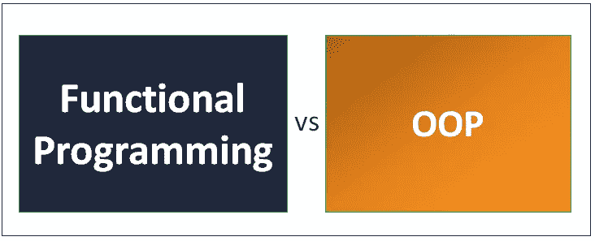

# 面向对象与使用类型脚本的函数式编程

> 原文：<https://blog.devgenius.io/object-oriented-vs-functional-programming-with-typescript-6b2243bb8c4b?source=collection_archive---------0----------------------->



面向对象还是函数式编程？

面向对象 vs 函数式编程怎么样？
如果你认为面向对象更好，那你就完全错了:)
如果你认为函数式编程，那你就大错特错了；)

在这个层面上讨论编程范式就像讨论艺术一样。
解决一个问题总有不止一种方法，尤其是在 Javascript 中，讨论这些事情很好，但没有绝对的答案。

你做的每一个决定都会有一个取舍。
让我们先来看看一些函数式的类型脚本代码。

# 纯函数

函数式编程中最重要的概念是纯函数的概念。这意味着函数的输出应该只依赖于它的输入。例如:

```
let num = 123;
function toString(val) {
    return val.toString();
}
```

这里我们有一个名为`toString()`的函数，它接受一个值作为参数，然后返回一个字符串格式的值。我们可以通过直接改变数字变量来使这个函数不纯。

```
let num = 123;
function toString(val) {
    num = val;
    ...
}
```

这将被认为是一个副作用，功能代码应该不会产生副作用。此外，他们不应该依赖任何外部价值来产生一个返回值。纯函数更容易测试，也更容易推理，因为您不必考虑函数本身之外发生的任何事情。

# 不可变数据

函数式编程的另一个核心原则是不可变数据。功能代码是无状态的，这意味着当数据被创建时，它永远不会改变。例如，我们有:

```
const data = [1,2,3,4,5,6];
```

我们可以在 Javascript 中通过在这个数字数组上使用`Object.freeze`来模拟这一点。

```
const data = Object.freeze([1,2,3,4,5]);
```

我们可以绕过这一点，但它阻止我们做像数组推送这样的事情，而这在函数式程序中是做不到的。所以很明显，如果我们有一个动态的软件应用程序，我们的数据必须以某种方式改变，所以你会经常把函数作为参数传递给其他函数。

```
const addEmoji = (val) => toString(val) + ' 😃';
```

这里，我们有一个典型的一阶函数，它接受一个值，然后返回一个不同的值。在这种情况下，只需将表情符号附加到字符串上。

高阶函数要么接受一个函数作为参数，要么自己返回一个函数。Javascript 有一些非常好的内置高阶数组函数，比如 map。因此，我们可以不使用 for 循环，而是将我们的函数传递给 map，它将对数组中的每个元素运行 add emoji 函数并转换值。这给了我们一个非常简洁优雅的方法来转换数组中的值。

```
const emojiData = data.map(addEmoji);
console.log(emojiData);  // ['1 😃', '2 😃', '3 😃', '4 😃', '5 😃']
```

我们可以做的另一件很酷的事情是创建返回函数的函数。当您想从一些基本功能开始，然后用一些动态数据扩展它时，这非常有用。

让我们假设我们正在构建一个天气应用程序，我们需要添加带有特定表情符号的字符串。我们将从一个名为`appendEmoji`的基本函数开始，然后用它来组成更复杂的函数。

```
const appendEmoji = (fixed) => (dynamic) => fixed + dynamic;
```

所以在这种情况下，内部函数接受两个参数并将它们相加。我们可以利用这一点来创建更多指向特定表情符号的专门功能。例如:

```
const rain = appendEmoji('🌧️');
const sun = appendEmoji('️🌞');console.log(rain(' today'))  // ️🌧️ ️️today
console.log(sun(' tomorrow'))  // ️🌞 tomorrow
```

这里，我们有一个 rain 函数和一个 sun 函数，然后我们可以用我们想要附加表情符号的字符串调用这个函数。最终的结果是一些简洁易读的代码，它们不依赖于任何共享状态，共享状态会使测试变得困难。对于函数式编程来说，这是最基本的，当你有异步数据和副作用之类的东西时，事情会变得有趣得多。

所以现在让我们继续，并将其与面向对象编程进行比较。

我们要做的第一件事是定义一个类，它本身并不做任何事情，而是作为实例化对象的蓝图，因此这个表情类的实例将是一个具有图标属性的对象。那么构造函数方法是特殊的，因为它在对象被实例化时运行一次。它会将一个参数传递给带有实际表情图标的构造函数，然后我们会将该参数设置为该对象的属性。像这样:

```
class Emoji {
    icon: string;

    constructor(icon) {
        this.icon = icon;
    }
}const sun = new Emoji('️🌞')console.log(sun) // Emoji { icon: '️🌞' }
```

表情符号类的工作方式类似于一个函数，但是我们在它前面使用了新的关键字。正如你所看到的，当我们这样做时，它创建了一个具有 sun 图标属性的表情符号对象。在 typescript 中有一种更简单的方法，因为我们有公共和私有成员的概念。因此，如果我们在构造函数中的参数前面使用 public 关键字，typescript 将自动知道将它设置为每个对象的公共属性。当您将属性或方法声明为 public 时，这意味着它对该类本身和该类的任何实例都是可用的。

```
class Emoji {
    constructor(public icon) {}
}
```

这可能是一件好事，也可能是一件坏事。例如，我们可以通过改变图标对象的值来改变图标。

```
const sun = new Emoji('️🌞')
sun.icon = '🌧️'
console.log(sun) // Emoji { icon: '🌧️' }
```

一方面，这非常方便，但另一方面，如果有大量代码这样做，就很难跟踪，也很难有效地测试。

Typescript 还为我们提供了一些工具来改善我们在编写面向对象代码时的语气。例如，我们可以将成员标记为私有，这样它们只能在这个类定义中使用。这意味着我们可以将公共 API 从这个类的内部逻辑中分离出来。例如，如果我们想使这个图标值可变，我们可以使它私有，我们将定义一个 getter，这样用户可以读取值，但不能改变值。

```
class Emoji {
    constructor(private _icon) {} get icon() {
        return this._icon;
    }
}
```

这里要指出的另一件重要的事情是，类实例可以有自己的内部状态。让我们想象一下，我们有一个按钮，用户可以切换表情符号，并在不同的状态之间来回切换。这是实现面向对象编程的一件非常简单的事情。

我们将向这个类添加另一个私有属性 previous，然后使用一个 getter 来检索该值，然后我们将定义一个 change 方法，该方法将改变这个实例上的实际图标值。

```
class Emoji { private _prev; constructor(private _icon) {} get icon() {
        return this._icon;
    } get prev() {
        return this._prev;
    } change(val) {
        this._prev = this._icon;
    }
}
```

当这种情况发生时，我们将首先将先前的值更改为当前图标，然后将当前图标更新为新值。

```
const emoji = new Emoji('️🌞')console.log(emoji.icon, emoji.prev) // ️🌞 undefined
```

在第一个控制台日志中，我们得到了太阳图标和未定义的和

```
emoji.change('🌧️');
emoji.change('🌪️');console.log(emoji.icon, emoji.prev) // '🌪️', '🌧️'
```

如果我们像上面一样改变状态几次，你可以看到这个类实例的内部值已经改变了。

# 静态方法

您可以对类做的另一件很酷的事情是定义静态方法。

方法的独特之处在于它在类本身上，而不是在类的实例上。所以我们将在这里定义一个静态方法，它本身实际上是一个纯函数，它的工作只是简单地给输入参数加一。

```
class Emoji {
    static addOneTo(val) {
        return 1 + val;
    }
}
```

现在我们可以使用 Emoji 类作为名称空间来运行这个函数。

```
Emoji.addOneTo(3);
```

现在我们要换个话题，谈谈代码重用的组合和继承。这是一个人们倾向于获得非常强烈的意见的领域，而组成的实际定义往往有点令人费解。让我们来看一个继承的例子。

```
class Human { constructor(public name) {} sayHi() {
        return `Hello, ${this.name}`;
    }
}const patrick = new Human('Patrick Mullot')console.log(patrick.sayHi()); // Hello, Patrick Mullot
```

如果我们的程序中有很多其他的对象，它们是相似的，但是基于它们的设计用途，实现了稍微不同的特性。例如，在一个电子游戏中，你可能有一个人类角色，然后是一个超级人类角色，拥有人类所有的能力，但有一些额外的东西。
在 typescript 中，我们可以简单地从 human 类继承所有功能，就像这样说`SuperHuman extends human`:

```
class SuperHuman extends Human {

    heroName; constructor(name) {
        super(name);
    }
}
```

这里我们调用`super`，它将执行父类的构造函数中的代码，在我们的例子中，它只是初始化这个 name 属性。

此时，我们可以继续定义一个叫做`superpower()`的额外方法。

```
class SuperHuman extends Human {

    heroName; constructor(name) {
        super(name);
        this.heroName = `HERO ${name}`; superpower() {
        return `${this.heroName} pops treys 🔥🔥🔥`
    }
}const steph = new SuperHuman('Steph Curry');console.log(steph.superpower()) // HERO Steph Curry pops treys 🔥🔥🔥
```

在这种情况下，`SuperHuman`仍然可以调用父类中定义的所有方法。例如:

```
console.log(steph.sayHi()) // Hello, Steph Curry
```

在正确的情况下继承是很好的，但是你要避免创建真正深度嵌套的类，因为当中间某处出错时，调试变得非常困难。作为一种选择，我们可以使用组合，实际上有多种不同的方式可以应用这种模式。另一种方法是将对象连接在一起。

```
const hasName = (name) => {
    return { name }
}const canSayHi = (name) => {
    return {
        sayHi: () => `Hello, ${name}`
    }
}
```

这里的想法是将您的属性或行为解耦到返回对象的对象或函数中。然后，我们可以将所有这些对象合并成一个最终的函数，完成我们需要它做的所有事情。这通常被称为 mixin 模式，它只是某种类型的多重继承。

```
const Person = function(name) {
    return {
        ...hasName(name),
        ...canSayHi(name)
    }
}const person = Person('Jeff')
console.log(person.sayHi()) // Hello, Jeff
```

这种 mixin 模式可能非常强大，但是在目前的形式下，我们失去了基于类的面向对象编程的所有人机工程学。这可能是一件好事或坏事，取决于你问谁，但是 typescript 实际上给了我们在基于类的格式中使用 mixins 的灵活性。

```
class CanSayHi {
    name; sayHi() {
        return `Hello, ${this.name}`;
    }
}class HasSuperPower {
    heroName;

    superpower() {
        return `${this.heroName} 🔥🔥🔥`;
    }
}class SuperHero implements CanSayHi, HasSuperPower {

    heroName; constructor(public name) {
        this.heroName = `SUPER ${name}`;
    }

    sayHi: () => string;
    superpower: () => string;
}
```

这里我们没有扩展类，而是实现了多个类。当你实现一个东西时，你只关心它的接口，而不是它的底层代码。我们在最开始定义的 apply mixins 函数将实际获取这些接口并将它们的代码应用到这个类中。最后一步是调用 apply mixins 函数，将基类作为第一个参数，将混合类作为第二个参数。

```
applyMixins(SuperHero, [CanSayHi, HasSuperPower]);const ts = new SuperHero('TypeScript')console.log(ts.superpower()) // SUPER TypeScript 🔥🔥🔥
```

现在终于可以回答问题了！

你的答案是什么？

# 结论

总是由程序员或开发人员来选择正确的编程语言概念，使他们的开发更高效、更容易。:)