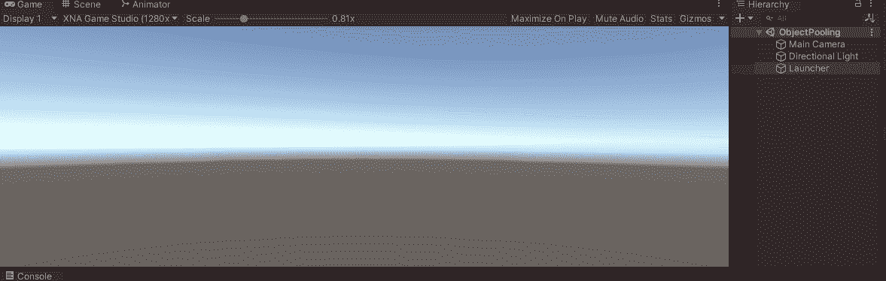
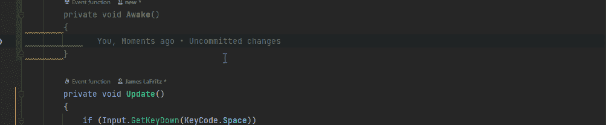
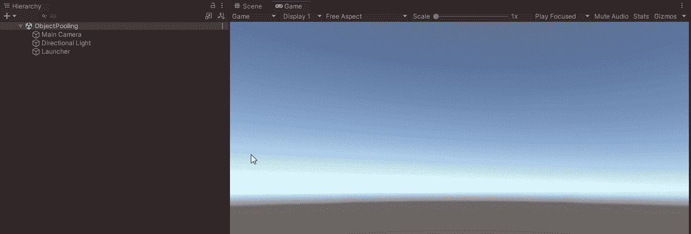

# Unity 中的对象池模式

> 原文：<https://blog.devgenius.io/object-pool-pattern-in-unity-f285adea5d5a?source=collection_archive---------0----------------------->

使用一组随时可用的初始化对象，而不是按需分配和销毁它们。这有助于提高性能，因为它重用了对象，而不是不断地销毁和创建它们。

对象池可视化示例

我有一个带有子弹组件的子弹预置和一个用于视觉的精灵渲染。

预制项目符号

子弹行为有一个速度，在更新方法中子弹以这个速度移动。当摄像头看不到子弹时，它就会自我毁灭。

项目符号行为

我有一个带有发射器组件的发射器。

发射器行为包含一个子弹预置，当我按空格键一个新的子弹在游戏中创建。

每次我按下空格键，就会产生一个新的子弹，当子弹到达屏幕的末端时，子弹就会从游戏中移除。

在这个例子中，没有足够的东西影响游戏的性能，但是想象一下，每一帧都有成百上千个这样的东西被创建和破坏。

# 履行

如果你使用的是 Unity 2021，Unity 已经内置了一个。

 [## 对象池

### UnityEngine 中的类。Pool /实现于:UnityEngine。CoreModule 实现接口:IObjectPool 建议更改…

docs.unity3d.com](https://docs.unity3d.com/ScriptReference/Pool.ObjectPool_1.html) 

如果您使用的是旧版本的 Unity，那么您必须制作自己的 see Unity Learn 作为一个良好的起点/

 [## 对象池介绍- Unity Learn

### 对象池是优化您的项目和减轻 CPU 负担的一个很好的方法，当您不得不…

learn.unity.com](https://learn.unity.com/tutorial/introduction-to-object-pooling) 

我将展示如何在 Unity 2021 中使用新的对象池。

我需要做的第一件事是在客户机上创建一个我想要的类型的 IObjectPool，在我的例子中，它是启动器中的一个子弹池。我还要确保我使用的是 UnityEngine。池命名空间。

IObjectPool <bullet>已添加到启动器</bullet>

接下来，我需要用一个具体的实现实例化这个池，我将在 Awake 中完成。

为了创建池，池需要几个函数。

[https://docs . unity 3d . com/2021.3/Documentation/script reference/Pool。ObjectPool_1-ctor.html](https://docs.unity3d.com/2021.3/Documentation/ScriptReference/Pool.ObjectPool_1-ctor.html)

我使用 Rider 作为我的 IDE，这样我就可以一边走一边自动创建这些函数。

实例化新池并创建函数

最后 3 个参数有默认值，所以我不需要为它们指定什么。

建立一个新的子弹池

## 创建方法

> createFunc 用于在池为空时创建新实例。在大多数情况下，这将只是()= >新的 T()。

我不是在 Update 方法中实例化一个新的项目符号，而是从池中获取一个项目符号，并在 create 方法中实例化该项目符号。

从池中获取一个新的项目符号，并在 Create 方法中实例化该项目符号

## Get 方法上的操作

> 从池中取出实例时调用 actionOnGet。

当我从泳池里拿到一颗子弹时，这就是我想要发生的。我要子弹把自己设置成主动，把子弹的位置设置成发射架的位置。

在获取项目符号时

## 对发布方法的操作

> 当实例返回到池中时调用 actionOnRelease。这可用于清理或禁用实例。

我将停用场景中的子弹游戏对象。

## 销毁方法上的操作

> 当元素由于池达到最大大小而无法返回到池时，调用 actionOnDestroy。

如果子弹池太大，那么我将摧毁子弹游戏对象。

## 正确处理子弹

目前我的子弹行为/组件/脚本告诉子弹在隐形时自我毁灭。我需要把子弹放回游泳池。在一个真实的游戏中，我可能会使用一个碰撞器和一个内置的物理方法/功能，比如触发回车。我将在这个演示中使用隐形。

正确地将子弹释放回泳池

我还需要能够设置对池的引用。

方法来设置对池的引用

我需要在发射器创建子弹的时候设置子弹所属的池。

# 现在子弹池工作正常。

Unity 创建项目符号并使用项目符号池

## 最大池大小

请注意，子弹被返回到池中，游戏对象变为非活动状态。现在，游戏将在池中创建多达 10，000 颗子弹，请注意，我实际达到的最大值是 13。我可以将池的最大大小设置为 5 或 10，Unity 将删除不需要的多余项目符号。

将最大尺寸设置为 5

现在 Unity 将只在场景中保留 5 颗子弹，并销毁不适合池中的子弹。它首先从库中获取子弹，如果库中没有子弹，它将创建一个新的子弹。子弹被送回弹药库，如果弹药库已经达到最大尺寸，那么子弹将被销毁。

代码可以在我的 Git Hub 页面上找到

 [## GitHub-JamesLaFritz/Design-Patterns-For-Unity 发布时-对象池

### 报告 Bug 请求特性展示了 Unity 中不同的编程设计模式。有许多不同的…

github.com](https://github.com/JamesLaFritz/Design-Patterns-For-Unity/tree/release-ObjectPooling)