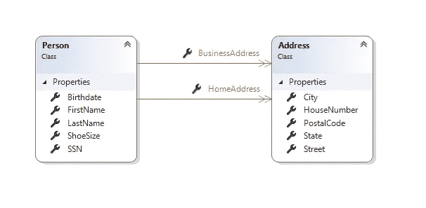
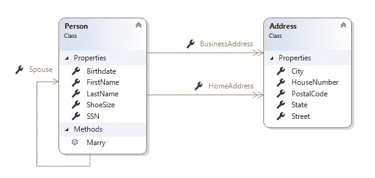

# 物化！-对象建模 101

> 原文：<https://blog.devgenius.io/objectify-f8e6337133c1?source=collection_archive---------6----------------------->

几乎每个现代程序员都听说过面向对象编程。自 20 世纪 60 年代初以来，它一直以这样或那样的形式存在，但在 20 世纪 90 年代中期开始流行，并一直保持全速发展。

对于那些刚接触这个术语的人来说，它只不过是一种思考如何设计计算机程序的方式。你不去想解决问题的步骤，而是把程序的各个部分想象成相互作用的*事物*——本质上是存在于计算机程序之外的某种现实的模型，模仿你试图解决的现实世界的问题。

# 对象？模特？我不确定我明白了…

这不是最简单的概念，但绝对值得学习。先说“什么是模型？”。

Dictionary.com 将*模型*一词定义为“……一种表示，通常是一种缩影，用以展示某物的构造或外观”(模型)。对于我们的目的来说，这是一个很好的定义，因为当我们对计算机系统建模时，我们正在创建我们感兴趣的真实事物的简化版本。

我们以一个人为例。如果我们向计算机系统描述一个人，我们可能会想到他们的名字、姓氏和出生日期等属性。此外，根据我们的系统正在做什么，我们可能会包括像社会安全号码(如果我们是国税局)或鞋号(如果我们是一个在线鞋店)。我们不可能得到向我们的系统描述的人的绝对总数，但是我们将包括我们认为对解决我们的问题重要的事情(软件架构师称之为*问题域*)。

所以，我们的人的模型被简化了。它只考虑那些我们当时认为重要的事情，正如我们所知，企业会改变他们认为重要的事情，所以这种模式将随着时间的推移而发展。没关系。我们不会从一开始就做对，我们应该预料到这一点。

我们的个人模型不会生活在真空中。还会有其他种类的物体与他们互动。一个人可能有一个地址，或者不止一个地址，如果这对我们很重要，我们也可以把它保存起来。

让我们给一个地址一个门牌号，一条街道，一个城市，一个州(或省，或类似的东西)和一个邮政编码。我们的人可以有 0 个或更多的家庭地址，因为我们需要处理无家可归的人和在温暖气候下过冬的人。他们可能有零个或多个工作地址。如果这对我们的应用程序很重要，我们将把它放在我们的模型中。

我们的模型目前看起来像这样:

使用这种方法，我们将在与业务人员讨论他们的问题域时发展模型。他们在描述他们希望系统做什么时使用的每个重要名词都成为我们模型的一部分，所以请做好笔记！这让我们想到了对象建模的第一个原则:

# 物体是名词

我们正在建模的东西只是…东西。它们是我们讨论系统功能时用到的名词。如果你发现自己在模仿“跑”或“唱”，那你就做错了。

此时，我们需要停下来纠正一些术语。我们一直说“对象”,因为每个人在谈论这种建模时都这么说，而*是*正确的术语——对象建模。但是我们正在设计的东西被恰当地称为*类*。类是对象的*类型*，对象是类的具体实例。

啊？

一个例子将使这一点更加清楚。之前，我们设计了一个 Person 类和一个 Address 类。在我们的系统中，我们可能有 Joe、Sally 和 Jim Bob——他们是 Person 类的对象。如果 Joe 和 Sally 都住在 123 Main Street，并且 Jim Bob 是他们在 125 Main Street 的邻居，那么我们有三个 Person 对象和两个 Address 对象(Joe 和 Sally 共享他们家庭地址属性的 Address 对象)。从这里开始，我们将使用术语*类*来描述事物的*种类*，使用*对象*来描述事物的*实例*。

# 所以，类是名词

好多了。继续前进…

# 班级可以做事情

当程序员没有完全考虑他们正在进行对象建模的事实时，这是经常被忽略的。在今天的世界中，有许多方法可以以某种持久的方式存储对象，比如在数据库中。程序员可以使用像微软的 Entity Framework、Red Hat 的 Hibernate(及其开源的堂兄 NHibernate)、苹果的核心数据以及数百个其他的代码库，包括商业的和免费的。它们非常节省时间，但是有一种倾向，就是让程序员只根据类的属性来考虑类。这真的很遗憾。

在每一种支持类和对象的编程语言中，它们的定义包括它们的属性——对象的特征；它们包含的*数据*和*方法*，允许对象执行动作的计算机代码。它们不仅仅是贫血的数据包，不应该被允许以这种方式建模。

这里再举一个例子。让我们将属性*配偶*添加到 Person 类中。*配偶*将是类型*人*的对象，开始时为空(或者用计算机术语来说 *null* ),因为一个人并非生来就是已婚的。

所以，在乔和莎莉还单身的时候，有一天莎莉向她求婚了。Joe 同意了，所以我们运行 Joe 对象的 Marry()方法。我们的 Marry()方法需要知道 Joe 要和谁结婚，所以我们将 Sally 对象作为 Joe 传递给它。玛丽(莎莉)。

现在，我们的模型看起来像这样:

在该方法中，我们可以将 Joe 的配偶属性设置为 Sally，并告诉 Sally 的配偶属性应该包含 Joe。当然，我们可以做其他事情，比如减少他们储蓄账户的余额属性，因为他们有一个盛大的婚礼，但这将使事情变得复杂。要点是 Person 类中的方法调用做了一些有意义的事情，按照我们在那里设置的任何业务规则来更改当前对象和任何其他相关对象。这些规则将永远被 Person 类的任何对象所遵循，因为它们是类的一部分，使得它们在需要的时候很容易被找到和修改。是的，商业规则是会变的，但是你已经知道了，不是吗？

# 模型应该总是反映现实

由于我们将类的属性集中在我们关心的系统事物上，并为每个对象在执行适当的操作时必须遵循的规则添加了方法，因此我们需要确保模型与业务中不断变化的现实保持同步。

如果我们正在建模一个杂货店，我们将有商品类、销售类、客户类(如果我们有一个忠诚度程序)和其他类。商品可能有一个叫做应税的属性，如果它是真的，我们销售它会得到销售税，如果它是假的，就绕过销售税。让我们在 Sale 类中放一个 Sell (Customer，commodity)方法来完成向特定客户销售商品的工作。

我们的业务规则规定，如果商品对象的应税属性为真，我们将查找税款并将其添加到总额中。很好——计算和征收销售税变得自动化了，因为我们的销售对象在我们销售商品时会这样做。但是规则变了…

一年一度，就在返校时间之前，有一个周末，学校用品不会被征收销售税。怎么办？

这说明我们需要确保我们的类跟上问题领域不断变化的现实，而不是进入我们可以处理这个问题的数百种方法中的任何一种。在这种情况下，我们不仅需要暂停某些商品的销售税，而且这种暂停必须是暂时的。而且日期每年都会改变，所以简单地说，在接下来的两天里，一些项目不会被收取政府附加费是行不通的。提出处理这类问题的通用方法是程序员的工作。

# 这一切的 TLDR

(对于那些不太会说极客话的人来说，它代表“太久了——没有阅读”。)

把一切都浓缩:

1.  创建一个模型——现实的简化版本——包含您对应用程序感兴趣的名词类型。
2.  添加对这些有趣的类很重要的属性
3.  一个对象执行的任何动作都应该由那个对象执行
4.  *确保当现实发生变化时，类也会发生变化。*

*从这里开始，事情会变得更加复杂，但这是一个很好的开始。诀窍是，当你开始迷失在随后出现的复杂性中时，记住这些基本原则。忘记它们，应用程序开始变得脆弱和错误。但是如果你坚持这样做，改变会更容易，错误会更少(它们不会完全消失)，并且在创建应用程序上的投资会在未来的许多年里继续带来收益。*

***引用:***

*“模特。”*Dictionary.com*，[Dictionary.com](http://dictionary.com/)，[www.dictionary.com/browse/model?s=t](http://www.dictionary.com/browse/model?s=t)。*