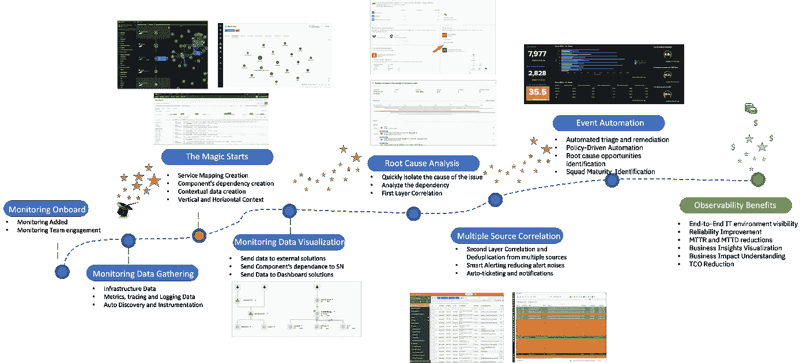
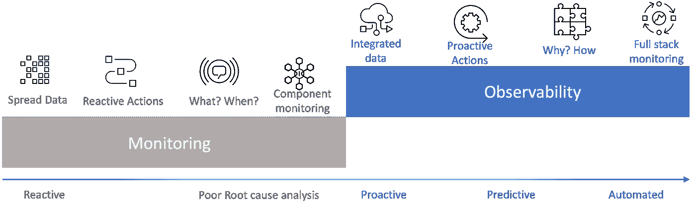
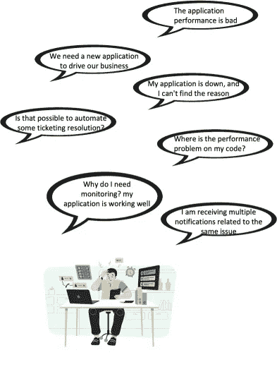
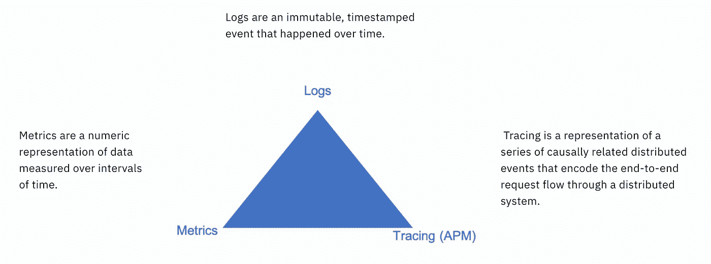
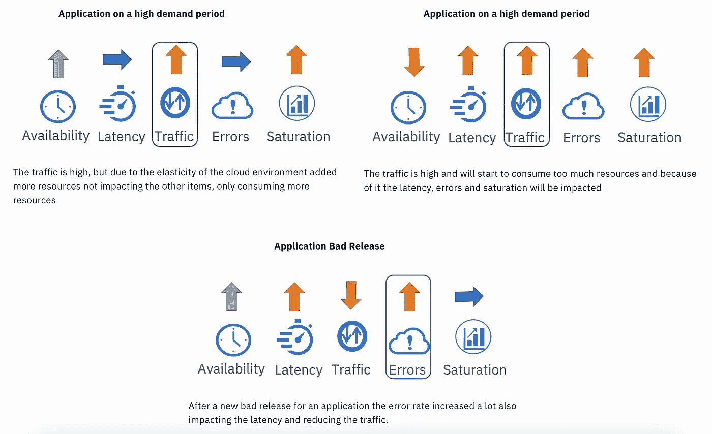
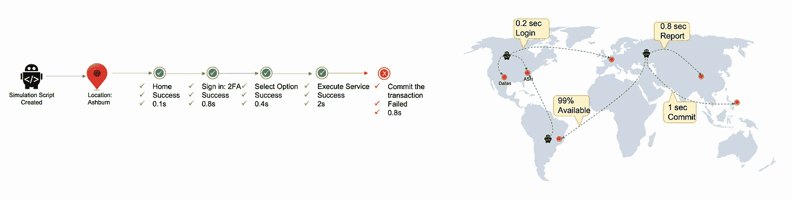
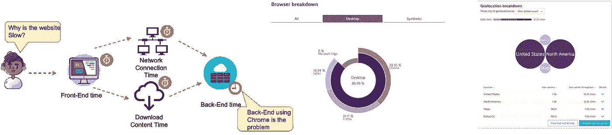
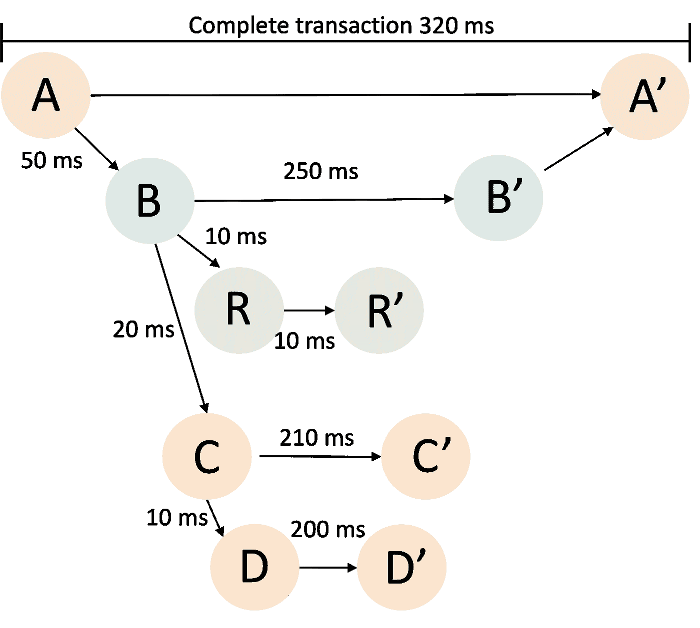
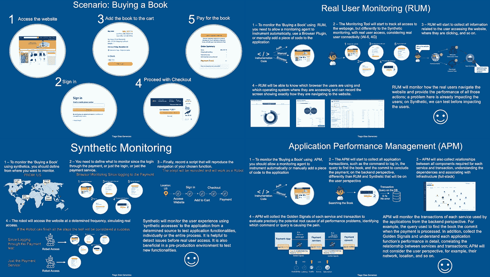
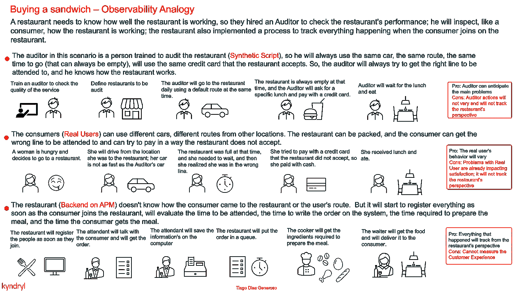

# 你应该知道的可观察性概念

> 原文：<https://blog.devgenius.io/observability-concepts-you-should-know-943fc057b208?source=collection_archive---------6----------------------->

我决定写这篇文章，因为可观察性(或简称为 o11y)是伴随谷歌 SRE(网站可靠性工程)而来的最重要的 IT 话题之一。我没有找到一篇文章把一些重要的概念放在一起，来帮助每个人理解和从事可观测性项目。

我将在此讨论的主题:

*   监控与可观察性
*   可观性解决的主要问题
*   可观察性优势
*   可观察性的三个支柱
*   SRE 黄金信号公司
*   如何利用黄金信号找到瓶颈
*   应用程序监控类型、合成、应用程序性能监控(APM)和真实用户监控。

# 监控与可观察性

**监控**是收集、分析和使用信息的过程，以跟踪项目实现其目标的进度，并指导管理决策。监控侧重于观察特定的指标。日志记录提供了额外的数据，但通常是从更广泛的系统环境中孤立地看待的。

**可观察性**是通过分析系统生成的数据(如日志、指标和跟踪)来了解系统内部状态的能力。它有助于团队分析跨多云环境的环境中正在发生的事情，以便您可以检测并解决问题的根本原因。

可观察性和监控相辅相成，各有不同的用途。

监控告诉你什么时候出了问题，而可观察性让你明白为什么。监控是可观察性的一个子集，也是可观察性的一个基本动作。你只能监控一个可观察的系统。

# 可观性解决的主要问题

*   云原生和微服务不断变化，依赖复杂技术；一旦我们将服务和组件托管在不同的主机环境中，任何更改都有可能导致整个系统崩溃。
*   一个问题可以为不同的团队生成多个事件，这使得确定问题的根本原因变得更加困难。
*   应用程序可用性可以决定业务的成败。
*   开发人员更频繁地部署代码，这使得很难理解性能方面发生了什么。
*   应用程序和基础设施在所有级别上都高度相互依赖。

# 可观察性优势

通过提供以下功能减少运营工作量:

*   识别依赖关系的简单方法
*   需要时，使用 RCA 细节进行自动化
*   通过人工智能(AI)进行自动诊断和 RCA
*   通过关联和语境化减少票证

通过提供以下服务改善客户体验:

*   更快地解决关键业务问题
*   通过分析性能交付更好的应用
*   支持实施新功能和实时发现问题的需求
*   在用户体验受到影响之前识别并修复性能问题

提高业务可见性:

*   关于应用程序依赖关系的集中信息
*   仪表板和报告的集中信息
*   识别和量化具有高业务影响的问题

# 可观察性的三个支柱

# SRE 黄金信号公司

部署监控解决方案的最佳起点是实施谷歌的黄金信号:

1.  延迟——为请求提供服务所花费的时间，或者称为响应时间的指标。
2.  流量—应用程序中的活动量。
3.  错误—失败请求的比率。
4.  饱和度——您的服务有多全面。

查看谷歌 SRE 书籍了解更多信息。​

# 如何利用黄金信号找到瓶颈

有了黄金信号，我们可以评估应用程序的性能并确定问题的根本原因；这是大多数应用程序性能监控(APM)解决方案用来查找根本原因的方法。

在这里，您可以看到三个示例，说明黄金信号如何一起轻松显示瓶颈:

# 应用程序监控类型

*   合成监控(人工交易)
*   应用性能监控(APM)
*   真实用户体验

合成监控:这种监控技术模拟人工事务的脚本记录(合成)。创建脚本是为了模拟用户在浏览网站的 web 应用程序上的行为，并且通常选择一个位置，在该位置，模拟将能够显示在不同站点上运行的性能。它可用于测试网站的某些功能，例如登录或流程，因为登录会通过其他网站功能。在用户真正访问之前发现问题是很有帮助的。在生产前环境中测试新功能也是有益的。

真实用户监控(RUM):真实用户监控是一种被动的监控技术，它将分析网站内的所有用户迭代，并收集有关用户部分和性能的信息，例如，收集用户正在使用的浏览器以及他们访问应用程序的位置。既然关系到真实接入，就会考虑用户连接(wi-fi、4G、5G)。此处检测到的问题已经影响到用户；在 Synthetic 上，我们可以在用户受到影响之前看到真实的影响，但不会考虑用户的特殊性。

应用程序性能监控:APM 将提供应用程序级别的监控，我们可以从后端的角度看到每个事务的性能(黄金信号),例如，查找一本书的查询。但是，APM 不会考虑最终用户的体验，例如他们的网络、位置等。

解释 APM、Synthetic 和 RUM 之间差异的场景:

我还创建了一个类比来支持需要向非技术团队解释的人:

你可以在“你应该知道的可观测性概念第二部分”中了解更多信息:[https://tiagodiasgeneroso . medium . com/Observability-Concepts-you-should-know-Part-2-74cb 24950 ed1](https://tiagodiasgeneroso.medium.com/observability-concepts-you-should-know-part-2-74cb24950ed1)

*Tiago Dias Generoso 是巴西 Pocos de Caldas 的杰出 IT 架构师|高级 SRE |主发明家。以上文章为个人观点，不一定代表雇主的立场、策略或观点。*