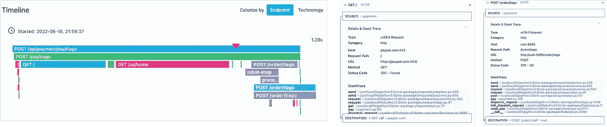
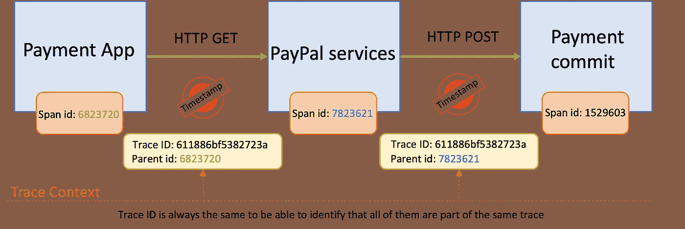
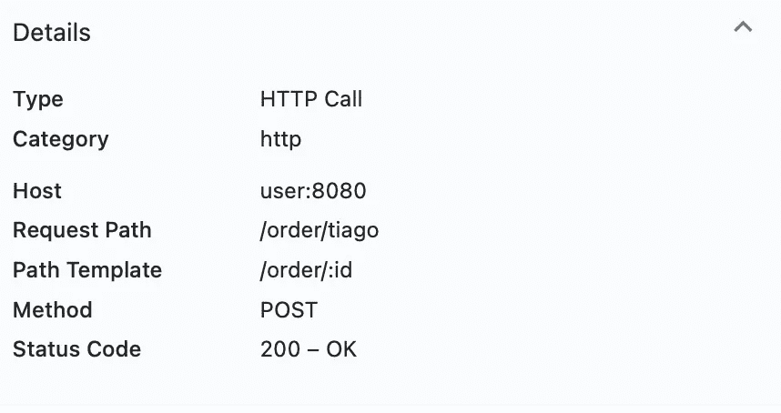
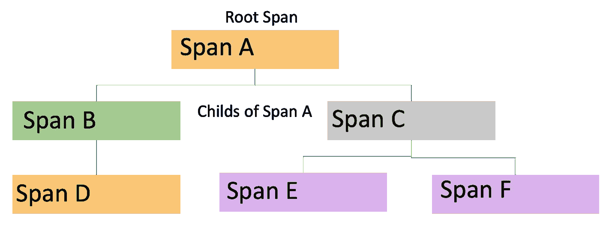
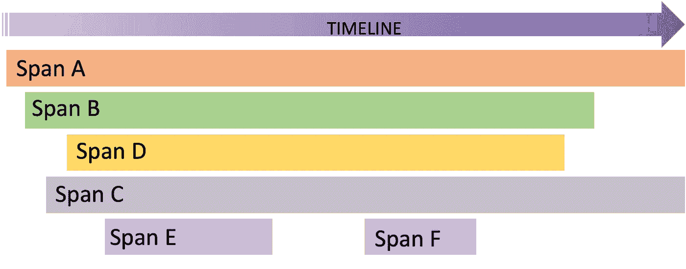
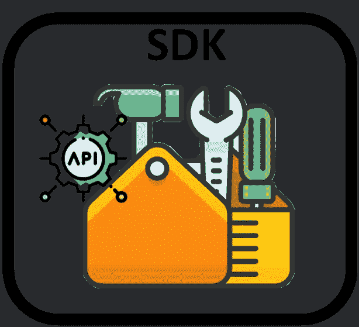
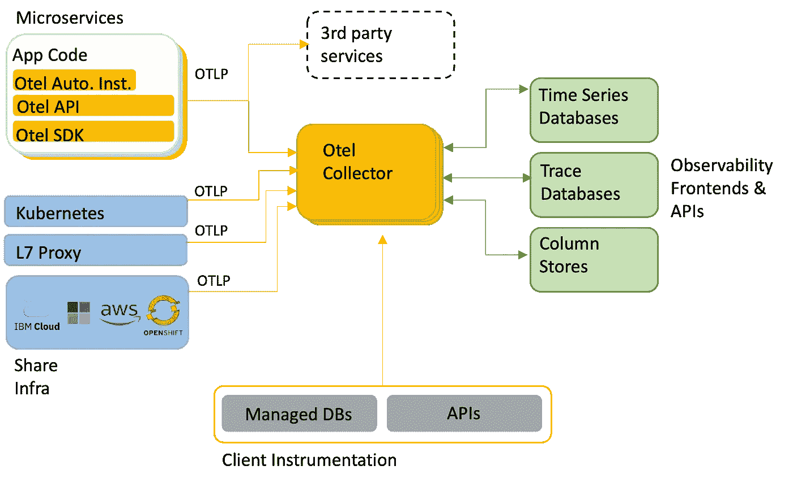

# 你应该知道的可观察性概念—第 2 部分

> 原文：<https://blog.devgenius.io/observability-concepts-you-should-know-part-2-74cb24950ed1?source=collection_archive---------12----------------------->

我写了第一篇文章“你应该知道的[可观察性概念](https://tiagodiasgeneroso.medium.com/observability-concepts-you-should-know-943fc057b208)”，向大家介绍学习可观察性(或简称为 o11y)的一些关键概念。但是在一些请求和反馈之后，我决定撰写第 2 部分，深入探讨一些可以让你为将可观察性付诸实践做好准备的项目。

在我的第一篇文章中，我解释了可观察性的三个支柱(日志、度量和跟踪)。在第 2 部分中，我想避免讨论日志和指标，因为它们背后的概念更简单。

我的目标是以一种简单的方式介绍以下主题，并解释为什么这些概念对你的可观察性之旅至关重要。

*   分布式跟踪
*   API 和 SDK 的概念和比较
*   开放式遥测

# 分布式跟踪

分布式跟踪是一种连接多个服务之间的所有事务的技术，使得端到端地跟踪它们成为可能。跟踪是对请求的完整处理，从最初的请求开始，经过所有必需的子活动(span ),直到事务结束。

例如，一个支付过程是一个痕迹；整个支付事务需要执行一些跨度来完成支付，例如，联系信用卡供应商，更新数据库，并将结果返回给用户。

使用 Instana 的机器人商店应用程序的付款跟踪

跟踪是如何发生的:

1-请求到达应用程序，并创建跟踪 ID

2-付款流程收到请求，处理信息，并将发送所有下游活动(范围)的跟踪 ID，并将所有内容关联到同一跟踪。

3-每个跨度完成后，将创建一个开始和结束时间戳，并将包含在跟踪时间线上，从而完成整个跟踪。

正如您在跟踪解释中看到的，span 代表一个工作单元，跟踪特定的请求。一个跟踪由多个跨度组成，每个跨度能够显示其执行的细节。

使用 Instana 工具的机器人车间跨度属性:

跨度属性

表示轨迹的两种不同方式:

单个轨迹中跨度之间的因果关系

单个轨迹中跨度之间的时间关系

# API 和 SDK 的概念和比较

为什么我的可观测性之旅需要了解 API 和 SDK？回应很容易；这是因为 SDK 和 API 是可观察性工具用来检测应用程序的机制。

**什么是 API(应用编程接口)？**

API 是为应用程序创建的接口，允许外部实体通过一个抽象层与该应用程序进行通信，并使用标准化来使这些外部实体易于与应用程序进行交互。因此，API 将允许可观测性解决方案从应用程序中提取信息。

**什么是 SDK(软件开发工具包)**

SDK 是一套用于促进和标准化软件开发的工具，因此开发人员不需要从头开始创建应用程序；他们可以重用这些工具包提供的工具。

因此，SDK 是一个完整的工具包，API 是这个工具包的一部分，创建了一个外部实体可以与之通信的接口。

可观察性工具可以有自己的 SDK，开发人员可以用它来装备发布 API 的应用程序，并允许应用程序向可观察性后端发送数据。

SDK 是一个工具包，其中也可以包含 API

下面的视频解释了 API 和 SDK 的区别:

IBM 云解释

# 开放式遥测

OpenTelemetry 是来自 CNCF(云本地计算基金会)的一个开源项目，旨在创建一种供应商中立的标准方法来为应用程序、基础设施和服务收集遥测数据。

OpenTelemetry at the end 是用于为可观测性后端生成遥测数据的工具、API 和 SDK 的集合。

**我为什么需要学习它？**

第一个原因是，通过学习 Otel 是如何工作的，您可以了解可观察性是如何工作的，数据收集是如何发生的，跟踪是如何创建的，等等。

第二个原因是，Otel 正在成为所有可观测性工具的标准，所有供应商都必须与 Otel 兼容。但是供应商为什么要投资呢？因为 Otel 不提供后端、分析、人工智能和许多其他功能，数据收集本身并不是可观察性供应商的主要市场。

你可以在这里了解更多详情:【https://opentelemetry.io/docs/concepts/】T4

Otel 架构参考

如何使用 Otel 收集数据？

参考:[https://opentelemetry.io/docs/concepts/instrumenting/](https://opentelemetry.io/docs/concepts/instrumenting/)

收集器**:open telemetry 收集器是一个独立于供应商的代理，可以接收、处理和导出遥测数据。它支持接收多种格式的遥测数据，并向一个或多个后端发送数据。**

**自动检测**:要使用 Otel 自动检测，开发者应该满足一些依赖关系，这些依赖关系会随着编程语言的不同而不同。一旦安装了这些依赖项，开发人员就应该配置一些次要的东西来准备好插装，例如，通知后端接收器。

**手动插装**:要手动插装一个应用程序，开发人员应该安装 Otel API 和 Otel SDK，他们应该在代码中定义如何收集信息并将其发送到 Observability 后端，这需要更多的工作来实现插装。

如何检测应用程序的一些示例:

[https://open-telemetry . github . io/open telemetry-python/getting-started . html](https://open-telemetry.github.io/opentelemetry-python/getting-started.html)

[https://open telemetry . io/docs/instrumentation/Java/automatic/](https://opentelemetry.io/docs/instrumentation/java/automatic/)

[https://opentelemetry.io/docs/instrumentation/java/manual/](https://opentelemetry.io/docs/instrumentation/java/manual/)

就是这样，你们所有人；我希望它能帮助你更多地了解一些重要的可观测性概念。:)

*Tiago Dias Generoso 是巴西 Pocos de Caldas 的杰出 IT 架构师|高级 SRE |主发明家。以上文章为个人观点，不一定代表雇主的立场、策略或观点。*