# 可观察性——实践中的景观代码

> 原文：<https://blog.devgenius.io/observability-landscape-as-code-in-practice-732743e201b2?source=collection_archive---------7----------------------->


激光灯。摄于[卡萨罗马的恐怖传说](https://legendsofhorror.ca)。由[阿德里·维勒拉](https://adri-v.medium.com)拍摄。

***同*** [***阿娜玛格麦地那***](https://lightstep.com/blog/authors/ana-margarita-medina)

如果你阅读了阿德里亚娜关于可观察性的文章，你可能会想起六月份的一篇文章，介绍了可观察性-景观作为代码(OLaC)的概念。

可观察性景观由以下部分组成:

*   应用仪表
*   收集和存储应用遥测数据
*   可观察性后端
*   一组有意义的 SLO
*   针对待命工程师的警报

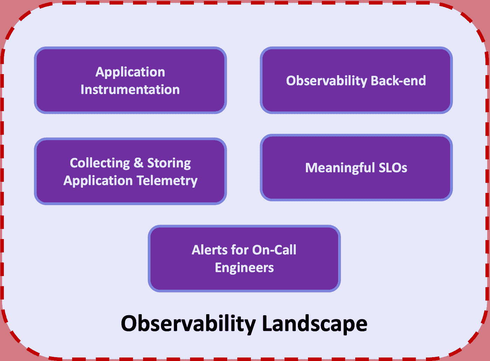

记住这一点，OLaC 仅仅是你的可观察性景观的编码，从而确保一致性、可维护性和可再现性。

那当然很好，但是看看这个东西的运行怎么样？好吧，我的朋友，你来对地方了，因为今天，你将看到一个教程，里面有很多实际操作的 OLaC 实践。

1.  [**采集&存储应用遥测** **采集&存储应用遥测**](https://lightstep.com/blog/observability-mythbusters-observability-landscape-as-code#use-the-otel-collector--codify-its-deployment)
2.  **方式:**[open telemetry Collector open telemetry Collector](https://docs.lightstep.com/otel/quick-start-collector)通过代码(Helm chart)部署，旁边是构成[open telemetry Demo App open telemetry Demo App](https://github.com/open-telemetry/opentelemetry-demo)的各种服务。
3.  [**整理您的可观测性后端配置** **整理您的可观测性后端配置**](https://lightstep.com/blog/observability-mythbusters-observability-landscape-as-code#codify-observability-back-end-configuration)
4.  **如何:**使用[light step terra form Provider light step terra form Provider](https://registry.terraform.io/providers/lightstep/lightstep/latest/docs)在 [Lightstep](https://app.lightstep.com/) 中创建仪表板。

我们希望通过一个使用现代云原生工具的真实例子来展示 OLaC 原则…这意味着将 [Kubernetes](https://kubernetes.io) 用于我们的云基础设施和 [Google Cloud Google Cloud 的](https://cloud.google.com/gcp) Kubernetes 产品。现在，因为我们是 OLaC 和 SRE 的好实践者，我们不会仅仅通过 UI 的点击来设置东西。不，先生。相反，我们将使用[hashi corp](https://hashicorp.com/)[terra form](https://terraform.io/)来# automatingAllTheThings。Terraform 允许我们进行基础设施即代码(IaC ),并为我们带来大量额外的好处，如更好地控制我们的资源和标准化。这些是《拉丁美洲和加勒比地区行动计划》和《临时行政理事会》的关键原则。

我们将把 [OpenTelemetry 演示应用](https://github.com/open-telemetry/opentelemetry-demo)部署到我们的集群。演示应用程序已使用[open telemetry open telemetry](https://opentelemetry.io)进行测试，并将通过[open telemetry Collector open telemetry Collector](https://docs.lightstep.com/otel/quick-start-collector)向 Lightstep 发送和。

你准备好了吗？？？我们开始吧！

# 辅导的

## 先决条件

开始之前，您需要以下材料:

*   一个 [Lightstep 账户](https://app.lightstep.com/signup/developer?signup_source=docs)，这样你就可以看到应用程序跟踪和度量仪表板
*   您想要使用的 [Lightstep](https://app.lightstep.com/) 项目的 [Lightstep 访问令牌](https://docs.lightstep.com/docs/create-and-manage-access-tokens#create-an-access-token)
*   一个 [Lightstep API 键](https://docs.lightstep.com/docs/create-and-manage-api-keys)，用于在 [Lightstep](https://app.lightstep.com/) 中创建仪表板。
*   运行 Terraform 脚本的 Terraform CLI
*   一个[谷歌云](https://cloud.google.com/gcp)账户，这样你就可以创建一个 Kubernetes 集群( [GKE](https://cloud.google.com/kubernetes-engine) )
*   [gcloud CLI](https://cloud.google.com/sdk/docs/install-sdk) 与谷歌云互动
*   与 Kubernetes 互动

# 步伐

**1-复制示例回购**

让我们从复制示例回购开始:

```
git clone https://github.com/lightstep/unified-observability-k8s-kubecon.git
```

**2-初始化子模块**

这个项目使用了几个[Git 子模块]([https://git-scm.com/book/en/v2/Git-Tools-Submodules](https://git-scm.com/book/en/v2/Git-Tools-Submodules))，所以为了确保事情顺利进行，你需要把它们拉进来:

```
cd unified-observability-k8s-kubecon
git submodule init && git submodule update
```

**3-谷歌云登录**

在我们创建 GKE 集群之前，您必须验证您的 Google Cloud 帐户:

```
gcloud auth application-default login --no-launch-browser
```

您将看到一个链接，您需要在浏览器中打开该链接来验证您的 Google ID。通过身份验证后，浏览器将显示一个授权令牌，供您粘贴到命令行中，如下所示:

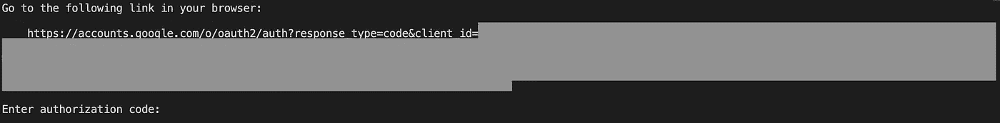

**4-创建 terraform.tfvars**

现在你已经通过认证了，让我们准备好登陆吧！在这样做之前，我们需要创建一个`terraform.tfvars`文件。

幸运的是，我们有一个非常方便的模板供您使用:

```
cd k8s-cluster-with-otel-demo/terraform
cp terraform.tfvars.template terraform.tfvars
```

接下来，在文件中填充以下值:

*   `<your_gcp_project>`:你的谷歌云项目的名称。不知道你的项目名称？没问题！只需运行`gcloud config get-value project`来找出它是什么！
*   `<your_gke_cluster_name>`:您希望为您的 GKE 集群命名。确保它遵循 Kubernetes 集群命名约定(即没有下划线`_`或特殊字符)。
*   `<your_lightstep_access_token>`:你的[轻步访问令牌轻步访问令牌](https://docs.lightstep.com/docs/create-and-manage-access-tokens#create-an-access-token)。这用于向您的 [Lightstep 项目 Lightstep 项目](https://docs.lightstep.com/docs/create-projects-for-your-environments)发送跟踪。
*   `<your_lightstep_api_key>`:你的[轻步 API 键轻步 API 键](https://docs.lightstep.com/docs/create-and-manage-api-keys)。这用于创建我们的指标仪表板。
*   `<your_lightstep_org_name>`:你的 Lightstep 机构名称。不确定你的组织叫什么？没问题！登录 Lightstep，点击屏幕左下方的人物图标。这会弹出一个小菜单。可以在“帐户管理”标题下找到组织名称，如下所示:

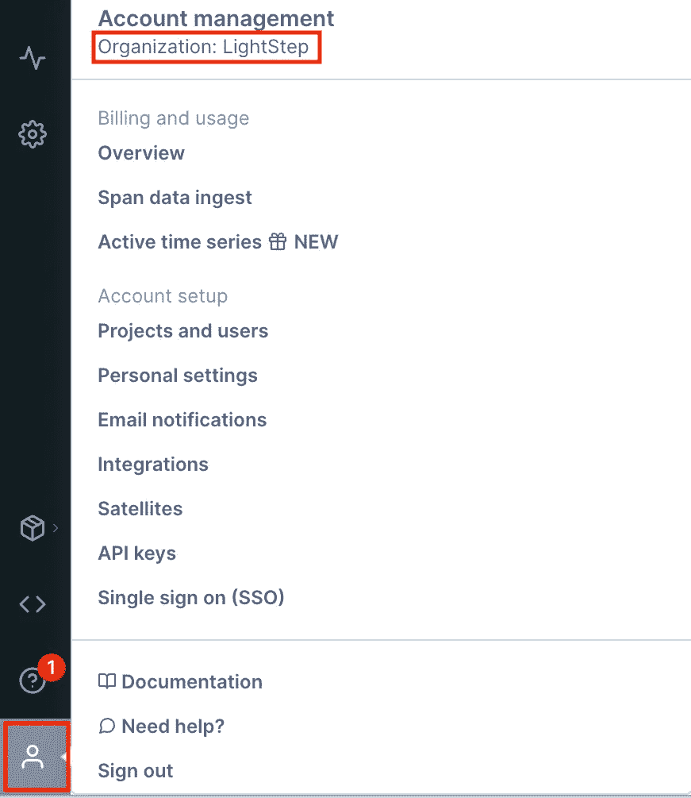

请注意，我的组织名为“LightStep”。你的将会不同。另请注意，组织名称区分大小写。

> **注意:** `*terraform.tfvars*` *在* `*.gitignore*` *中，不会被纳入版本控制。*

**5 道地形**

此步骤将初始化 Terraform(在本地安装提供程序)，然后将应用 Terraform 计划。

它将:

*   创建一个 Kubernetes 集群
*   使用 [OpenTelemetry 演示舵图](https://github.com/open-telemetry/opentelemetry-helm-charts/tree/main/charts/opentelemetry-demo)部署 [OpenTelemetry 演示应用](https://github.com/open-telemetry/opentelemetry-demo)
*   在 Lightstep 中创建仪表板

在运行下面的命令之前，确保你已经在`k8s-cluster-with-otel-demo/terraform`文件夹中。

请注意，这一步可能需要 30 分钟，这取决于 GKE 的处置。耐心点。😄

**6-更新您的 kubeconfig**

现在集群已经创建好了，您可以将它添加到您的`kubeconfig`文件中了！默认情况下，文件保存在`$HOME/.kube/config`。

在你更新你的`kubeconfig`之前，你首先需要确保你已经安装了[gke-g cloud-auth-plugin gke-g cloud-auth-plugin](https://cloud.google.com/kubernetes-engine/docs/how-to/cluster-access-for-kubectl#install_plugin):

```
gcloud components install gke-gcloud-auth-plugin
gke-gcloud-auth-plugin --version
echo "export USE_GKE_GCLOUD_AUTH_PLUGIN=True" >> ~/.bashrc
```

现在我们可以将集群添加到`kubeconfig`:

```
gcloud container clusters get-credentials $(terraform output -raw kubernetes_cluster_name) --region $(terraform output -raw region)
```

这将从 Terraform 获得`kubernetes_cluster_name`和`region`输出值(这是`terraform output -raw`的内容)，并将它们放入您的`gcloud container clusters get-credentials`命令中。

或者，如果您关闭了运行 Terraform 的终端并丢失了输出值，您也可以这样做:

```
gcloud container clusters get-credentials <cluster_name> --region <region>
```

其中`<cluster_name>`和`<region>`对应于您在步骤 3 中在`terraform.tfvars`文件中输入的值。

**7-查看 OTel 演示应用**

如果您运行`kubectl get ns`，您会注意到现在有了一个名为`otel-demo`的新名称空间:

这是我们部署 OTel 演示应用程序的地方。让我们看看这个名称空间，看看我们创建了什么。首先，我们来看看带有`kubectl get pods -ns otel-demo`的吊舱:

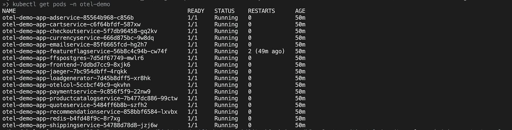

请注意我们是如何部署了一系列不同的服务来组成 OTel 演示应用程序的，包括`adservice`、`cartservice`、`recommendationservice`等。

我们还部署了一个 [OTel 收集器 OTel 收集器](https://docs.lightstep.com/otel/quick-start-collector)。其配置 YAML 存储在配置图中。我们可以通过运行`kubectl describe configmap otel-demo-app-otelcol -n otel-demo`来查看一下:

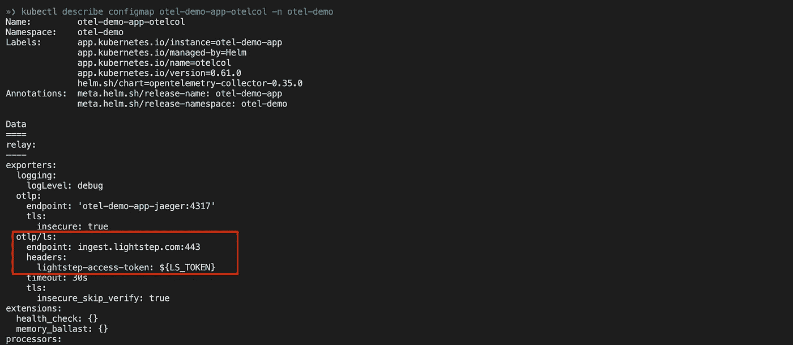

你可以看到我们还引用了一个名为`${LS_TOKEN}`的变量，它代表你在`terraform.tfvars`中设置的[光步访问令牌光步访问令牌](https://docs.lightstep.com/docs/create-and-manage-access-tokens#create-an-access-token)。但是它在哪里呢？这个秘密作为一个名为`otel-collector-secret`的秘密安装到 OTel 收集器容器实例中。让我们通过运行`kubectl describe secret otel-collector-secret -n otel-demo`来看看这个秘密:

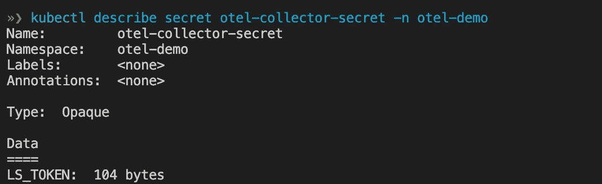

这一切的神奇都发生在[otel-demo-app-values-ls . YAML otel-demo-app-values-ls . YAML](https://github.com/lightstep/unified-observability-k8s-kubecon/blob/main/gke-otel-demo/terraform/configs/otel-demo-app-values.yaml)。这是来自 [OTel 演示应用掌舵图 OTel 演示应用掌舵图](https://github.com/open-telemetry/opentelemetry-helm-charts/blob/main/charts/opentelemetry-demo)的 [values.yaml values.yaml](https://github.com/open-telemetry/opentelemetry-helm-charts/blob/main/charts/opentelemetry-demo/values.yaml) 版本，更新了收集器配置，以便我们可以配置 OTel 收集器向 Lightstep 发送跟踪。

**8-运行 OTel 演示应用**

好了……库伯内特说的够多了。再来看看 [OpenTelemetry 演示 App](https://github.com/open-telemetry/opentelemetry-demo) ！您可以通过 Kubernetes port-forward 访问演示应用程序:

```
kubectl port-forward -n otel-demo svc/otel-demo-app-frontend 8080:8080
```

要访问前端，请访问 [http://localhost:8080](http://localhost:8080/) :

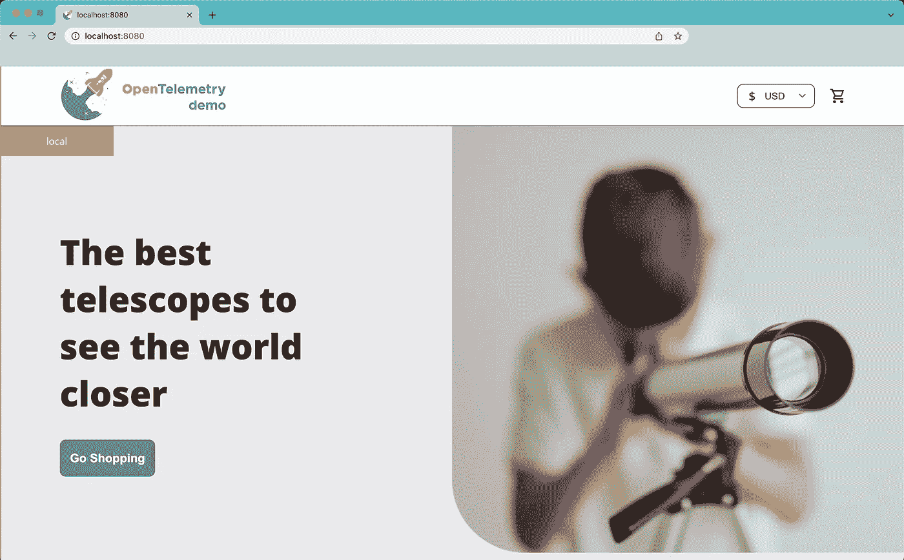

继续探索令人惊叹的望远镜和配件的选择，并购买一些。😉🔭

**9-参见 Lightstep** 中的轨迹

我们现在可以去 Lightstep 看看。让我们通过创建一个[笔记本](https://docs.lightstep.com/docs/use-notebooks)来做到这一点。

首先，点击左侧导航栏上的小页面图标(下面以蓝色突出显示)。这将显示以下页面:

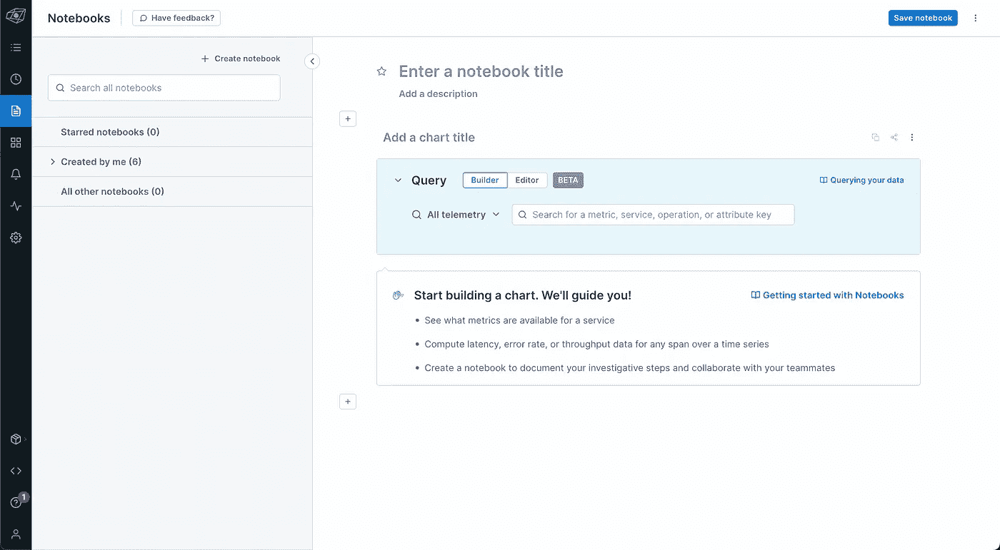

接下来，我们为我们的踪迹建立我们的查询。让我们看看来自`recommendationservice`的痕迹。我们将在“所有遥测”旁边的字段中输入`recommendationservice`。因为这是一项服务，所以从下拉列表中选择第二个值，即“使用‘推荐服务’作为服务值”，如下所示:

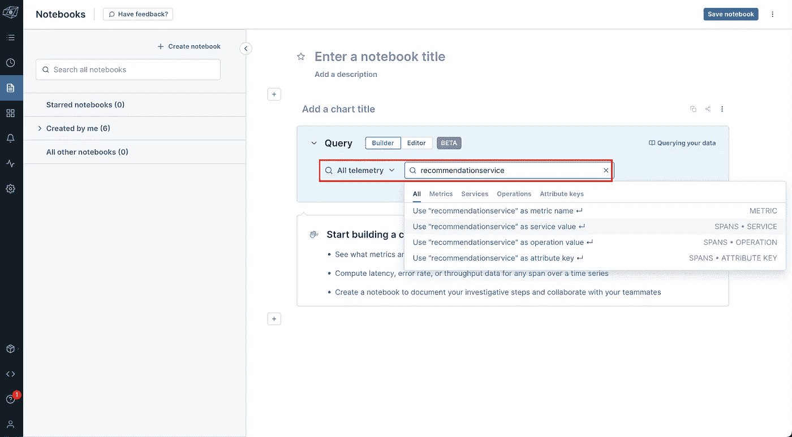

选择该值后，您将看到如下图表:

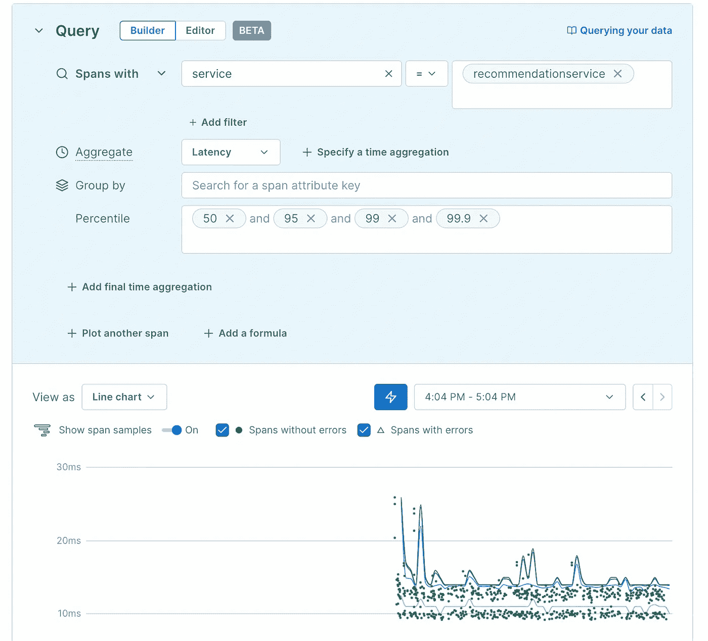

小绿点代表该服务的跟踪样本。将鼠标悬停在其中一个上，亲自查看！

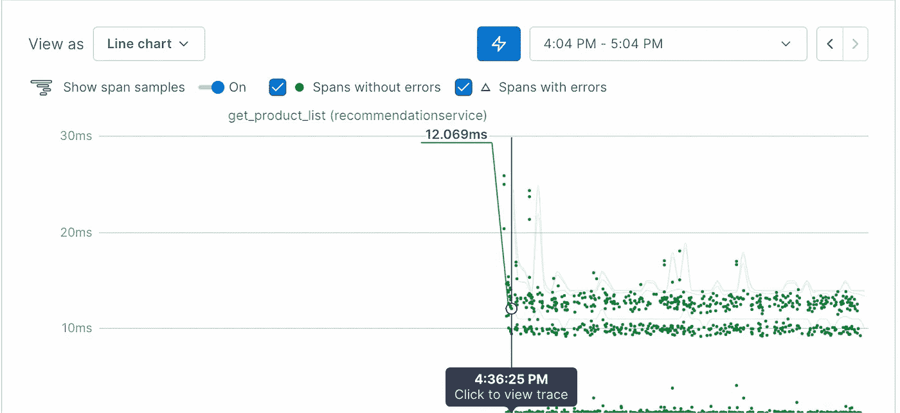

如果你点击这些点中的一个，你将被带到跟踪视图。在您单击之前，请确保先保存您的笔记本(不要担心，在您离开该页面之前，您会收到提醒)！

这里是我们点击上面的`get_product_list`点(操作)时看到的轨迹视图:

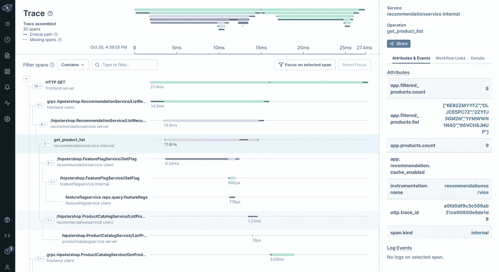

很酷吧，阿米利特？

**10-参见 Lightstep** 中的 Kubernetes 指标

还记得你跑`terraform apply`的时候吗？它不仅创建了一个 Kubernetes 集群，部署了 OTel 演示应用程序(和 OTel Collector)，还为我们创建了一些方便的度量仪表板。

您可以通过转到左侧导航栏上的仪表板图标(带有 4 个小方块的图标)来查看新创建的指标仪表板:

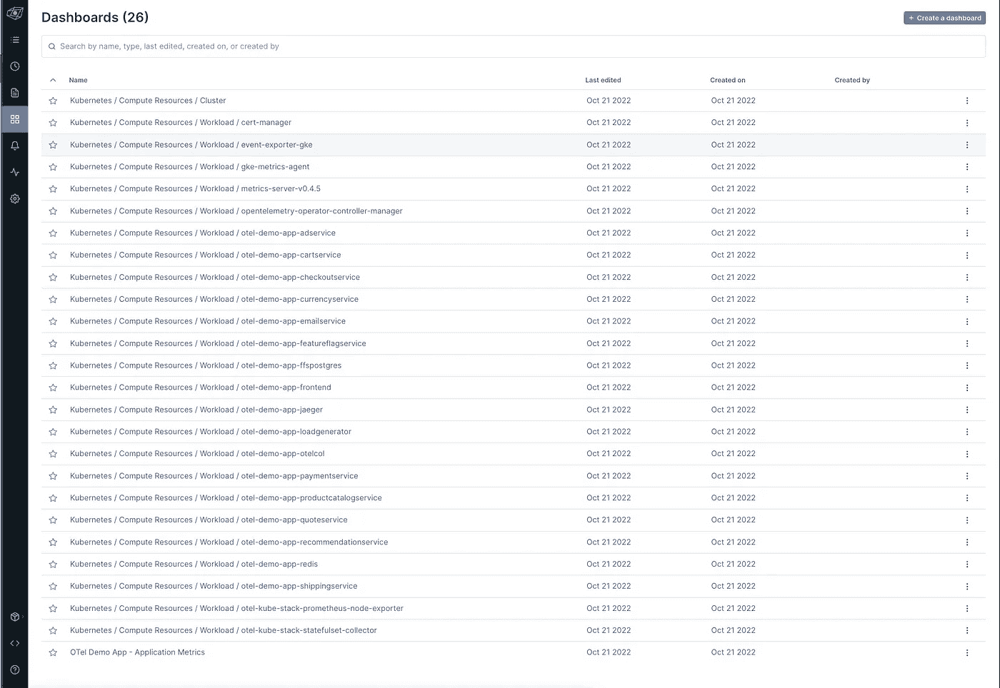

首先，让我们看看**Kubernetes/Compute Resources/Cluster**仪表盘。该控制面板允许您查看集群的状态。

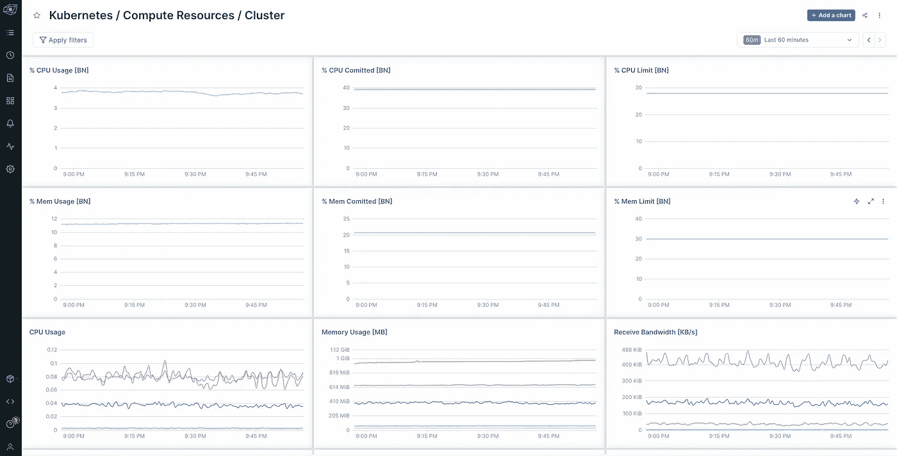

然后，我们有各种其他指标，称为 **Kubernetes 工作负载指标**。这些控制面板的名称以“ **Kubernetes /计算资源/工作负载**开头。这些仪表板特定于您正在运行的服务。它们使用[kube-state-metrics kube-state-metrics](https://github.com/kubernetes/kube-state-metrics)，考虑了您的各种名称空间中的 Kubernetes 工作负载。仔细看看[otel _ demo _ app _ k8s _ dashboard . TF otel _ demo _ app _ k8s _ dashboard . TF](https://github.com/lightstep/unified-observability-k8s-kubecon/blob/main/gke-otel-demo/terraform/modules/lightstep/otel_demo_app_k8s_dashboard.tf)。

我们使用 [Lightstep 的 Prometheus Kubernetes open telemetry Collector](https://github.com/lightstep/prometheus-k8s-opentelemetry-collector)将这些指标导入 Lightstep。这张头盔图的灵感来自于[库贝-普罗米修斯-斯塔克库贝-普罗米修斯-斯塔克](https://github.com/prometheus-community/helm-charts/tree/main/charts/kube-prometheus-stack)，但是有一个关键的不同——没有普罗米修斯！我们能够使用最近对[open telemetry Operator for Kubernetes open telemetry Operator for Kubernetes](https://github.com/open-telemetry/opentelemetry-operator)的增强功能，例如支持服务监视器，以便从 pod、系统组件等获取 Prometheus 指标。

> ***注:*** *您可以通过查看文档了解更多关于*[*Prometheus Kubernetes open telemetry Collector Prometheus Kubernetes open telemetry Collector*](https://github.com/lightstep/prometheus-k8s-opentelemetry-collector)*的信息。*

例如，**Kubernetes/Compute Resources/Workload/OTel-Demo-App-cartservice**仪表盘显示 OTel Demo 应用的 cart service 指标。在其中，我们可以看到我们的容器和 pod 是如何基于 CPU 和内存等指标运行的。

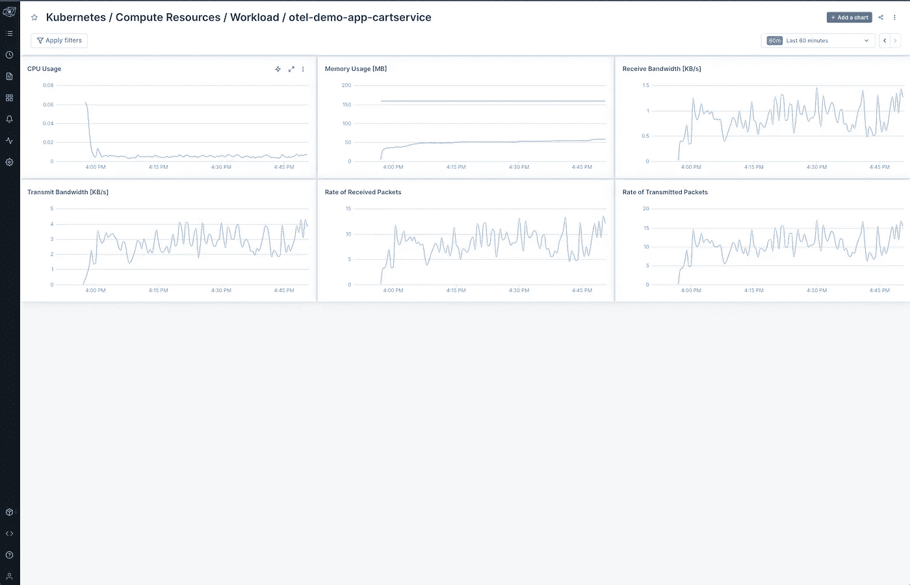

# 11-参见 Lightstep 中的应用指标

啊…但是我们还没有完成指标！如果您返回到仪表板视图并滚动到列表的最末尾，您将看到 **OTel 演示应用——应用指标**仪表板。


让我们点击它来快速浏览一下！

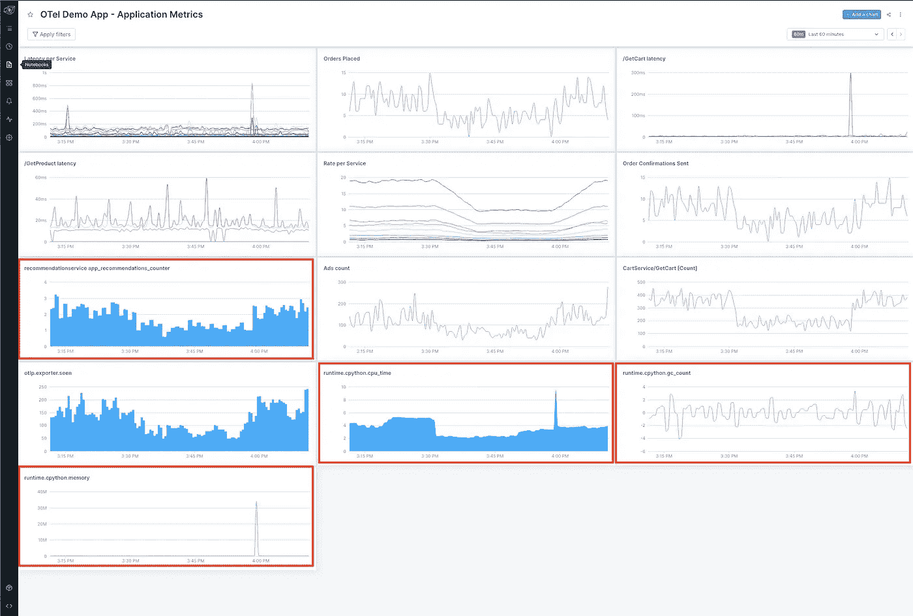

OTel 演示应用程序的最新版本发出自动测量和手动测量的指标。在今天的演示中，我们想重点介绍一些来自`recommendationservice`的。

首先，我们有自动检测的 Python 指标，这些指标是从 Python 运行时捕获的:

*   `runtime.cpython.cpu_time`:跟踪 CPU 处于不同状态所花费的时间。这包括用户(运行应用程序代码的时间)和系统(在操作系统中花费的时间)。该指标以总运行时间(秒)表示。
*   `runtime.cpython.memory`:内存利用率
*   `runtime.cpython.gc_count`:垃圾收集器被调用的次数。

我们还有一个手动测量的指标:

更多关于`recommendationservice`的信息，请查看。有关其他服务捕获的更多信息，请查看 [OTel 演示应用服务文档 OTel 演示应用服务文档](https://github.com/open-telemetry/opentelemetry-demo/tree/main/docs/services)。

**12-拆卸**

```
terraform destroy -auto-approve
```

如果你不再使用这个环境，不要忘记拆除它的资源，以避免运行一个巨大的云账单。不客气😉

这一步可能需要 30 分钟，所以请耐心等待！此外，您可能会注意到，在第一次运行时，您会看到以下错误:

```
Error: uninstall: Release not loaded: otel-operator: release not found
```

> **不要慌！** *如果再次运行* `*terraform destroy -auto-approve*` *，将完成所有的事情。*

# 最后的想法

今天我们看到了可观察性-景观-代码(OLaC)在实践中的一些方面！具体来说，我们研究了以下要素:

*   带[打开遥测](https://opentelemetry.io/)的应用仪表
*   通过 OTel 收集器收集和存储应用遥测数据
*   通过代码配置可观测性后端(即 [Lightstep](https://app.lightstep.com/)

我们通过使用 Terraform 来展示这一点:

*   **将 OpenTelemetry 演示应用部署到 Kubernetes。**Otel 演示应用展示了使用 OpenTelemetry 的不同语言的不同服务的[跟踪](https://opentelemetry.io/docs/concepts/observability-primer/#understanding-distributed-tracing)和[度量](https://opentelemetry.io/docs/concepts/observability-primer/#reliability--metrics)工具。
*   **将 OpenTelemetry 收集器部署到 Kubernetes(演示应用程序部署的一部分)。**收集器用于向 Lightstep 发送应用程序跟踪和指标。
*   **配置 Lightstep 仪表盘。**light step terra form 提供商允许我们对此进行整理。

整理我们的可观察性景观意味着我们可以根据需要拆除并重新创建我们的应用程序、收集器和仪表板，因为我们知道我们每次都将保持全面的一致性。此外，这意味着我们可以对它进行版本控制，这样它就不会丢失在以太网的某个地方，或者位于 Bob 桌子下面的秘密服务器中。奖金！

希望这能让你对 OLaC 的力量有一点小小的了解，并激励你也去那里开始 OLaC！(我刚造了一个新动词。不客气)

咻！这是一个需要思考和理解的问题！给自己一个鼓励，因为我们已经做了很多！现在，请欣赏这张阿德里亚娜的老鼠兔子正在吃杏仁的照片！


兔子老鼠享受杏仁。遗憾的是，这张照片拍摄后不久，我们就失去了邦妮。😭由[阿德里·维勒拉](https://adri-v.medium.com)拍摄。

和平、爱和准则。🦄 🌈 💫

OpenTelemetry 演示应用程序 OpenTelemetry 演示应用程序一直在寻找反馈和贡献者。请考虑加入 [OTel 社区 OTel 社区](https://github.com/open-telemetry/community/blob/main/community-membership.md#member)帮助 OpenTelemetry 变得更棒！

有关于可观察性-风景-代码的问题吗？告诉我们！请随时通过[电子邮件](http://devrel@lightstep.com)与我们联系，或者:

*   在 [Twitter](https://twitter.com/adrianamvillela) 、[乳齿象](https://hachyderm.io/@adrianamvillela)或 [LinkedIn](https://www.linkedin.com/in/adrianavillela) 上与阿德里亚娜联系
*   在 [Twitter](https://twitter.com/Ana_M_Medina) 、[乳齿象](https://hachyderm.io/web/@anamedina#)或 [LinkedIn](https://www.linkedin.com/in/anammedina) 上与 Ana 联系。

希望收到你们的来信！

*最初发表于*[*https://lightstep.com*](https://lightstep.com/blog/observability-as-code-with-kubernetes-and-lightstep)*。*