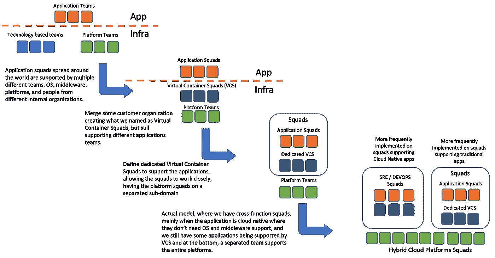
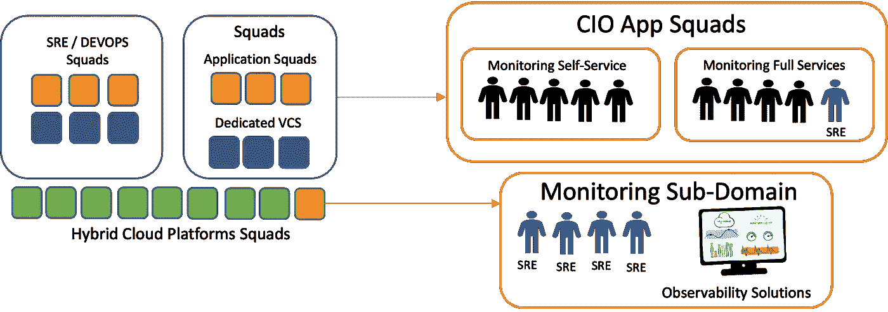
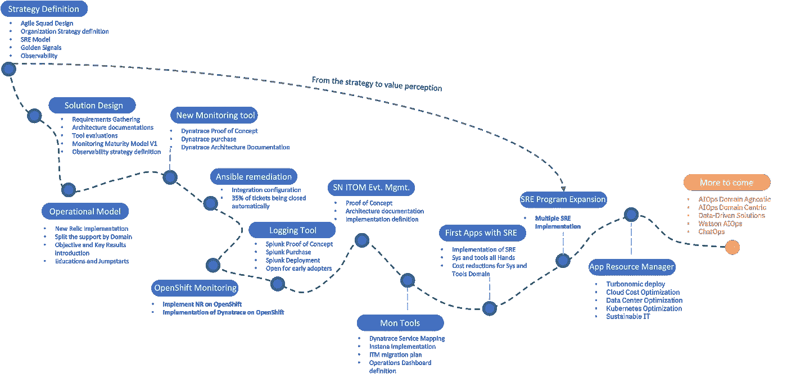
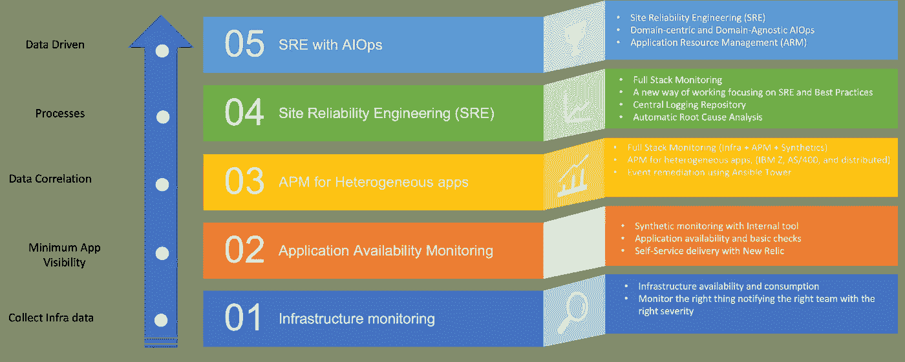
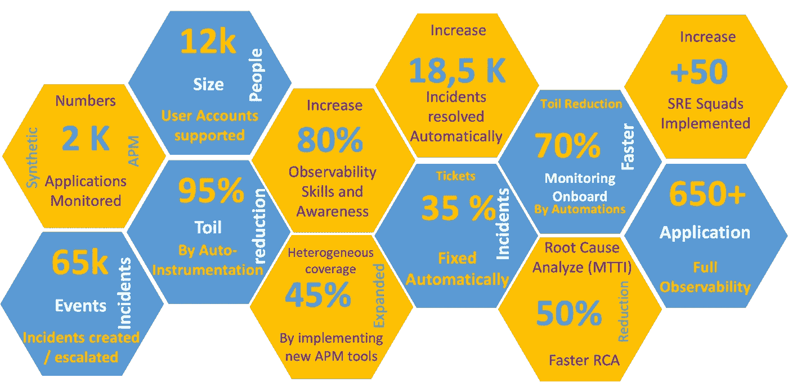

# 从敏捷团队设计到 SRE 实施的可观察性成功案例

> 原文：<https://blog.devgenius.io/observability-success-story-from-agile-squad-design-through-sre-implementation-6d534842021b?source=collection_archive---------7----------------------->

我总是看到文章、文档和网络研讨会解释 SRE、SRE 的概念、实施 SRE 的最佳实践，有时还有如何实施 SRE，并且在大多数情况下，探索整个公司在云和 DevOps 团队上运行的完美场景。

但是，寻找文章来展示一个成功的案例，探索挑战和实际(并不完美)的实施，探索如何主要在具有混合环境(云和传统数据中心)的公司中减轻这些挑战是具有挑战性的。

我将在这里谈论我在一个大公司领导的一个成功的实现，这个公司有一个复杂的场景，有时候，定义一个完美的实现并不容易；这是一个根据客户需求设计 SRE 实施并获得相同结果的问题。

为了使 SRE 转型成为可能，组织所做的第一件事就是敏捷团队的设计；没有它，组织中就不会有 SRE 队。

旧组织的问题:

*   分散在多个地点和时区的技能造成了浪费。
*   复杂的流程和组织结构抑制了灵活性
*   效率低下会减缓解决问题和管理变更的周期和响应时间
*   许多移交是由孤立的团队结构引起的

这是一个漫长的旅程，因为我们在世界各地有多个孤立的团队(我们谈论的是数百个团队)的旧模式，并将这些团队合并为跨职能团队。

现在，我们创建了一个更好的敏捷组织(正如我在开始提到的，并不完美)，基本上有两种类型的团队，正如你在上面的图片中看到的实际模型，他们都使用平台团队提供的服务。

*   SRE 的开发运维团队负责应用程序的端到端，并为特定应用程序提供 SRE 服务。这些团队中的大多数都支持云原生应用。
*   应用程序团队和支持操作系统和中间件的基础设施团队。之所以要有这样的团队，是因为要有一个共享的基础设施，而且有一个专门的团队来支持这类活动中的多个应用程序团队会更有效率。在未来，我们的想法是将这些小队转变为德沃普斯/ SRE 小队。

基于这种敏捷转变，我们也开始定义如何为整个组织提供可观测性/ SRE 服务，包括数百个团队。

大多数团队从未听说过站点可靠性工程和可观察性，所以我们创建文档，提供工作会议和培训，创建视频，展示成功案例，等等。这是一个漫长的旅程，需要几个月的时间来提高认识。

之后，我们开始实施 SRE 小组和可观察性解决方案的战略，以达到组织的目标。

基于我们拥有的两种类型的小队，我们开始了关于如何为所有小队实现 SRE /可观测性的策略定义。因此，我们创建了一个可观察性团队，负责团队使用的所有工具的可观察性治理，以建立新的 SRE 团队，并成为仍然需要准备好承担这一责任的应用团队的 SRE。

我们创建了两种类型的可观察性产品，如下图所示:

自助服务:

*   顾问服务
*   可观察性解决方案治理
*   最适合支持云原生应用的团队
*   提供培训
*   支持 SRE 小队建设

全套服务:

*   自助服务提供的所有服务
*   提供完整的可观测性服务器，充当客户的 sre
*   分析应用程序性能问题

这种模式带来的挑战:

*   采用这种设计，我们需要调整我们的所有解决方案，以支持自助服务和全面服务这两种模式
*   SRE 实施的成功取决于应用团队对项目的参与程度
*   通过共享基础架构提供端到端监控，如何生成独立的根本原因分析、事后分析等
*   复杂的 RBAC 体系结构设计为这两种模式提供服务
*   没有治理的自助服务会驱使我们采用低效的解决方案。我们开始实施 NR 的方式就是一个例子。
*   很难找到能够提供可观测性的解决方案。

为了缓解这些挑战，我们需要在架构设计方面投入大量资金，寻找能够支持这一战略的解决方案/工具，并与众多不同的团队一起推广多种概念验证，以验证解决方案。

我基于这个转换项目中的一些重要里程碑创建了下面的旅程，我们从敏捷团队设计、SRE 战略定义开始，经过工具评估和购买、复杂架构设计、自动化开发、流程实现等等。

我们从基础架构监控开始多年，团队最重要的事情是创建阈值和最佳实践，以发现基础架构中的问题，并向正确的团队报告以采取行动或运行自动化来自动修复问题。

过了一段时间，我们发现需要通过添加新功能、支持团队从脚本转移到新工具、引入新概念、提供可用性监控和监控应用性能来改进应用监控。我们还开始集中可观察性工具，并鼓励团队使用公司工具，为组织提供所有事情的集中视图。

由于客户拥有复杂的混合环境，我们评估了监控托管混合云基础架构的异构应用程序(IBM Z、AS/400、Power、Intel)的最佳方法；据此，我们评估了能够为我们提供这种能力的市场解决方案。最后，我们创建了解决方案的架构设计并成功实施。

定义了工具、敏捷团队和架构之后，我们开始了另一个阶段，向团队介绍 SRE 和可观察性概念，展示好处和公司战略，并建立 SRE 团队。在这个阶段，我们大量使用工具特性来提供自动的根本原因分析和应用程序拓扑，将应用程序问题与基础设施问题相关联，等等。

最后，我们正在努力改进 SRE 功能，引入新的 AIOps 功能，并将 APM 数据与基础设施数据相关联，以通过应用资源管理工具优化基础设施和平台的使用。

这种转换产生的一些数字:

*Tiago Dias Generoso 是巴西 Pocos de Caldas 的杰出 IT 架构师|高级 SRE |主发明家。以上文章为个人观点，不一定代表雇主的立场、策略或观点。*