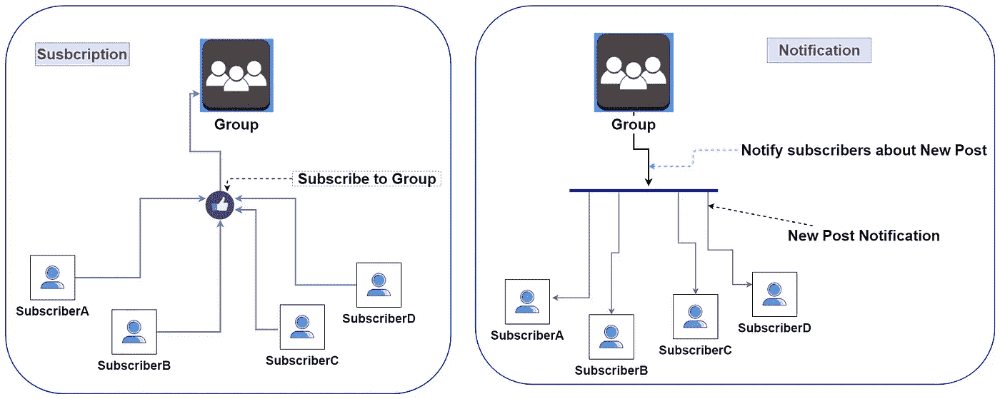
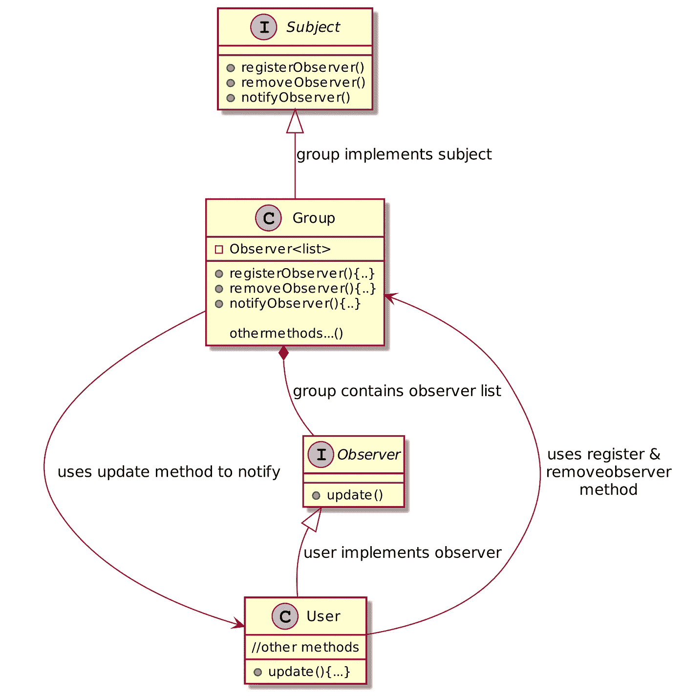
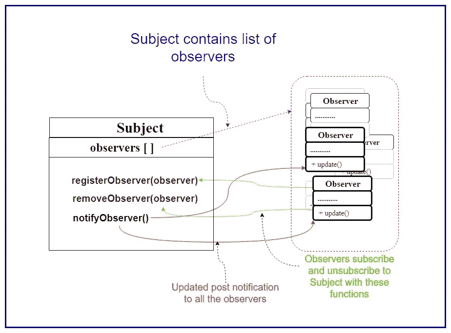
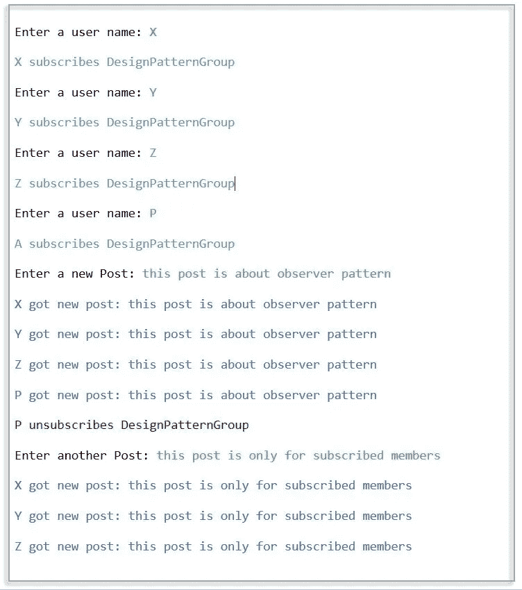

# 观察者设计模式教程

> 原文：<https://blog.devgenius.io/observer-pattern-explanation-a-trial-of-blending-theory-with-practical-d68c8a482f38?source=collection_archive---------3----------------------->

## [设计模式 101](https://codeburst.io/design-patterns-101-9fe18d5a1bd9?source=friends_link&sk=e0a82f4a24100530f9c079a71fe5a706)

## 脸书集团的订阅和通知系统是观察者模式的一个很好的例子。


照片由[乔伊·查克拉博蒂](https://unsplash.com/@joy_photo)拍摄

设计模式是软件工程中 ***最重要但又令人害怕的*** 方面之一，尤其是对于那些刚接触这个话题的人来说。当我开始我的助理架构课程时，我自己很难理解不同软件设计模式的思想。

> **学习设计模式困难的主要原因是模式中使用的术语一开始很难理解。作为一名开发人员，程序员更容易从代码中理解这个想法，那么这些术语就不会显得那么复杂。所以，这是一次将理论和代码融合在一起的尝试。**

*第一部分从一个重要的模式开始，观察者设计模式。*

> 根据维基百科，观察者模式是一种软件设计模式，在这种模式中，一个名为 subject 的对象维护一个名为 observer 的依赖者列表，并自动通知它们任何状态变化，通常是通过调用它们的方法之一。

如果你是第一次设计模式，那么这个定义有点难以理解。让我们来看一个例子。现在是数字媒体的时代。我们都知道脸书或任何社交媒体上的团体订阅和通知。因此，当你试图描绘观察者模式时，一个群组订阅服务，其群组是发布者，用户是订阅者，这是一个很好的可视化模式的方式。



图 1:作为观察者模式示例的组订阅和通知

您关注您感兴趣的群组以获取该群组的更新。所以你是那个团体的订阅者/追随者。现在，如果有帖子更新，来自该群的通知将出现在您的时间线中。Y **你是订阅者，群组是发布者，群组拥有你的个人资料信息，因此当有新帖子更新时，它会向你发送通知。**这种*订阅机制* 正是我们需要观察者设计模式的地方。

如果你了解 MVC 模式，模型-视图-控制器的“视图”部分可以描述为观察者。当 UI 元素更改状态时，它的所有依赖项都会得到通知并自动更新。

为了理解观察者，我们需要把观察者模式分成三个部分。观察者模式有**三个部分。**

I)主题/出版商

ii)观察员/订户，以及

iii)客户。

在观察者模式中，我们称发布者为**主体**，订阅者为**观察者**。客户端仅仅意味着**主**函数，所以不需要担心这个。所以我们可能会这样想:

> 发布者+订阅者=观察者模式。

仅仅通过阅读理论来学习设计模式有点困难，因为模式中使用了不同的术语。例如在这个模式中，我们有**主体**、**观察者**和**客户端**。程序员更容易从代码中理解这个想法。所以我会用代码来描述模式。示例代码是用 java 编写的，您可以使用自己喜欢的任何面向对象的语言。也许以后我会尝试用其他语言代码链接编辑文章。

*对于刚开始设计图案的人，请尝试自己写一次，会对你有奇效。*

# 主题/出版商:

在观察者模式中，发布者被称为**主题。****主体**维护一个**观察者**列表，并自动通知他们任何状态**变化**。观察者模式中的主体有三个任务:

> 提供注册和删除观察者的方法。
> 
> ii)维护其观察员/订户的列表。
> 
> iii)并在任何状态改变时自动通知它们。主体向所有注册的观察者广播事件。

> 因为它将通知观察者对象它的状态的变化，所以它也被称为发布者。

*为了实现，我们将定义一个* ***接口*** *作为主体。*任何实现这个接口的类都是观察者模式中的主体。该类必须定义下面代码中给出的这三个函数。

主题接口代码

从图 1 中可以看出，用户订阅了一个组，当有新帖子更新时，用户会收到通知。我们例子中的组类是**主题** / **发布者**。因此，它必须实现**主题**接口。



图二。类图

在很多书和网站上，你会看到他们放了一个带有 concreteSubject 或者 concreteObserver 的概化结构图。我发现作为一个初学者很难把这么多通用公式联系起来。因此，为了更好的理解，我们在这里保留了一个类图。完成这个实现后，你应该回过头去查看任何一本书或网站上的结构图。对你来说应该更有意义，至少我是这么希望的。

从类图中，可以看到组类实现了*主题接口。所以在这个例子中，Group class 是主语。*用户类实现了*观察者接口。所以用户类是观察者。和组有一个观察者对象列表。因此，用户可以使用 register 和 removeobervser 方法成为组类的观察者。*和组类可以用更新的方法通知观察者。

现在我们进入编码部分。下面给出了组类的代码。文末给出了代码链接。

Group 类实现 Subject 接口

现在让我们分解它来理解观察者模式。**观察者可以在列表中添加或删除，观察者列表会跟踪对象列表。**下面是主题类组提供给观察者使用的两种方法。

```
**public void registerObserver(Observer o) {
  observers.add(o);
}****public void removeObserver(Observer o) {
  observers.remove(o);
}**
```

现在，让我们检查我们主题的最后一个任务，即**组**类:通知观察者。当一个新帖子被发布时， **notifyObserver** 方法获取所有观察者的列表，并通过 **update** 方法将帖子发送给观察者对象。

```
public void newPost(String post) {
  this.post = post;
  notifyObserver();
}public void notifyObserver() {
  for (Observer observer : observers) {
    observer.update();    //update posts for observers
  }
}
```

现在，我们可以知道在 observer 中需要有一个**更新**功能。我们将在下一节讨论这一点。

# 观察员/订户:

Observer 是这个设计模式中的一个 actor 类，有时它会引起混淆，因为设计模式名称和 actor 名称是相同的。因为这些对象订阅了主题，所以它们也被称为**订阅者**。观察者依赖于主体。当受试者的状态改变时，观察者会得到通知。在我们的例子中，如果有一个新的帖子，观察者会得到通知。

观察者订阅和取消订阅主题。通常，作为观察者的对象执行两项任务:

> I)使用主题提供的方法作为观察者订阅和取消订阅。
> 
> ii)实现观察者接口以从主题获取更新。



图:观察者和主体之间的关系

下面是观察者界面的代码，其中有 ***更新*** 功能。所以想要获得组更新通知的对象必须实现这个 Observer 接口。我们将在用户类描述中看到其他类是如何使用这个类和方法的。观察者界面只有一个功能

观察者界面

用户类实现了这个观察者 ***接口*** 。所以 user 类的所有对象现在都将是 ***观察者*** 。

用户使用 Subscribe 函数中的 **registerObserver** 方法注册为观察者。也可以从调用 **removeObserver** 方法的组类的观察者列表中注销用户。集团可以通过 ***更新*** *功能更新新帖通知。*

用户类通过实现观察者接口成为观察者

# 客户端/主功能:

通常设计模式例子中的客户端代码实际上是**主函数**中的代码。它的功能取决于编码器的实现。Main 函数定义了观察者的数量和类型。

在 client 中，我们创建了一个组，为一些用户输入内容，这些用户订阅了该组。当一个新的帖子进入群组时，所有订阅的用户都会收到通知。最后一个用户取消订阅该组。所以，下次用户没有收到新帖子时。

在设计模式教程中，Main 函数被称为客户端

主要功能/客户代码

# 样本输出:



图 4:观察测试程序的输出

谢谢你的耐心。希望这篇文章能让你对观察者设计模式有更好的了解。下面是 [**代码链接**](https://github.com/ashis041/DesignPattern/tree/master/ObserverDesignPattern)**它目前在 java 中。我会尝试更新其他语言的代码。**

> *****如果你是设计模式的新手，请不要复制粘贴代码，*** [***试着自己写代码***](https://medium.com/dev-genius/design-pattern-for-newbies-fb11b676b061?source=your_stories_page---------------------------) ***，这对你理解模式会有奇效。如果你需要任何帮助或者有任何提高我写作的建议，请告诉我。*****
> 
> **感谢你阅读这篇文章。祝你愉快。😃**

**资源:sourcemaking、refactoringGuru 和 Head-First 设计模式书。**