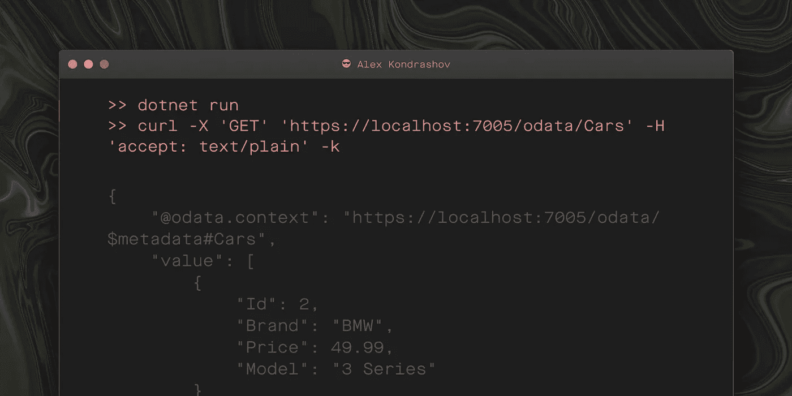

# 通过命令行在 Mac 上运行 ASP.NET 核心 6.0 的 OData

> 原文：<https://blog.devgenius.io/odata-for-asp-net-core-6-0-on-mac-via-command-line-92c45da4fafa?source=collection_archive---------5----------------------->

。NET 6.0 包含了`Program.cs`的新结构。我想记录我是如何通过命令行添加 OData 支持的。



以下是我遵循的步骤:

## 1.创建 ASP.NET 核心 Web API 6.0 应用程序

```
>> dotnet new webapi -o odata>> cd odata
```

## 2.添加`Entity Framework Core`和`OData` 包参考

为了简单起见，我使用了 EF Core 内存数据库提供程序。

```
>> dotnet add package Microsoft.EntityFrameworkCore.InMemory>> dotnet add package Microsoft.AspNetCore.Odata
```

## 3.更新`Program.cs`

需要添加以下内容作为 *Program.cs 的一部分:*

*   OData 约定模型
*   OData 控制器
*   实体框架上下文

## 4.添加对 GET 请求的支持

我使用了`EnableQuery`注释来启用`CarsController.cs`中的 GET 请求。静态类`DataSource`提供测试数据。`DataSource.GetCars()`的代码可以在[这里](https://github.com/alkondrashov/odata)找到

## 5.运行应用程序并检查结果

证明 OData 有效的好方法是查询所有价格小于或等于 50 的汽车。只有一辆车满足这个条件。

```
>> dotnet run>> curl -X 'GET' '[https://localhost:7005/odata/Cars?$filter=Price](https://localhost:7005/odata/Cars?$filter=Price) le 50' -H 'accept: text/plain' -k
```

响应应该如下所示:

```
{
    "[@odata](http://twitter.com/odata).context": "[https://localhost:7005/odata/$metadata#Cars](https://localhost:7005/odata/$metadata#Cars)",
    "value": [
        {
            "Id": 2,
            "Brand": "BMW",
            "Price": 49.99,
            "Model": "3 Series"
        }
    ]
}
```

# 摘要

在这个例子中，我们看到了向 ASP.NET 核心 Web API 应用程序添加对 OData 的支持，并执行了一个简单的查询来证明 OData 请求正在通过。希望这有助于你运行你的项目。

# 链接

1.  [本例中的代码](https://github.com/alkondrashov/odata)
2.  [经典 ASP.NET 网络应用的 OData 支持示例](https://docs.microsoft.com/en-us/aspnet/web-api/overview/odata-support-in-aspnet-web-api/odata-v4/create-an-odata-v4-endpoint)
3.  [ASP.NET 核心 2.0 网络应用的 OData 支持示例](https://devblogs.microsoft.com/odata/asp-net-core-odata-now-available/)
4.  [ASP.NET 核心 5.0 网络应用的 OData 支持示例](https://devblogs.microsoft.com/odata/asp-net-odata-8-0-preview-for-net-5/)
5.  [ASP.NET 5.0 网络应用支持 OData 的另一个例子](https://referbruv.com/blog/posts/working-with-odata-integrating-an-existing-aspnet-core-3x-api)