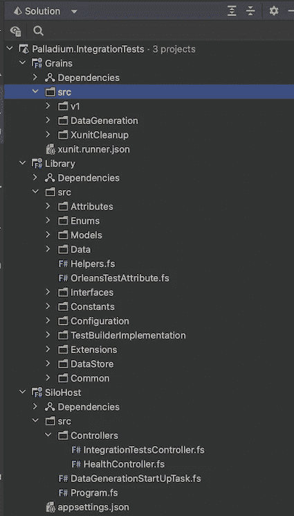
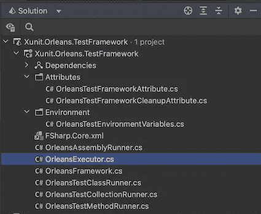
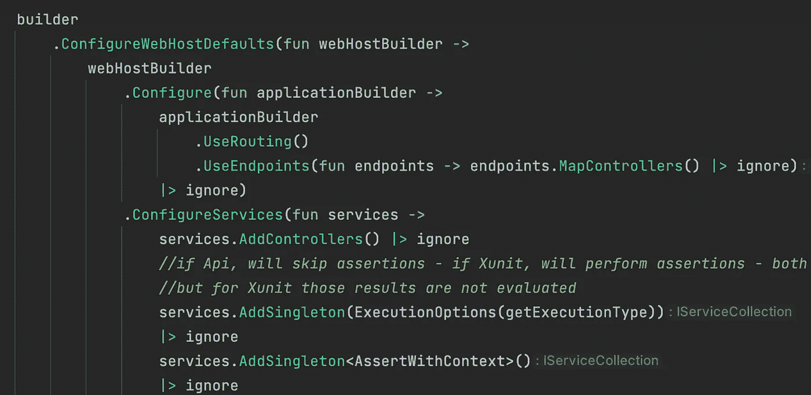
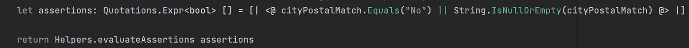
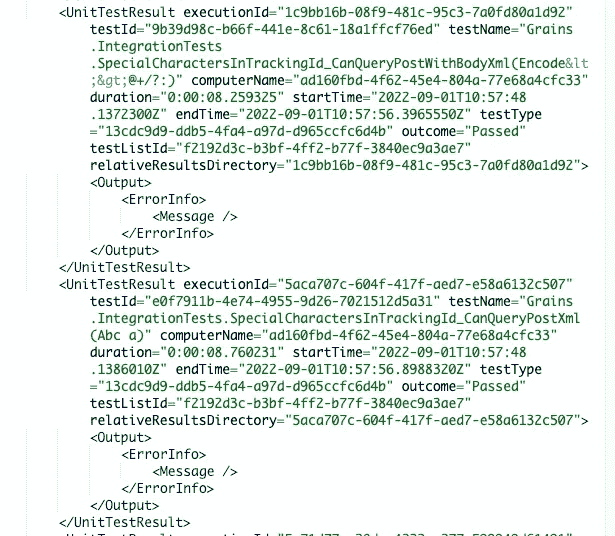
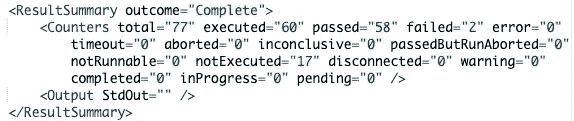
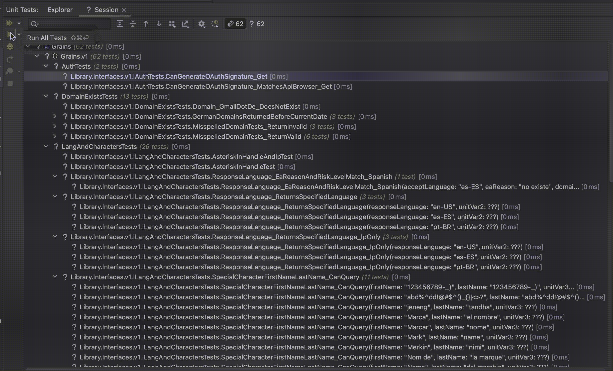

# F#、微软奥尔良和 Xunit

> 原文：<https://blog.devgenius.io/of-f-microsoft-orleans-and-xunit-1eaa6cd71f7c?source=collection_archive---------8----------------------->

2022 年 5 月底，我加入了 Lexis Nexis risk solutions 都柏林分公司的一个成功的工程师团队，尽管我的首席工程师职位需要大量的经验，但我和其他新员工一样经历了相同的入职过程——**，我喜欢这份工作！**

每个新加入者都要经历一个训练营，在那里一个项目是从头开始开发的:在我的例子中，想法是找到一种方法来减少集成测试套件在主产品管道中运行的时间。

该套件本身在大约 7/8 分钟内运行——考虑到所执行的测试数量(150 以上),这已经是一个很好的成就，但这里的慢板是持续改进和不断挑战成就——因此有了使用[微软 Orleans](https://dotnet.github.io/orleans/) 并行运行集成测试的想法，从而允许更快&更频繁的部署。

在我加入之前，已经完成了概念验证:使用该技术开发了一系列短期冒烟测试，并成功集成到管道中:在每个地区的生产环境中部署后，奥尔良冒烟测试在几秒钟内运行。这个 [POC](https://github.com/PiotrJustyna/Palladium) 被命名为 **Palladium** ，我的任务是将这种方法复制到大量的集成测试中。

# 挑战

我应该迁移的集成测试可以分为三个主要类别:

*   *纯*测试——没有状态，通常对一个或多个端点执行 http 调用。
*   *隔离的有状态*测试——有状态，但是数据是针对每个实例生成的，并且将 CRUD 操作与对一个或多个端点的 http 调用结合到不同的数据源。
*   *共享有状态*测试——具有与其他测试共享的状态，并且再次将 CRUD 操作与外部 http 调用相结合。

数据源可以从 AWS Dynamo 到 Postgres SQL、Aurora、Sql Server 和 Redis，但是在撰写本文时，这些数据源已经在一个大型迁移过程中被大大简化了。

另一个想法是允许工程师通过 Test Explorer 窗口从他们选择的 IDE(Visual Studio，JetBrains Rider)运行这些测试，以在提交任何更改之前验证他们的测试，并在主管道中执行它们。

当本机使用 Nunit 或 Xunit 等框架时，这听起来可能微不足道——当底层技术需要重新编写以完全绕过它们允许的多线程支持(如果有的话)并将这些测试调用远程发送到 Orleans Silo 时，这就不那么重要了。

啊，差点忘了…这应该是用 F#写的——鉴于我超过 15 年的 C#经验，这是一种我从未接触过的语言:)

# 方法

第一项任务是复制一个众所周知的自托管奥尔良筒仓结构，大致如下:

*   一个自托管应用程序，它将运行 Silo 集群并公开一个端点来检索测试结果(SiloHost)。
*   一个包含颗粒的具体实现的颗粒库——在我们的例子中代表测试(颗粒)。
*   一个共享库，包含了颗粒接口和一些助手，模型，设备，以及项目需要的共享逻辑(库)。



钯集成测试结构

一旦设置完成——看起来比上图简单——我就有了一个工作主机、几个接口和几个返回一个或多个断言的粒度，这些断言将被评估和解析成一个模型(是的，我们必须让[用测试结果创造](https://fsprojects.github.io/FSharp.Quotations.Evaluator/)！)

然后，这个模型将被序列化为一个由端点返回的 [TRX](https://fileinfo.com/extension/trx) 输出，允许通过一个简单的 API 调用进行管道集成。

到目前为止，简单的测试工作正常，它们在奥尔良运行得非常快，并且可以从端点检索原始结果。

# Xunit 集成

在一头扎进实际的测试迁移之前，下一步是找到一种在 Xunit 中运行这些奥尔良谷物的方法——这非常有趣！

我的第一个尝试是用经典的事实属性来修饰颗粒(测试),并确保 Xunit 会选择它们——这很有效。

不过很明显，这只是证实了一个事实，即我不必太担心框架的发现方面——我可以依赖 Xunit sdk，但在执行方面——那是完全不同的故事。

幸运的是，Xunit 对扩展非常开放，很容易继承您需要的东西来定制 executor 生命周期的几乎任何(不是每个)方面。

从这个意义上来说，我推荐一篇由 Andrew Lock 撰写的文章作为起点，这篇文章描述了 Xunit 框架的整个类层次结构——这里的 T2 就是这样。当然，他的最终目标与我的有很大不同，但对我的目的仍然非常有用。

我真正需要的是 Xunit 发现我的测试，然后让我在奥尔良运行它们——这意味着我必须继承和定制测试执行中涉及的每一个类(从上到下):

继承 **XunitTestFramework** 来启动 Silo 进程(Palladium 中的 SiloHost)并调用我自己的执行程序。

继承**XunitTestFrameworkExecutor**，我必须:

创建一个 Orleans 客户端来与 Silo 通信，调用自定义装配运行程序，运行 grains，并执行一些清理操作。

关闭与思洛存储器的客户端连接，并在执行完成后设法停止思洛存储器进程。

继承**xunittesassemblyrunner**到:

打开到思洛存储器的客户端连接(重试)，并并行运行测试*收集*。

继承**XunitTestCollectionRunner**来并行运行测试*类*。

继承 **XunitTestClassRunner** 来并行运行测试*方法*。

继承 **XunitTestMethodRunner** 来有效地并行运行测试*用例*，这意味着大量的反射来获得测试的基本接口，从客户端实例化正确的粒度，并在 silo 主机上运行测试方法。

下面是 RunTestCaseAsync 方法:

```
protected override async Task<RunSummary> RunTestCaseAsync(IXunitTestCase testCase)
{
    var interfaceReflectedType = _currentClass.Interfaces
        .FirstOrDefault(i => i.ToRuntimeType().GetCustomAttributes(false)
            .Any(a => a.GetType() == _orleansAssemblyMetadata.OrleansTestInterfaceDiscovererType))
        .ToRuntimeType();

    if (interfaceReflectedType == null) 
        throw new Exception($@"Could not find the Test (grain) interface. 
    Make sure the interface is marked with the { _orleansAssemblyMetadata.OrleansTestInterfaceDiscovererType.FullName } test attribute.");

    var grain = _clusterClient.GetGrain(interfaceReflectedType, Guid.NewGuid());

    var testCaseNameParts = testCase.Method.ToRuntimeMethod().Name.Split('.');
    var grainInterfaceInvocationMethod = interfaceReflectedType.GetMethod(testCaseNameParts[^1])!;
    var arguments = testCase.TestMethodArguments?.ToList();

    *//bit of a hack - only expecting the unit parameter in the last position* if (grainInterfaceInvocationMethod.GetParameters().Any(p => p.ParameterType == typeof(Unit)))
    {
        arguments?.Add((Unit)Activator.CreateInstance(typeof(Unit), true)!);
    }

    MessageBus.QueueMessage(new TestCaseStarting(testCase));
    MessageBus.QueueMessage(new TestMethodStarting(TestCases, testCase.TestMethod));

    *//invoke the method on the grain instance* var sw = Stopwatch.StartNew();
    var testResult = true;
    XunitException? testException = null;

    try
    {
        await (Task)grainInterfaceInvocationMethod.Invoke(grain, arguments?.ToArray())!;
    }
    catch (XunitException e)
    {
        testException = e;
        testResult = false;
    }
    catch (Exception e)
    {
        Console.WriteLine($"{e.Message}: {e.StackTrace}");
    }

    sw.Stop();

    var executionElapsedTime = (decimal)sw.ElapsedMilliseconds / 1000;
    var testSkipped = string.IsNullOrEmpty(testCase.SkipReason) ? 0 : 1;

    MessageBus.QueueMessage(
        new TestMethodFinished(
            TestCases,
            testCase.TestMethod,
            executionElapsedTime,
            1,
            testResult ? 0 : 1,
            testSkipped)
    );

    MessageBus.QueueMessage(
        new TestCaseFinished(
            testCase, 
            executionElapsedTime, 
            1, 
            testResult ? 0: 1, 
            testSkipped)
    );

    *//log diagnostic message* _diagnosticMessageSink.OnMessage(
        new DiagnosticMessage("Test {0} {1} in {2} seconds with the following parameters: {3} {4}",  
            testCase.Method.Name, 
            testResult ? "passed" : "failed",
            executionElapsedTime,
            arguments == null || arguments.Count == 0 
                ? "nothing" 
                : string.Join(',', arguments),
            testResult ? string.Empty : $"{System.Environment.NewLine} Test failure exception: {testException?.UserMessage ?? testException?.StackTrace}"
        ));

    return new RunSummary
    {
        Failed = testResult ? 0 : 1,
        Skipped = testSkipped,
        Time = executionElapsedTime,
        Total = 1
    };
}
```

这一堆代码很快变得如此庞大，以至于它应该有自己的项目——所以它被移植到一个 Nuget 包中，然后集成到主项目中。值得注意的是，这个包完全是用 C#编写的，而 Palladium 项目完全是用 F#编写的。



Xunit 自定义框架结构

这个包目前托管在公共的 Nuget [库](https://www.nuget.org/packages/Xunit.Orleans.TestFramework/)中，但是目前它没有文档记录，其源代码托管在一个私有的 repo 中。我希望尽快使它完全开源——尽管它附带一些警告，我希望我有时间记录下来。

# 集成测试

迁移本身并没有带来很多挑战——一旦熟悉了基本概念，在奥尔良进行开发就相当简单了。

在使用奥尔良进行测试时，有几件事情需要特别注意:

*   fixture 机制——这通常由 Xunit 自己负责，而在这种情况下，测试类使用的具体类的注入需要手动进行，即在 DI 中间件中注册服务。



钯中间件

*   断言和测试输出——同样，如果不满足条件，使用 Xunit 的断言将抛出异常，但是在我们的例子中，我们不能只依赖这种机制，因为 Palladium 的主要用法是通过 API 调用返回一组定制的结果。这需要一种定制的方法来评估断言。



由测试方法评估并返回断言的例子

# 结果呢

对两个项目进行微调并涵盖所有边缘情况(类固定、依赖注入等等)花了一些时间，但最终 Palladium 现在能够在我们的集成测试执行中实现令人难以置信的并行度。

目前，我已经迁移了大约 40 个测试(事实和理论)，相当于 77 个测试的执行(在大约 12 秒内运行)。它们包括许多纯测试(无状态测试)和一些带有隔离状态的有状态测试。下一个挑战将是重新设计我们管理状态的方式，这样每一个测试都可以独立运行，但是现在结果非常令人满意！


在我们的 Azure 管道中集成钯运行的早期示例



TRX 输出的摘录



TRX 输出的摘要摘录

此外，测试可以从 IDE 中完美地执行



集成通过测试浏览器(Jetbrains Rider)在 Orleans 上测试执行

# 最后

这个项目是从一个非常独特的角度看待一个典型问题的绝佳机会——它让我熟悉了一种新技术(微软奥尔良)和一种新语言(F #)——我肯定我弄糟了，但我非常渴望在这方面做得更好。

除此之外，探索测试框架深度的想法(这里是 Xunit)是我在没有这个项目的情况下永远不会想到的——这本身就是一个非常有趣的焦点。