# 移动应用程序中的离线数据同步

> 原文：<https://blog.devgenius.io/offline-data-sync-in-mobile-applications-1808b21491b7?source=collection_archive---------4----------------------->

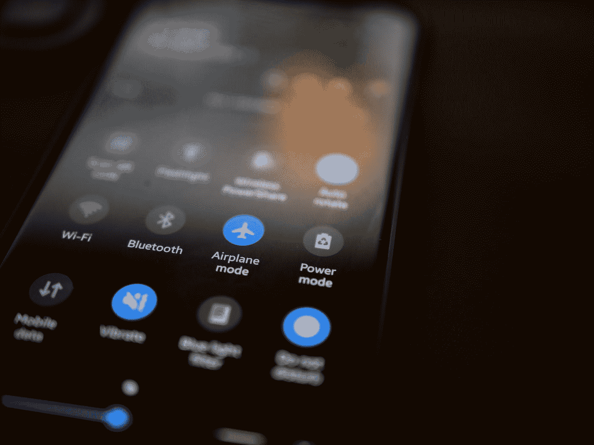

离线模式

## **在线模式与离线模式**

**在线模式:**

*   始终连接到互联网
*   移动应用程序需要一个正常工作的互联网连接，否则根本无法工作。
*   它不会与服务器通信
*   用户将无法执行任务
*   一个最常见的例子是一个银行应用程序，如果没有互联网，你就无法进行任何交易。

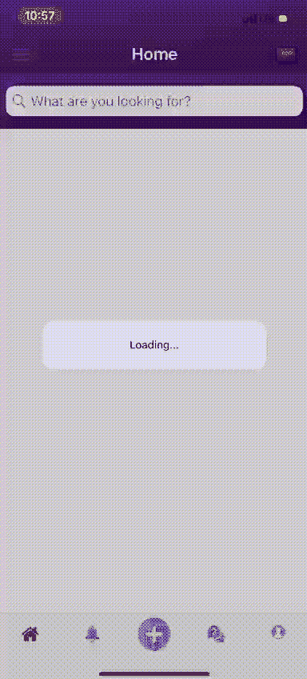

布拉提尼商业出售

上面附上的截图来自一款名为 [Blatini](http://www.blatini.com) 的应用。这是一个商业分类应用程序，你可以购买或出售企业。

在附件的 gif 中，你很可能会看到装货标签。当应用程序从需要互联网连接的数据库加载数据时，标签会出现。如果没有互联网连接，您将无法发布广告或查看已发布的广告，因为为了从服务器加载数据，此应用程序需要互联网连接。

让我们借助大理石图来看看完整的场景。

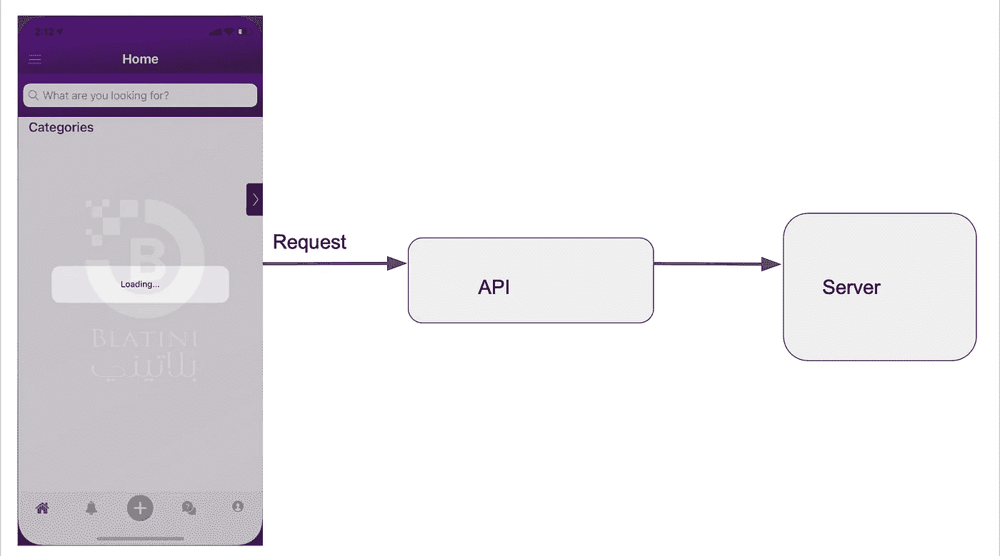

布拉提尼商业出售

应用程序的上图显示了应用程序使用 API 从服务器请求数据。

如下图所示，应用程序已收到服务器的响应，并显示给最终用户。但这一切都是因为互联网连接，这就是为什么应用程序能够与服务器通信。

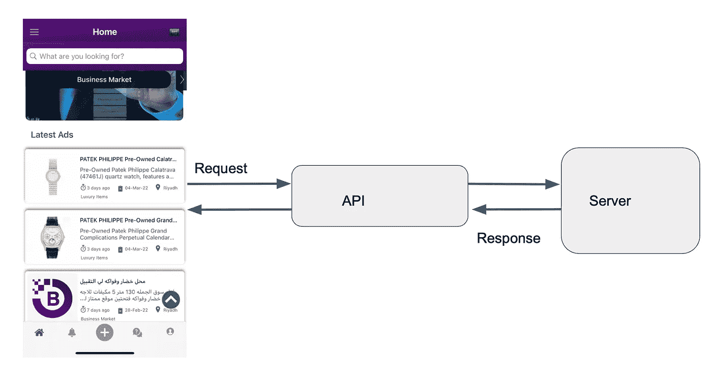

布拉提尼商业出售

下图向我们展示了没有互联网连接时应用程序的状态。由于没有互联网连接，我们无法与服务器通信。并且用户不能执行任何任务。

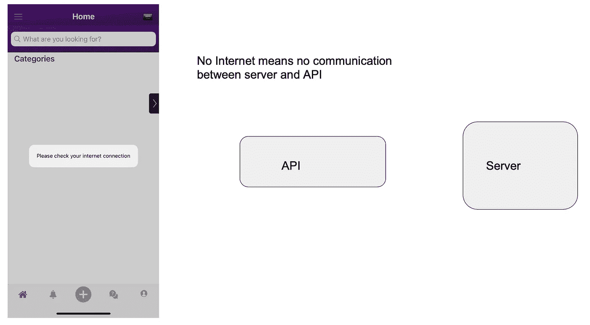

布拉提尼商业出售

**离线模式:**

*   不需要互联网连接。
*   执行基本操作不需要与服务器通信。
*   应用在互联网上不是为了执行基本操作而加深的。

**离线模式实际上是如何工作的？**

我想用一些图表来解释一下。假设我们的用户想要改变显示图片(DP ),那么会发生什么呢？

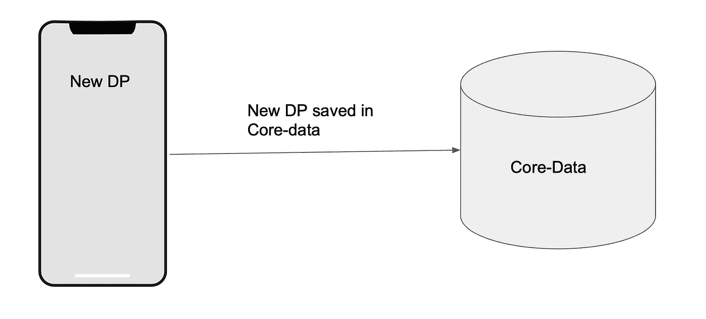

移动应用中的离线存储

他将在应用程序中上传图片，应用程序将把它保存到移动应用程序数据库，即核心数据。

稍后，一旦您的设备有一个活跃的互联网连接。该应用程序将从核心数据即您的本地存储中获取新保存的 DP，并立即将其上传到服务器。

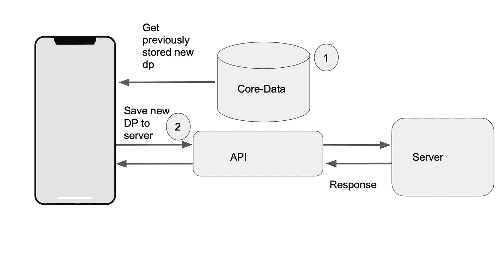

移动应用中的离线存储

离线数据同步不仅仅是**将记录推**到服务器，你还必须从服务器**拉**新记录。

现在我们有两个事件**推**和**拉。**离线模式比在线模式更复杂。

**以下是离线模式的复杂性:**

*   主数据同步
*   增量数据同步/获取更新的记录
*   离线数据同步
*   哪些记录首先更新/优先同步

## 主数据同步:

在主数据同步中，只要您启动应用程序，它就需要在您的应用程序开始工作/准备使用之前从服务器下载一些记录。

**主数据同步用例:**

下图显示了数据库中的两个表，其中表 1 有 30k 条记录，表 2 有 35k 条记录。当与互联网连接时，用户能够下载总共 65，000 条记录。

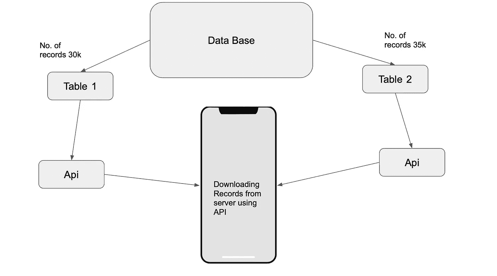

但是，当应用程序下载数据时，会发生以下情况之一:

*   互联网数据已达到极限。
*   wifi 已断开。
*   用户关闭应用程序
*   手机电池没电了

出现以上情况之一怎么办？

*   一旦再次连接到互联网，您的应用程序是否会删除全部数据并重新下载？
*   保持对数据的跟踪，并从先前停止的同一记录处继续。

所以在你编码之前，一定要考虑这些情况。

## 增量数据同步:

增量同步是一种仅同步数据库中更新的记录的同步。

例如，下图显示了一个应用程序在中午 12:00 和下午 1:00 完成了主同步。设备离线，稍后在晚上 9:00 恢复在线。从下午 1:00 到晚上 9:00，有一些记录被更改。

因此，您的应用程序将只同步已更改的更新记录，而不是再次下载整个表。

对于这种数据拉取，您用 api 发送时间，并且只获得在该时间之后发生的更改。

我知道有一些实时数据库可以解决这种复杂性，但它们是有偿的。如果你的客户不想得到一个付费的数据库，你将不得不回到 SQLlite，核心数据或领域。

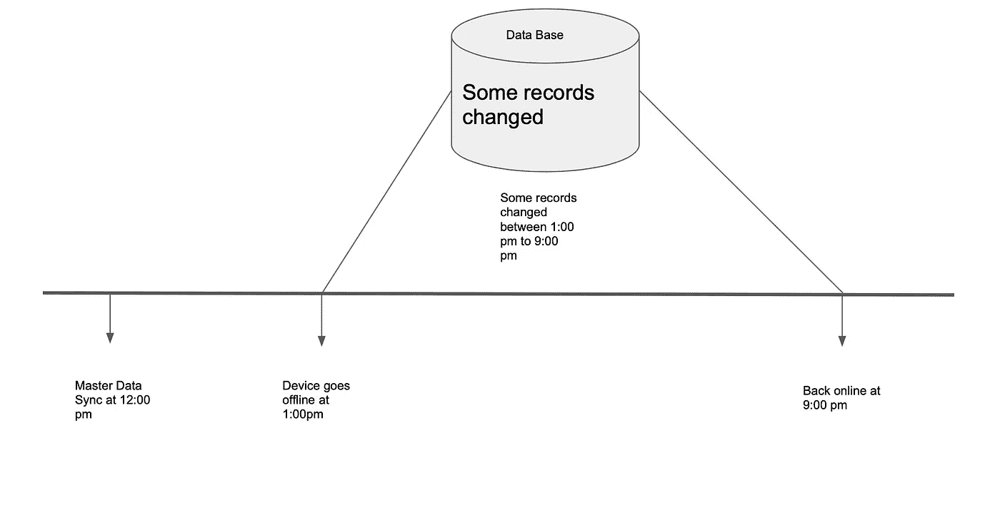

## 离线数据同步:

假设您下载了记录，您的主同步完成后，您在下午 1:00 离线，并在晚上 9:00 恢复在线。在离线时间，您更新了手机中的本地记录，现在当您上线时，这些记录将被在线推送至您的数据库。与此同时，你的应用程序将做增量同步。

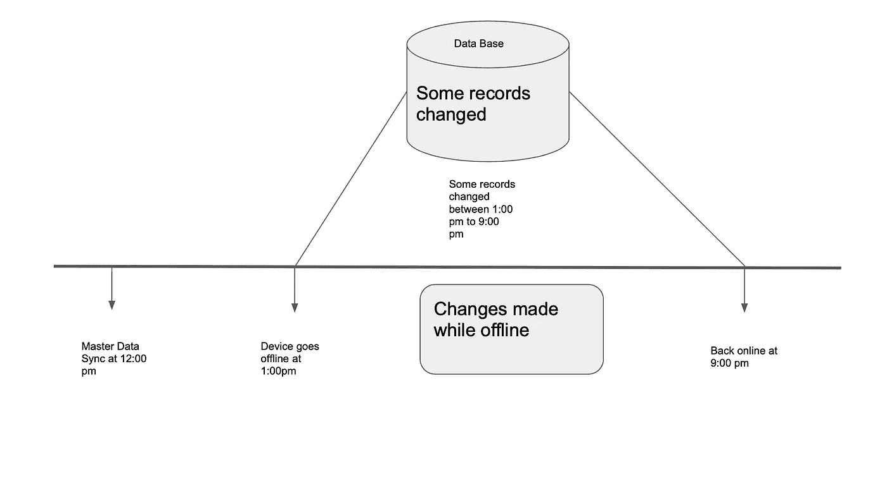

那么我们应该先推送离线记录还是做增量同步呢？我建议您在推送离线记录时使用单个 API。您还应该传递最后一次主数据同步时间，并且只获取过去时间之后发生的更改。这样，您不仅可以获取最新的记录，还可以通过一次 API 调用将您所做的更改推送至数据库。

例如，您有一个在下午 12:00 和下午 1:00 同步的名为“Umair”的记录。您离线后将记录名称从“Umair”更改为“Umair khan”。晚上 9:00 上线后，您会将此记录推送到数据库，并传递最后的主同步时间，即下午 12:00，因此数据库会将记录名称“Umair”更新为“Umair khan ”,但不会重新下载它，只会下载在主同步时间之后更改的记录

但这真的取决于后端开发人员如何开发 api &只有他能告诉你是否需要先进行增量同步或离线同步，或者两者同时进行，就像我上面提到的那样。

## 优先级同步:

名字本身就说明了一切。假设两个用户试图更改相同的记录，他们的更改将会发生，而他们的更改将会被服务器拒绝。

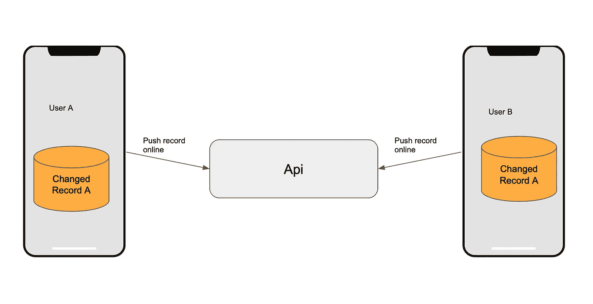

用户 A 和用户 B 都更改了名为“A”的记录。现在谁的更改将存储在 DB 上。

**这在以下方面有所不同:**

*   用户角色(拥有高级角色的用户，其更改将被保存)
*   业务需求(将由客户给出)
*   如果没有很好地描述以上两者，那么我们假设两个用户都是平等的，谁的互联网连接更好，谁就会推送更改，而具有慢速互联网连接的用户会忽略这些更改，然后两个用户都会获得由慢速互联网连接用户推送的记录。

我希望我能够很好地解释离线数据模式。如果你喜欢我的文章，请分享并关注我，这真的激励我写更多。