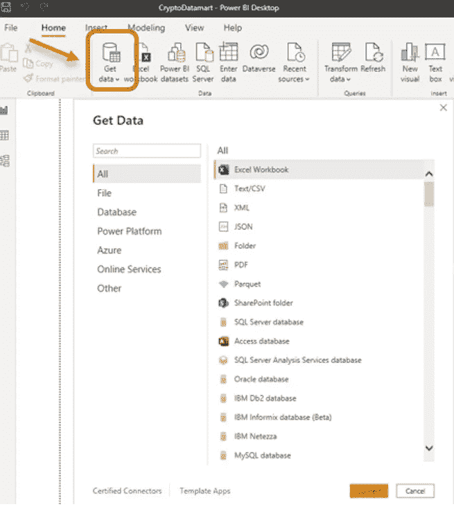
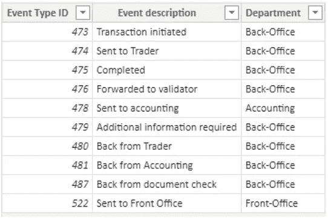
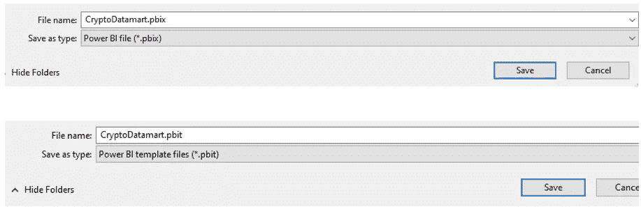

# 通过步骤#3 为 BI 桌面提供支持—数据项目背景

> 原文：<https://blog.devgenius.io/ok-power-bi-desktop-by-steps-4-data-project-context-6102335d602a?source=collection_archive---------6----------------------->


[KOBU 机构](https://unsplash.com/@kobuagency?utm_source=medium&utm_medium=referral)在 [Unsplash](https://unsplash.com?utm_source=medium&utm_medium=referral) 上拍摄的照片

如果您对数据感兴趣，出于多种原因，Microsoft Power BI 是必知的工具之一。在本系列中，我想介绍 Power BI Desktop 的基本特性，以简单实用的方式导入、转换和构建对数据的洞察。

```
**·** [**Intro**](#1593) **·** [**Project scenario**](#dd8c) **·** [**Data & business process understanding by Power BI**](#c224) **∘** [**Transactions**](#da8f) **∘** [**Events**](#ce56) **∘** [**EventDesc**](#e726) **·** [**Package and deliver your Power BI content**](#e469) **·** [**In a nutshell..**](#c06f)
```

# 介绍

在我关于 Power BI Desktop 的前两篇文章中，我简要介绍了这个工具。从现在开始，我的系列将集中展示我们在真实数据项目中的典型步骤。

这个想法不仅仅是描述该工具的功能，这些功能几乎每周都在发展，而是为您提供关于如何通过 Power BI Desktop 处理我们在任何数据分析项目中发现的数据主题的有用信息。

链接到 SQL by Steps 系列以前的故事:

*   [**Power BI 桌面按步骤#1 —概述**](/power-bi-desktop-by-steps-1-overview-22bf781fd8bf)
*   [**Power BI Desktop by steps # 2—用 Power Query 转换数据**](/power-bi-desktop-by-steps-2-transforming-data-with-power-query-b745e676b585)

# **项目场景**

在任何数据项目中，我们需要做的第一件事是获取源数据，并理解它们。在现实世界的项目中，这些任务可能涉及几个角色(数据工程师、数据库业务分析师、数据分析师等)。)并且需要一些努力来熟悉原始数据。

现在让我们给一个数据项目一个背景:我们将在这个系列中工作:我们希望为一家金融公司建立关于加密货币交易的数据分析，该公司处理端到端流程以允许客户进行加密货币交易，这意味着市场上的订单(购买和出售)执行。

经过对原始数据源的分析和理解，我们确定了 3 个可以回答各种业务问题的数据源，因此我们决定在它们的基础上构建我们的数据分析项目。

注意:这是一种简化:在实际的数据项目中，我们通常会有更多的数据源，但是这种简化是绝对有意义的，因为即使有几个数据源，接下来的所有步骤和任务仍然是相同的。

我们的 3 个宝贵数据来源如下:

1.  **交易**:每个加密货币交易及其主数据生成一行。
2.  **事件**:对于每笔交易，捕获多个事件，每个事件描述公司部门内的交易阶段，从订单接收到交易完成。
3.  **事件描述**:交易事件数据的补充，提供了更多关于事件类型的信息。

我将在下面更详细地描述它们。

# Power BI 对数据和业务流程的理解

我们希望探索每个数据源中的原始数据，因此希望将其导入到 Power BI 桌面中。在本文中，我们以 Excel 格式存储每个数据源，但是如果它们是数据库表，情况将完全相同。

让我们通过“获取数据”按钮导入我在上一篇文章中看到的 3 个文件。



现在，让我们通过在数据视图中逐个查看所有数据源来了解我们的业务流程。

## **交易**

以下是交易摘录。我们可以看到，每一行都代表一项交易，可通过“交易标识”识别，与一个地点、一个客户和一个产品相关联。
例:蓝色交易发生在 2021 年 11 月 21 日，地点在美国，交易价格为 50775 美元。


## **事件**

这些事件是不同公司的部门需要完成密码货币交易
处理的所有可能阶段。每个事件都由一个“事件标识”唯一标识。同一笔交易的所有事件都有相同的“交易
标识”。


对于每个事件，“事件类型标识”表示每个事件的类型，但在此表中不能直接理解。为此，我们需要
使用我们的第三个表，如下所述。

## **事件描述**

该来源列出了“事件”表中使用的所有可能的“事件类型标识”，并提供了每个事件必要的描述性属性
通过查看描述，我们可以推断出“事务启动”是创建新事务时记录的第一个事件，而
“完成”是最后一个事件。其他事件发生在不同部门连续处理每个事务时。



**连接点:业务流程**
现在我们已经了解了 3 个数据源，我们可以通过高层描述
密码货币交易处理的业务流程来联系所有这些概念。

*   用户下订单购买或销售密码货币产品。
*   该订单创建了一个交易。不同部门(前台和后台、交易员、会计等..)，需要执行一系列任务
*   交易通过最后一个事件完成，产品进入客户账户。

每一笔交易都可以被认为是通过一条由连续步骤组成的流水线进行的，使用它的事件，我们可以随时知道每一笔交易处于哪个阶段。

**想象接下来要连接的点**
我们现在需要将这些原始数据转化为可操作的信息和业务知识，而 Power BI 具备所有允许我们这样做的能力。

您可能会想:“我们没有需要回答的实际业务问题，我们如何构建报告和分析？”。

你说得对，到目前为止我还没有提到任何具体的要求。但是我们可以配置我们的 Power BI 数据项目，使我们能够根据我们的数据解决各种各样的问题。事实上，在某个时候，报告要求会发生变化，受众会要求现在的事情，因此我们需要以最灵活和完整的方式准备我们的 Power BI 数据项目。
这就是你在数据分析方面的数据天赋和主动性发挥作用的地方。

在实践中，为了在 Power BI 中获得数据项目的最大灵活性，我们需要做三件事，这将推动我们在本系列中的下一次讨论:

**1。数据模型
2。建筑商指标
3。数据可视化**

例如，通过使用前面描述的 3 个数据源，我们需要通过将 3 个数据源联系起来来准备一个清晰的数据模型。然后我们会设计有意义的业务指标:比如“买入加密货币”交易的总笔数，“卖出加密货币”，总周转…

我们还可以制定一些运营指标，如“交易周转时间”和“每笔交易的平均阶段数”..

一旦我们可以处理一个适当的指标库，我们就可以建立有效的可视化，根据受众来调整它们。

我知道你们中的一些人不会同意我的“自下而上”的方法，即在获得实际需求之前构建解释业务的元素。但事实是..**我们是数据专家**，我们应该推动关于什么可能相关的讨论，以获得对业务的清晰了解，所以让我们不要害怕提出建议。无论如何，积极主动对任何数据人来说都是一件好事。

# 打包并交付您的 Power BI 内容

为了结束这个故事，我们需要确保保存带有导入数据的 Power BI 文件，我们将在这个
系列的下一集使用这些数据。
当您尝试保存 Power BI 桌面文件时，您可以选择。pbix 和. pbit 格式。



区别在于. pbix 将报表结构和所有从不同数据源导入的数据存储到 Power BI 中，而。pbit
只存储报告结构。通常我会选择。pbix，但只是要小心谁你分享你的文件，因为你也给了那个人访问你所有的数据！

# 简单地..

在这个故事中，我介绍了一个数据项目场景，我将在 Power BI 系列中使用它，这是一个基于 3 个表的加密货币交易项目。

感谢阅读。

[随时订阅我的**【分享数据知识】**简讯**。**](http://eepurl.com/humfIH)


如果你想订阅《灵媒》,请随意使用我的推荐链接[https://medium.com/@maw-ferrari/membership](https://medium.com/@maw-ferrari/membership):对你来说，费用是一样的，但它间接有助于我的故事。