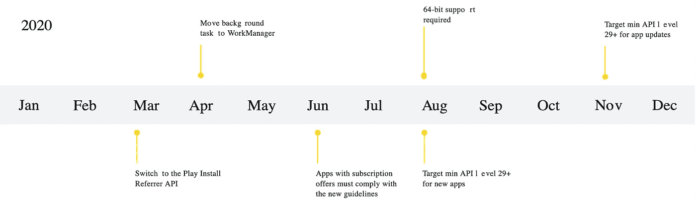
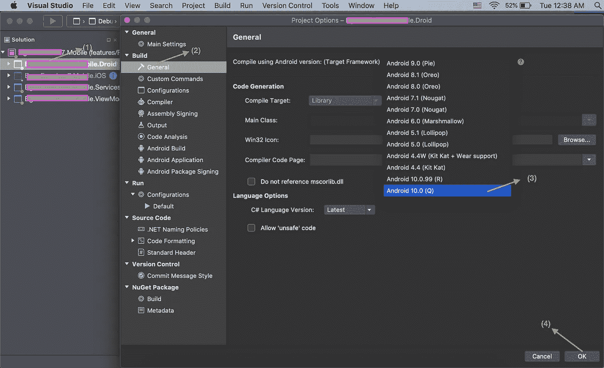

# 旧的 MVVMCross Xamarin 解决方案&日益逼近的 Android 10 截止日期

> 原文：<https://blog.devgenius.io/oldmvvmcrossxamarinsolutionstheloomingandroid10deadline-1744a54b6dbd?source=collection_archive---------5----------------------->

## 11 月 2 日就要到了，要主动避免崩溃

U 像 Xamarin 这样的跨平台框架有很多优点，比如学习曲线更短，开发时间更短。但是，由于原生 iOS & Android SDK 的**不可预见的**变化而需要的变化是缺点之一，正如你将在本文中看到的。
更新:查看[这篇文章](https://prototypemakers.medium.com/migrating-updating-an-old-xamarin-native-mvvmcross-project-c2ddd90282b6)了解如何更新和迁移。

## 介绍

你一定已经从微软刚刚发表的一篇文章[中了解到 Android Play 商店需求的重要变化。它基于 Android](https://devblogs.microsoft.com/xamarin/android-10-requirements) 概述的[截止日期，并在此图中进行了总结:](https://developer.android.com/distribute/play-policies)

谷歌的解释者图片显示了不同需求的时间表

谷歌 Play 商店要求指出，2020 年 11 月 2 日之后，所有对 Android 应用的更新都需要针对 Android 10 (Q API Level 29)框架。

## 修复大多数 Xamarin 应用程序

对于大多数 Xamarin 和 Xamarin。表单应用程序，这是一个简单的 4 步修复:

4 步改变以符合 Android 10 的变化

1.  在 Microsoft Visual Studio 中打开您的 Xamarin 解决方案(SLN)文件，双击您的`Droid`项目以打开项目选项
2.  在菜单中选择常规构建选项
3.  将目标框架更改为 Android 10 或更高版本
4.  按确定，你就完成了！

## 为什么 MVVMCross 没那么容易？

如果你正在使用一个像 MVVMCross 这样的“MVVM 框架”库(nuget 包)，你可能会有很多工作要做。这些库与 Xamarin 本地解决方案的代码紧密相关，主要用于简化导航和代码共享，比 Xamarin 早很多年。形式变得更加稳定。那么问题是什么呢？正如 StackOverflow 上的[所详述的，由于 MVVMCross 框架无法预见的 Android SDK**中的变化，这些应用不能简单地针对 Android 10 框架。您的应用程序将在加载时崩溃，除非您更新到 MVVMCross 版本 6.4.1 库。更新 Nuget 包通常很容易，不是吗？修复并不容易，因为这些 MVVM 框架库的更新版本不支持您的“核心”项目的> 5 年旧目标框架，它可能使用。NET Portable PCL 4.5 —配置文件 111。该库的维护者 Tomasz，**](https://stackoverflow.com/questions/59078153/mvvmcross-android-10-0-q-mainactivity-exception-crash-on-setcontentview)**[指出](https://twitter.com/Cheesebaron/status/1280521246535561223)有一些潜在的变通办法，比如滚动你自己的`MvxLayoutInflater`代码，或者可能只是停止使用 MvvmCross 的绑定膨胀，像在 iOS 上一样在代码中进行所有的绑定，但我还没有尝试过这些。**

## 那么我该如何更新呢？

理论上，更新库版本应该遵循以下步骤:

GIF 讽刺的叫你把头发拔了

1.  您必须首先将核心 PCL 项目目标框架更新为。NET 标准 2.0。有几篇文章谈到了这一点。
2.  一旦你改变了这一点，现在你所有的第三方库将需要更新到一个版本，以支持新的核心目标框架。
3.  由于这些库中多年的变化(可能超过 2000)，您将会有很多错误。
4.  一旦你通过简单的修复解决了 90%的错误，所有的项目都需要做大量的修改，因为 MVVMCross 的设置和以前有很大的不同。

我的建议是不要尝试更新你的库版本！从我的试验中，我了解到更新库版本的最简单的方法是用最新的目标框架和库获取 MVVMCross 提供的最新工作样本，并对其进行替换，一部分一部分地替换页面。如上所述，也许可以试试 Tomasz 提到的潜在解决方法。

## 为什么我会知道这件事？

去年，我花了一些空闲时间，尝试在空闲时间为一个应用程序进行迁移，这是一个挑战，遵循我在网上收到的教程和建议，并向 Xamarin 顾问请教，这导致了一个路障和许多实现。对于我刚刚继承的一个应用程序，一家主要的咨询公司花了几个月的时间与 Xamarin apps 一起进行 MVVMCross 框架“迁移”，我们仍然在修复产生的 bug。

## 迁移会让应用持续一段时间吗？

迁移并不都是不幸的。2018 年底左右做的另一个改变是，Android 把所有原生库都改成了“AndroidX”。从我与 MVVMCross 的创建者的交谈中，只有一个非官方版本的库支持 AndroidX，但它是可行的。你现在不需要做这种改变，但随着即将到来的 MVVMCross 版本 7 库，你可以在可预见的未来继续发布你的 Xamarin MVVMCross Android 应用程序的更新。

## MVVMCross 太牛了！

我最近继承的应用程序将 MVVMCross 用于 2013 版的库，非常稳定。该公司只是决定迁移到最新版本，因为这个 Android 10 的要求。考虑到这一点，尽管有这个问题，我还是高度赞扬框架的创建者和贡献者们创造了一个奇妙的库。不要忘记与你的朋友分享，因为他们可能不知道这个迫在眉睫的最后期限。请在 [Twitter](https://twitter.com/Saamerm) 上告诉我你的想法，或者在这里发表评论。