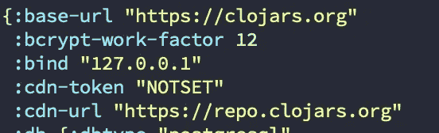
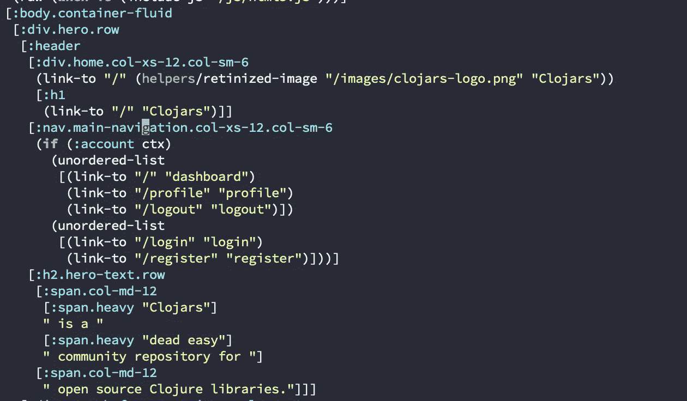
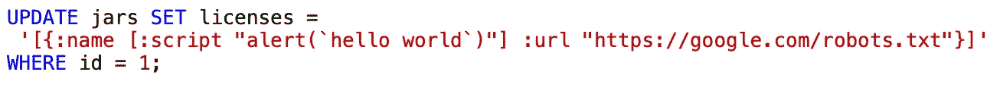

# 论克罗夫特的持续 XSS 和外部资源

> 原文：<https://blog.devgenius.io/on-clojars-persistent-xss-and-external-resources-74746baabe97?source=collection_archive---------10----------------------->

永远不要相信任何东西，甚至是你的数据库。或者我如何在 Clojure 社区的一个最关键的软件上发现一个漏洞。

自从我开始学习网络安全以来，我注意到几乎每一个漏洞都是基于信任作为系统或应用程序实例的一部分的某物或某人。SQL 注入、缓冲区溢出和 XSS 信任用户输入，CSRF 基于信任用户的浏览器，我们存储用户凭证的哈希，因为我们不相信我们的数据库总是安全的。

> 这个程序，它们不是自己坐，而是和其他程序对话。现在我们有三个或更多这样的东西。而且现在可能不是用同一种编程语言写的，都有自己的世界观。— Rich Hickey 谈[有效计划 Clojure 的 10 年](https://www.youtube.com/watch?v=2V1FtfBDsLU)。

作为子系统(如数据库)一部分的第三方应用程序等资源是由不同的人构建的，他们有自己的世界观，像每个人一样，**他们也会犯错误**。它可能存在漏洞，泄露凭证，甚至遭受某种类型的注入攻击。

# edn 是什么？

与任何类似 Lisp 的语言一样，Clojure 使用了代码是数据的强大概念，反之亦然，这意味着 Clojure 程序是使用自己的数据结构表示编写的。edn 扩展为 [**可扩展数据表示法**](https://github.com/edn-format/edn) ，是 Clojure 的数据表示语法的子集。一些 Clojure 应用程序甚至用它作为数据传输格式。

通过 Clojure 使用 edn 存储非结构化数据很简单，因为使用 Clojure 的核心库可以很容易地读取这些数据。它实际上非常安全，因为它没有实际的代码，只有数据。

Clojars 使用 edn 来存储配置。

# 打嗝

[Hiccup](https://github.com/weavejester/hiccup) 是 Clojure 库，能够从 Clojure 数据结构呈现 HTML。正如自己的库所承诺的，可以用向量来表示元素，用映射来表示元素属性。所以在代码上保持布局是非常简单的，事实证明它可以非常快，因为在代码被编译成 Java 字节码之后，它不需要解析，它现在就是数据了。

Clojars 源代码中的 Hiccup 布局

# 有时候你不需要 HTML 来 XSS

我注意到从数据库中提取的一些字段被视为数据结构，更确切地说，是包含字段*名称*和 *url 的地图集合。*这个名字是和 Hiccup 布局一起添加的，所以我马上想到:**“如果名字是一些 Hiccup 数据结构会怎么样？”**。这里的假设非常简单，因为 Hiccup 将数据结构直接呈现在 HTML 中，您甚至不需要将 HTML 直接放在值上，只需要数据。

名称直接用于链接中。

然后，我需要了解如何从数据库中提取数据，如这将最终成为地图的集合。发生的情况是，一些特定字段在从数据库中提取后被解析为 edn 数据。直接在 jar 获取函数上，密钥被限制为*许可证*和*单片机*。我没有注意到 *scm* 字段的任何代码没有经过任何消毒就被使用。

## 坚持攻击

情况很简单，如果攻击者对数据库有足够的访问权限，他可以直接在数据库上将数据添加到 jar 的 license 字段中，这样就可以直接呈现数据，而无需进行清理。PoC 只是一个简单、直接的 SQL 查询。出于某种原因，单引号在 HTML 中被转义了，所以我需要用反引号来代替。在这一点上，我必须感谢[海托尔·古维亚](https://heitorgouvea.me)，他在几周前发布了一个关于绕过 XSS 过滤器的挑战，其中一个可能的有效载荷是`prompt`hello world``，这给了一个提示。

# 瞧

现在，这会呈现一个包含警报调用的脚本标记，而不是许可证的名称。也可以向 *src* 字段中注入一些东西来加载远程代码，这样就可以用它来处理牛肉之类的东西。

# 结论

我把漏洞报告给了*contact@clojars.org*，也就是[官方漏洞报告渠道](https://clojars.org/security)。我与项目维护者 Tobias Crawley 就 Clojurians Slack 进行了交谈，我想感谢他公开交流这个问题。

除了数据库之外，我还试图使用其他攻击媒介，比如试图发布一个带有精心制作的 pom 文件的包，但由于它的实现方式，这不是一个可行的媒介。

注意到这个漏洞不被普通用户利用是非常重要的，因为你必须直接访问数据库才能达到这个目的。

# 时间表

*   6 月 28 日:克隆了回购协议，以便探索它并看看它是如何工作的，当天就发现了漏洞；
*   6 月 29 日:报告了该漏洞，并在 Slack 上与 Tobias Crawley 讨论了该漏洞，他在当天立即回答并承认了该问题；
*   7 月 4 日:托拜厄斯修复了这个问题，并提出了一个解决方案，作为对[https://github.com/clojars/clojars-web/pull/763](https://github.com/clojars/clojars-web/pull/763)的拉动式请求，我审阅了这个问题，我们讨论了这个解决方案；
*   7 月 5 日:补丁已部署，我已被添加到安全感谢列表中。

*我也请托拜厄斯审阅了这篇文章，以确保他对我在这里所说的内容感到满意。*