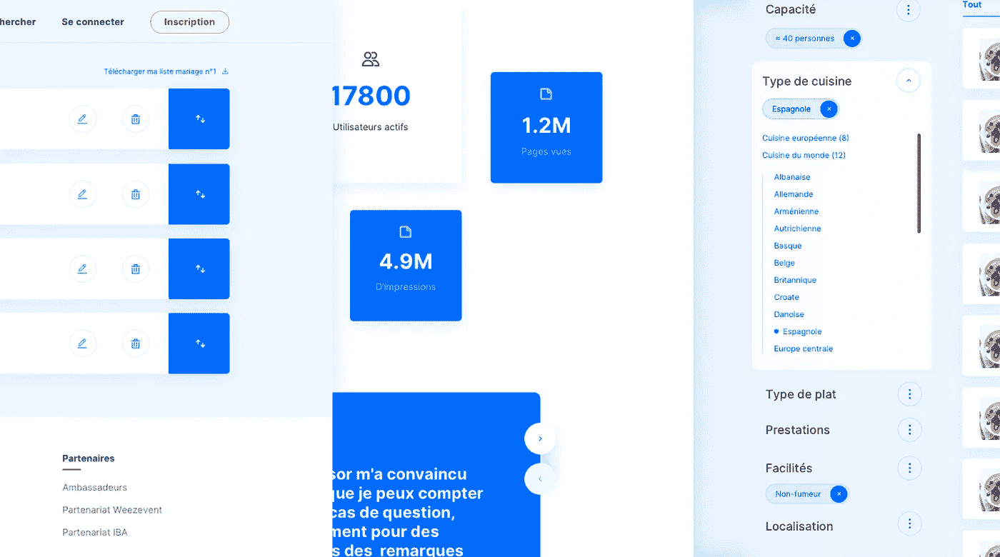

# 现代 web 应用程序的设计

> 原文：<https://blog.devgenius.io/on-designing-modern-web-applications-6ba7432a21f?source=collection_archive---------28----------------------->

## 我最近开始与一个团队合作，该团队拥有一项服务，旨在将当地企业更紧密地联系在一起。我建议他们如何实现更好的在线曝光，因为团队的主要挑战是分离应用程序，这似乎是重新思考技术堆栈和方法的好机会。

## 最佳用户体验工程

我们开发的最终目标是关于使用我们网站的人们以及他们作为用户所能获得的利益。当我们考虑现场的不同挑战时，我们可以调整体验，默认情况下，它决定了工程决策。这个概念化阶段遵循一个关于商业模式和用户数据政策的道德框架，以及其他关注点。

## 关注点分离和分离的架构

在对应用程序进行了轻微的 UX 和用户界面改造后(在这一点上，我们不想过多地改变用户的习惯)，我们决定采用两种不同的网络应用程序:一种专用于公共内容，另一种专注于后端功能，如内容管理、支付、社交网络功能。这种架构标志着受 SEO 约束的页面和处理更广泛功能但不暴露于爬虫的页面之间的关注点分离。

为了解决这个问题，基于“原子设计”原则的风格指南被创建，然后被转录到独立于两个版本的横向 web 组件库中。我们确实在 NPM 上托管了设计系统，以便于版本控制和跨开发人员分发，开发人员可以为他们的工作挑选所需的组件。

## 设计系统和方法

下面是我们总结迭代过程的方式:

类似 Jamstack 的工作流。

通常，一个微妙的平衡是在全球分布和本地范围的样式和方法之间，以及在只读和交互式组件之间做出决定——本质上是在通用性和性能之间。功能规范包括拖放、列表重新排序、图像上传和裁剪、3D 场馆的表示等等。

一个专用于显示场馆三维表示的组件。

## 范围和现代 CSS 模块

我们的组件库是基于原子设计原则的，CSS 与 JS 部分一起写在组件中。因为级联逻辑是有限的，所以这种方法允许资源的更渐进的加载，更少的相互依赖和更高的稳定性。

最新的强大 CSS 模块，如 Grid 和 Flexbox 以及基于 REMs 的字体大小减少了代码量，并(几乎)结束了@mediaqueries 中的覆盖。总之，在脚本的帮助下，在生产中切割类名，其好处是产生接近 80%的 CSS。SVG 图标系统、CSS 变量的使用以及对标记和可访问性特性的特别关注完成了创建高质量组件系统的努力。

## 加载和缓存

现代应用程序在预连接、预取或预加载资源时提供了完善的选项。座右铭可以是“越少越好，越早越好”。我们应该只提供我们需要的资源，并且我们应该努力让它们在我们需要它们之前到达。客户机和服务器之间传输的速度和节约节省了带宽的使用，使整个生态系统更快、更可持续。例如，为了提高导航的响应性，当页面的链接显示在视口中时，会自动检索相应页面的拆分代码，并开始预加载资源。服务工作者的加入可以处理离线功能，并能更好地控制静态资产的缓存。这些措施保证了异步 web 组件的机制快速而平稳地运行。

## GraphQl 作为一种查询语言

GraphQL 是一种用于 API 的开源数据查询和操作语言，由脸书于 2012 年在内部开发，于 2015 年公开发布。GraphQL 的强大之处在于，它允许客户只要求他们需要的东西，仅此而已。对于与 API 的交换来说，这个功能是一个不可思议的改进，尤其是在路由上的碎片数据模式的情况下。

反过来，在将数据发送回服务器时，GraphQl 可以极大地简化请求，特别是当逻辑遵循。

## 集中式数据存储

客户端数据存储(集中数据和应用程序的主要逻辑)将请求解耦到不同的 API，同时提供缓存和持久化功能。然后，数据可以随时随地获得，而与显示的页面没有必要的关联。因此，数据存储为个性化提供了一个完美的优化设计，防止第三方脚本在组件系统中传播，允许更多的创造力，并使整个应用程序更智能，更易于维护。

## 用户的旅程和个性化

在任何给定时间访问应用程序中任何地方的状态，为个性化和用户旅程提供了一些令人难以置信的视角。无论是地理定位、特定产品类别的关联性、CRM 还是数据分析，一切都可以结合起来，以创建您所需的业务逻辑场景。在我们的案例中，影响者的个人资料和优惠都是地理定位的，减少了地图和定位器的使用，需要更少的导航和更少的点击，从而提高了体验和转化率。

## 同构与 SEO

众所周知，web 应用程序的弱点是内容索引。由于其异步特性，内容不会在爬网程序访问期间向其公开。然后，我们操作服务器端呈现来生成每条路线，并调用同构组件，这些组件既可以处理它们在服务器端的呈现，也可以处理它们在客户端的显示和逻辑。有了现代 javascript 框架，SSR 可以相对容易地解决，这种服务器端自动化结合了两者的优点。第一个加载的视图被渲染了——其中内嵌了 over fold CSS——这是一个性能上的巨大改进，尤其是对于第一个内容丰富的绘制。此外，我们决定通过 JSON-LD 模式公开结构化数据，该模式在 schema.org 上可用，这是一个创建、维护和推广结构化数据模式的协作社区。然后，搜索引擎可以使用这些模式来消除元素的歧义，并围绕实体建立事实。这些实体反过来创建丰富的搜索引擎结果。在应用程序相对平坦的网站地图中，我们利用“组织”、“网站”、“网页”和“本地商业”模式，向搜索引擎指定价格范围、可用性、评级、地理位置、开放日期等信息。

SSR 原则的一个非常简单的原则模式。

## 一些反馈

[来源](https://www.simicart.com/blog/pwa-case-studies/#Embrace_the_Future_of_Websites)

**Trivago:** 自从 Trivago 用 PWA 更新其网站以来，超过 50 万人在他们的主屏幕上添加了 Trivago 快捷方式，他们的参与度增加了 150%。推送通知被证明是沟通和增加转化率的完美方式——酒店报价的现场点击量增加了 97%。

**Pinterest:** 与旧的移动网络体验相比，花费的时间增加了 40%，用户生成的广告收入增加了 44%，核心参与度增加了 60%。

Twitter: 跳出率下降了 20%，每次会话的页面增加了 65%，发送的推文增加了 75%。

## 迈向 web 4.0 的必要一步

随着许多服务转向人工智能和人工智能，网络应用的能力需要解决这个新网络时代的迫切需要。图形界面将不再经常使用，但更重要的是，它将有不同的用途。来自各种来源的数据流将越来越多地穿越网络应用，设计系统将需要能够在更广泛的环境中生活和工作。web apps 也很有可能随着时间的推移取代原生应用，成为原生 app 和网站的完美结合。所有这些因素都集中在一个需求上，即基于模块化设计系统和异步机制的在线解决方案需要面向未来、低成本的适应性技术堆栈。

感谢阅读我:-)