# 使用 Nuxtjs 中的 vue-tour 包的入门用户

> 原文：<https://blog.devgenius.io/onboarding-users-using-the-vue-tour-package-in-nuxtjs-9bea60c9e4ed?source=collection_archive---------13----------------------->

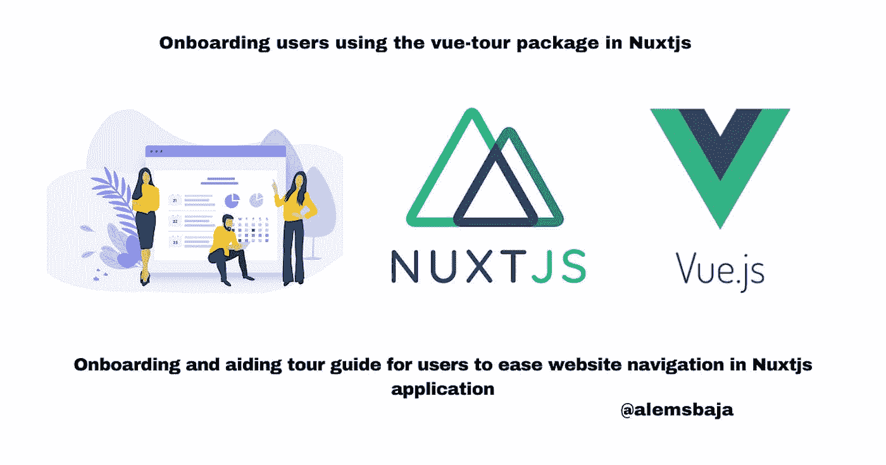

vuejs/nuxtjs 中的 vue-tour 包

在这篇文章中，我们将看看如何使用 [Pulsar](https://github.com/pulsardev) 的 [vue-tour](https://github.com/pulsardev/vue-tour) 向导包在 Nuxtjs 应用程序中搭载或引导用户。

**vue-tour** 是一个轻量级、简单且可定制的旅游插件，用于 Vue.js

Vue Tour 提供了一种快速简单的方法来指导用户使用您的应用程序。您可以通过单击以下按钮来控制此页面上的游览。

如果您想以更高级的方式使用 Vue Tour，请访问我们的[文档](https://github.com/pulsardev/vue-tour/wiki)。

> *该项目的目的是为我们的网站上的入职用户添加一个导游。*

**让我们从创建一个新的 Nuxtjs 项目开始。**

> *在(Nuxtjs)[*[*【nuxtjs.org/docs/get-started/installation】*](https://nuxtjs.org/docs/get-started/installation%5D)中创建一个项目

```
yarn create nuxt-app tour_guide_in_nuxtjs 
```

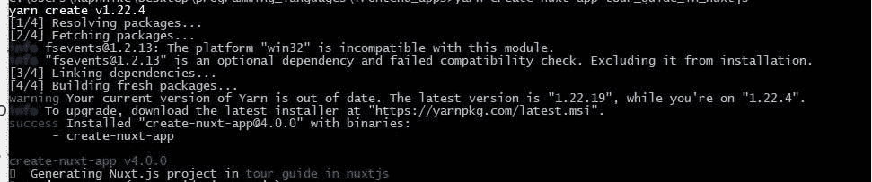

按照说明设置应用程序

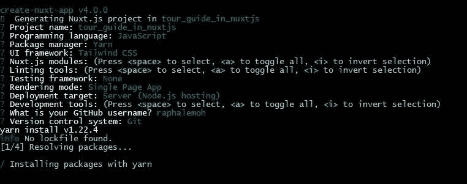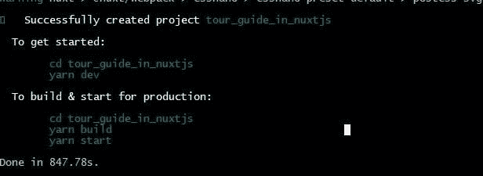

改变目录，用你最喜欢的编辑器打开源代码。

> *在这里，我们假设您使用 vscode…您可以使用下面的命令在 vscode 编辑器上打开项目*

```
code .
```

> *在端口 4500* 上使用下面的命令服务应用程序

```
yarn dev --port 4500
```

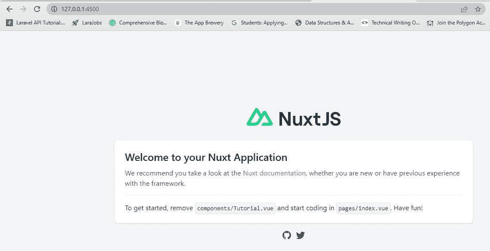

在添加 vue-tour 包之前，我们将使用一个 Tailwindcss 登录页面模板来演示这个来自[这里](https://preview.tailwindtemplates.co/plain/)的项目

您可以在此找到更多模板

运行此命令添加 **tailwindconfig**

```
npx tailwindcss init
```

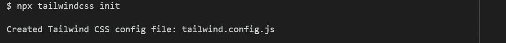

> *将登录 web 模板中的 tailwind.config.js 文件复制到 Nuxtjs 项目中，并更新如下所示的内容部分*

```
content: [
      '*.html',
      '/js/main.js'
    ]
```

有关如何设置 Tailwindcss 的更多信息，请访问此[链接](https://v2.tailwindcss.com/docs/guides/nuxtjs)

> *我们将在 Nuxtjs 项目中创建一个 assets 文件夹来保存登录页面模板中的 CSS 和字体文件。*

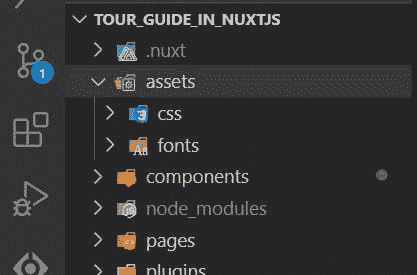

> *js 和资产/图像文件将被放置在静态文件夹*下

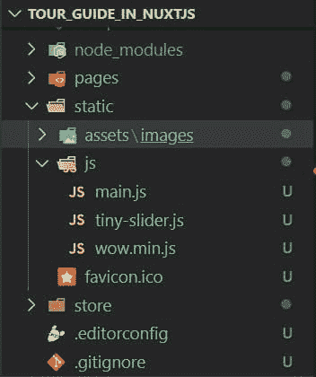

这些文件可以通过 **nuxt.config.js** 文件加载，在 vue 组件中访问。

```
css: [
    '@/assets/css/animate.css',
    '@/assets/css/tiny-slider.css',
    '@/assets/fonts/lineicons/font-css/LineIcons.css',
    '@/assets/css/tailwindcss.css',
  ],script: [
    {
      src: "js/tiny-slider.js",
      src: "js/wow.min.js",
      src: "js/main.js",
    }
  ],
```

> *接下来，让我们实现 vue-tour 包*

您可以使用 yarn、npm 安装 vue-tour，或者在 GitHub 上下载缩小版。

```
yarn add vue-tour
```

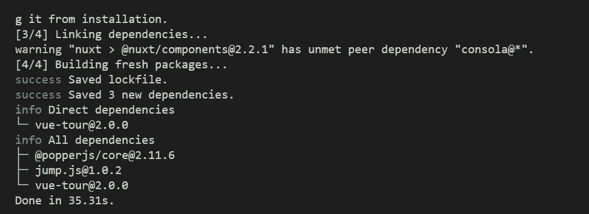

> *接下来，创建一个插件文件夹和文件夹内的 vue-tour 插件文件，并告诉 vue 使用它。此外，不要忘记包括风格。您可以添加默认提供的样式，也可以根据自己的喜好进行自定义。*

```
import Vue from 'vue'
import VueTour from 'vue-tour'require('vue-tour/dist/vue-tour.css')Vue.use(VueTour)
```

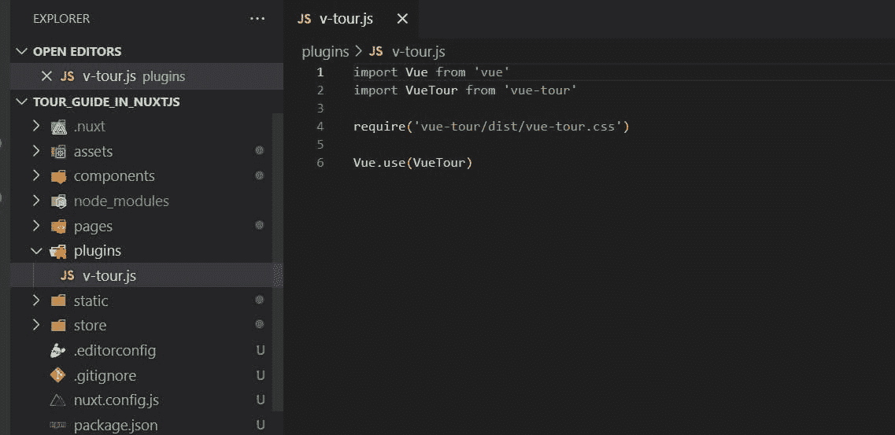

> *接下来，在 Nuxt 配置文件中注册插件*

```
plugins: [
    '@/plugins/v-tour'
  ],
```

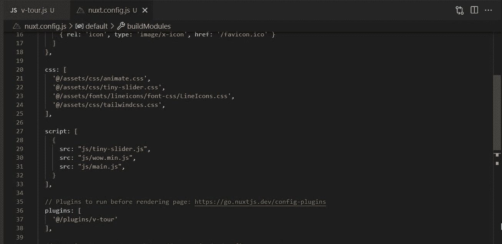

> *接下来，我们将在显示登录页面的教程组件中添加一个 v-tour 组件，并向它传递一组步骤。每个步骤的 target 属性可以指向应用程序的任何组件中的一个 DOM 元素(只要它在相关步骤弹出时存在于 DOM 中)。*

```
<v-tour name="myTour" :steps="steps"></v-tour>
```

> *接下来我们将添加 id 属性来跟踪教程组件*的 HTML 部分(任何元素)中的步骤

只需将需要指南的部分包装在

例如 block

```
<div id="v-step-0">
                  <a class="navbar-brand mr-5" href="index.html">
                    
                  </a>
                </div>
```

> *更新脚本部分以显示指南详情*

```
<script>
  export default {
    name: 'my-tour',
    data () {
      return {
//array of objects containing the steps
        steps: [
        {
          target: "#v-step-0",
//header of the pop up dialog
          header: {
            title: "Get Started with our Tour guide",
          },
          content: `Discover and explore <strong>our amazing features</strong>!`,
        },
        ]
      }
    },
    mounted: function () {
      this.$tours['myTour'].start()
    }
  }
</script>
```

> *在这篇文章中，我们创建了 10 个步骤来引导或让用户了解登录页面*

*   第一个指南

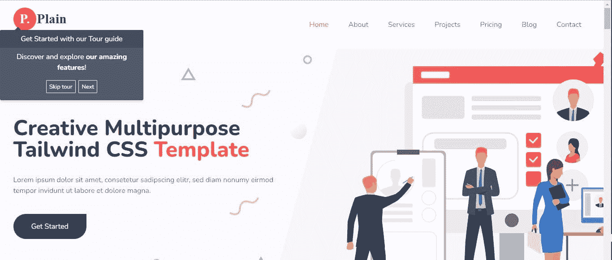

*   导航指南

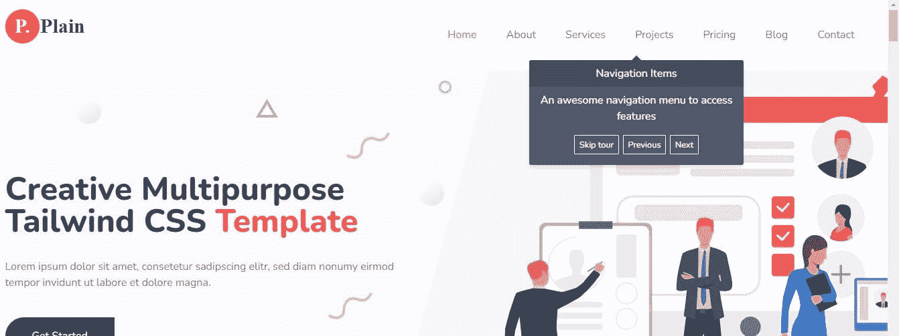

*   指南 3

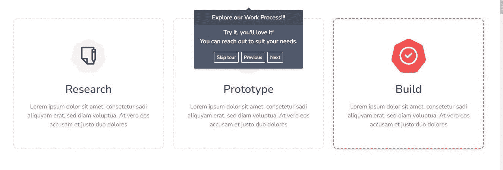

您可以使用放置选项来更改弹出窗口的方向..右、左、下或上。

*   指南 4


*   指南 5

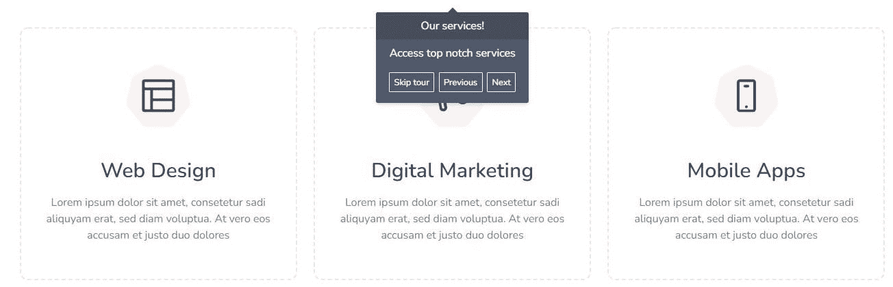

…..

*   指南 10

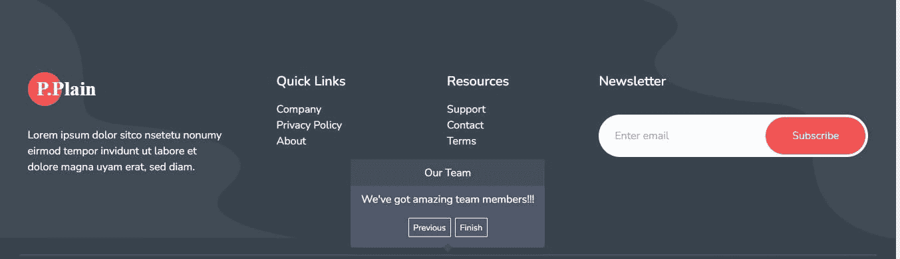

**注:**

*   该对话框有上一个、下一个和跳过漫游选项。
*   最后一个对话框有“上一个”和“完成”选项
*   如果内容占用了屏幕空间，您可以添加高度和滚动功能。
*   为了不打扰用户使用 pop 指南，你可以使用 cookies 或 localstorage 来跟踪显示状态。

感谢您阅读本文！！！。

如果你觉得这篇文章有用，请分享给你的网络，并随时使用评论区的问题，答案和贡献。

*原发布于*[*https://alemsbaja . hashnode . dev*](https://alemsbaja.hashnode.dev/onboarding-users-using-the-vue-tour-package-in-nuxtjs)*。*