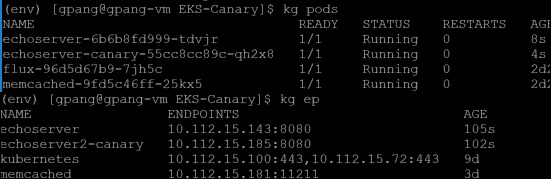
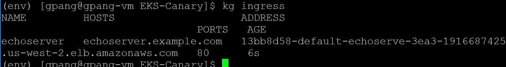
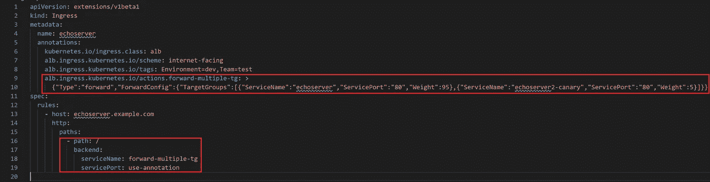

# AWS EKS (Kubernetes)上的金丝雀，无服务网格

> 原文：<https://blog.devgenius.io/one-box-to-rule-them-all-8bdbd48f1ec1?source=collection_archive---------8----------------------->


戴维·克洛德在 [Unsplash](https://unsplash.com?utm_source=medium&utm_medium=referral) 上的照片

## 背景:

我认为大多数工程师都同意在生产中进行测试是一个坏主意，但我们在生产前环境中经常不会遇到问题，因为我们没有足够的测试，我们没有反映生产的测试数据，我们没有呼叫量和/或我们没有生产的输入多样性。所以[的金丝雀部署](https://martinfowler.com/bliki/CanaryRelease.html)是为了在最小化爆炸半径的同时“试水”而开发的。通常这意味着将一小部分生产流量重定向到运行新代码的节点。这个“金丝雀”节点受到严密监控，因此如果出现任何问题，部署工程师都会立即得到通知。然后，新代码被“烘烤”在金丝雀节点中，直到我们有信心将新代码推广到产品中。

## 问题:

我一直在努力寻找一种方法来进行金丝雀部署，而不需要将整个[服务网格](https://www.redhat.com/en/topics/microservices/what-is-a-service-mesh)应用到我的 [EKS](https://aws.amazon.com/eks/) 集群上。由于我的集群相对较小，服务网格最终变得多余。服务网格带来了许多功能，如服务发现、跟踪和认证，但我只运行几个不同的服务，只有几个依赖关系。额外的网络跃点的额外延迟和额外的 CPU 和内存消耗不值得服务网格提供的功能。

## 解决方案:

我发现[应用负载平衡器(ALB)入口控制器](https://github.com/kubernetes-sigs/aws-alb-ingress-controller/pull/1088)现在支持[加权目标](https://github.com/kubernetes-sigs/aws-alb-ingress-controller/pull/1088)。这意味着我们可以控制每个目标接收的流量比例。有了这个，我们可以创建一个金丝雀设置，而不需要任何服务网格。

首先，我们需要在集群上安装 ALB 入口控制器。我会按照 AWS 提供的这个[步骤来安装它。](https://kubernetes-sigs.github.io/aws-alb-ingress-controller/guide/walkthrough/echoserver/)

然后，我们将创建 2 个部署和服务文件。一套部署和服务用于我们的生产环境，另一套用于我们的 canary 环境。[prod . YAML](https://github.com/GnatorX/EKS-Canary/blob/master/echoserver.yaml)canary . YAML。

```
kubectl apply -f echoserver.yaml
kubectl apply -f echoserver-canary.yaml
```

确保它们正在运行。

```
kubectl get pods
kubectl get endpoints
```



确认 pods 正在运行，并且两个服务(echoserver + echoserver2-canary)在端点上都有 IPs。

现在打开入口。 [ingress.yaml](https://github.com/GnatorX/EKS-Canary/blob/master/ingress.yaml)

```
kubectl apply -f ingress.yaml
```

确认入口已创建，并且底层入口已创建。

```
kubectl get ingress
```



因为入口部分包含创建分流流量的逻辑，所以让我们深入了解一下。



请注意红框注释。动作注释格式看起来像这样:`alb.ingress.kubernetes.io/actions.${action-name}`。该注释允许自定义操作，例如重定向请求。您可以给动作一个自定义名称，用`${action-name}`表示。然后，通过在入口规则中引用该名称并使用`servicePort: use-annotation`，您可以让入口规则执行您的自定义操作。

```
{"Type":"forward","ForwardConfig":{"TargetGroups":[{"ServiceName":"echoserver","ServicePort":"80","Weight":95},{"ServiceName":"echoserver2-canary","ServicePort":"80","Weight":5}]}}
```

在这里，我们利用这一点来为每个目标提供权重。请注意，我们将生产服务`ServiceName: "echoserver"`的权重设置为 95，将金丝雀服务`ServiceName:”echoserver2-canary"`的权重设置为 5。这意味着 95%的流量会到达 prod，而 5%会到达我们的 canary。

## 部署流程:

现在你可能会问我如何使用它？部署流程是什么样的？

在部署阶段，当应用程序准备好进行 canary 测试时，首先将应用程序部署到 canary 部署(echoserver-canary)上，方法是将部署 yaml 文件的容器映像更改为 prod candidate，并将更新的部署应用到您的 EKS 集群。您将监控金丝雀 pod 的日志和指标，并让它烘烤适当的时间。然后，通过对 prod 部署 yaml 进行同样的更改，并将更改应用到您的 EKS 集群，您将部署到 prod。

部署到 prod 后，有些人可能会采取不同的清理方法。即使在部署之后，我也将金丝雀作为产品的一部分来运行。由于它运行与生产环境相同的代码，因此它将作为一个额外的节点。有些可能会关闭金丝雀，您可以通过更改入口动作并将生产服务设置为 100 权重并将金丝雀权重设置为 0 来做到这一点。这将需要在每次部署后更改入口，但是从操作角度来看，这是一种更干净的方法，因为只有您的生产部署在为生产流量提供服务。

## 总结:

*   我们希望利用金丝雀部署，在最小化爆炸半径(只将一小部分流量重定向到金丝雀)的同时，用生产流量测试我们的新代码
*   我们通过使用 ALB 的加权目标规则来避免使用服务网格，因为服务网格对于您的集群来说可能是多余的
*   我们将入口设置为指向 canary 和 prod，并将生产候选对象部署到 canary 并对其进行监控
*   然后，我们将生产候选部署到所有生产节点。