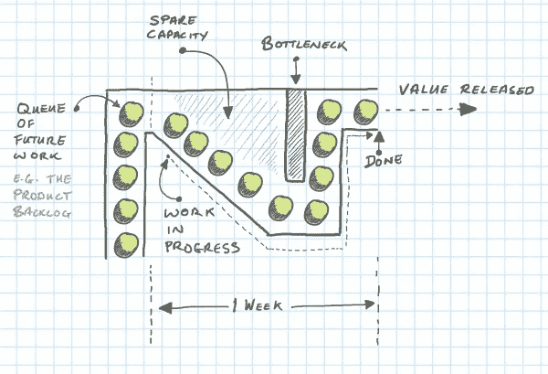

# 一个开发者一个任务

> 原文：<https://blog.devgenius.io/one-developer-one-task-b9bd52af925c?source=collection_archive---------3----------------------->

## 为什么 WIP(在制品)是要限制的？

约翰·施诺布里奇在 [Unsplash](https://unsplash.com?utm_source=medium&utm_medium=referral) 上的照片

# 什么是在制品？

术语[在制品](https://www.investopedia.com/terms/w/workinprogress.asp) (WIP)是一个生产和供应链管理术语，描述等待完成的部分成品。WIP 是指在生产过程的不同阶段，产品所产生的原材料、劳动力和间接成本。在制品是资产负债表上库存资产账户的一个组成部分。这些成本随后被转入产成品账户，并最终转入销售成本。

在软件开发中，WIP 是一个开发人员在特定时刻正在处理的任务数量。

# 正常行为

我已经经历过很多次，因为依赖他人，我的任务无法进入下一阶段。预合并代码审查是一个很好的阻塞步骤的例子。当您正在处理一项任务，并且您认为该任务已经完成时，您需要由另一个人来完成代码审查，以继续该任务(测试它，或者部署到生产环境，或者寻求其他人的帮助)。与此同时，我通常会接受另一项任务，这样循环又开始了。
这种行为增加了正在进行的工作，现在一个人有两个正在进行的任务。在这种情况下，我们有以下场景:

## 在我完成第二个任务的编码之前，代码审查就结束了

此时此刻，我必须决定完成第二个任务的代码和完成代码审查哪个更重要。

*   **完成第二个任务代码:**
    这个选项有一个大问题，第一个任务可能比第二个任务对业务更重要，因为第二个任务，我们推迟了第一个任务的部署。
*   **完成代码审查:**
    如果我们选择这个选项，我们将会遇到上下文切换问题，如果代码审查需要一些时间来修正注释，那么我们将会持续一些时间来回到我们的第二个任务代码。一旦我们回到我们的第二个任务，我们将需要一些时间来记住我们在做什么，我们的计划是什么，或者为什么我们的测试没有通过(上下文切换)。

## 在第一个任务的代码评审完成之前，我完成了第二个任务的编码

在这种情况下，循环又开始了。我必须把代码审查放在第二个任务中，我将接受另一个任务，再次增加 WIP，把问题做得更复杂。

## 代码评审通知的延迟实现

这个问题的出现是因为代码审查者和编码者需要被通知他们有代码审查要做或者代码审查已经完成。在这些延迟期间，没有人在该任务中工作，如果这些延迟很长，那么 WIP 将会增加。但是即使它们很短，代码评审员也会生活在一个永恒的上下文切换中。

# 限制 WIP

这并不意味着强迫程序员如果没有完成第一个任务就不要开始新的任务。这是一个警告，让你反思为什么我要这样做，为什么我受阻，我不能继续我的任务？这个问题的答案通常意味着您在生产过程中遇到了瓶颈:

[https://dzone.com/articles/littles-law-on-ready-for-queues](https://dzone.com/articles/littles-law-on-ready-for-queues)

如果瓶颈是手动步骤，解决方案可能是:

*   如果可能，使手工步骤自动化
*   如果你不能自动化，那就找一个更好的方法，用非阻塞的方式来做同样的事情

在我们的例子中，代码审查可以自动化吗？

*   从某种意义上来说，是的，我们可以用棉绒来验证我们的样式，我们可以用测试来查看我们的代码是否工作，所有这些事情都可以很快完成，而不会阻碍我们。
*   但是代码审查中有一部分必须由人类来完成。代码是否可读，是否解决了必须解决的问题，等等。

正如我们所说的，我们可以为另一个非阻塞步骤改变代码审查，并获得同样的好处吗？**是的，结对编程**

## [看板](https://www.scaledagileframework.com/team-kanban/)团队的利特尔法则

在软件开发的看板世界中，我们使用与利特尔法则不同的术语。[利特尔法则使用看板术语，包括在制品(WIP)、吞吐量和交付时间，可以是](https://itsadeliverything.com/littles-law-the-basis-of-lean-and-kanban):

***WIP =产量*提前期***

其中
**WIP** =进行中的任务数
**吞吐量** =平均离职率，例如每周的故事数
**提前期** =任务在系统中花费的平均时间

如果我们想缩短交付周期(将新功能投入生产的时间):

提前期= WIP/吞吐量

我们可以减少 WIP，或者增加吞吐量(例如，每周的故事数量)。“我可以通过增加从事特性工作的人数来提高吞吐量”，这种想法很正常。但是，如果我们的生产路径阻碍了团队成员，那么 WIP 将会增加，我们的交付周期将会比以前更短。

让我们想象一个人的小公司:

0.1(提前期)= 1(任务)/10(每周任务)

现在我们将有两个人进行合并前的代码审查:

0.26 = 4(任务)/ 15(每周任务，我们没有 20 个，因为我们有一个瓶颈)

我们的生产路径有一个手动步骤，根据团队中工作的人数成比例地增加 WIP。因此，减少 WIP 和提升团队成员的解决方案是替换阻塞步骤(在我们的例子中，例如进行结对编程)。

0.1(提前期)= 1(任务)/ 10(每周任务)

有四个程序员和结对编程:

0.1(提前期)= 2(任务)/ 20(每周任务)

因此，我们的团队可以从 1 扩展到 4，同时保持相同的交付周期，因为我们消除了瓶颈，所以我们限制了 WIP。

你可以说，等等，但是你让两个人重复了成本，你得到了同样的结果。好的，另一种方法是增加交货时间。增加交货时间意味着增加上市时间，这意味着失去客户。

保持交付周期
[【提交后评审】](https://link.medium.com/lzENCmVms8)的另一种方法[辛迪·斯里德哈兰](https://medium.com/u/87c8c84f24b1?source=post_page-----b9bd52af925c--------------------------------)