# 给你的中型文章一个优雅的感觉

> 原文：<https://blog.devgenius.io/one-hack-to-give-your-medium-articles-an-elegant-feel-e641deaa2ae4?source=collection_archive---------20----------------------->

## 学会链接你文章的不同部分，^_^

尼克·莫瑞森在 [Unsplash](https://unsplash.com?utm_source=medium&utm_medium=referral) 上拍摄的照片

# 背景:

不久前，我写了一篇[媒体文章](https://medium.com/swlh/my-journey-to-becoming-a-gsoc-20-student-8c34a78e97ef?source=friends_link&sk=f6a81b75c2019fe1864a589afe56ab01)，描述了我在 GSoC 2020 中被选为统计计算 R 项目的学生开发者。委婉地说，这篇文章非常受欢迎，甚至被推荐给了我😄

我从这篇文章中得到的唯一负面反馈是，它太长了，读者常常会因为文章的浩瀚而感到迷失。所以，我决定稍微修改一下，我在*中添加了一个* ***目录*** *部分，并使该表的所有条目都可以点击*。这让我很惊讶，因为我猜想这可能是 Medium 文章中很常见的功能，但是 Medium 没有提供任何支持，所以我不得不自己动手来实现它:

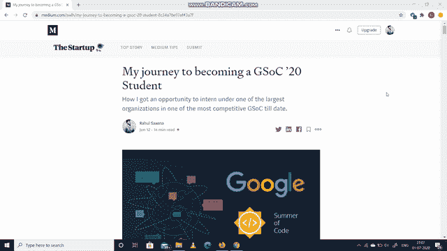

活动中的可点击条目

# 在文章中模仿这种行为:

让我给你一点警告。这种方法不是很直接，坦率地说，有点像黑客。因为我是计算机科学专业的本科生，所以这对我来说很自然。然而，即使你不太懂技术，我还是会列出你可以复制和模仿这种行为的具体步骤。

## 第一步:

如果你已经发表了你的文章，那么使用**编辑故事**选项来修改你的文章，如果你的文章还没有发表，那么你将能够默认编辑你的故事。

滚动到要链接的部分:

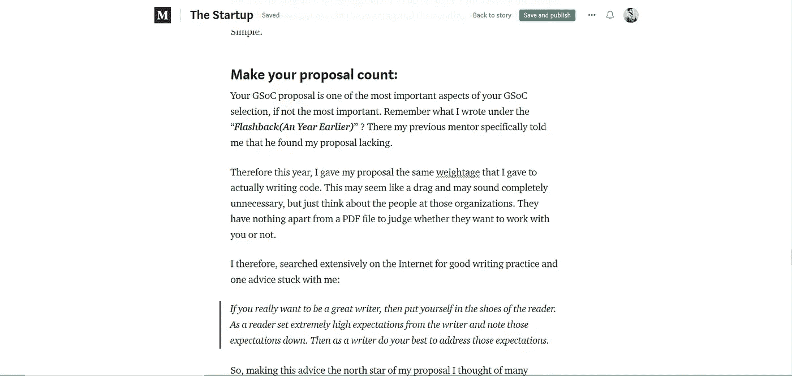

这一步不会因浏览器而异

## 第二步:

选择标题并右键单击。然后选择**检查元素**选项:

Mozilla Firefox:

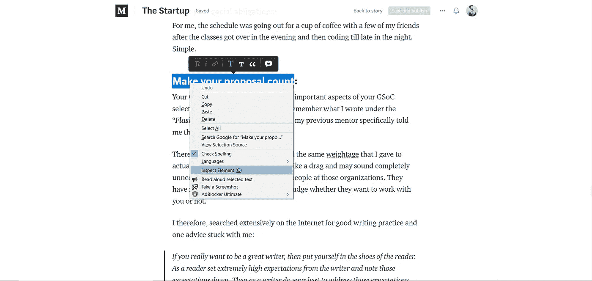

Mozilla Firefox 中的演示

**谷歌浏览器:**

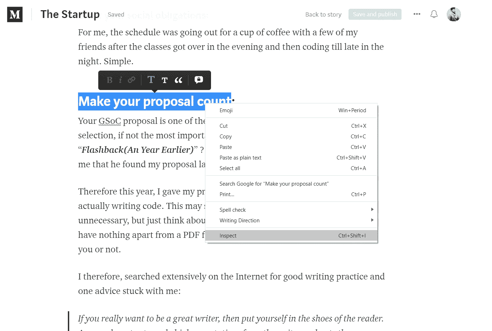

Google Chrome 中的演示

**微软 Edge:**

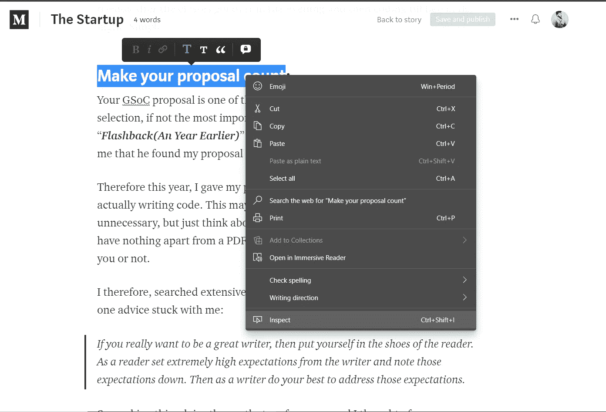

Microsoft Edge 中的演示

## 第三步:

从打开的侧窗中寻找 ***name*** 属性，并复制分配给它的字符串:

**Mozilla Firefox:**

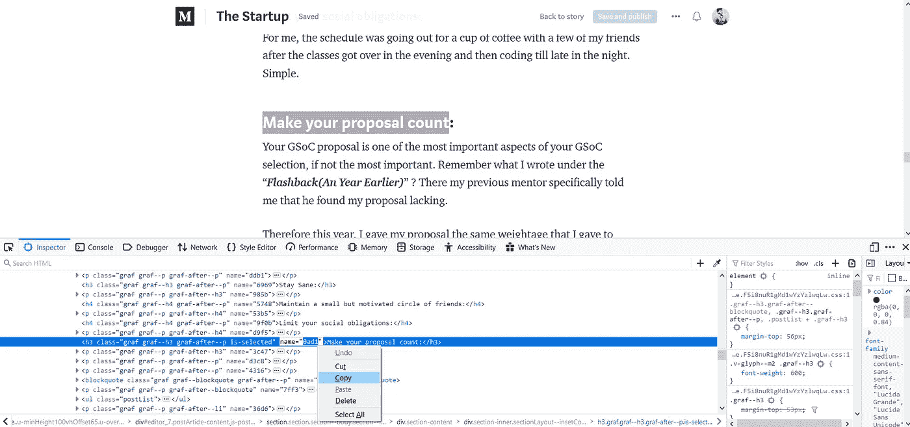

Mozilla Firefox 中的演示

**谷歌浏览器:**

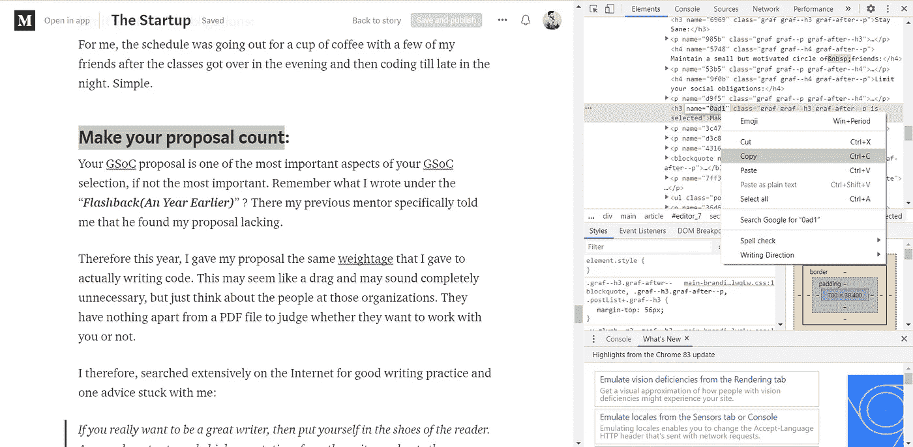

谷歌浏览器中的演示

**微软 Edge:**

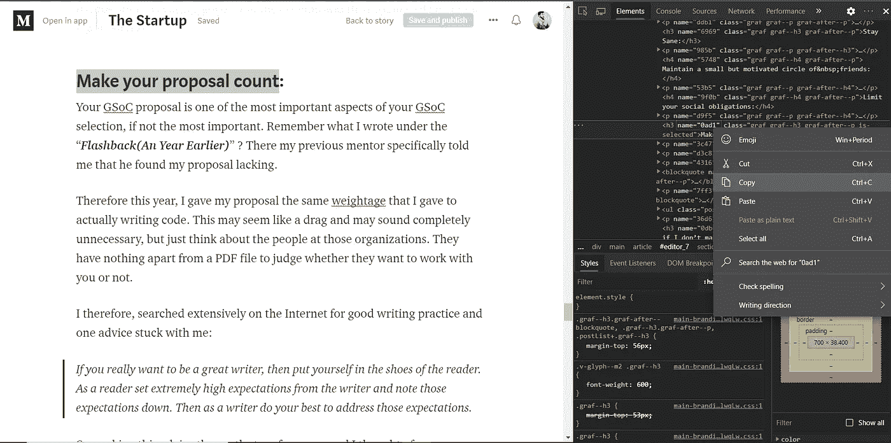

Microsoft Edge 中的演示

当您选择/突出显示特定标题，然后选择 ***检查元素*** 时，您将在弹出的新侧窗中直接进入该标题/章节的代码。不需要搜索任何东西；)

## 第四步:

回到您的 ***目录*** 中您想要链接到您的部分的地方，然后选择您想要使其可点击的文本。选择在那里添加超链接的选项:

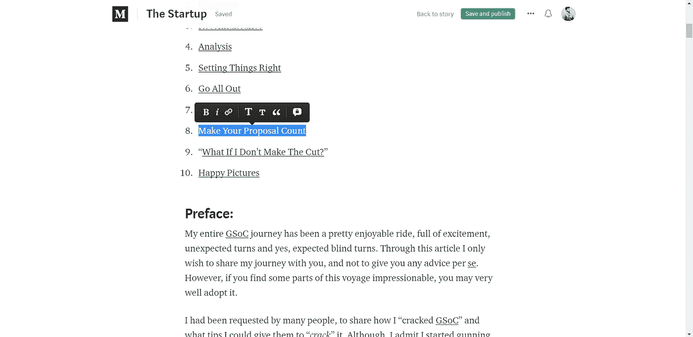

这一步不会因浏览器而异

## 第五步:

点击选项后添加一个超链接(interlinked chains logo) **添加一个井号(#)** 然后粘贴你之前从 ***name*** 字段复制的字符串。

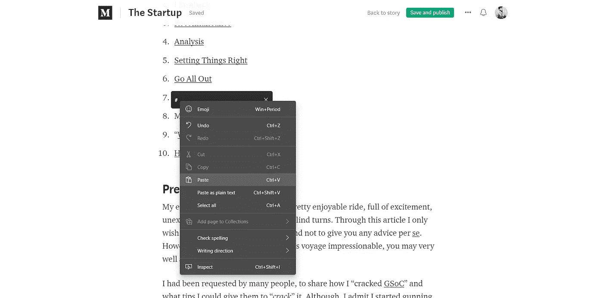

这一步不会因浏览器而异

## 第六步:

出现类似内容后，按回车键:

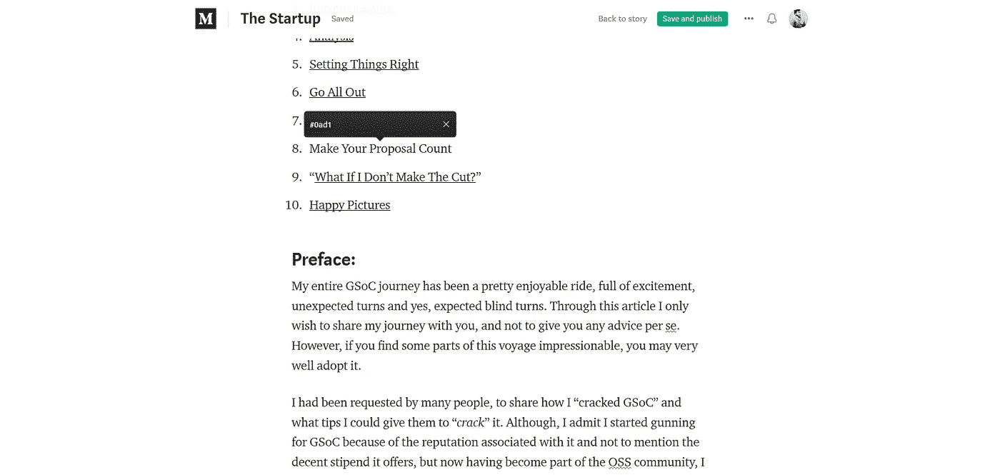

这一步不会因浏览器而异

## 第七步:

对你想要链接的所有部分都这样做，然后或者 ***发布*** 或者 ***保存并发布*** 你的文章。太好了，现在你们都完成了。恭喜你！！🙌🎊

干得好！！这就是事情的全部。干得好！！

# 结论:

这对一些人来说可能是轻而易举的事，但对一些人来说同样困难。即使你很难掌握，也不要担心，你只需要这样做两到三次，然后你就会完全精通它。没什么大不了的。

关于这一点，我还想告诉大家，这项功能还没有在 Safari 浏览器中测试过，所以不做任何声明。然而，这种技术在主流浏览器中运行良好。

如果你遇到其他方法来达到这些效果，请在评论区告诉我。另外，如果你觉得这篇文章很有帮助，别忘了为这篇文章鼓掌，并通过 LinkedIn 或 Twitter 联系。你也可以看看我写的所有其他有趣的文章，[这里](https://medium.com/@rahulsaxena.hindubale)。

借此，祝你写作之旅一切顺利。

谢谢你，祝你成功。