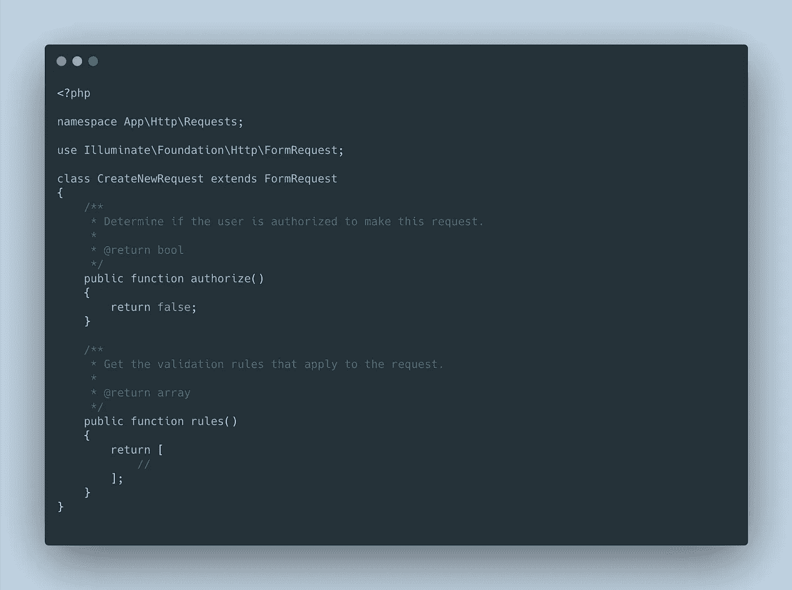
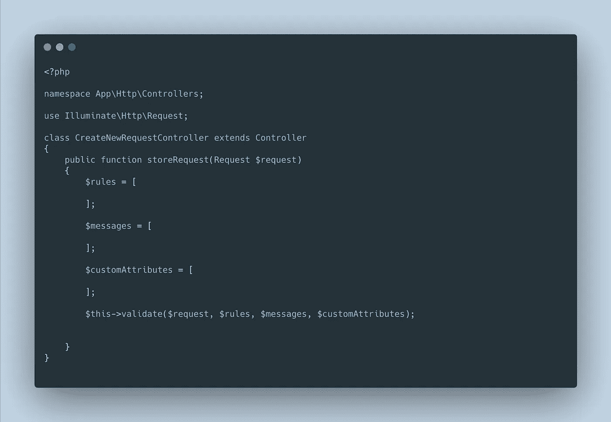
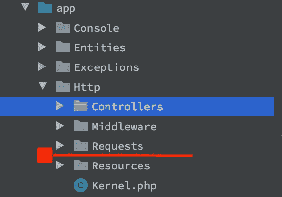
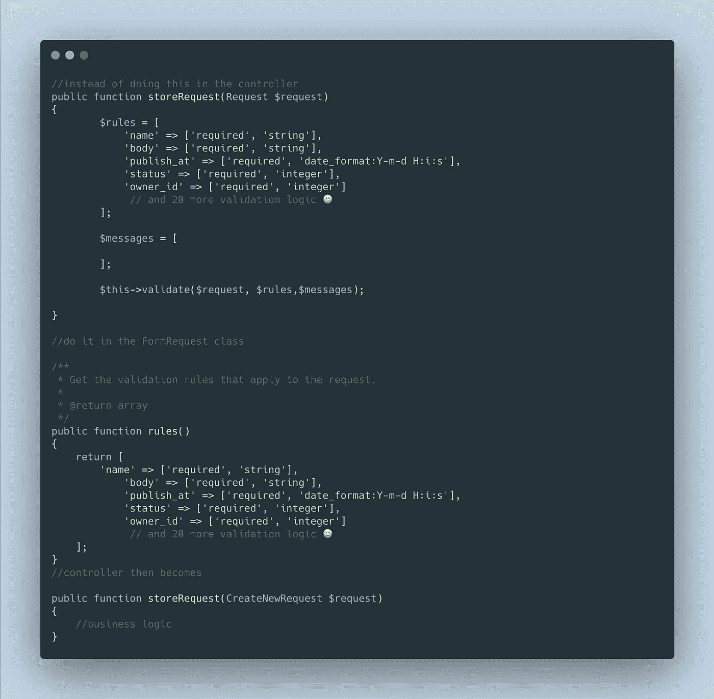

# 一个 Laravel 表单请求类，多个 HTTP 方法

> 原文：<https://blog.devgenius.io/one-laravel-form-request-class-multiple-http-methods-961740b7f630?source=collection_archive---------3----------------------->



Laravel 提供了开箱即用的请求验证，这使得在接收表单提交时验证用户输入变得更加容易。在这篇短文中，我将解释表单请求类、它的默认方法，以及如何利用这个表单请求来匹配多个 HTTP 方法。

只是指出一点，Laravel 还有一个验证工厂(Illuminate\Validation\Factory)类，在我看来，这个类比表单请求类更常被开发人员使用。

验证工厂类似乎是 Laravel 随控制器提供的默认验证方法，用户无需设置即可通过以下方式在控制器中访问该验证工厂:

> $this->validate($request，$rules，$messages，$customAttributes)。



$messages 和$customAttributes 数组是可选的，可以在没有它们的情况下调用该函数，如下所示:

> $this->validate($request，$rules)。

这种方法工作得很好，但是当验证逻辑增长时，通常建议将其移动到自己的类中，因此是表单请求类。

可以使用 Laravel 的 artisan 命令创建表单请求类:

> php artisan make:请求 RequestClassName

这个命令将在 Laravel 应用程序的 app\Http 目录中创建一个 Requests 文件夹，并使用创建 FormRequest 类时传递的类名创建一个 FormRequest 类，在我们的例子中是 requestClassName。



简单解释一下 FormRequest 类的内容，该类附带了两个方法:authorize 和 rules。

```
<?php

namespace App\Http\Requests;

use Illuminate\Foundation\Http\FormRequest;

class CreateNewRequest extends FormRequest
{
    */**
     * Determine if the user is authorized to make this request.
     *
     ** ***@return*** *bool
     */* public function authorize()
    {
        return false;
    }

    */**
     * Get the validation rules that apply to the request.
     *
     ** ***@return*** *array
     */* public function rules()
    {
        return [
            //
        ];
    }
}
```

authorize 方法检查用户是否被授权发出请求，因此这里的一个示例用例可以是一个博客系统，其中只有帖子创建者可以编辑他/她的帖子。假设博客帖子有一个 user_id 列，用于跟踪哪个用户发布了该帖子，那么 authorize 函数可以如下所示:

```
*/**
 * Determine if the user is authorized to make this request.
 *
 ** ***@return*** *bool
 */* public function authorize()
{
   return $blogPost->user_id === auth()->id();
}
```

因此，只有当博客帖子编辑请求是由博客帖子所有者发出时，它才返回 true，然后继续处理编辑请求，否则，它将返回 false，并向用户抛出一个异常，继续下一个方法。

rules 方法包含利用 FormRequest 类的任何表单的验证逻辑。

FormRequest 类可以注入到您希望 FormRequest 验证逻辑为真的任何方法中，这将清理您的控制器。



在解释了围绕可用的 validate 方法和用户创建的表单请求类的概念之后，让我转到本文旨在阐明的主要问题。

理想情况下，创建和更新模型的记录可能需要对模型的列进行不同的验证，举个例子，让我们继续使用 blog 类比。

要创建一个博客，我们可能会决定需要一个图像，博客文章名称是必需的，与博客文章内容相同，但是在更新文章时，博客文章图像不一定是必需的，它变成了一个可选的验证。

```
*/**
 * Get the validation rules that apply to the request.
 *
 ** ***@return*** *array
 */* public function rules()
{
    //blog post creation rules

    return [
        'name' => 'string | required',
        'content' => 'string | required',
        'image' => 'image | required'
    ];
}*/**
 * Get the validation rules that apply to the request.
 *
 ** ***@return*** *array
 */* public function rules()
{
    //blog post update rules

    return [
        'name' => 'string | required',
        'content' => 'string | required',
        'image' => 'image'
    ];
}
```

上面的两个规则是不同的，如果我想坚持表单请求类的验证方式，我可能必须创建更多的表单请求类，因为我对 POST、PUT、PATCH 和 DELETE 有不同的验证逻辑。要仅用一个表单类解决这个问题，可以编辑表单请求，使其更加通用，从而为不同的 HTTP 动词提供不同的规则。请参见下面的代码示例:

```
protected $rules = [

];*/**
 * Get the validation rules that apply to the request.
 *
 ** ***@return*** *array
 */* public function rules()
{
    $method = $this->method();
    if (null !== $this->get('_method', null)) {
        $method = $this->get('_method');
    }
    $this->offsetUnset('_method');
    switch ($method) {
        case 'DELETE':
        case 'GET':
                $this->rules = [];
            break;

        case 'POST':

            break;
        // in case of edit
        case 'PUT':
        case 'PATCH':

            break;
        default:
            break;
    }

    return $this->rules;
}
```

解释:

```
$method = $this->method();
```

上面的代码片段从请求对象中检索 HTTP 方法，并将其存储到变量$method，next 中。

```
if (null !== $this->get('_method', null)) {
        $method = $this->get('_method');
    }
```

知道 Laravel 有办法使用@method()指令屏蔽或更改原始请求方法后，代码会测试是否在请求对象中指定了一个方法，如果是，它会用它更新方法变量。

```
$this->offsetUnset('_method');
```

这从请求对象中删除了“_method”属性，这样我们就实现了发送到应用程序的 HTTP 请求的类型，然后可以为每种请求类型提供不同的规则。

```
switch ($method) {
        case 'DELETE':
                $this->rules = [ //rules here for delete request];
            break; case 'GET':
                $this->rules = [ //rules here for get request];
            break;

        case 'POST':
               $this->rules = [//rules here for post request];
            break; case 'PUT':
               $this->rules = [//rules here for put request];
            break;   

        case 'PATCH':
               $this->rules = [//rules here for patch request];
            break; default:
            break;
    }

    return $this->rules;
```

上面的 switch 语句用每个请求类型的适当验证逻辑更新规则数组，并帮助您将它们全部放在一个请求类中。

> 在推特上关注我:[https://twitter.com/drumzminister](https://twitter.com/drumzminister)