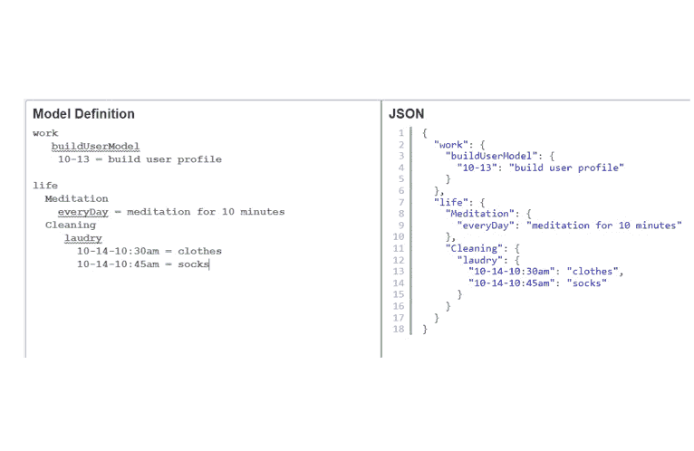

# 一个可能改变你一生的小习惯

> 原文：<https://blog.devgenius.io/one-little-small-habit-that-could-probably-change-your-life-380a9debad2a?source=collection_archive---------13----------------------->

***把你的计划放进 JSON***

如果你真的要评估你现在对生活的满意程度，你会给你的发现打多少分？你觉得你的健康处于最佳状态吗？你喜欢你的工作吗？你现在还过得去吗？也许有一个选择你一直想做，但还没有精力去做。你有没有什么事情是你希望自己能够做，但却后悔没有去做的？如果这些问题中的任何一个引起了你的共鸣，也许是时候进行一些自我反思了。

当我后悔的时候，我经常想起一首布鲁诺·马斯的老歌。名句戏；“虽然很痛，但我会第一个说我错了。哦，我知道我为我的错误道歉可能太晚了，但我只想让你知道”。这首歌描述了一个有遗憾的人，我想我们每个人都有遗憾，甚至我自己。

为了远离悔恨的刺痛，我决定为了一个更大的未来而改变生活的最好方法是写下我想要实现的目标。

**你可能想知道这个习惯对改善生活有什么帮助；**

有一个待办事项清单可以作为一个有目的的任务，原因有很多。首先，由于人类每天有大量的想法(大约 6000 个)，以有序的方式组织想法和任务对记忆东西特别有用。此外，当我们看到页面上的文字作为未来目标和任务的提醒时，一旦它们被草草记下或写下，就有更高的机会完成、执行和成功，因为在我们日常忙碌的混乱中，当我们努力工作的大脑处理新信息时，许多想法很容易与我们擦肩而过或被遗忘。

**更好..，多亏了 Json，我们可以制作一个非常灵活的待办事项列表！**

人们倾向于以不同的形式组织我们的待办事项列表。有些人用最简单的笔记记下事情。有些人使用纯文本编辑器工具，有些人使用待办事项应用程序(市场上有很多)。我都试过了，它们都有一些优点和缺点。直到最近，我使用 json 来规划我的生活，一切看起来都那么美好和容易。它不仅仅是我们作为开发人员用来存储、检索或传输数据的强大工具。它也可以成为集思广益、高效和有效地组织和执行目标和任务的有效工具。

**让我解释一下为什么(从非技术角度)**

**例如……我如何使用 Json**

以上是我如何使用 json 来计划一些日常活动的例子(工具可以在 [http://www.objgen.com/json 找到)。](http://www.objgen.com/json).)利用 JSON 固有的键值对特性。我用它来评估需要做什么，在什么时间框架内，子类别功能也可以用来改善列表制作的整体优化和日常生活的效率。(我可以插入我需要做的事情的类别，从而使在类别下添加或删除项目变得非常灵活)即使您要计划一个聚会或活动，一个孩子的生日聚会或一个结婚纪念日，一个周末聚会或一个工作会议，使用 JSON 进行规划可以使所有事情在整个规划阶段顺利有效地运行。

在生活中，我们被赋予了许多工具，如果有效利用，它们可以创造巨大的财富。例如，如果使用正确，计算机可以通过学习和处理数据来创造学习、成长和取得成就的机会。传统的纸笔也是如此。当我们写下事情的时候，那些曾经被锁在我们潜意识和意识之间的想法会浮现出来，并在我们写下的文字中获得生命。正如计算机可以成为一种有用的学习设备一样，通过 JSON 等工具进行的数字组织提供了清理我们的时间表并专注于对我们真正重要的任务的机会。列出对我们来说真正重要的事情，让我们有机会在繁忙的生活中最重要的事情上取得成功。