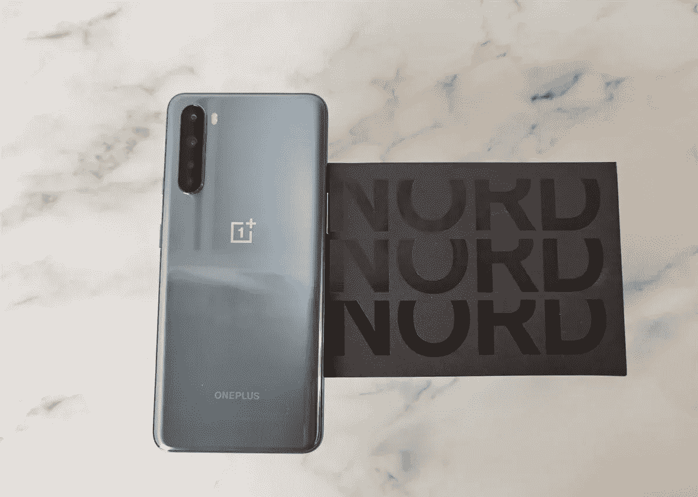
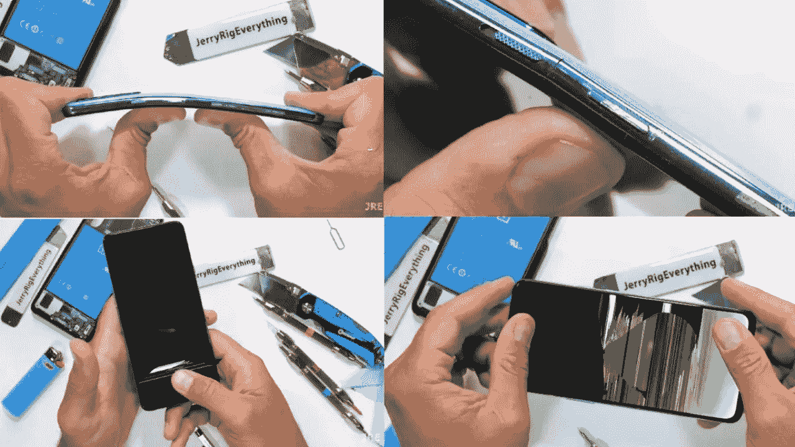
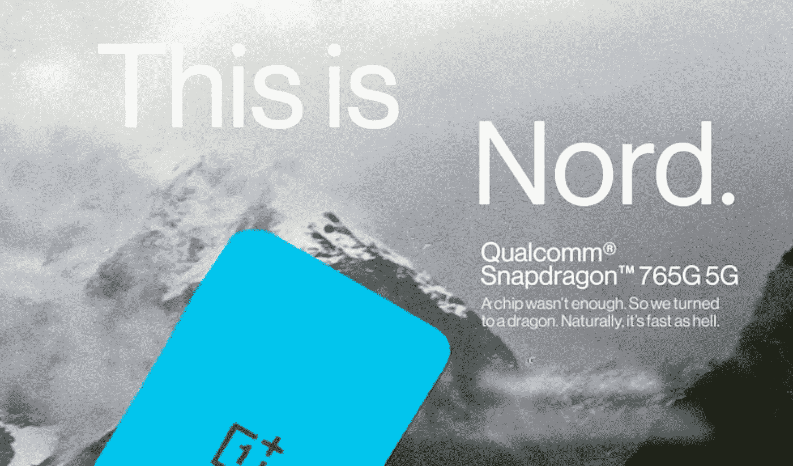
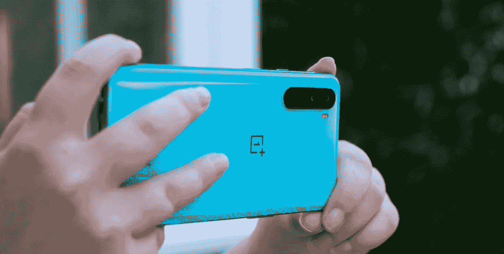

# 一加·诺德:这款手机你不应该买！

> 原文：<https://blog.devgenius.io/oneplus-nord-the-phone-you-should-not-buy-9f57aead6cf0?source=collection_archive---------5----------------------->

## 一加再造一加 X 的失败尝试

鸣谢:XDA 开发者

我 不得不承认，从第一天起，一加就真的擅长一件事；显然，这是营销和过度宣传他们的产品。备受期待的一加·诺德也是如此。它被过分夸大了；人们甚至在没有看到或不知道其规格的情况下就预订了一加诺德。我想，每个人都在盲目预购辐射 76 后吸取了教训。话又说回来，我有什么资格评判他们呢？但我可以清楚地判断一加北部的所有缺陷；这就把它归入了你不应该投资的智能手机类别。

## **弯曲门回来了！**

信用:JerryRigsEverything

一加诺德的主要卖点之一显然是极其平滑的 90Hz AMOLED 显示屏，它应该能够为大多数人提供令人惊叹的观看体验。此外，在这个价格范围内，很难找到刷新率高于 60Hz 的 AMOLED 显示器。与同价位的大多数同类产品相比，这使得一加诺德成为一款相当独特的智能手机。但是，似乎更低的价格带来了更大的妥协。

> 90Hz AMOLED 在这个价位上很棒，但值得冒这个险吗？

最近，在专门测试智能手机耐用性的 YouTube 频道 JeeryRigsEverything 中，杰里发现一加诺德并没有那么耐用，没有通过弯曲测试。它不仅没有通过弯曲测试，而且 AMOLED 显示屏会立即破裂，导致整个一加诺德几乎毫无用处。看到这一点后，我显然不会向任何人推荐一加诺德。

## **其实并不快的龙**

信用:一加

更新的骁龙 765G 是一款不错的芯片，但是没有一加宣传的那么快。一加诺德的 6GB 内存和 64GB ROM 基本版本将在 8 月份以低至 330 美元的价格上市。但是，在同样的价格范围内，小米已经在销售其去年的旗舰杀手 K20 Pro，配有骁龙 855。就性能而言，骁龙 765G 远不及骁龙 855。让我们不要忘记更便宜的联发科，这些天他们给了骁龙一个机会。因此，对于任何迫切需要原始性能或在大多数游戏中达到辉煌的 60 FPS 的人来说；Nord 对你来说可能不是最好的选择。

> *诺德忘了联发科芯片组和更便宜的骁龙 855 智能手机*

但是有人可能会争论 5G 在一加北部和骁龙 765G 的可用性；如果你非常担心具有 5G 连接功能面向未来的智能手机，那么你可能不需要看得更远。因为 Oppo 的另一个子品牌 Realme X50 5G 提供了与 Nord 相同的规格，但比它的表弟便宜近 100 美元。从外观上看，几个月内你可能会在大多数低于 250 美元的智能手机中找到骁龙 765G。因此，使一加北部成为一个非常糟糕的选择。

## **后面只有一只好眼睛**

鸣谢:安卓权威

T 智能手机的相机细分市场已经达到了这样一个地步，目前大多数可用的 Quad-Bayer 相机传感器都能够在白天捕捉同样好的图像。他们确实倾向于在夜间挣扎，但越来越多的品牌在他们的智能手机上安装了夜间模式来解决这个问题。话虽如此，当你将 Nord 的主摄像头与其他中端智能手机上的 48 MP 摄像头放在一起时，它并没有太多特别之处。唯一让它与众不同的是 OIS，这是一个罕见的中端功能，它肯定有助于视频稳定性。但是，也就这样了。对其相机的赞美也就到此为止了。

> *如果你想要顶级相机*多功能*和高质量，看看别的地方*

Nord 可能拥有你能在任何中端智能手机上找到的最好的一对自拍相机，但在背面却是另一番景象。除了它的主要相机，超宽相机是一种典型的相机，你可以在几乎所有的中端相机中找到它。让我们不要再深入到无用的微距和深度感应相机中。总而言之，这款相机很一般，与其他几款相机相比，会有很大的不足。

我显然不讨厌一加·诺德。从纸面上看，这实际上是一部不错的智能手机。但是，当我比较智能手机的利弊时，我很难向任何人推荐它。每个主要的智能手机制造商都有一个不可告人的秘密，似乎北欧可能是一加的。