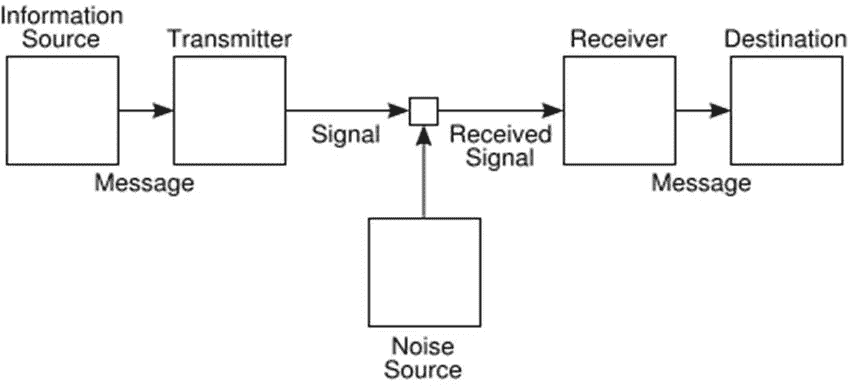
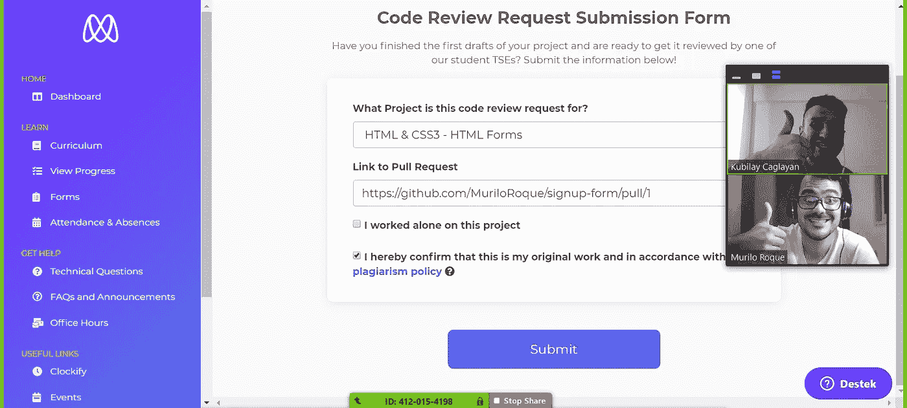
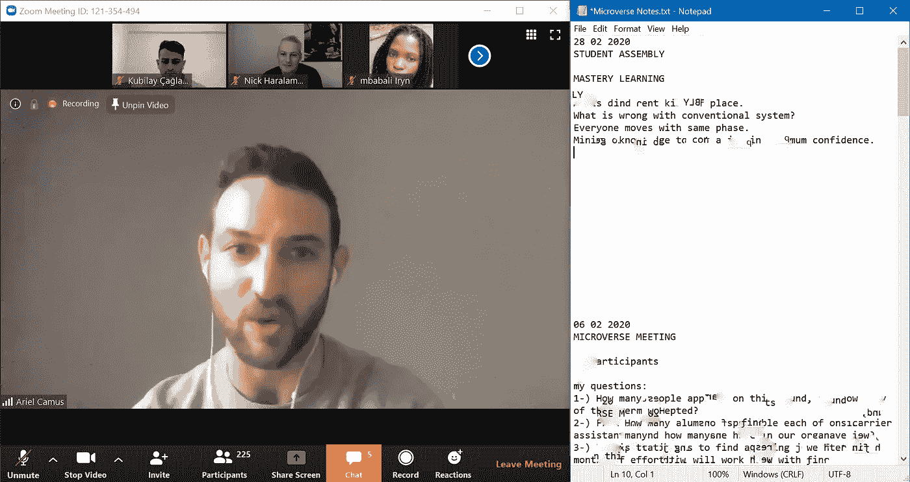

# 如今的在线学习

> 原文：<https://blog.devgenius.io/online-learning-nowadays-a03cc1987833?source=collection_archive---------13----------------------->

从**我参加世界上最好的现代学校之一**到现在已经 5 个月了，从我积极开始学习软件开发到现在已经一年多了。

从那以后，我参加了这些活动:

1.  Udemy Python 课程(50 小时，付费，老师)
2.  SQL 课程(120 小时，带薪，教师)辍学
3.  前端训练营(60 小时，免费，教师)辍学
4.  微 verse (1500 多个小时，带薪，无教师)

> 教育就是把我们唯一能从一个人身上转移到另一个人身上的东西，也就是“信息”，转移到另一个人身上。

在这篇文章中，我将分享我的经历，然后我会告诉你为什么 Microverse 的教育系统可能是同类中最好的。

# 训练营和传统课程

你一定注意到了“辍学”标签！是的，我不能带他们超过几个小时。原因如下…

SQL 课程是付费的，来自一个有声望的协会，有一个经验丰富的老师。

训练营给了老师讲课的机会，而且在一系列面试后是免费的。

那么是什么问题呢？几件事，从**时间管理**开始。从预先安排好的时间开始，然后在预先安排好的时间完成，应该不难，对吧？但现实是不同的，有 15 分钟的延迟，并谈论我们应该在讲座期间休息，等等…

在你有老师的情况下，你一定对**课程**非常好奇和质疑。因为你不喜欢迷失在叙述者的白日梦里。是的，它发生了。教育工作者对他们如何实施课程毫无头绪，这种情况并不少见。

我学习课程内容的努力仍然没有实现。这让我想到，我们正在学习的课程，实际上是一种即兴的行为。

啊？除非老师在他/她的领域是最好的，否则这是不被认可的。

向老师上课的另一个非常重要的缺点是，你会有一个过滤过的现实。想象你一路走到了未来，成为了一名教师，想象你不打算告诉你的学生的事情。这是你头脑中的个人过滤器，是人类心理的一个非常自然的过程。但它扼杀了多功能性。只有当你幸运的时候它才会杀死你，大多数时候它做的远不止这些。

通用通信系统的示意图([通信的数学理论](http://people.math.harvard.edu/~ctm/home/text/others/shannon/entropy/entropy.pdf)

老师在你和信息来源之间架起了一座桥梁。如果您可以通过一个好的路线图自己找到源代码，这是不必要的。根据香农的理论，每一个转移过程都有扭曲效应。老师会为你的信息传递增加更多的站点(目的地)。它允许失真。

讲课的时候提问也是流量的杀手锏。**在精心准备的课程中，没有提问的余地。但是在拥挤的教室里，有许多来自不同背景的人。太多问题了。让他们以同样的速度前进几乎是不可能的。这也为某人不理解题目时的焦虑制造了理由。虽然有问题没有错，但是系统不允许你得到答案。**

此外，不好笑的笑话，政治讽刺，当地的故事，以及讲座中许多分散注意力的点，使其效率低下。

那么，该怎么办呢？相信我，当你问一个问题时，不管它有多高的熵，你不是第一个问这个问题的人。

# **微宇宙**

Microverse 是一所网校。我们以前听过很多，但这是一种更为流行的形式。

当我第一次选择成为这所学校的学生时，我真的无法想象它如此适合我的学习口味。

首先，我没有老师。当我说我没有老师的时候，我的意思是我有很多老师。如果老师能教我我需要的东西，那么我有上百个老师。

> 当我不是只有一个活生生的**信息**来源而是这么多的时候，我感觉到了**信息**生动、动态、无处不在的潜力。这使我处于一种攻击模式，从最好的来源获取它。

这是我的老师名单:

1.  我的编码伙伴
    他们总是知道一些我不知道的事情。他们多大不重要，他们是谁不重要。
2.  我的导师我的导师是一个比我更有经验的高年级学生，他总是在那里打破我的障碍。
3.  我的单口相声团队
    和我的同龄人一样，以相似的速度前进。当我们每天开会时，分享阻碍和每天的成就教会了我很多。
4.  我的老编码伙伴
    令人难以置信的是，看到不同的人可以走不同的路，即使他们走着相同的路线图。因此，在我的旧宝箱里，总有一份好的、更新的礼物送给我。
5.  我，我自己
    我是我每天进步的主要动力。我看着我的神圣之路，走向下一站。我在读，在看，在说，在创造，在失败，在尝试。

> 学习就是不能再生动了，煽动。在某种程度上，让你处于无可辩驳的行动中，去得到你应该得到的，去做你应该做的。没有被动倾听。没有一成不变的心态。这是一个信息池，分布均匀，路线图清晰，学生每天都在路上行走和进步。

我有**个源文档**要阅读和学习。在我和信息来源之间没有传输器。

由于每个日志都被监控，所以没有灵活的**时间管理**的机会。

你认识了许多来自世界各地的人，这最终教会了你**如何沟通和合作。**

应用了结构良好的课程。有了技术课程、专业技能课程以及算法和数据结构课程，学生们已经为他们真正需要的东西做好了充分的准备。

基于志愿者的指导对于解决软件开发领域的障碍非常有效。

此外，只有获得技术支持工程师对您的项目的批准，才可能通过该计划。万一你失败了，你会得到深入的反馈。

**由此可见，我们古代教育体系的大部分不足之处都被微服修补了。**

随着变化的速度越来越快，在接下来的几年里，学习将是一个真正的挑战。Microverse 肯定会成为这一领域真正重要的推动者。

有时，我听到人们称 Microverse 是一个“训练营”。
这是不正确的。但是我也不能用我们的常规词汇来定义它。

我能说的最好的是，我认为， **Microverse 是一所在线的现代学校，有这么多精心制作的功能来帮助任何人成为全栈软件开发人员。** **奇点临近，微宇宙是伟大的加速器。**

欢迎随时联系我，可以提问，也可以在评论区分享你的想法。

[访问我的网站](https://kubilaycaglayan.com/)
[访问我的学校](https://www.microverse.org/)

从项目的第一周开始，我和我的第一个编码伙伴。

当 Ariel 在我们每月一次的学生大会上讲话时，我正在做笔记。