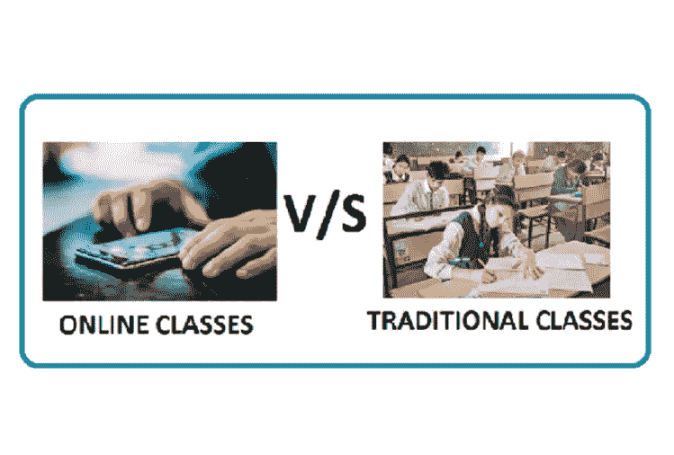

# 线上与线下课堂:持续的争论

> 原文：<https://blog.devgenius.io/online-vs-offline-classes-the-ongoing-debate-3ff6a6b8d806?source=collection_archive---------6----------------------->

***这取决于国家和感染率。***

在世界各地，许多国家都在争论这些课程是否应该是面对面的。我住的地方也一样。但是，如果我告诉你，它应该着眼于整个人口，感染率和死亡率。在这里，我将从我的国家给你做一个比较。

自从我的国家在 2020 年 6 月真正开放以来，有很多关于是否所有的课程都应该面对面进行的辩论。但是，线下课堂在教育部变得很明显，几乎在所有大学都变得很明显。然而，当高等教育委员会与面授课程的指导方针交织在一起时，情况发生了变化。但是很明显，只有医学、兽医、药学和一些工程类的应用课程可以离线进行，包括考试。大多数人都松了一口气，辩论也慢了下来。

***直到教育工会和一名新闻主播积极为开放学校辩护，***

他们试图用包括冰岛在内的其他国家所做的各种教育研究和最近的医学研究来支持他们的观点。在他们的教育研究中，他们告诉我们，如果学生不上学超过一年，而不考虑国家的发展水平和冠状病毒的情况，他们会损失一年多的时间。在医疗方面，他们谈到了巴伐利亚健康委员会和法国儿科学会关于儿童感染他人程度的研究。这些研究的结论是，儿童的感染率很低，学校应该继续开放。

因此，绝对存在信息过载和污染，环境不会被添加到他们的分析中。作为一名在大学学习的学生，由于密集的交通，人们很容易相互传染，我支持远程学习，因为它在我的家乡地区传播。

关于这一巨大的时间，我的建议是，如果在开放学校方面有太多的困惑，请查看冠状病毒的统计数据，以做出具体的决策。它们真的有助于保护你自己，保持安全，不要惊慌。

你认为开放学校怎么样？你在隔离期间经历过困惑吗？请在下面的评论区分享你的经历。