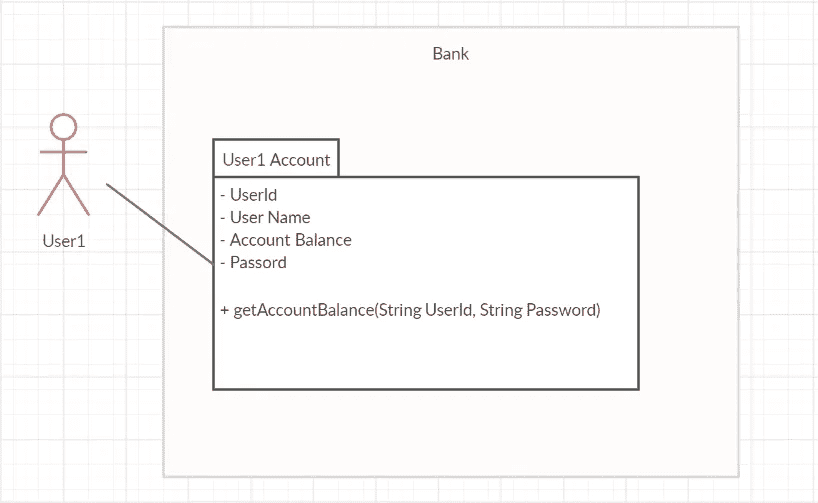
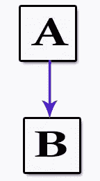
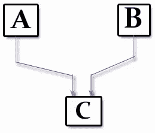
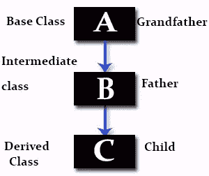

# OOP 及其 PILLER 的

> 原文：<https://blog.devgenius.io/oop-and-its-pillers-b47e89d8069f?source=collection_archive---------37----------------------->

面向对象程序设计及其基础/Pillers。

[DDP](https://unsplash.com/@moino007?utm_source=medium&utm_medium=referral) 在 [Unsplash](https://unsplash.com?utm_source=medium&utm_medium=referral) 上拍照

> 根深了，就没理由怕风了。

面向对象编程(OOP)是一种编程范式(标准、模式)，它基于一组“**对象**”。对象由数据(也称为属性)和操作对象数据的方法组成。
一个**对象是基于类的**，这意味着该对象是类的实例，这也决定了它们的类型(数据类型)。

**什么是阶级？**

“类是对象的模板/蓝图。它定义了对象行为(以类方法的形式)和对象属性(以属性或类数据成员的形式)”。

作为开发人员，我们都想开发/构建软件。所以一个软件系统可能由成千上万个相互交互的类组成。
为了处理太多的类是非常困难的，为了消除这一点，我们需要一些技巧，以便我们可以很好地组织或系统地管理。为了管理如此多的类并降低复杂性，系统设计人员使用了几种技术，这些技术可以归为四个主要概念

**1-封装**

**2-抽象**

**3-继承**

**4-多态性**

这些概念是 OOP 的四个主要基础，用软件术语来说，它们被称为面向对象编程(OOP)。

明白了吗？[🤔](https://emojipedia.org/thinking-face/)当然，是的[😉](https://emojipedia.org/winking-face/)

太好了[👍](https://emojipedia.org/thumbs-up/)，现在我们用例子来详细说一下每一个。

# **1-封装:**

*把(某物)封装起来*

*封装实际上不仅仅是一种“数据隐藏”,而是关于“数据隐藏”的意思，它用于隐藏类中结构化数据对象的值或状态，防止未授权方直接访问它们。
**或**
封装是当你对其他类隐藏你的类内部数据和所有其他实现细节/机制。

我们可以通过将数据封装在一个叫做类的单元中，并使用**访问说明符**(一种限制对对象成员访问的语言特性，即:公共、私有和受保护成员)来实现封装。所以这是一种限制访问类的某些属性或组件的方法。*

*在现实生活中，假设你在银行有一个账户。[🏦](https://emojipedia.org/bank/)银行软件将您的所有信息组合成一个包/类(用户标识、姓名、密码、账户余额等)。如果你的余额变量在银行软件中被声明为公共变量怎么办？[🤔](https://emojipedia.org/thinking-face/)你的账户余额将被公开，在这种情况下，任何人都可以知道你的账户余额。那么，你喜欢吗？显然没有[🙅‍♂️](https://emojipedia.org/man-gesturing-no/) 所以，为了保证你账户的安全，他们声明 balance variable 为 private，这样任何人都看不到你的账户余额。合格的个人只能通过该类中定义的方法查看他的余额，该方法将要求帐户持有人名称或用户 Id 和密码进行身份验证。*

**

***👉因此，我们也可以通过利用数据隐藏的概念来实现安全性。这叫做封装。***

# *2-抽象:*

*它指的是只向用户显示必要的特征，隐藏与用户无关的细节。它被用来简单地描述事物。*

*让我们再来谈谈银行的例子，假设你在银行有一个账户，你想给你的朋友转账 X 元，你只需在手机上开个账户，然后把钱转到各自的账户上，就这样。[🤑](https://emojipedia.org/money-mouth-face/)但是在这整个过程中，你不知道银行软件是如何处理所有转账的机制的。例如，软件如何验证您的帐户余额，出于安全目的发送金额时的加密过程等。这就是抽象。*

**

*在 Java 中，垃圾收集也是解释抽象的最好例子。作为一个 java 程序员，GC 是完全抽象的，作为一个语言设计者，你需要理解 JVM 的内部细节。*

# ***3-继承:***

*一个类可以继承它的父类的实现，同时也可以扩展或改变它的一部分，当类有很多共同点时，这允许代码的重用。继承的目的是功能的可重用性。*

*它指的是在子类中改变(继承)超类的结构和行为。*

*基于范例和特定的语言，有各种类型的继承。很少有人在下面*

**

## *1-单一继承*

*子类继承一个超类的特征。一个类获取另一个类的属性。*

**

## *2-多重继承*

*一个类可以有多个超类，并继承所有父类的特性。C++、Common Lisp 和一些其他语言支持多重继承，而 java 由于**钻石问题**不支持多重继承。*

**

## ***三级遗传***

**一个子类从另一个子类继承而来。**

# *4-多态性:*

*这是一个名字可以有多种形式的概念，当我们有许多通过继承彼此相关的类时，就会出现这种情况。继承让我们从其他类继承方法和属性。*

*在现实世界中，你使用智能手机[📱](https://emojipedia.org/mobile-phone/)用于交流。你选择的交流方式可以是任何方式，可以是电话，短信，图片信息，或者通过电子邮件。目的或目标是共同的，那就是交流。但是方法不同。*

**

*-可以通过两种方式实现:*

1.  *静态多态性(编译时，早期绑定)*
2.  *动态多态性(运行时，后期绑定)*

## ***静态多态性:***

*这可以通过**方法重载来实现，**其中多个方法使用不同的参数或签名共享相同的名称，并具有不同的返回类型。*

## ***动态多态性:***

*这可以通过**方法覆盖来实现，**通过子类的方法覆盖超类的方法。*

*现在轮到你了！如果你学到了至少一件事&如果你觉得内容值得分享。😊提供反馈、评论或开始讨论。✍️可以随时改正错误。[🐛](https://emojipedia.org/bug/)*

# *[😀](https://emojipedia.org/grinning-face/)干杯！！*