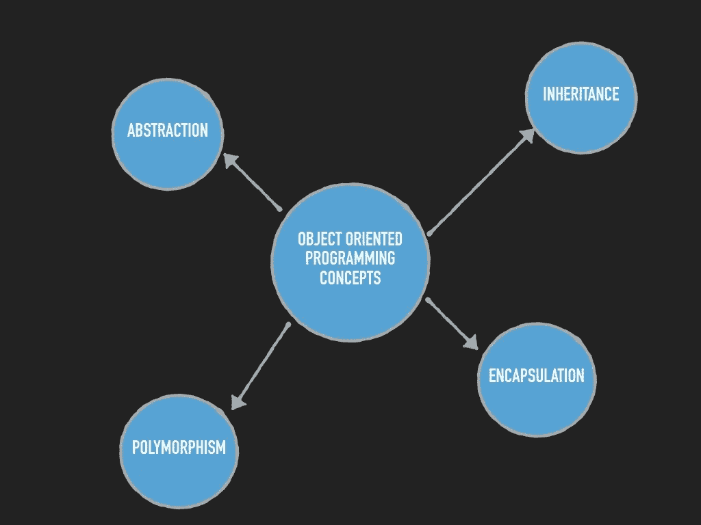

# 面向对象编程现在是计算机科学的基础

> 原文：<https://blog.devgenius.io/oop-is-now-the-basis-of-computer-science-2fbb0a8dfe2c?source=collection_archive---------0----------------------->

查尔斯·德鲁维奥在 [Unsplash](https://unsplash.com?utm_source=medium&utm_medium=referral) 上拍摄的照片

今天，面向对象编程是计算机科学的基础。

简单地说，我想用一个例子来解释它。

首先想到**为什么我们都在做编程？**而回答这个问题是为了解决现实生活中的问题，为了节省人力和时间。

所以，想象一下，你是一名工人，有责任在 ATM 机中添加现金。

所以，你需要应用一些逻辑，你需要在那里保留多少张 500，2000 或 100 的钞票，这样取款人的需求就完全满足了。

这就是面向对象编程的方法。

把自己想象成这个现实世界中的一个物体。所以你有一些特征，比如身高，体重等等。你参与解决现实世界的问题。

在 OOP 中，对象由它的数据、行为和相关的函数来表示。

简单而常见的例子是**苹果是类水果的对象，具有颜色红、味道甜等特点。**

OOP 概念包括两个基本术语:类和对象。

例如 C 语言采用过程化方法，程序将在程序员编写的流程中执行。

但是，使用 C++或 java 语言，您可以将问题分为类和对象方法，并使用面向对象编程的函数和其他功能来解决。

现在为了解决现实生活中的复杂问题，面向对象编程它向用户提供了以下特性:

面向对象的程序设计(Object Oriented Programming)

## 1-数据抽象

只显示基本细节，隐藏其他细节，比如当你打开开关时，你只需按下按钮，但你不知道里面的线路和连接。

## 2-继承

当一个类可以继承基类或父类的特性时。

## 3-多态性

它是一个物体呈现多种形态的能力。

在 OOP 中,**多态性**最常见的用法是当一个父类引用被用来引用一个子类对象时。

## 4-数据封装

将数据和功能打包成一个单元。

## 5-模块化

我们将程序分成小单元以降低复杂程度，并根据程序员的需要反复使用这些模块。

# 结论:

许多开发人员出于多种原因批评面向对象编程模型。

最大的担忧是 OOP 过分强调软件开发的数据部分，而对计算或算法关注不够。

此外，OOP 代码可能更复杂，编译时间也更长。

面向对象的替代方法包括:

*   函数式编程
*   结构化程序设计
*   命令式编程

大多数高级编程语言为开发人员提供了组合这些模型的选项。

**如果你觉得这个有用，点击那个**👏**按钮:)**

**奖励:**

即使是糟糕的代码也能运行。但是如果代码不干净，它会使开发组织陷入困境。

每年，都有无数的时间和大量的资源因为糟糕的代码而被浪费。但不一定非要这样。

著名的软件专家 Robert C. Martin 用 ***干净代码展示了一个革命性的范例:敏捷软件技术手册*** 。

Martin 和他在 Object Mentor 的同事们合作，将他们在运行中清理代码的最佳敏捷实践提炼成一本书，这本书将向你灌输软件工匠的价值观，并使你成为一名更好的程序员，但前提是你必须为此努力。

使用以下链接获取您的副本:

[干净的代码:敏捷软件技术手册](https://amzn.to/3nTuUu6)

一些您可能感兴趣的相关文章:

[有史以来最好的 1- 6 名程序员](https://selcote.com/2020/10/27/6-best-programmers-of-all-time/)

[2-未来编程最有前途的领域](https://selcote.com/2020/10/22/the-most-promising-fields-for-programming-in-the-future/)

[3-Web 开发中最常用的 5 种语言](https://selcote.com/2020/10/20/the-5-most-used-languages-for-web-development/)

[4-提高编程技能水平的最佳方法](https://selcote.com/2020/10/16/the-best-way-to-improve-your-programming-skill-level/)

[5-推荐初学者先学的编程语言](https://selcote.com/2020/10/13/recommended-programming-language-for-beginner-to-learn-first/)

[6-不要慌这是学习编程的最好方法](https://selcote.com/2020/10/12/dont-panic-this-is-the-best-way-to-learn-programming/)

7- 4 个很棒的 YouTube 频道，这会提高你的编程技能

学习如何编程永远不会太晚

我希望在开始编程时就知道的最好的建议

与我联系:[博客](https://selcote.com/)， [Youtube](https://www.youtube.com/channel/UCU_LhClyNOtEQw7R0q9ovoQ?view_as=subscriber) ，[脸书](https://www.facebook.com/zelakioui)，[推特](https://twitter.com/zelakioui)

来源:[selcote.com](https://selcote.com/2020/11/03/oop-is-now-the-basis-of-computer-science/)