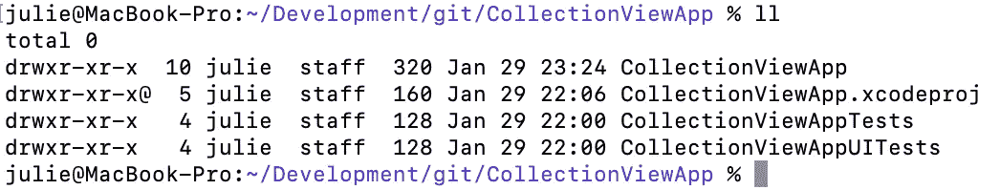
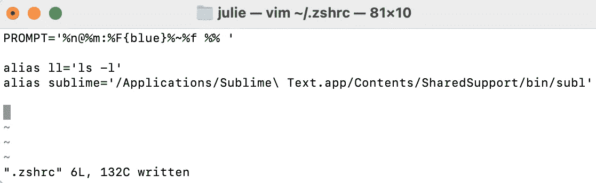

# 从终端打开任何应用程序

> 原文：<https://blog.devgenius.io/open-any-application-from-the-terminal-d8b14db8d3e9?source=collection_archive---------0----------------------->

## 使用别名创建快捷方式

照片由 [Clement Helardot](https://unsplash.com/photos/95YRwf6CNw8) 在 [Unsplash](https://unsplash.com/photos/95YRwf6CNw8) 上拍摄

作为一名程序员，你可能总是在寻找捷径和方法来使工作流更加高效。终端很可能已经为编译、导航目录和使用 git 等任务打开了。为什么不用终端打开常用的应用程序呢？

本文将介绍如何通过在打开终端时调用的中央启动脚本中定义别名来创建应用程序快捷方式。按照以下步骤从终端定制运行任何应用程序。

# 别名

别名允许用户将命令与自定义名称相关联。别名可用于创建复杂命令的快捷方式或缩短磁盘上的路径。

例如，可以创建一个别名来调用命令`ls -al`，该命令以长格式列出所有文件。以下示例将该命令分配给快捷键`ll`。

`> alias ll="ls-al"`

一旦在环境中声明了这个别名，就可以通过运行`ll`以长格式列出目录的内容。

别名示例

别名可用于识别在磁盘上启动应用程序的快捷方式。例如，假设应用程序 Sublime 是一个常见的文本编辑器，它位于以下位置:

`/Applications/Sublime Text.app/SharedSupport/bin/subl`

每当需要启动 Sublime 时，不要写出这么长的路径，您可以通过如下声明别名来创建一个快捷方式:

`alias sublime="/Applications/Sublime\Text.app/SharedSupport/bin/subl"`

现在我们已经了解了如何使用别名创建快捷方式，让我们将它添加到环境中，以便快捷方式在任何终端上都是持久的，无论用户何时注销和重新登录！

# 将别名添加到启动脚本中

别名需要添加到启动脚本中，这取决于系统的默认 shell 类型。可以通过在终端中运行以下命令来确定默认 shell:

`> echo $SHELL`

# zsh

如果返回`/bin/zsh`，默认 shell 是`Z-Shell`。`Z-Shell`的启动脚本位于`~/.zshrc`中。如果该文件不存在，则需要在终端中运行以下命令来创建它:

`> touch ~/.zshrc`

# 尝试

如果缺省 shell 是 bash，启动脚本驻留在`~/.bashrc`中。如果该文件尚不存在，请运行以下命令创建它:

`> touch ~/.bashrc`

# 将别名添加到脚本中

既然已经创建了启动脚本文件，使用 vim、nedit 或任何其他文本编辑器打开这个文件。如果你通过 Finder 访问文件，你需要输入`Cmd + Shift + .`来显示隐藏的文件。

下面是一个示例`.zshrc`文件，它包含列出文件细节和启动 sublime 的别名。

~/.zshrc 示例

保存文件并重新打开终端。Sublime 现在可以从终端中的任何目录启动，只需运行:

`> sublime`

# 结论

别名可用于为任何类型的命令创建快捷方式。下次您发现自己在终端中重复编写冗长的命令或路径时，可以考虑创建一个别名。不必键入冗长的命令将节省时间，并允许您将精力转移到更令人兴奋的事情上，如编码！