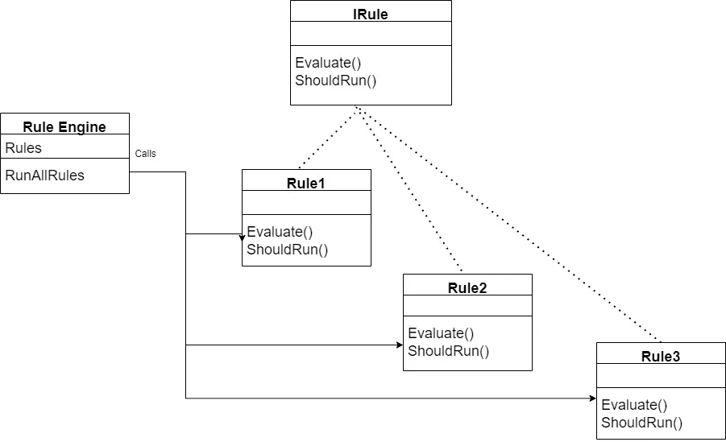
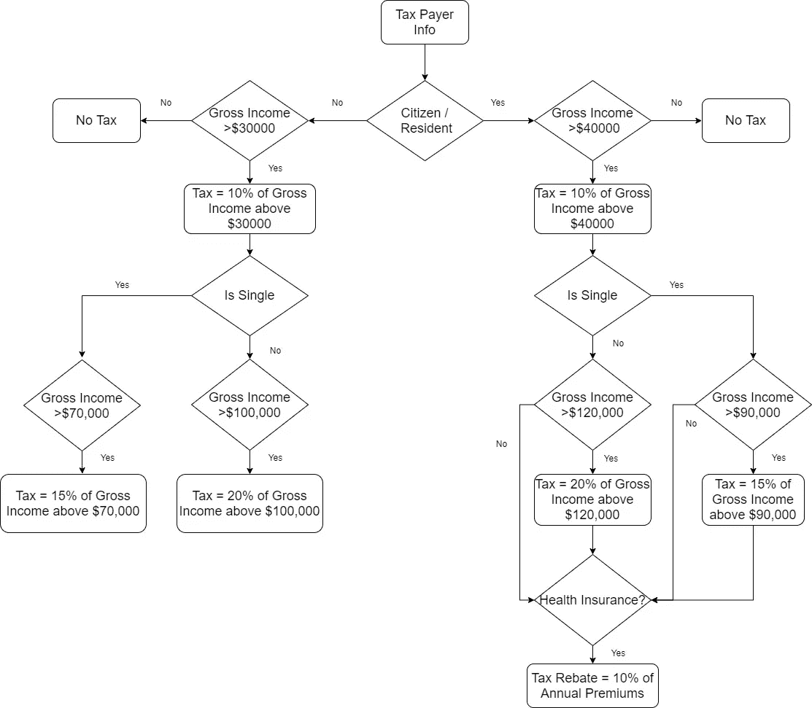
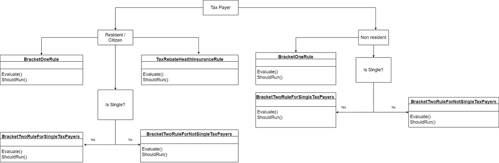

# 开闭原则和规则引擎设计模式

> 原文：<https://blog.devgenius.io/open-closed-principle-and-rule-engine-design-pattern-904c784501e5?source=collection_archive---------0----------------------->

尊重隐私。

蒂姆·莫斯霍尔德在 [Unsplash](https://unsplash.com?utm_source=medium&utm_medium=referral) 上的照片

[坚实](https://en.wikipedia.org/wiki/SOLID)原则是美国软件工程师兼讲师[罗伯特·C·马丁，也就是众所周知的](https://en.wikipedia.org/wiki/Robert_C._Martin)[罗伯特叔叔](https://en.wikipedia.org/wiki/Robert_C._Martin)提出的众多原则中的一部分在这篇文章中，我将谈论 [S **{O}** LID](https://en.wikipedia.org/wiki/SOLID) 原则之一，即[开闭原则(OCP)](https://en.wikipedia.org/wiki/Open%E2%80%93closed_principle) 。

我会用 C#来演示代码，但是 OCP 是语言不可知的。

**OCP 的官方定义是:**

> *软件实体(类、模块、功能等。)应该对扩展开放，但对修改关闭*

# OCP 的好处

OCP 推荐了一些使软件升级变得容易的方法。想象一个用例，WhatsApp 想要扩展聊天服务，向脸书信使发送消息。

开发人员希望重用聊天服务的相关组件。做这件事有两种方法。

1.  修改现有的聊天服务，以支持新的要求。它会将聊天服务代码暴露给 bug。聊天服务的复杂性将会增加，自动化测试用例可能会失败。
2.  使用相关组件扩展聊天服务代码。为支持新特性而编写的代码将采用新类的形式，但将受益于聊天服务的核心功能。这种方法的好处是可以独立地部署和测试新功能。

规则引擎设计模式是服从 OCP 的许多方式之一。许多其他设计模式允许我们遵循 OCP，但是我将本次会议限制在规则引擎设计模式，这是展示 OCP 威力的最简单的方法之一。

# 规则引擎

帮助开发人员遵循 OCP 的流行设计模式之一是规则引擎设计模式。用多个复杂的业务规则处理同一个实体来开发软件应用程序是一种有效的设计模式。

业务规则可能是相互关联且复杂的。可能会涉及许多复杂的分支和条件逻辑。遵循 OCP 将使开发人员能够独立添加、删除或禁用业务结果。

规则引擎有两个组件:

1.  规则引擎—对实体执行所有规则以产生结果的引擎。
2.  业务规则—规则定义处理逻辑或条件。

# 税收计算器

让我们尝试为一个税收计算器应用程序实现规则引擎设计模式。纳税计算是一个复杂的过程，取决于许多因素，如年龄、总收入、居民身份等。
很多业务规则评估这些因素来确定税额。政府政策驱动着这些商业规则，并且可以频繁地改变它们。在这个用例中，我将使用规则引擎设计模式来保持这些业务规则的独立性。

## 实现规则引擎设计模式的步骤

完整的代码可以在 https://github.com/tarunbhatt9784/TaxCalculator.git 的[找到](https://github.com/tarunbhatt9784/TaxCalculator.git)

**第一步——将所有规则写在一个地方**

使用 if-then-else 条件语句在一个方法中编写所有规则。

**第二步:** **为每个规则创建类。**

为每个规则创建单独的类。在每个类文件中添加一个 ShouldRun()方法，以确定是否必须执行业务规则。

每个类都有两个方法— Evaluate()和 ShouldRun()。

因此，我们可以创建一个接口，让所有这些规则特定的类实现这个接口。让我们将这个接口命名为 ITaxCalculatorRule。

**第三步:** **创建规则引擎**

一旦我们有了接口形式的每个规则的契约和具体的规则类，就该在规则引擎的帮助下处理它们了。规则引擎将负责评估这些规则。这是一个两步的过程:

*   查找规则接口的所有实现— ITaxCalculatorRule

*   检查每个规则的 ShouldRun()，如果它返回 true，运行 Evaluate()方法

完整的代码可以在[https://github.com/tarunbhatt9784/TaxCalculator.git](https://github.com/tarunbhatt9784/TaxCalculator.git)找到

## 结论

让我们总结并重申一下使用规则引擎设计模式的优势

1.  业务规则的独立可测试性
2.  规则引擎不需要随着每个业务规则的添加或删除而改变。
3.  可以单独启用或禁用业务规则，而无需更改其他规则或规则引擎

谢谢

> 页（page 的缩写）s-Medium 是一个阅读、写作和向其他作者学习的绝佳平台。如果你想加入我的旅程，今天就加入 [medium](https://tarunbhatt9784.medium.com/membership) 。

# 词汇表

[开闭原则—维基百科](https://en.wikipedia.org/wiki/Open%E2%80%93closed_principle)

[开闭原则——维基百科](https://en.wikipedia.org/wiki/Open%E2%80%93closed_principle)

[固—百科](https://en.wikipedia.org/wiki/SOLID)

罗伯特·c·马丁——维基百科

[c#开发人员的坚实原则| Pluralsight](https://app.pluralsight.com/library/courses/csharp-solid-principles/table-of-contents)

[C#设计模式:规则引擎模式| Pluralsight](https://app.pluralsight.com/library/courses/c-sharp-design-patterns-rules-pattern/table-of-contents)