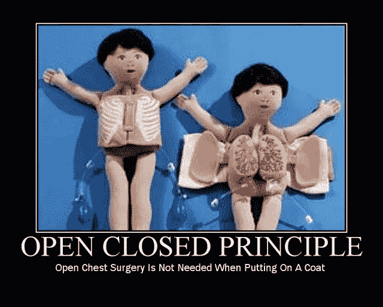

# 开闭原理|坚如磐石

> 原文：<https://blog.devgenius.io/open-closed-principle-solid-as-a-rock-aba6465ad9de?source=collection_archive---------1----------------------->



这是关于固体如岩石设计原则的五部分系列的第二部分。坚实的设计原则，当结合在一起时，使程序员能够轻松地编写易于维护、重用和扩展的软件。**O**pen-**C**losed**P**principle(OCP)是这个系列的第二个原则，我将在这里用 [Modern C++](http://www.vishalchovatiya.com/21-new-features-of-modern-cpp-to-use-in-your-project/) 中的一个极小的例子来讨论它，以及它的好处&通用指南。

> */！\:原载@*[*www.vishalchovatiya.com*](http://www.vishalchovatiya.com/category/design-patterns/)*。*

顺便说一句，如果你还没有浏览过我以前关于设计原则的文章，下面是快速链接:

1.  [**S** RP —单一责任原则](http://www.vishalchovatiya.com/single-responsibility-principle-in-cpp-solid-as-a-rock/)
2.  [**O** CP —开启/关闭原理](http://www.vishalchovatiya.com/open-closed-principle-in-cpp-solid-as-a-rock/)
3.  [LSP—利斯科夫替代原理](http://www.vishalchovatiya.com/liskovs-substitution-principle-in-cpp-solid-as-a-rock/)
4.  [**I** SP —界面偏析原理](http://www.vishalchovatiya.com/interface-segregation-principle-in-cpp-solid-as-a-rock/)
5.  [**D** IP —依赖反转原理](http://www.vishalchovatiya.com/dependency-inversion-principle-in-cpp-solid-as-a-rock/)

您在这一系列文章中看到的代码片段是简化的，而不是复杂的。所以你经常看到我不使用像`override`、`final`、`public`(同时继承)这样的关键字，只是为了让代码紧凑&可消耗(大部分时间)在单一标准屏幕尺寸。我也更喜欢`struct`而不是`class`，只是为了节省代码行，有时不写`public:`，还会故意忽略[虚拟析构函数](http://www.vishalchovatiya.com/part-3-all-about-virtual-keyword-in-c-how-virtual-destructor-works/)，构造函数[，复制构造函数](http://www.vishalchovatiya.com/all-about-copy-constructor-in-cpp-with-example/)，前缀`std::`，删除动态内存。我也认为自己是一个务实的人，希望用尽可能简单的方式，而不是标准的方式或使用术语来传达一个想法。

***注:***

*   如果你是在这里被直接绊倒的，那么我建议你浏览一下[什么是设计模式？](http://www.vishalchovatiya.com/what-is-design-pattern/)一、哪怕是鸡毛蒜皮的小事。相信会鼓励你对这个话题进行更多的探索。
*   您在本系列文章中遇到的所有这些代码都是使用 C++20 编译的(尽管我在大多数情况下使用了 C++17 之前的现代 C++特性)。因此，如果你无法获得最新的编译器，你可以使用已经预装了 boost 库的[https://wandbox.org/](https://wandbox.org/)。

# 目的

> *类应该对扩展开放，对修改关闭*

*   这实际上意味着你应该能够扩展一个类的行为，而不用修改它。这可能对你来说很奇怪&可能会提出一个问题，你如何在不修改类的情况下改变它的行为？
*   但是这个在[面向对象设计](http://www.vishalchovatiya.com/memory-layout-of-cpp-object/)里面有很多答案像[动态多态](http://www.vishalchovatiya.com/part-1-all-about-virtual-keyword-in-cpp-how-virtual-function-works-internally/)、[静态多态](http://www.vishalchovatiya.com/7-advanced-cpp-concepts-idiom-examples-you-should-know/#CRTP)、模板等。

# 违反了开闭原则

```
enum class COLOR { RED, GREEN, BLUE };
enum class SIZE { SMALL, MEDIUM, LARGE };struct Product {
    string  m_name;
    COLOR   m_color;
    SIZE    m_size;
};using Items = vector<Product*>;#define ALL(C)  begin(C), end(C)struct ProductFilter {
    static Items by_color(Items items, const COLOR e_color) {
        Items result;
        for (auto &i : items)
            if (i->m_color == e_color)
                result.push_back(i);
        return result;
    }
    static Items by_size(Items items, const SIZE e_size) {
        Items result;
        for (auto &i : items)
            if (i->m_size == e_size)
                result.push_back(i);
        return result;
    }
    static Items by_size_and_color(Items items, const SIZE e_size, const COLOR e_color) {
        Items result;
        for (auto &i : items)
            if (i->m_size == e_size && i->m_color == e_color)
                result.push_back(i);
        return result;
    }
};int main() {
    const Items all{
        new Product{"Apple", COLOR::GREEN, SIZE::SMALL},
        new Product{"Tree", COLOR::GREEN, SIZE::LARGE},
        new Product{"House", COLOR::BLUE, SIZE::LARGE},
    };
    for (auto &p : ProductFilter::by_color(all, COLOR::GREEN))
        cout << p->m_name << " is green\n";
    for (auto &p : ProductFilter::by_size_and_color(all, SIZE::LARGE, COLOR::GREEN))
        cout << p->m_name << " is green & large\n";
    return EXIT_SUCCESS;
}/*
Apple is green
Tree is green
Tree is green & large
*/
```

*   所以我们有一堆产品&我们根据它的一些属性过滤了它。只要需求是固定的，上面的代码就没有任何问题(在软件工程中永远不会出现这种情况)。
*   但是想象一下这种情况:您已经将代码发送给了客户。后来，需求发生了变化&需要一些新的过滤器。在这种情况下，您再次需要修改类并添加新的过滤方法。
*   这是一个有问题的方法，因为我们有 2 个属性(即颜色和大小)&需要实现 3 个功能(即颜色、大小及其组合)，还有一个属性&需要实现 8 个功能。你知道这是怎么回事了。
*   你需要一遍又一遍地修改已实现的代码，这可能会破坏代码的其他部分。这不是一个可扩展的解决方案。
*   开闭原则表明，您的系统应该对扩展开放，但对修改应该关闭。不幸的是，我们在这里所做的是修改现有的代码，这违反了 OCP。

# 开闭原理示例

实现 OCP 的方法不止一种。在这里，我展示了流行的一个，即界面设计或抽象层次。这是我们的可扩展解决方案:

# 增加可扩展性的抽象层次

```
template <typename T>
struct Specification {
    virtual ~Specification() = default;
    virtual bool is_satisfied(T *item) const = 0;
};struct ColorSpecification : Specification<Product> {
    COLOR e_color;
    ColorSpecification(COLOR e_color) : e_color(e_color) {}
    bool is_satisfied(Product *item) const { return item->m_color == e_color; }
};struct SizeSpecification : Specification<Product> {
    SIZE e_size;
    SizeSpecification(SIZE e_size) : e_size(e_size) {}
    bool is_satisfied(Product *item) const { return item->m_size == e_size; }
};template <typename T>
struct Filter {
    virtual vector<T *> filter(vector<T *> items, const Specification<T> &spec) = 0;
};struct BetterFilter : Filter<Product> {
    vector<Product *> filter(vector<Product *> items, const Specification<Product> &spec) {
        vector<Product *> result;
        for (auto &p : items)
            if (spec.is_satisfied(p))
                result.push_back(p);
        return result;
    }
};// ------------------------------------------------------------------------------------------------
BetterFilter bf;
for (auto &x : bf.filter(all, ColorSpecification(COLOR::GREEN)))
    cout << x->m_name << " is green\n";
```

*   如你所见，我们不必修改`BetterFilter`的`filter`方法。现在它可以和各种`specification`一起工作。

# 对于两个或多个组合规格

```
template <typename T>
struct AndSpecification : Specification<T> {
    const Specification<T> &first;
    const Specification<T> &second; AndSpecification(const Specification<T> &first, const Specification<T> &second)
    : first(first), second(second) {} bool is_satisfied(T *item) const { 
        return first.is_satisfied(item) && second.is_satisfied(item); 
    }
};template <typename T>
AndSpecification<T> operator&&(const Specification<T> &first, const Specification<T> &second) {
    return {first, second};
}// -----------------------------------------------------------------------------------------------------auto green_things = ColorSpecification{COLOR::GREEN};
auto large_things = SizeSpecification{SIZE::LARGE};BetterFilter bf;
for (auto &x : bf.filter(all, green_things &&large_things))
    cout << x->m_name << " is green and large\n";// warning: the following will compile but will NOT work
// auto spec2 = SizeSpecification{SIZE::LARGE} &&
//              ColorSpecification{COLOR::BLUE};
```

*   `SizeSpecification{SIZE::LARGE} && ColorSpecification{COLOR::BLUE}`不起作用。有经验的 C++眼睛很容易就能认出原因。虽然临时对象创建在这里是一个提示。如果你这样做，你可能会得到如下的[纯虚函数](http://www.vishalchovatiya.com/part-1-all-about-virtual-keyword-in-cpp-how-virtual-function-works-internally/)的错误:

```
pure virtual method called
terminate called without an active exception
The terminal process terminated with exit code: 3
```

*   对于两个以上的规范，可以使用可变模板。

# 开闭原则的好处

# = >扩展性

“当一个程序的单一变化导致相关模块的一系列变化时，这个程序就会表现出我们认为是‘坏’设计的不良属性。程序变得脆弱、僵化、不可预测和不可重用。开闭原则以非常直接的方式解决了这个问题。它说你应该设计永不改变的模块。当需求发生变化时，您可以通过添加新代码来扩展这些模块的行为，而不是通过更改已经工作的旧代码。”罗伯特·马丁

# = >可维护性

*   这种方法的主要好处是接口引入了一个额外的抽象层次，支持松散耦合。一个接口的实现是相互独立的，不需要共享任何代码。
*   因此，您可以轻松应对客户不断变化的需求。在敏捷方法中非常有用。

# = >灵活性

*   开闭原则也适用于插件和中间件架构。在这种情况下，您的基础软件实体就是您的应用程序核心功能。
*   在插件的情况下，您有一个基础或核心模块，可以通过一个公共网关接口插入新的特性和功能。web 浏览器扩展就是一个很好的例子。
*   二进制兼容性也将在后续版本中保持不变。

# 尺度来制作开放封闭原理友好的软件

*   在 SRP 中，您对分解以及在代码中何处绘制封装边界做出判断。在 OCP 中，你判断在你的模块中什么是抽象的，留给模块的消费者去具体化，什么是具体的功能提供给你自己。
*   有许多设计模式可以帮助我们在不改变代码的情况下扩展代码。例如，[装饰模式](http://www.vishalchovatiya.com/decorator-design-pattern-in-modern-cpp/)帮助我们遵循开闭原则。此外，[工厂方法](http://www.vishalchovatiya.com/factory-design-pattern-in-modern-cpp/)、[策略模式](http://www.vishalchovatiya.com/strategy-design-pattern-in-modern-cpp/)或[观察者模式](http://www.vishalchovatiya.com/observer-design-pattern-in-modern-cpp/)可以用来设计一个应用程序，只需对现有代码做最小的改动，就可以轻松地进行更改。

# 结论

请记住，课程永远不会完全关闭。总会有不可预见的变化需要修改一个类。但是，如果可以预见变更，如上文所示，即`filters`，那么当这些变更请求滚滚而来时，您就有了一个应用 OCP 以适应未来的绝佳机会。

[有什么建议，查询或者想说](http://www.vishalchovatiya.com/contact-2/) `[Hi](http://www.vishalchovatiya.com/contact-2/)` [？减轻压力，只需点击一下鼠标。](http://www.vishalchovatiya.com/contact-2/) 🖱️