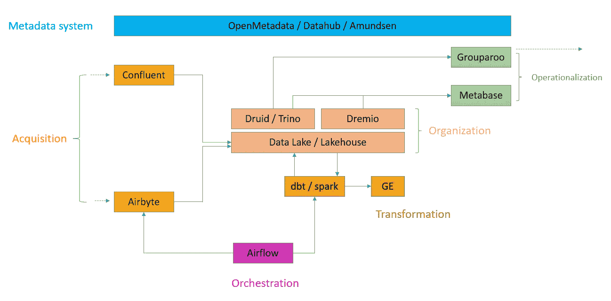

# 面向小型团队的开源数据堆栈

> 原文：<https://blog.devgenius.io/open-source-data-stack-for-small-team-c33f148f7d66?source=collection_archive---------2----------------------->

哈维·卡夫雷拉在 [Unsplash](https://unsplash.com/s/photos/lego?utm_source=unsplash&utm_medium=referral&utm_content=creditCopyText) 上的照片

构建数据堆栈的工具，帮助您的公司成为数据驱动型企业

在这个博客中，我们将讨论一些灵活的技术来支持数据的存储、管理和消费。这些工具受到现代数据堆栈的启发。

对于一个刚刚开始数据产品之旅的组织来说，MDS 的特点是:

*   数据产品之旅的低门槛。
*   低代码组件/工具—基于连接器/插件的系统。
*   云原生—在云中诞生
*   由 SQL 支持—使用云数据仓库或 Lakehouse
*   模块化和可定制化——每个工具都解决一个问题(而且做得很好),因此它们必须是模块化的，以确保它们能与其他工具很好地协同工作。
*   应该是元数据驱动的——堆栈的所有方面都应该收集和发出元数据。
*   也支持实时场景。
*   关注运营
*   这个堆栈的中心应该是协作的。
*   使用的每个组件或工具都应该有活跃的大型社区来提供支持。
*   选择合适的合作伙伴——MDS 不是万能的解决方案。每个组织都是不同的，因此需要特定的解决方案。与人交谈，阅读那里的内容，加入 Slack 社区的行列。

现代数据堆栈可以分为四层。

> 获取→组织→转换→分析和运营

面向小型公司的开源(主要)数据堆栈

# 获得

将数据从生成数据的来源放入堆栈是数据平台的第一步。这些数据是从数据库、文件系统、SaaS 工具、广告平台、物联网设备、网络和移动活动中收集的。

## 提取和装载

源数据需要以批处理方式移动，以组织数据湖或湖屋中的数据。这需要通过各种渠道及时完成。Airbyte 是实现这种数据集成的开源工具。

> Airbyte / Fivetran

## 事件跟踪/流式传输

事件是业务/技术信息。事件发生得非常快，需要实时或接近实时地消耗。所以数据栈需要一种方法来处理这些事件。Kafka 是事实上的选择流媒体平台。

> 卡夫卡/汇流

# 组织

收集完数据后，下一步是以一种更易于管理和使用的方式对其进行组织。在 MDS，我们通常有一个云仓库。但随着事情朝着湖屋系统快速发展，我认为我们应该有一个湖屋平台。但是为了保持进度，我会把仓库和湖边小屋都包括进去，并逐渐倾向于其中一个。

## 数据仓库

> 德鲁伊/雪花

## 数据仓库

> 冰山+德雷米奥/数据布里克斯三角洲

# 改变

一旦我们组织了数据，我们就需要标准化、验证甚至重构数据。这些转换通常深入数据建模。这种转换可以用 dbt 来完成。

## 转换和建模

> DBT /火花

## 数据有效性

> 远大前程/ SodaSQL

# 使用于操作

一旦数据在仓库中被组织和清理，我们需要从中获得洞察力。洞察的形式可以是用数据回答的问题(特别查询)、使用数据讲述的故事(可视化)以及业务工具中反馈的数据点以采取行动(反向 ETL)。

## 形象化

> 超集/外观

## 分析

> 特里诺

## 反向 ETL

> Grouparoo /高度接触

# 管理

所有数据及其转换版本都需要监控和治理。数据治理有两个支柱:可观察性和数据编目。

编目处理数据的内容和位置。而可观察性处理新鲜度、正确性、模式变化和沿袭。

## 数据可观察性和编目

> 数据中心/阿蒙森/开放元数据

## 管弦乐编曲

因为我们上面讨论的所有步骤都涉及不同的工具和不同的时间，所以我们需要一个指挥者来运行这个节目。Airflow 是广泛使用的开源工作流管理器。

> 气流

享受构建数据产品的乐趣！！！