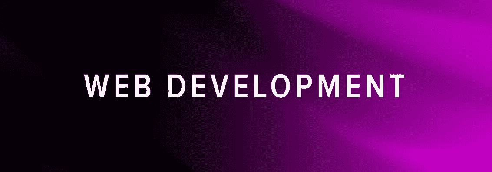
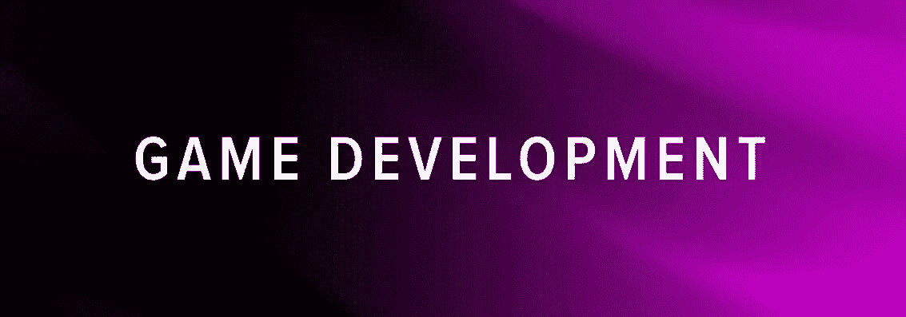
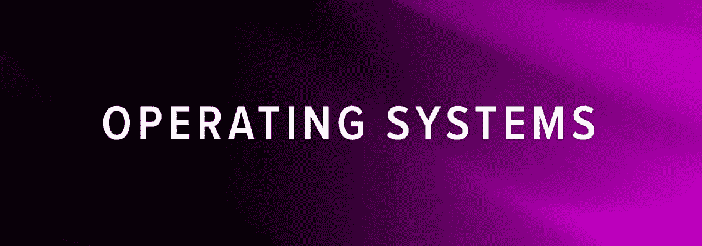
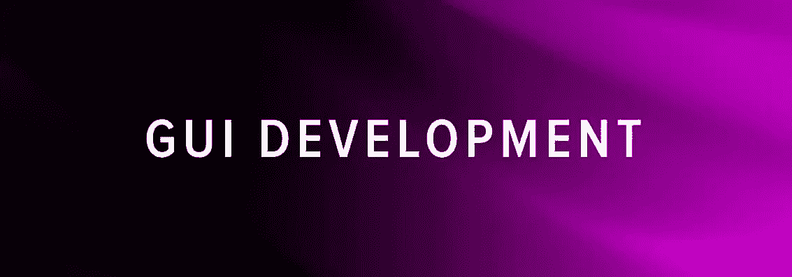
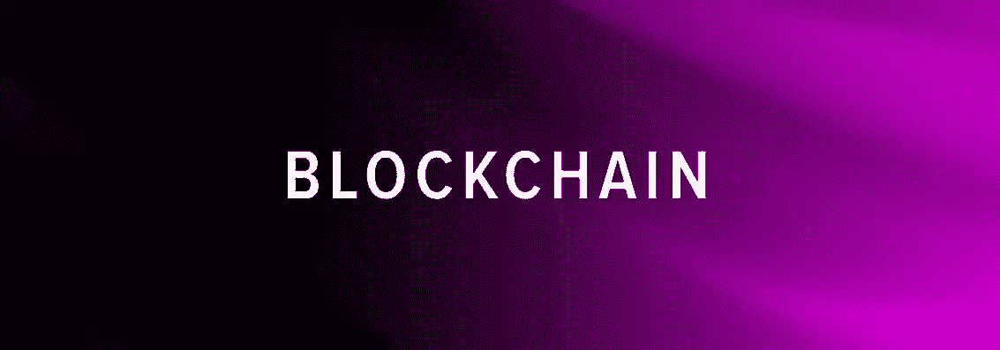

# 24 个了不起的开源 Rust 项目

> 原文：<https://blog.devgenius.io/open-source-rust-24-awesome-frameworks-projects-and-libraries-8885112f8a73?source=collection_archive---------2----------------------->

Viktor Forgacs 在 [Unsplash](https://unsplash.com/s/photos/open-source?utm_source=unsplash&utm_medium=referral&utm_content=creditCopyText) 上拍摄的照片

Rust 有一个非常活跃和快节奏的开源生态系统，有大量的贡献者在从事大量令人敬畏的项目。

如果你问——我能用 Rust 造出什么？答案几乎是一切。

本文将重点介绍一些开源的 Rust 库、框架和存储库，对您自己的项目学习和使用可能会有帮助。

为了方便起见，我把它们分成了几个领域，比如网页开发、游戏开发、区块链等等。让我们开始吧！

# Rust 的 Web 开发框架

可以用 Rust 构建 web app 吗？肯定！

Rust 有多个速度极快的 web 框架——Actix、Rocket 和 Yew——您可以使用符合您需求和偏好的框架。

## 火箭

[Rocket](https://github.com/SergioBenitez/Rocket) 是 Rust 生态系统中对初学者来说最容易上手的 web 框架。它是高度可定制的，可以帮助你快速启动一个新的应用程序。同时，它避免了许多不必要的样板文件。Rocket 还包含了许多特性，这意味着您不需要远离框架来构建您需要的一切。

与 Actix Web 不同，该框架运行在 nightly Rust 上——该语言的“实验”版本。

## Actix Web

Actix Web 通常被认为比 Rocket 更具性能和稳定性。下面，它与 [Erlang](https://serokell.io/blog/introduction-to-erlang#process-oriented) 和 [Akka](https://doc.akka.io/docs/akka/current/typed/actors.html) 中使用的演员模型一起工作。

与 Rocket 相比，它不太“包括电池”，这意味着您很可能需要使用第三方库来获得额外的功能。

## 紫杉

Yew 是一个 Rust 框架，用于使用 WebAssembly 创建 web 应用程序。在它的主要优点中，它列出了像 React 和 Elm 这样的基于组件的框架，由于多线程支持而带来的出色性能，以及 JavaScript 互操作性。

到目前为止，它还没有准备好投入生产，但是对于辅助项目和内部工具来说，它应该是一个很好的选择，尤其是如果你想和 WASM 一起工作的话。

## 左拉

如果你需要一些快速简单的东西来服务一个静态网站，Zola 是一个非常棒的工具，可以创建快速和可伸缩的网页，没有任何其他依赖或 JS 膨胀。

## 弯曲

[Warp](https://github.com/seanmonstar/warp) 是一个用 Rust 编写的 web 服务器框架。与 Rocket 和 Actix 相比，它对于一个 web 框架来说是相当小的，并且只提供基本的开箱即用的功能。

# 游戏开发

Rust 对于游戏开发来说非常出色，原因和 C++一样:它的性能是可预测的。以下是一些你可以用来构建自己的 Rust 游戏的引擎。

## 一群

两个主要的 Rust 游戏引擎是 Bevy 和 Amethyst。其中， [Bevy](https://github.com/bevyengine/bevy) 是更新更酷的一款。它是一个简单的数据驱动引擎，本质上可以被称为 Amethyst 2.0，因为它受到了它的极大启发。

想了解更多关于 Bevy 的信息，你可以看看《Bevy》这本书。

## 紫色

[Amethyst](https://github.com/amethyst/amethyst) 是两者中更成熟的一个，正因为如此，它拥有更多大型项目可能需要的特性以及与第三方库的更好集成。但是，Bevy 正在快速赶上。如果你正在为你的新项目寻找一个引擎，我建议你看看这两个引擎，看看你更喜欢哪一个。

# ggez

如果你正在寻找一些简单的东西开始，ggez 是一个轻量级的跨平台游戏框架，以最小的摩擦制作 2D 游戏。

如果你想了解 Rust 游戏开发的更多信息，请查看[我们是游戏了吗？](https://arewegameyet.rs/)

# 操作系统

在操作系统开发中，Rust 是 C 语言的优秀替代品，因为它提供了相同级别的性能，同时兼顾了内存安全。事实上，开发者们正在调查给 Linux 内核添加 Rust 的可能性，微软也在进行实验。

以下是一些纯粹用 Rust 编写的开源操作系统:

## 氧化还原

氧化还原是一个用 Rust 编写的操作系统，它使用 Rust 的创新来构建一个现代的微内核。

## 插曲

[intermezzOS](https://intermezzos.github.io/) 是一个教学操作系统，专门致力于向来自其他编程领域的有经验的开发者介绍系统编程概念。

## 忒修斯

[Theseus](https://github.com/theseus-os/Theseus) 是用 Rust 编写的新操作系统，它呈现了一种新颖的操作系统结构，并声称可以避免状态溢出现象，这种现象发生在一个实体的状态通过与另一个实体的交互被永久改变时。

有相当多的东西可以阅读——这里有一篇关于这个项目的论文。

# GUI 开发

虽然 Rust 并不以其构建吸引人的用户界面的能力而闻名，但仍然有许多好的库可以用来构建 GUI。

## 德鲁伊特

Druid 是一个实验性的 Rust-native UI 工具包，专注于构建简单、完美的用户体验。它是面向数据的，受 Flutter、SwiftUI 等现代框架的启发。

要了解更多，你可以查看一下[德鲁伊的书](https://linebender.org/druid/)。

## 冰冷的

[Iced](https://github.com/hecrj/iced) 是一个跨平台的 GUI 库，专注于简单性和类型安全性。它深受榆树的启发。虽然它现在仍处于试验阶段，但对于在 Rust 中为您的项目创建 GUI 来说，这是一个极好的选择。

## Orbital Widget 工具包

[Orbital Widget Toolkit](https://github.com/redox-os/orbtk)是一个跨平台的工具包，用于使用 Rust 构建可扩展的用户界面。它专注于速度、易用性和跨平台兼容性。

## 托里

Tauri 是一个为 Windows、Linux 和 macOS 构建桌面应用程序的框架。有了它，你可以使用任何编译成 HTML/CSS/JS 的前端框架来构建 ui，Rust 作为后端。

如果你想了解 Rust 中 GUI 开发可能性的更多信息，这里有一个大帖子涵盖了大多数库。

# 区块链

## 开放以太坊

OpenEthereum 的主要目标是成为最快、最轻、最安全的以太坊客户端。它是用 Rust 开发的，并声称提供对快速可靠的服务至关重要的核心基础设施。

## 灯塔

[灯塔](https://github.com/sigp/lighthouse)是一个开源的以太坊 2.0 客户端，用 Rust 编写，由适马 Prime 维护。

## 奇偶校验技术:波尔卡多特和基板

奇偶技术致力于为分散式网络建立区块链基础设施。

在它的项目中有[基质](https://github.com/paritytech/substrate)，一个区块链发展的模块化框架，和[波尔卡多特](https://github.com/paritytech/polkadot)，一个区块链的网络。这两个项目在实现中都大量使用了 Rust。

# 其他项目

以下是一些不属于任何给定类别的项目。希望你能在这个“事”的集合里找到牛逼的东西。:)

## 伺服系统

[Servo](https://github.com/servo/servo) 是用 Rust 写的 web 引擎原型。这是 Mozilla 致力于创建一个新的开源浏览器引擎的成果。2020 年，Servo 从 Mozilla 转移到由 Linux 基金会托管。

由于 Rust 的内存安全保证减少了漏洞的数量，Servo 应该比用 C++编写的浏览器更安全。

# swc

swc 是一个超快的 JavaScript/TypeScript 编译器。与 Babel 相比，它的基准编译速度至少提高了 18 倍。

## 混乱

想要运行 Adobe 最近禁用支持的所有酷炫 Flash 游戏？可以用 [Ruffle](https://github.com/ruffle-rs/ruffle) ，Rust 写的 Flash 播放器模拟器。

可以在 [ruffle.rs](https://ruffle.rs/demo/) 上试试。

## 疯狂的

[Lunatic](https://github.com/lunatic-lang/lunatic) 是一个实验平台，使用 WASM 实例作为演员来构造执行。它深受[二郎](https://serokell.io/blog/introduction-to-erlang)的启发。

它被认为是联合了 WASM 和 Erlang 的优点，使你能够构建基于 actor 的系统，既容错又速度惊人。

## 星际飞船

对于那些想让外壳更酷的人来说，Starship 是一个快速、可定制的智能提示。

## 美丽搜索

[MeiliSearch](https://github.com/meilisearch/MeiliSearch) 是一个强大的、快速的、易于使用的、可定制的搜索引擎，并且允许输入错误。现在有很多形容词了！您可以为自己的项目设置它，而不是一个定制的、性能可能更差的解决方案。

# 有什么要补充的吗？

正如你所看到的，生态系统是巨大的，有很多可以探索的。我当然不可能面面俱到。如果你知道一个值得来这里的项目，不要害怕在[推特](https://twitter.com/serokell)上让我们知道！

如果你想了解更多关于 Rust 的知识，我建议去我们博客的 [Rust 部分](https://serokell.io/blog/rust)。玩得开心！

*最初发布于*[*https://sero Kell . io*](https://serokell.io/blog/open-source-rust)*。*