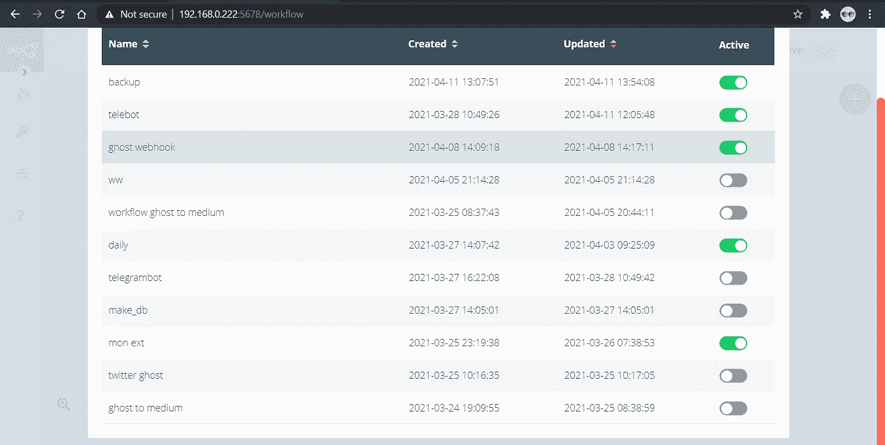
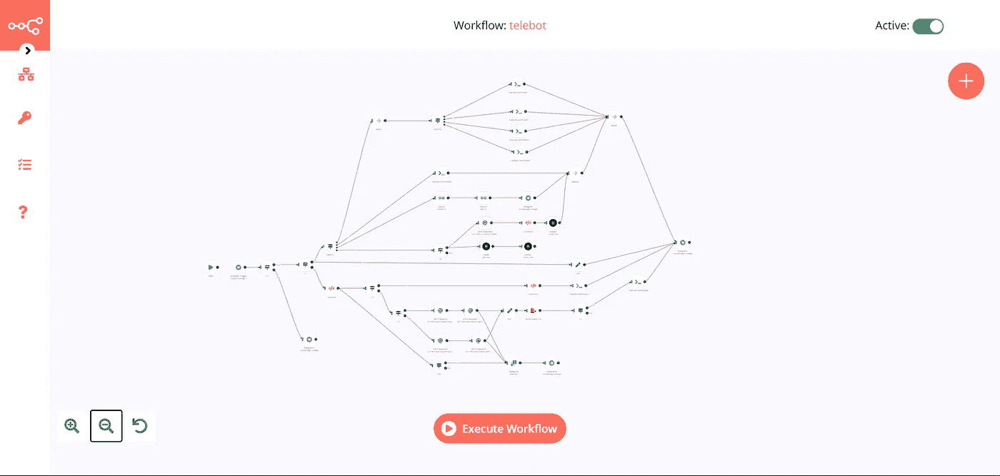

# 在 Raspberry-Pi 和小发明“n8n.io”上的开源自托管

> 原文：<https://blog.devgenius.io/open-source-self-hosting-on-raspberry-pi-and-the-gizmo-n8n-io-6cc42e644e1a?source=collection_archive---------7----------------------->

我曾经问过一位财富 500 强公司的 CxO，他对“开源”有什么看法。他的回答让我意识到，人生各行各业都有很长的路要走。他说，“开源就像家常便饭，每个人都想在那里享受菜肴，但没有多少人想做饭并为他人带点东西”。

一年半之后，当我用 n8n.io 做实验时，我意识到他是对的。世界上有很多伟大的工作正在发生，尤其是在开源社区。但是，我们可能要问自己，我们是否做了足够的事情来支持它？即使开源世界发生了很多事情，我们对正在发生的好事给予了足够的关注吗？我们是否都为此做出了足够的贡献？我们是在无条件地拥抱开源，给兄弟会一个肩膀吗？我们在实现开放标准方面是否不屈不挠？最重要的是，我们正在帮助开源项目成长吗？我们是否对好的作品给予了足够的发言权，并跳出来为更大的受众修复这些产品上的 bug？

这些问题非常相关，原因有很多。首先，许多伟大的产品拥有大量粉丝。当我在研究 Apache Airflow 时，我意识到社区和生态系统虽然仍在发展，但已经足够成熟，许多企业已经完全支持该产品。但是，这就够了吗？我们都在为一个能够造福于技术世界大众的开源项目努力吗？

当然，这些问题没有答案。虽然对任何个人来说，在软件行业工作 3.5 年似乎太短了，但对许多具有时代意义的产品和技术的亲身体验让我接触到了这个行业的许多方面。一项如此重要的技术出现了，但很少出现，以至于我们可以生动地看到行业围绕它旋转并进一步发展。感谢上帝，我有机会研究许多这样的技术。

虽然从专业角度来说，我们可能会轻松地实施和试验新技术，但家庭服务器上的自托管却是一个需要解决的不同问题。这是因为我们跟不上维护和许可成本。如果技术将成为精英阶层——知识渊博的少数人——的特权，我们如何赋予每个人权力？此外，如果每个人都必须从头开始构建自己的工具，或者如果每个人都没有用于企业的相同的故障保护工具，我们又如何能够平等地为构建更美好的未来做好准备呢？

就在我试图观察这些想法的时候，我看到了 Reddit 上的一条评论，这条评论向我介绍了一些新的东西。这让我对无代码的未来有了一点了解！

我做集成工程师已经有一段时间了，但是最近才开始做 Dell Boomi。不可否认，这可能是最完美的 iPaaS 解决方案之一。有一个经过深思熟虑的界面，一个更加结构化的界面，一个精细的版本控制，一个敏锐的日志记录机制，最重要的是，一组非常完善的连接器等等。设计原则或多或少是通过多年的变化和改进实现的永恒理念。

在 Dell Boomi 工作的合格工程师和专业人士比我多得多。我已经爱上了戴尔·波密的奇迹。但是，Dell Boomi 是有成本的，即许可成本。定价模式可能是小口袋的一大负担。明确一下，戴尔 Boomi 和本文后面的部分没有可比性。Boomi 是对未来的窥探。

如果我告诉你，有一个类似的产品，有一个庞大的粉丝群和社区，捆绑了更广泛的连接器支持，而且都是免费的，那会怎么样？没错，这样的东西是存在的，而且是 [n8n.io](https://n8n.io/) 。

自己主持很有趣，但是，也很累，至少对我来说是这样。因为我使用一个树莓 Pi 来满足我所有的主机需求，而且我在这里算是一个初学者，所以设置东西是非常辛苦的。一些令人厌倦的事情包括-

*   维护您的域名注册商和 DNS 提供商记录(即使是一次性设置)
*   管理 CDN 级别的设置，如安全性、验证码、僵尸拦截等。
*   路由器和路由器级安全性
*   intranet 上的设备和网络配置
*   树莓派和电源
*   操作系统和内核版本
*   安装和软件配置
*   应用程序和数据量
*   应用程序配置和备份
*   管理托管容器/应用程序

这样的例子不胜枚举。承认自我招待的欢乐旅程中的摩擦并不可耻。然而，不管有没有摩擦，我们还是会做事。

尽管我遭受了所有这些挑战，但我确实编写了脚本并自动化了许多任务。我安排 Crons 和 watchdogs 重启并处理我托管的许多服务。我还启动了一些工具，如 [Portainer](https://www.portainer.io/) 、 [Nginx-Proxy-Manager](https://nginxproxymanager.com/) ，以及其他一些很酷的仪表板来管理许多容器和服务。但是，总会有一些摩擦。在我和我的服务器之间总是有一堵高高的不安之墙。而且，我不容易攀登它。

我希望能够更轻松地自动化和控制事情，具有更大的灵活性和力量。那时，我希望能够找到一个开源工具，可以让我快速前进！类似戴尔-博米的东西。一些可以让我更快开发和实现的东西。一座跨越高墙的桥，这样我就可以跋涉滑向另一边，或者跳过棘手的高大不适。

一个快速的想法是使用 IFTTT、Twilio 或 Zapier 之类的东西。这些服务太棒了。我被自己在网络之外能做的事情惊呆了。我对集成和特性的数量感到惊讶。我很快使用 Zapier 将我的 GhostCMS 博客与 Medium 整合起来。只有几下点击的距离！只要我在 Ghost 上发布了什么，我就可以看到它以一个新故事的形式出现在媒体上，并且每个新帖子都有一条新推文。这对我来说是一个压倒性的自动化，因为它只需点击几下，没有脚本！

任何人对扎皮尔/伊夫泰的所作所为都不会不满意。但是，当然，这仍然花费了不少。即使定价计划是公平的，对于像我这样的爱好者来说，随着我继续试验技术，这一成本仍然很高。我浏览了互联网和论坛，可能浏览了所有关于 Zapier/IFTTT 替代品的页面。在互联网的某个角落，在一个无限的评论池中，在帖子档案和微小字体之间的某个地方，我看到了一些改变了我对自托管的整个看法的东西，那就是“ [n8n](https://n8n.io/) ”。

## N8N 是什么？

我将用更简单的话来说，它不仅仅是一个工作流自动化工具，它是一个小发明，是自动化爱好者的福音，是一个基于 UI 的自动化工具，可以扩展，并且可能对我们可以做的事情没有限制(除了它的许可和我们的想象力)。

它有大约 200 种不同的现成集成。触发器和连接器使它成为我正在寻找的家庭服务器自动化的一个合适和容易的选择！

一些快捷功能:

*   码头准备好了！
*   具有加密的凭据存储
*   支持工作流和凭证的导入/导出
*   可以启用基本身份验证
*   记录和跟踪执行
*   支持 webhooks！
*   包括电池！

使用 N8N 制作的工作流程

现在，更大的问题是，你能用它做什么？可能什么都有。这是我建立的一些工作流程-

*   Ghost CMS to Medium —在 Ghost 上发布的每篇文章都会通过 cron 工作流自动发布到 Medium 上。
*   Ghost to Twitter——每次在 Ghost 上发布帖子时，都会发送一条新的推文
*   持续监控 ghost 博客
*   基于 JS 的视图计数器
*   n8n 配置到 Gmail 和 Gdrive 的备份

虽然我在 n8n 上做了许多其他集成，但工作流之王是一个电报机器人！那个我和 n8n 集成的！这改变了我的一切。它把我的家庭影院变成了智能扬声器系统。一个简单的电报聊天变成一个电子邮件传递工作流程。最重要的是，它让我的 Raspberry-pi 变成了一个自动化发电站！

与 N8N 集成的电报机器人

我的机器人能做什么！

*   在连接到 Raspberry-Pi 的扬声器上播放 YouTube 视频
*   使用 SendGrid 进行邮件传递
*   用一条电报信息更新博客
*   网址缩写
*   智能灯光控制器
*   远离手机的备份系统！
*   执行 Python 脚本
*   运行 shell 命令
*   Bitwarden 的密码更新！
*   服务器正常运行时间和健康监控
*   发送时事通讯(我在有限的受众中尝试过，效果不错)

这一切仅仅发生在几个小时之内！

能够想到某个用例，并且只需点击几下鼠标就能让它工作，这是一件令人兴奋的事情。更让我兴奋的是，它如何正确地融入 Apache Airflow 和 Dell Boomi 之间的空白，这一空白让我一直好奇并推动探索。这解决了我大部分的自托管问题。

这个工具确实是一个小发明，任何人都在为 Zapier/IFTTT 寻找开源和自托管的替代方案。它是免费的，可以进行实验。但是，在我看来，从企业的角度来看，n8n 并不是包罗万象的，因为它缺乏一些最基本的功能。仅举几个例子-

*   每种形状和配置的精细版本控制
*   工作流级别版本控制
*   记录和轻松监控作业

我还注意到一些间歇性的应用程序在尝试多个 web 挂钩时死机，但是，需要修复的只是一个容器重启。

如果有足够多的支持者准备采用 N8N 这样的技术奇迹，这样的项目可以增长。我确实知道并理解 N8N 附带的许可证禁止商业化。所以，它在某些方面并不是完全开源的。但是，如果像这样的项目获得足够的牵引力，会是什么样的呢？如果这样的项目走到一起呢？如果社区接受风险，并努力解决它们，会怎么样？如果我们能给这个奇迹增加更多的健壮性呢？如果我们能够改进缺点，使 N8N 成为大众的强大替代产品，会怎么样？如果它解决了很多和我一样是自助主机初学者的人的问题呢！

有了 n8n 这样的解决方案，未来似乎更有趣，也更有希望。最重要的是，能够把那些明显的点和缺口连接起来是非常令人欣慰的！

在以后的系列文章中，我将进一步阐述什么是 n8n，以及如何使用 n8n 进行部署和开发！以及它带来的无限可能！