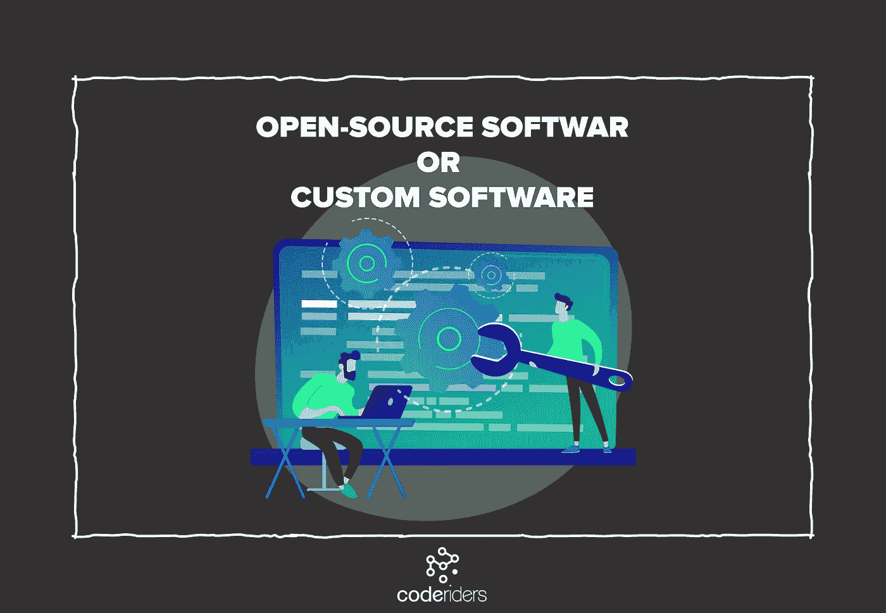
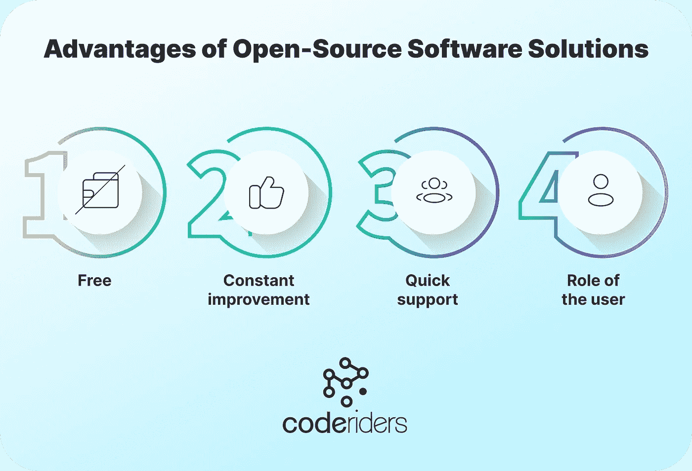
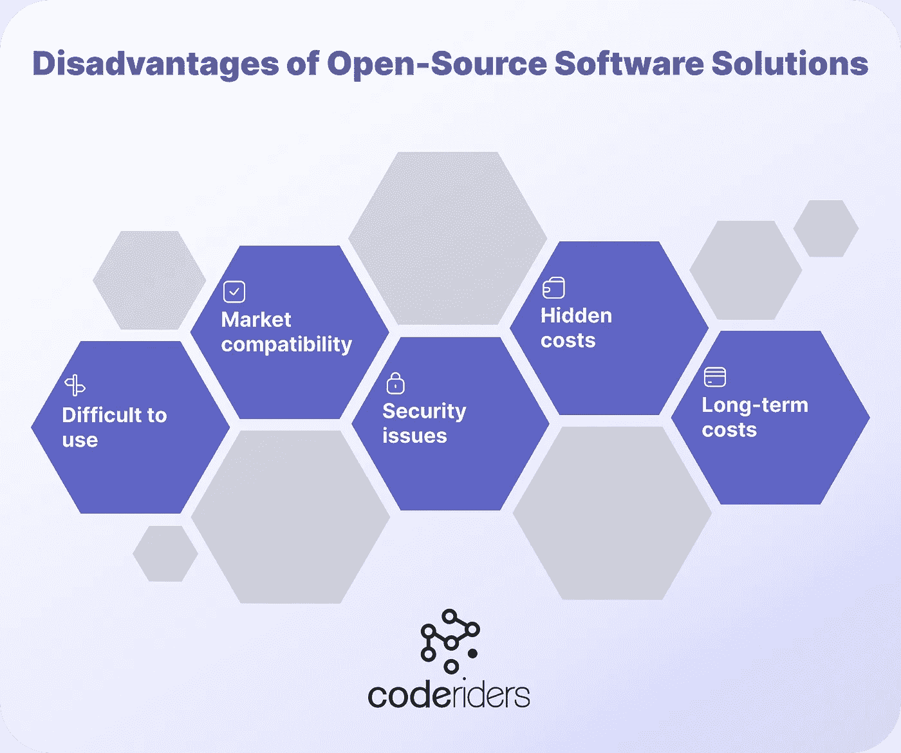
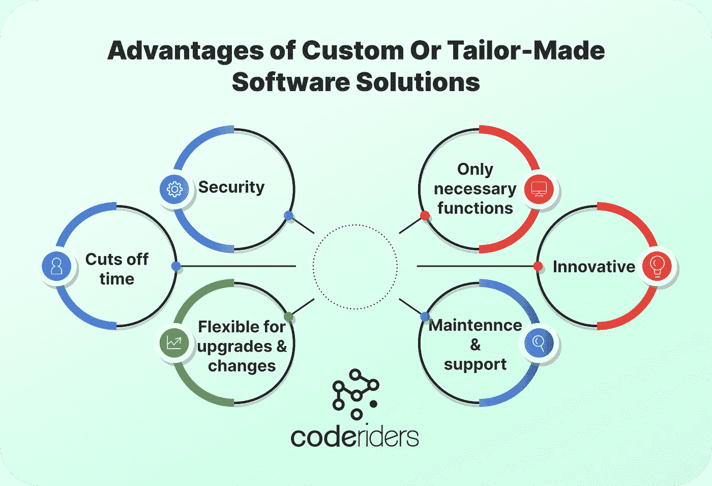
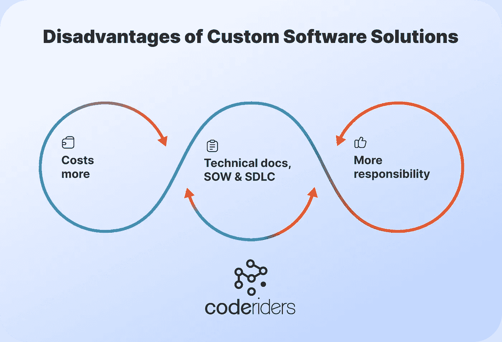

# 开源软件与定制软件:哪个更好？

> 原文：<https://blog.devgenius.io/open-source-software-vs-custom-software-which-is-better-7b623969a228?source=collection_archive---------9----------------------->

如果你的公司没有在线代理，你的公司就倒闭了。如果你不为员工提供[数字工具或尖端软件解决方案](https://www.coderiders.am/solutions)，他们的工作效率就会下降。你的收入与你的业务外观和用户友好程度密切相关。

在信息技术行业，我们有两种实现复杂软件解决方案的方法:

使用开源软件解决方案或工具，

实现您的定制软件解决方案或工具(通过与定制软件开发公司或个人软件开发人员和工程师合作)。

选择定制软件(量身定制的软件)和开源软件之间没有对错之分。你的选择取决于你的业务的具体特点。

本文将解释定制软件和开源软件解决方案之间的区别。我们将阐明定制和开源软件解决方案的优势和劣势，并让您决定哪一个最适合您的业务。

**什么是开源软件？**

开源软件(OOS)是一种公开的计算机软件。OOS 的版权所有者被许可授予用户进入和使用他们的软件解决方案的权利。

开源软件的一个典型例子是各种商业管理工具或商业技术，例如:

*   任务管理工具，
*   电子邮件营销工具，
*   SMM 或社交媒体日程安排工具，
*   消息传递、项目管理和沟通工具(针对员工和客户)，
*   SEO(搜索引擎优化)工具，
*   跟踪和人力资源工具，
*   会计工具，
*   电子签名开放软件，
*   线索生成以及文档协作工具。

这是一个为来自不同行业和背景的各种专业人士设计的无数开源软件解决方案的永无止境的列表。

公司根据其目标、运营领域和初始服务对各种工具进行优先排序。例如，一家小型软件开发公司可能会使用著名营销工具(如 Semrush、Moz、Hubspot 和 Hootsuite)的免费或付费计划来管理其营销活动。对于一些企业来说，这些开源解决方案已经足够了。然而，大多数时候，银行为他们的员工选择定制 [CRM](https://www.coderiders.am/solutions/crm-solution-development) 和会计系统。

换句话说，开源软件的源代码对公众开放，可以随时免费使用和修改。软件开发人员和工程师可以摆弄代码，进行迭代和必要的修改。因此，开源软件对全世界各种专业人士的改变、更新和发展是开放的。

**开源软件解决方案的优势**

以下是公司更喜欢开源软件解决方案而不是定制软件解决方案的主要原因。

**开源软件是免费的**

开源软件解决方案为世界各地的公司省钱。如果你刚刚起步或者需要一个最小的解决方案，使用开源软件绝对是一个资源节约器。

公共软件解决方案提供了免费访问专有软件包的开放源代码的机会。您可以运行业务流程和操作，而无需花钱购买软件许可证。

全球 78%的组织在开源软件上运行部分或全部业务，这使得在全球经济中实施开源软件成为一项合理且有益的商业计划。开源软件的这一优势足以让专业人士与全球软件供应商合作，发布新的技术解决方案。

**开源软件在不断改进和发展**

由于公众可以访问开源软件的源代码，并且有可能添加新的解决方案，开源软件解决方案正在不断发展。世界各地的专业人士向他们首选的开源软件添加新的解决方案，以更好地定制他们的业务目标。

例如，最近在 [CodeRiders 定制软件开发公司](https://www.coderiders.am/)，我们的一个全栈软件开发人员致力于向 Figma 协作界面设计工具添加一个新的软件解决方案。她在 Figma 的插件库中添加了一个新插件，进一步简化了 UI/UX 设计师的工作。这个新的插件将一个已经设计好的页面翻译成另一种语言，而不影响它的设计。用户只复制设计文件，并通过克隆整个作品将其翻译成首选语言。我们专门的全栈软件开发人员为一家意大利公司构建了这个插件，该公司向 CodeRiders 请求这个解决方案。该插件将很快发布到 Figma 插件社区。

**开源软件解决方案提供快速支持和错误修复**

安全性是开源软件解决方案的关注点之一。开源代码所有者尽最大努力提供高安全性，通常拥有众多软件开发人员，甚至软件开发和维护团队。负责代码维护和支持的软件开发团队或软件供应商一直关注着错误和问题。

**在开源软件中，你的角色是“用户”**

作为用户，你不是任何开源代码的所有者。这意味着您不需要担心项目中出现的任何错误，不需要打开错误修复任务，也不需要与负责代码的软件开发团队进行交流。作为用户，需要通过客服平台(一个 CRM 系统)举报问题。

**开源软件解决方案的缺点**

这些是开源软件解决方案最令人担忧的缺点。

**开源软件解决方案通常难以使用**

由于开放源码软件是供公众使用的，它不太“定制”，更适合目标用户市场的中等标准。对于不同的公司来说，许多开源软件解决方案的界面或功能不太用户友好是很常见的。众说纷纭。然而，如果您的首选开源软件解决方案很难为您的员工设置和使用，这可能会导致严重的员工生产力问题。

**市场兼容性极高**

我们在每个行业都有数百万的开源软件解决方案。构建和销售开源软件已经成为一项有益的业务，如果营销方式正确，它可以产生收入。然而，随着类似公共软件解决方案数量的增加，标准也越来越高。与众不同并提供不同于其他软件解决方案的功能是至关重要的。

我们也不应该忘记你的开源软件的技术和功能问题。你的软件应该有最小的错误，优秀的客户服务，速度快，功能多样。另一方面，在发布开源软件解决方案之前，您应该知道许多类型的专有硬件需要专门的驱动程序来运行开源程序。这些开源程序通常只能直接从设备制造商那里获得。有时候，一个开源驱动并不能和特定的软件或者专有驱动一起工作。无论哪种情况，项目的成本都会增加。

**责任和安全问题**

开源软件的许可所有者完全控制着产品及其底层代码。开源软件被许可方仅包含有限担保，没有责任或赔偿保护。

**隐性成本**

大多数开源软件解决方案都有免费和付费的软件包。为了实现更复杂的动作，用户必须购买付费的软件包。有时，开源软件前期是免费的，但运行起来要收费。如果用户不打算付费，这将是一个大问题。

**长期成本**

如果你使用开源软件的付费版本，你应该每个月支付固定的费用。另一方面，在软件外包的情况下，定制软件实现是一次性投资。企业主找到一个合适的软件外包公司或软件供应商，并要求时间和金钱的估计，并支付一次性定制软件开发和实施。

**综上所述，**如果你知道自己业务的利弊，并且对自己的目标有把握，投资那些提供创新和创造性解决方案的开源软件将会取得成功。在 code riders custom software development company，除了为国外来自不同行业的各种公司构建定制的私有软件解决方案之外，我们还从事开源业务项目。我们的开源软件解决方案为我们的合作伙伴带来了丰厚的投资回报。

例如，CodeRiders 软件开发人员和工程师致力于 CRM 和电子邮件营销系统的后端功能，以及集成的 API 应用程序( [Worldsoft Business Suite](https://www.coderiders.am/portfolio#worldsoft-ag) )。目前，WBS 是一个领先的 CRM 门户，一个用于业务管理的 SaaS 应用程序。你可以通过[创建一个免费试用账户](https://worldsoft-wbs.info/test/)来测试这个软件。

**什么是定制软件？**

自定义软件解决方案，也称为闭源软件解决方案，仅由软件所有者根据许可协议授权的用户访问。定制软件的代码仅向软件开发公司或从事和维护该定制软件解决方案的软件开发人员公开。如果客户与软件开发公司(软件供应商)合作，未经所有者同意，后者无权对软件进行更改。如果定制软件代码所有者有内部软件开发人员，这些是完成代码所有者给定任务的普通员工。

换句话说，定制软件或定制软件是基于特定公司或个人的业务需求而构建、设计和实现的软件解决方案。

定制软件解决方案的典型示例包括:

[业务流程自动化解决方案](https://www.coderiders.am/solutions/business-intelligence-solution-development)，

内容管理系统(CMS)，

[营销软件解决方案](https://www.coderiders.am/blog/how-marketing-software-solutions-are-critical-for-your-business)，

自动开票解决方案，

定制库存系统，

错误跟踪软件解决方案，

[API 集成解决方案](https://www.coderiders.am/solutions/integration-software)，

[电子商务系统](https://www.coderiders.am/solutions/ecommerce-solutions-development)，

[大数据和分析](https://www.coderiders.am/solutions/big-data-and-analytics-software-solution)，

[实时解决方案](https://www.coderiders.am/solutions/real-time-dashboards)，

[CRM 系统](https://www.coderiders.am/solutions/crm-solution-development)。

这些只是我们开发的定制软件系统和解决方案的几个例子。

**定制软件解决方案的优势**

尽管构建和实现定制的软件解决方案是昂贵的，并且需要大量的投资，包括雇佣软件开发团队，但是在某些情况下这是唯一的解决方案。如果你遇到开源软件解决方案的所有风险，投资定制软件服务会让你花费更少。这些都是量身定制软件的典型优势。

**定制软件是安全的**

定制软件更安全，因为它是一种闭源解决方案，仅由相关专业人员和软件开发团队使用。如果企业使用定制软件，黑客攻击和入侵的可能性将降至最低，而开源软件由于其开源代码，通常更容易被黑客攻击。

**定制软件仅包含必要的功能**

开源软件的创造者试图定制和调整它以适应他们一般目标用户的需求和目标。它是为世界范围内的各种公司构建的，而定制软件只为单个公司构建，供私人使用。合乎逻辑的是，定制软件解决方案使用起来更舒适，因为它们不包含特定公司不需要的分散注意力的功能。

另一方面，定制软件的 UI/UX 设计也完全是为特定公司的喜好和小众量身定制的。

**定制软件节省了大量时间**

由于定制软件是为特定公司及其需求量身定制的，因此使用起来更加容易和方便。它提高了工作质量、速度和生产率。

**定制软件是创新的**

虽然开源软件的所有者也升级和更新他们的软件解决方案和功能，但该软件仍然是通用的，供公众使用。另一方面，在量身定制的软件解决方案中，私人用户在市场中搜索尖端战略和解决方案，并指示其软件外包团队实施创新。

**定制软件可根据您的业务增长灵活升级和变更**

如果企业主需要添加特定的功能或对他们的定制软件进行更改，这是容易、快速且经济实惠的。自定义软件所有者是控制和访问代码的人。

**定制软件提供维护和支持**

如果软件所有者雇佣软件外包团队或专门的软件开发人员，那么与软件开发供应商保持联系以添加新的解决方案或修复 bug 是负担得起且容易的。

**定制软件解决方案的缺点**

**定制软件可能会比平时贵**

在这个世界上，任何私人或定制的东西都是昂贵的。这条“定律”也没有绕过定制软件开发。定制软件开发在开始时需要大量投资，例如使用资源寻找合格的软件供应商，或者花钱雇佣个人软件开发人员。构建和实现定制软件所需的时间和资金也会更高。在投资定制软件开发之前，这些都是需要考虑的要点。

另一方面，你也应该注意开源软件解决方案的隐性成本。你应该权衡这两个选项，考虑每个选项的所有潜在成本，以做出最终的有益决定。

**您需要填写技术文档、SOW 或参与软件开发生命周期(SDLC)**

为了与合格的软件供应商合作，你应该清楚地定义你的目标和对项目的主要期望。没有一个合格的软件供应商会向不清楚其软件开发需求的客户提供时间和资金估算。

幸运的是，我们有各种软件外包参与模型，支持那些没有最终产品视图的公司。软件供应商自己也有技术文档作者，他们帮助客户归档 SOW 文档。

然而，即使你没有看到定制软件的最终版本，你也应该有一个商业计划。如果你雇佣个人软件开发人员并组建一个内部技术团队，这一点就更加明显了。在 code riders custom software development company，我们创建了一份关于“如何编写可靠的工作范围/SOW 文档”的白皮书，并提供了一个来自教育技术行业的真实示例。你可以下载下面的文档。

 [## 如何撰写可靠的工作范围| code riders 白皮书

### 里面是什么？

www.coderiders.am](https://www.coderiders.am/white-papers/how-to-write-a-solid-scope-of-work) 

**如果你投资定制软件，你肩上的责任会更大**

如果你是软件的所有者和私人用户，你的产品的质量和功能是你的责任。每当您的产品面临错误或问题时，您不会报告问题并等待解决方案。您有责任与您的软件供应商或负责该产品的软件开发人员密切合作来解决问题。

最后，如果你公司的安全很重要，任何一点信息都可能是致命的，那么最好选择定制软件实现，并找到一家可靠的[定制软件开发公司](https://www.coderiders.am/services/custom-software-development)，或者雇佣专门的软件开发人员和工程师。定制软件解决方案也绝对是公司的正确选择，这些公司有要求苛刻的客户或需要开源软件替代方案中没有的软件解决方案。量身定制的软件解决方案是独一无二、创新不断的企业的理想选择。

最后，开源软件和定制软件都是严肃的投资。如果企业仔细检查和评估每个解决方案的利弊，它将选择最符合其业务目标和战略的解决方案。最终，如果企业连起码的网上存在都没有，它们的竞争力就会下降。投资构建和销售开源软件，为自己的企业构建私有软件，或者使用开源软件解决方案，如果在正确的地点和正确的时间完成，都是有益的商业举措。

要咨询哪种模式最适合您的企业，您可以[与我们 CodeRiders 团队安排一次免费通话](https://coderiders.am/contact-us)。我们将在一个工作日内回复您的信息。

 [## 软件开发公司-联系我们| CodeRiders

### 让我们谈谈您在定制软件开发、网页开发和设计、软件外包方面的业务需求…

www.coderiders.am](https://www.coderiders.am/contact-us) 

*联系团队 CodeRiders，构建您的私人定制软件或开放软件，为全球企业提供新的解决方案。*