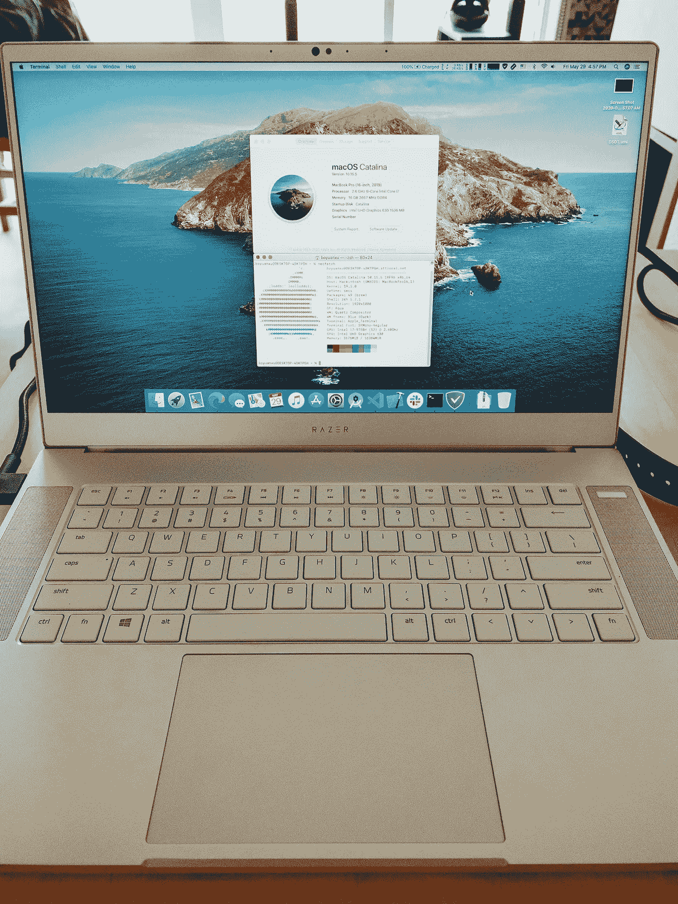
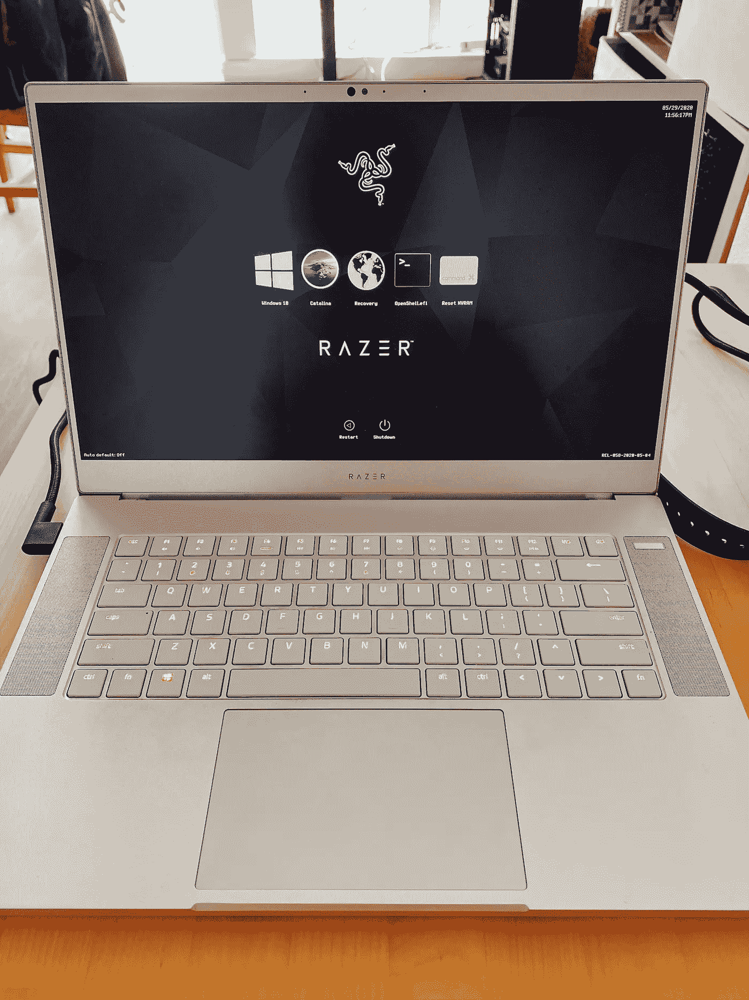

# open core Razer Blade Advanced 15 Hackintosh—经济实惠的 MacBook 指南

> 原文：<https://blog.devgenius.io/opencore-razer-blade-advanced-15-hackintosh-the-affordable-macbook-guide-2c8dc6da1b2a?source=collection_archive---------1----------------------->

> 免责声明:本指南适用于 2019 年年中的 RBA 15(RZ09–03017 em2)。

作为一台顶级的 2016 款 MacBook Pro，我已经厌倦了它的键盘和散热问题。新的 16 英寸 MacBook Pro 是一个很大的改进，但价格太高了，我需要我的新笔记本电脑能够处理 AAA 游戏和视频编辑，除了区块链和跨平台移动开发。最终，我选定了一款 2019 年年中的 Razer Blade Advanced 15，配有 RTX 2070 Max-Q

我需要 macOS 来完成我的大部分开发工作，需要 Windows 来玩游戏，但高级型号只有一个 M.2 NVMe 插槽。下面是我如何实现一台完美的笔记本电脑 Hackintosh，运行 Catalina 10.15.5 + OpenCore 和双启动 Windows 10，只有一个 1TB NVMe 驱动器。

首先，当然是规格:

*   CPU:英特尔酷睿 i7–9750h 6 核 12 线程处理器，2.6GHz 主频，4.5GHz 睿频
*   内存:16GB 双通道 DDR4 2667MHz
*   iGPU:英特尔 UHD 630
*   dGPU:英伟达 RTX 2070 Max-Q
*   显示屏:15.6 英寸 FHD 240 赫兹
*   存储:精简版 CA3–8d 512S，512GB
*   网络摄像头:Windows Hello UVC 摄像头(带红外)
*   WiFi:英特尔无线 AC 9560NGW (WiFi 6)
*   声音:Realtek ALC298
*   键盘:Razer 色度逐键 RGB
*   触控板:Windows Precision 触控板

什么不起作用:

*   英特尔 WiFi
*   Windows Hello(显然)
*   RTX 2070 Max-Q
*   显示器似乎卡在 60Hz，不能用开关强制 240Hz
*   雷电 3 未测试

什么有效:

*   其他一切

# macOS 的准备工作

B 在我们开始安装 macOS 之前，我们需要对硬件和固件进行一些修改，为我们的刀片式服务器做好准备。我们需要做的事情是:

*   解锁 BIOS 菜单设置
*   交换 WiFi 卡
*   交换 M.2 NVMe 硬盘

## 基本输入输出系统

BIOS 设置将需要更改，以避免您以后遇到大麻烦。然而，默认情况下，并非我们需要更改的所有 BIOS 设置都对用户可见。我们需要转储 BIOS 映像，更改一些内置的可见性设置，并将修改后的映像闪回。

首先按照本文“准备”下的相关步骤:[https://github . com/stonevil/Razer _ Blade _ Advanced _ early _ 2019 _ Hackintosh](https://github.com/stonevil/Razer_Blade_Advanced_early_2019_Hackintosh)

然而，在闪回修改后的图像之前，请按照本指南将“超频和性能”添加到主菜单中。请特别注意“将隐藏菜单移至主屏幕”:[http://forum . notebook review . com/threads/Razer-BIOS-MODS-potential-to-unlock-all-hidden-options . 830993/](http://forum.notebookreview.com/threads/razer-bios-mods-potential-to-unlock-all-hidden-options.830993/)

此外，我发现了一个奇怪的问题:安装一个售后 NVMe 驱动器实际上隐藏了未锁定的 BIOS，原因超出了我的理解。简单地删除驱动器和引导没有驱动器恢复隐藏的菜单。

> 运行 Android Emulator 的移动开发人员:在完成上述所有步骤后，确保让 VT-d 和任何其他虚拟化技术保持开启。与链接的 GitHub 指南所说的相反，它不会给 macOS 引导**带来任何麻烦，但不启用它们会导致 Android 模拟器在启动时崩溃。**为什么？因为 Android 模拟器采用了英特尔 HAXM 虚拟化技术。

## WiFi 交换

刀片式服务器附带的英特尔 WiFi 6 卡无法在 macOS 上运行，因为还没有人从 Linux 移植稳定的英特尔 WiFi 驱动程序。互联网上的大多数人建议新人换成 DW1560(BCM94352Z)或 DW1830(BCM943602BAED)，但这些卡要么有不同的子版本(但只有一个子版本可以工作)，要么有 3 个天线而不是 2 个，两者都需要 kexts 才能正常工作。其中一些甚至会导致 Windows 中的 BSODs。

我建议你换成 BCM94360NG，而不是这些乱七八糟的东西。这张卡是 Fenvi 公司制作的，这是一家中国公司，专门生产和销售兼容 Hackintosh 的产品。这种卡不需要任何驱动程序，甚至在安装过程中就开始工作。它也有官方的 Windows 驱动程序，非常好用。链接:[https://www . ebay . com/ITM/M-2-NGFF-网卡-换博通-BCM 94360 ng-better-BCM 94352 z-dw 1560-BT4-0/264663343680](https://www.ebay.com/itm/M-2-NGFF-Network-Card-for-Broadcom-BCM94360NG-better-than-BCM94352Z-DW1560-BT4-0/264663343680)

## M.2 NVMe(可选)

显然，早期的刀片配备了三星 PM981 NVMe 驱动器，其固件无法与 macOS 兼容。我的带有一个精简版 NVMe 驱动器，我不知道精简版驱动器和 macOS 之间的任何兼容性问题，所以请随意尝试一下。

但由于我是双启动，我需要超过 512GB。我选定了一个 Sabrent 1TB NVMe 硬盘，它完美无瑕。一些指南要求你为 NVMe 硬盘购买一个散热器，但是要注意某些物理上的不兼容性。在我的刀片式服务器的 NVMe 驱动下有一个凸起的支撑垫，它不能承受 NVMe 散热器的额外厚度。

# 安装 macOS + OpenCore

F 关注这里的优秀指南:[https://1 revenger 1 . git book . io/laptop-guide/prepare-install-MAC OS/preparing-the-USB-media](https://1revenger1.gitbook.io/laptop-guide/prepare-install-macos/preparing-the-usb-media)

> 注:触控板无法正常工作是正常的。我们将不得不稍后修理它。

## 警告:UHD 630

我们很幸运，因为我们的刀片使用的 UHD 630 的特定变体不需要任何*平台 id* 欺骗。您可以将*设备属性*下的条目完全留空。换句话说，根本不需要打 iGPU 补丁。(你肯定已经在 BIOS 里把 DVMT 设置成 64M 了！)

## 警告:系统产品名称

MacBookPro16，1 一直在为我工作，但请随意尝试其他产品名称。

## 警告:ACPI 二进制补丁

*   **随时指出任何错误，我敢肯定其中一些是多余的或不必要的。**
*   _OSI 到 XOSI: 5F4F5349 -> 584F5349
*   EC0 -> EC: 4543305F -> 45435F5F
*   _BIF -> XBIF(电池 SSDT): 5F424946 -> 58424946
*   _BST -> XBST(电池 SSDT): 5F425354 -> 58425354
*   SBFG 到 XBFG(SSDT-I2C):53424647-> 58424647，表格签名:44534454
*   _CRS 到 XCRS(SSDT-I2C):144 c 045 f 43525300-> 144 c 0458 43525300，表签名:44534454
*   HPET _CRS 到 XCRS:5f 435253 08a 019-> 58435253 08a 019
*   TIMR IRQ 0 修补程序:22010 07 9 00--> 22000 07 9 00
*   RTC IRQ 8 修补程序:22000179 00--> 22000079 00
*   将 SSCN 改名为 XSCN (I2C): 5353434E -> 5853434E
*   将 FMCN 重命名为 XMCN (I2C): 464D434E -> 584D434E
*   _ PTS-> ZPTS(dGPU):5f 505453 01-> 5a 505453 01
*   _ WAK-> ZWAK(dGPU):5f 57414 b 01-> 5a 57414 b 01
*   RTEC ->特科(dGPU):47055254 45430070-> 47055854 45430070

# macOS 安装后 Kexts + ACPI 热补丁

现在你已经完成了 macOS 的安装，很多事情可能看起来很不对劲。您可能会注意到，每当尝试关闭时，刀片内核都会死机。触控板不工作。亮度不起作用。电池寿命是垃圾，因为当 WhateverGreen 禁用 dGPU 时，它仍然是通电的。没有声音。让我们解决这一切。

## Kexts & Bootflags

*   声音: **AppleALC** 。使用布局标识 3。为了最大化通用性，不要在*设备属性*下的 OpenCore 配置中定义它。使用引导标志 *alcid=3* 。
*   CPU 电源管理:**cpuffriend**。遵循回购协议上的说明。
*   USB 口注入:使用 **Hackintool** 。他们有一个很棒的内置 USB 端口映射工具，它可以生成一个 USBPorts.kext 文件。
*   触控板:**voodoo I2C**&**voodoo i2chid**。他们现在不会工作，因为我们需要做一些 SSDT ACPI 补丁和 GPI0 引脚。此外，请确保从这里下载它的一个特殊版本:[https://github.com/VoodooI2C/VoodooI2C/issues/319](https://github.com/VoodooI2C/VoodooI2C/issues/319)一般版本很可能在 80%的时间里无法工作。你可以在上面的链接中找到原因。
*   引导标志:*-v keep syms = 1 debug = 0x 100 alcid = 3 igfxcflbklt = 1-igfxmlr-wegnoegpu*

## 使用固态硬盘进行 ACPI 热修补

OpenCore 致力于提供更像 Mac 的引导环境。它做出的设计选择之一是不支持 DSDT 注入。这将立即导致 90%的其他指南无用，因为他们依赖修补 DSDT。我们必须将这些 DSDT 补丁转化为 SSDT 热点补丁。

对于 OpenCore 用户来说，OC-little 可能是最好的 GitHub 回购，因为该回购拥有你能想到的所有 SSDT 补丁。但是，整个回购都是中文的。这对我来说不是问题，因为我的母语是英语，但对你来说，我能看到问题。幸运的是，[有人把整件事翻译成了英语](https://github.com/jsassu20/OpenCore-HotPatching-Guide)。但请注意:翻译后的回购协议最后一次更新是在 2019 年 12 月，而原始回购协议仍会定期更新。翻译后的回购实际上已经严重过时，文件夹结构也完全不同。我会仔细检查原始的中国回购协议。别急，我会解释它们是什么，具体告诉你用什么。

让我们一个一个地检查回购中的文件夹。

> 注意:您需要 MaciASL 将以下 DSL 文件编译成 AML 文件。

*   **01-AOAC:** 刀锋不需要补丁。AOAC 代表*常开/常接*。它会导致 S3 睡眠和电池寿命问题。
*   **02-欺骗设备:**02–1 涵盖了所有主板的欺骗 EC，02–2 部分 300 系列主板中的欺骗 RTC0，02–3 PS2N 键盘固定，以及 02–4 欺骗 ALSD 环境光线传感器。如果你没有重命名 EC，很可能你甚至不能启动安装程序。**我们需要 ALSD(不是 ALS0！)恶搞让亮度控制起作用。**
*   **03-二进制替换:**刀片不需要补丁。03–1 涵盖了 GPI0，但我们将稍后处理它。
*   **04-OS 修复:**它试图通过将 macOS 伪装成 Windows 10 来纠正某些硬件行为。**应用重命名和 SSDT-OC-XOSI。**
*   **05-设备注入:**05–1 x86 英特尔电源管理注入，05–2 PNLF what evergreen 背光注入，05–3 SBUS 注入。我们将需要做到这三点。对于 05–1，所有不同的变体都是为了适应来自 DSDT 不同 OEM 的不同命名方案，并且**我们的刀片需要 SSDT 插件 SB。PR00** 。对于 05–2，有两种类型的背光修复:ACPIBacklight(必须与 ACPIBacklight.kext 一起使用)和特定于代的背光修复。我们将使用后者，更具体地说是 SSDT-PNLF-CFL。对于 05-03，我们将使用 SSDT-SBUS 航线。关于这个修复的文档并不多，但它不会造成伤害。
*   **06-欺骗丢失的设备:**这些修复试图添加一些真实 Mac 中存在但在其他情况下丢失的设备。这些都是可选的，但都是必备的，取决于您的硬件，您可能不需要所有这些。我个人有 **DMAC，MCHC，MEM2，PMCR** 。
*   **07-PS2 键盘映射**:Blade 不需要补丁。这些补丁是可选的:它们的目的是在被按下时将一个物理按键映射到另一个按键。甚至不确定它是否能与刀片一起工作，因为刀片没有 PS2 键盘(我可能是错的)。
*   **08-电池热修补**:这是打造刀片最困难的部分之一。唯一的 DSDT 电池补丁来自 2014 年的刀片，没有任何 SSDT 电池热补丁专门针对 2019 年年中的 RBA。别害怕，我做了一个。你可以在我的 GitHub 回购里找到(我会在最后链接)。
*   **09-禁用 EHCx** :刀片不需要补丁。
*   **10-PTSWAK 补丁**:这些补丁试图修复一些睡眠/唤醒问题。**刀片需要 SSDT-PTSWAK** 。
*   **11-PNP0C0E 睡眠/唤醒修复:**刀片不需要补丁。他们试图纠正按下睡眠按钮和盖子唤醒的问题。
*   **12–0D/6D 补丁:**刀片不需要补丁。他们试图在尝试睡眠时纠正即时唤醒问题。不过，在现实生活中我可能需要那个补丁。
*   **13-欺骗以太网:**刀片式服务器不需要补丁，因为我们有本机支持的 AirPort WiFi 卡。
*   **14-亮度控制键补丁:**刀片不需要补丁。
*   **15-CMOS 复位修复**:刀片不需要补丁。他们试图纠正 CMOS 在关机或重启时复位的问题。
*   **16-ACPI USB 映射**:刀片不需要补丁。我们为此使用了 Hackintool。
*   **17-禁用 PCI 设备:**刀片不需要补丁。他们试图禁用不支持的 PCI 设备，如 SD 读卡器。
*   **18-ACPIDebug:** 不需要。为 ACPI 增加了日志功能，对于调试来说非常酷。
*   **19-设备特定补丁:**刀片不需要补丁。
*   **20-I2C 补丁**:我们将需要 **SSDT-I2CxConf** 和另一个专门针对我们 2019 年年中 RBA 的补丁。它会出现在我的回购协议中。
*   **21-IRQ 声音修复**:Blade 不需要补丁。
*   **22-关闭 dGPU** :一般情况下刀片式服务器需要这些补丁，但这些补丁并不适用于我们的刀片式服务器。一个工作版本附在我的回购。

唷，我想这就是 OpenCore 补丁和修补 macOS 的全部内容了！此时，您的刀片应该可以完全运行 macOS。接下来，我们需要安装 Windows。

# Windows 的准备工作

在安装 Windows 之前，我们需要对驱动器进行分区，为 Windows 腾出空间。

*   打开“磁盘工具”。
*   点击左上角的“查看”并选择“显示所有设备”。
*   选择最上面的设备，这应该是您的硬盘驱动器的名称(在我的例子中是“Sabrent Media”)，然后选择“Partition”。
*   在下一个窗口中，您将能够调整 macOS 容器分区的大小。我把我的降到了 512GB。
*   一旦你这样做，左边的图形应该会更新，并直观地表明 macOS 将只占用一半的驱动器。
*   单击“应用”以应用更改。

然后我们需要制作一个可启动的 Windows 10 安装程序。你可以问谷歌如何做到这一点——但记住**你必须使用一种不会把 install.wim 分成两个更小的文件的方法！**

# 安装 Windows

Y 你可能以前安装过 Windows，但是请仔细阅读这篇文章！它将把你从无尽的绝望和 Windows 10 安装程序的无能中拯救出来。

## 引导进入安装程序

启动到安装程序是相当简单的，只要确保你是通过 BIOS 而不是 OpenCore 来完成。一旦你启动到安装程序，继续像平常一样，直到屏幕上询问你想在哪里安装 Windows。您必须非常小心，不要覆盖您的 macOS 安装！选择未分配的空间，然后单击“新建”。它会问你是否可以创建额外的分区，点击“确定”。**然后就此打住！**

## 使用 DISM 应用 Windows 映像

进行全新安装最有可能以一个非常模糊的错误信息和一大堆奇怪的分区结束，在重启后你必须一个接一个地删除它们。相信我，我花了一整夜在谷歌上试图摆脱安装错误，但毫无效果。因此，我们将使用 DISM 直接“提取”Windows 到我们的驱动器。

从我们离开的地方开始，您现在需要通过单击右上角的红色“X”来关闭安装窗口。您现在应该会被重定向到欢迎屏幕。

按 Shift+F10 打开命令提示符。然后，

*   类型 *diskpart*
*   类型*列表盘*
*   键入*选择磁盘 0*
*   键入 *list vol* 并记下为 Windows 新创建的分区的卷号以及安装程序所在的 USB 驱动器的卷号。如果 Windows 卷未安装(没有分配的字母)，请阅读[此](https://docs.microsoft.com/en-us/windows-server/storage/disk-management/assign-a-mount-point-folder-path-to-a-drive#:~:text=At%20the%20DISKPART%20prompt%2C%20type,mount%3D%5D%20.)。
*   键入*退出*
*   假设您的可移动卷被挂载到 *D:* ，键入以下内容:*dism/Get-WIM info/WIM file :D:\ Sources \ install . WIM*(或者 *install.esd* 如果您使用了媒体创建工具)
*   记下您要安装的 Windows 版本的索引号。
*   假设索引号为 1，用于 Windows 的卷已安装到 *G:* ，请键入以下内容:*dism/Apply-Image/Image file :D:\ Sources \ install . WIM/index:1/Apply dir:G:\*

DISM 现在会将 Windows 解压缩到目标驱动器。您应该可以看到一个进度条来指示其进度。当该过程完成时，您有所有的 Windows 文件，但没有引导文件来引导它。让我们解决这个问题。

*   键入*G:\ Windows \ system32 \ BCD boot G:\ Windows/f UEFI*

如果以上工作正常，那么你就可以启动 Windows 了！如果没有，您必须使用 *diskpart* 挂载 EFI 分区(假设挂载在 *S:* )并键入:

*   *G:\ Windows \ system32 \ BCD boot G:\ Windows/S S:/f UEFI*

不错！现在你们都完成了！重新启动你的刀片，你应该看到 Windows 启动。如果没有，请在 BIOS 中选择 Windows 启动管理器来启动到 Windows。然而，有一个问题。

# 找回 OpenCore

很有可能，OpenCore 将会从你的 BIOS 中彻底消失。如果它仍然与 Window 启动管理器一起出现，请知道这是一个缓存问题，它最终会消失，因此您必须执行此修复。

## 正在删除 Windows 启动管理器

您需要在 Windows 中挂载 EFI 分区，并使用 Explorer++导航到 EFI 驱动器(以管理员身份运行它)。然后，导航到 *EFI — Microsoft — Boot* ，并将 *bootmgfw.efi* 重命名为其他名称。重新启动，OpenCore 回来了，但 Windows 启动管理器不见了。我们必须再把它找回来！

## 正在恢复 Windows 启动管理器

已经有人用图片做了很棒的特写:[https://medium . com/MAC oclock/guide-multi boot-dual boot-open core-with-windows-MAC OS-Linux-kextcache-131 e 96784 c3f](https://medium.com/macoclock/guide-multiboot-dualboot-opencore-with-windows-macos-linux-kextcache-131e96784c3f)

在“安装后”下查找。记住文章中提到 *bootmgfw.efi* 的地方，您必须将其更改为您重命名的名称。

# NDK 开放核心

vanilla OpenCore 的问题是，它的 ACPI 热补丁和设置适用于它启动的每一个操作系统，包括 Windows。然而，ACPI 为 macOS 设计的热补丁最终可能会破坏 Windows。我们希望能够从这些补丁中排除 Windows。一种方法是在每一个 SSDT 文件中添加一个条件语句，但这将是很乏味的。相反，你可以选择使用 [NDK 的 OpenCore](https://github.com/n-d-k/OpenCorePkg) 的分支，它提供了一个 GUI 引导选择器和一个仅将各种注入应用于 macOS 的选项。这是我的自定义主题:

# 包扎

T4:好吧，那真是一次疯狂的旅行！现在，您有了一个双启动刀片，可以在白天使用 macOS 作为一个伟大的生产力工具，在晚上使用 Windows 作为一个游戏机。

这里是承诺的 GitHub 链接，它有定制的 dGPU 和电池 ACPI 补丁:[https://github.com/boyuanx/Hackintosh_OC_RBA15_Mid2019](https://github.com/boyuanx/Hackintosh_OC_RBA15_Mid2019)

我要感谢所有参与 Hackintosh 社区的开发人员，感谢大家的阅读！

更新:这个回购协议的作者比我做得更好。看看这个吧！[https://github.com/tylernguyen/razer15-hackintosh](https://github.com/tylernguyen/razer15-hackintosh)