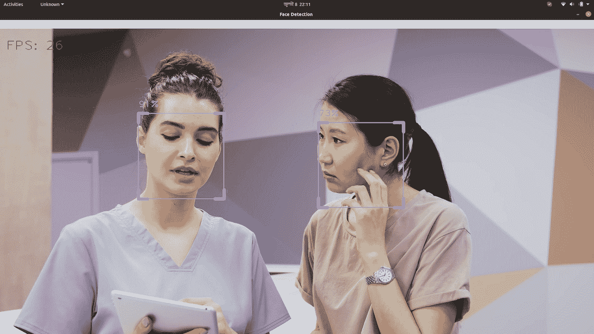

# OpenCV 人脸检测项目讲解

> 原文：<https://blog.devgenius.io/opencv-face-detection-explained-with-project-5c5f1d263cac?source=collection_archive---------2----------------------->

## 建立自己的人脸检测项目



**人脸检测**是一种用于各种应用的计算机技术，可以从数字图像中强化人脸。人脸检测应用广泛，如人脸识别、运动检测、情感接口、摄影等。

本文将介绍如何通过网络摄像头或视频文件直接使用 Python OpenCV 进行人脸检测。

首先你需要安装 OpenCV 和 Numpy。我们将使用完整的 Python 编程语言来完成本教程，所以让我们开始吧。

# 库设置

我们将同时使用 mediapipe 和 OpenCV。以下是关于这些库的更多信息。

## 中间管道

MediaPipe 与研究和开发人员的解决方案和应用合作，用于移动、web 应用、边缘计算等领域的机器学习。

MediaPipe Pose 处理 RGB 图像，并返回检测到的最突出人物的姿势标志。请参考用法[示例。](https://solutions.mediapipe.dev/pose#python-solution-api)

导入 CV2、媒体管道和时间。

安装 mediapipe

```
pip install mediapipe
```

## **OpenCV**

OpenCV 是一个图像处理库。它旨在解决计算机视觉问题。OpenCV 是一个用 Python 扩展的 C/C++库。

下面是安装 OpenCV 的命令

```
pip install opencv-python
```

# 我们开始吧

现在创建 faceDection.py。首先，导入我们在这里需要的库。

```
import cv2import mediapipe as mpimport time
```

`**time()**` **函数**接受浮点数并返回自纪元以来的当前时间(秒)。如果系统时钟提供，可能会出现几分之一秒。

## **cv2。视频捕获(视频路径)**

这个是视频路径的。如果您不想使用网络摄像头，那么您必须选择此选项。

```
cap = cv2.VideoCapture('/home/python/OpenCV/faceDetect/faceD1.mp4')
```

**如果您使用网络摄像头，则**

```
cap = cv2.VideoCapture(0) #depends on your system 0 or 1
```

## **设置帧速率**

```
pTime = 0cTime = time.time() *# frame rate*fps_rate = 1 / (cTime-pTime)pTime = cTime
```

## **MediaPipe 人脸检测。**

MediaPipe 面部检测处理 RGB 图像，并返回检测到的面部位置数据的列表。

```
mpFaceDect = mp.solutions.face_detectionmpDrawing = mp.solutions.drawing_utilsfaceDetection = mpFaceDect.FaceDetection(0.75)
```

`**cv2.cvtColor(src, code[, dst[, dstCn]])**` 将图像从一个色彩空间转换到另一个色彩空间。该函数将输入图像从一个颜色空间转换到另一个颜色空间。以防变形。在 RGB 颜色空间**、**之间，应该明确指定通道的顺序 **(** RGB 或 **)** 。注意。OpenCV 中的默认颜色格式通常被称为 RGB，但它实际上是 BGR**(**`.` 字节被颠倒 **)** 。

`faceDetection.**process(self, image: np.ndarray)**` **功能**处理 RGB 图像并返回检测到的面部位置数据的列表。RGB 图像表示为一个数字数组。

`**draw_detection(**image, detection,keypoint_drawing_spec,bbox_drawing_spec**)**` 功能在图像上绘制检测包围盒和关键点。

1.  `**image**` **:** 表示为 NumPy ndarray 的三通道 RGB 图像。
2.  `**detection**` **:** 要在图像上标注的检测原型消息。
3.  `**keypoint_drawing_spec**` **:** 一个 DrawingSpec 对象，指定关键点绘图设置，如颜色、线条粗细和圆半径，如 drawing spec = drawing spec(COLOR = RED _ COLOR)。
4.  `**bbox_drawing_spec**` **:** 指定边界框的 DrawingSpec 对象。绘图设置，如颜色和线条粗细，如 DrawingSpec = DrawingSpec())。

`**cv2.putText(**img**,** text**,** org**,** fontFace**,** fontScale**,** color[ **,** thickness[ **,** lineType[**,** bottomLeftOrigin]]]**)**`

## 我们来讨论一下参数。

1.  `**img**` **:** 输入绘制文本字符串，
2.  `**text**` **:** 要绘制的文本字符串。
3.  `**org**` **:** 图像中文本字符串的左下角。
4.  `**fontFace**` **:** 字体类型**，**
5.  `**fontScale**` **:** 乘以特定字体基本大小的字体比例因子。
6.  `**color**` **:** 文字颜色。
7.  `**thickness**` **:** 用于绘制文本的线条粗细。
8.  `**lineType**` **:** 线型。
9.  `**bottomLeftOrigin**` **:** 当**为真时，**图像数据原点在左下角。否则**，**在左上角。

## 使用`**cv2.imshow()**` 功能显示图像

```
cv2.putText(img, *f*'FPS: {int(fps_rate)}', (20, 70), cv2.FONT_HERSHEY_PLAIN,3  ,(0, 255, 0), 2)cv2.imshow('Face Detection ', img)cv2.waitKey(1)
```

## **以下是完整代码:**

我们可以把它转换成一个模块，这样我们就可以很容易地使用这个值，创建一个像`**faceDetectModule.py**`这样的模块，然后复制你之前写的所有代码。

然后创建一个类。我们应该能够做的是，我们应该创建一个对象，并创建一个方法，允许我们检测姿势，并为我们找到所有这些点。

```
**Init function**(self, min_detection_confidence=0.5, model_selection=0)
```

上面的代码初始化了一个 MediaPipe 人脸检测对象。

## 参数:

1.  `min_detection_confidence`:人脸检测成功的最小置信度值(【0.0，1.0】)。[详见](https://solutions.mediapipe.dev/face_detection#min_detection_confidence.)
2.  `model_selection` : 0 或 1。0 表示选择最适合距离相机 2 米以内的人脸的短程模型，1 表示最适合距离相机 5 米以内的人脸的全程模型。[详见](https://solutions.mediapipe.dev/face_detection#model_selection.)

## **完整代码在此**

下面是完整的代码，您可以根据需要使用和定制。请看一看。

## 以下是视频文件的输出


# 结论

在这篇文章中，我们讨论了一个完整的人脸检测项目。从这篇文章中，你可以了解人脸检测，也可以根据你的需要扩展这个项目。

感谢您的阅读。

祝你愉快。