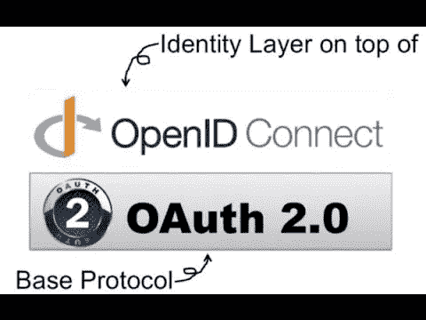
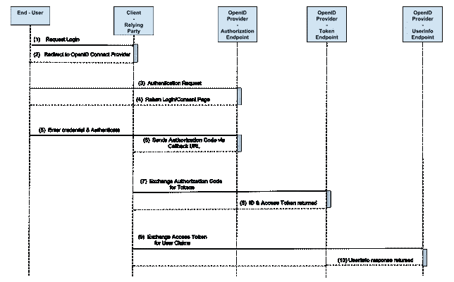
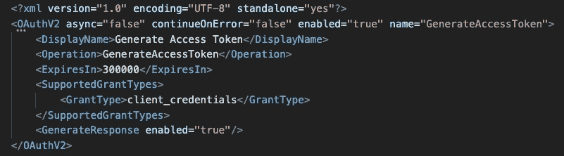

# OpenID 连接和 OAUTH 2.0

> 原文：<https://blog.devgenius.io/openid-connect-oauth-2-0-758529e6f853?source=collection_archive---------13----------------------->

在开始了解 oidc 和 oauth 2.0 之前，我们需要后退一步，看看它们是干什么用的？

因此，基本上 oidc 和 oauth 2.0 用于身份和访问管理(IAM)。IAM 包括验证请求访问资源的用户的身份及其访问级别。因此，为了验证用户身份，我们将该过程称为**认证**，同时检查名为**授权**的用户的访问级别。

有些人互换使用 authN 和 authZ，这是不正确的。它们共同构成了强大的身份和访问管理，而不是一个取代另一个。虽然您只能使用 authZ 来保护 OAuth 2.0 的微服务，我们将在本文的最后介绍这一点。

**OpenID 连接工作流程**

oidc 表示 authN，而 oauth 表示 authZ。现在，oidc 在 oauth 之上工作，换句话说，它在授权步骤发生之前工作。

如下所示:

1.  用户试图通过**社交登录(sso)** 登录网站
2.  网站(客户端或中继方)将使用**回调** url 将用户重定向到 oidc sso
3.  用户输入他们凭证
4.  oidc 端点 **(/auth)** 对用户进行认证，并向网站页面发送**授权码**
5.  网站向 oidc 端点 **(/token)** 发送具有首选**范围**的授权码，以换取 **id 令牌**和**访问令牌**
6.  网站向 oidc 端点 **(/userinfo)** 发送用户声明、角色等的访问令牌

了解工作流程后，我们应该回到一些术语上来。

**ID 令牌**是一个 Json Web 令牌。这些 ID 令牌由报头、有效负载和签名组成。标头和签名用于验证令牌的真实性，而有效负载包含客户端请求的用户信息。ID 令牌是 oidc 对 OAuth 2.0 的核心扩展。ID 令牌由授权服务器颁发，包含携带用户信息的声明。

*值得一提的是，除非在联系 oidc 端点时指定 openid 的作用域，否则不会返回 id_token。*

**访问令牌**是一个唯一的令牌，告诉资源服务器这个用户被授权在这个有限的范围内访问它。

**授权码**是授权码，是客户端用来交换访问令牌的临时码。代码本身是从授权服务器获得的，用户有机会看到客户端请求的信息，并批准或拒绝请求

**动手操作:apigee oauth 2.0 策略实施**

首先创建一个代理并选择你喜欢的流，对我来说，我会选择代理预流并放置 **OAuthV2** 策略。

OAuthV2 图标

现在，为了使这个端点(流)**生成**一个访问令牌，您需要选择您首选的**授权类型**。出于本教程的考虑，将使用 client_credentials 授权类型。

因为我们让这个端点生成一个访问令牌，所以我们需要在策略 xml 中的**操作**上指定它，如下所示。您也可以从 **ExpiresIn 覆盖令牌寿命的默认值。**如果 xml 中给出了范围，则令牌将被限制在此范围内。否则，它的范围将是您的客户端应用程序订阅的任何产品。

在建立您的策略之后，您现在需要做的就是使用您的客户端 id 和客户端密码(用户名和密码)访问该端点。

**资源**

 [## Payara 平台中的 OpenID Connect 5.183

### OpenID Connect 是一种安全机制，用于应用程序联系身份服务，验证身份…

博客. payara.fish](https://blog.payara.fish/openid-connect-in-the-payara-platform-5.183)  [## 访问令牌

### 访问令牌用于基于令牌的身份验证，以允许应用程序访问 API。应用程序接收…

auth0.com](https://auth0.com/docs/secure/tokens/access-tokens)  [## Microsoft 身份平台 ID 令牌- Microsoft 身份平台

### ID 令牌是 OpenID Connect 对 OAuth 2.0 的核心扩展。身份令牌由授权机构颁发…

docs.microsoft.com](https://docs.microsoft.com/en-us/azure/active-directory/develop/id-tokens)  [## 授权码授权- OAuth 2.0 简化版

### 授权码是一个临时码，客户端将使用它来交换访问令牌。代码本身是…

www.oauth.com](https://www.oauth.com/oauth2-servers/server-side-apps/authorization-code/)  [## 用简单的英语解释 OpenID Connect

### 获得关于 OpenID Connect 基础知识的介绍，这本书没有矫饰，但是很幽默！

www.onelogin.com](https://www.onelogin.com/blog/openid-connect-explained-in-plain-english)  [## OAuthV2 策略| Apigee X |谷歌云

### 无论您的企业正处于数字化转型的早期阶段，谷歌云都可以帮助您…

cloud.google.com](https://cloud.google.com/apigee/docs/api-platform/reference/policies/oauthv2-policy#generateaccesstoken)