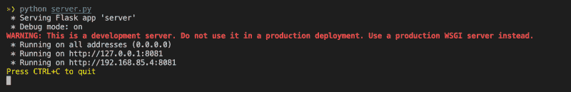
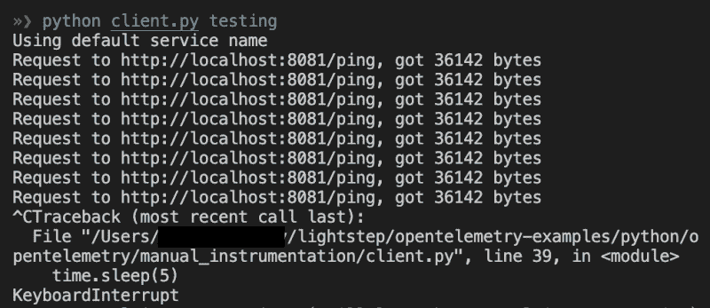
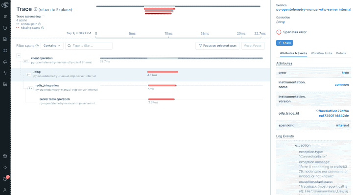

# Python 的 OpenTelemetry:手动配置和上下文传播

> 原文：<https://blog.devgenius.io/opentelemetry-for-python-the-hard-way-aa3507b87343?source=collection_archive---------4----------------------->


渥太华里多运河船闸的开关装置。Adri Villela 的照片。

在我的[上一篇博文](https://lightstep.com/blog/auto-instrumentation-is-magic-using-opentelemetry-python-with-lightstep)中，我向你们展示了如何用 [OpenTelemetry (OTel)](https://lightstep.com/blog/opentelemetry.io) ，à la [自动检测](https://lightstep.com/blog/auto-instrumentation-is-magic-using-opentelemetry-python-with-lightstep#automatic-instrumentation--python)来检测 Python 代码。您可能还记得，在那篇文章中，我[建议使用 Python 自动插装二进制文件](https://lightstep.com/blog/auto-instrumentation-is-magic-using-opentelemetry-python-with-lightstep#should-i-always-use-the-auto-instrumentation-agent)，即使对于非自动插装的库也是如此，因为它很好地抽象了所有讨厌的 OTel 配置内容。当您使用它，以及任何适用的 Python auto[-instrumentation 库](https://github.com/open-telemetry/opentelemetry-python-contrib/tree/main/instrumentation)(由[open telemetry-bootstrap](https://github.com/open-telemetry/opentelemetry-python-contrib/tree/main/opentelemetry-instrumentation#opentelemetry-bootstrap)安装)时，它会为您处理相关服务间的上下文传播。

总之，它让我们的生活变得美好而简单！

好了，今天，我的朋友们，我们要折磨一下自己，因为我们要把自动检测二进制放在一边，取而代之的是深入研究 Python 的超级人工 OpenTelemetry 检测。由于我们没有自动仪器作为我们的安全保障，我们将不得不学习如何做以下事情:

*   配置 OpenTelemetry for Python，将测量数据发送到支持 [OTLP](https://github.com/open-telemetry/opentelemetry-specification/blob/main/specification/protocol/otlp.md) 的可观测性后端。剧透:我们将使用 [Lightstep](http://app.lightstep.com) 作为我们的观测后端。✅
*   跨相关服务传播上下文，以便它们显示为同一跟踪✅的一部分

> *我不会深入探讨如何用 OTel 为 Python 创建跨度，因为* [*官方 OTel 文档*](https://opentelemetry.io/docs/instrumentation/python) *已经做得很好了。*

你害怕吗？别担心，因为我已经想通了，所以你不用担心！

你准备好了吗？我们开始吧！！

# 先决条件

在我们开始我们的教程之前，这里有一些你需要的东西:

*   基本了解 [Python](https://www.python.org/) 和 [Python 虚拟环境](https://realpython.com/python-virtual-environments-a-primer)
*   对 [OpenTelemetry](https://lightstep.com/blog/opentelemetry.io) 的基本了解。如果你需要的话，我建议查看一下官方 OTel 文档。

如果您想运行第 2 部分中的完整代码示例，您还需要:

*   一个[光步可观察性账户](https://app.lightstep.com/signup/developer?signup_source=docs)
*   一个 [Lightstep 访问令牌](https://docs.lightstep.com/docs/create-and-manage-access-tokens)告诉 Lightstep 将你的跟踪发送到什么项目
*   基本了解如何使用[光步可观性](http://app.lightstep.com/)
*   一个 [Python](https://www.python.org/downloads) 的工作装置

# 第 1 部分:发生了什么？

我们将通过一个客户端和服务器应用程序用 OpenTelemetry 演示 Python 手动工具。客户端将调用服务器托管的一个`/ping`端点。

本教程中的示例可在[light step/open telemetry-examples](https://github.com/lightstep/opentelemetry-examples/tree/main/python/opentelemetry/manual_instrumentation)repo 中找到。我们将使用三个主要文件:

*   [common.py](https://github.com/lightstep/opentelemetry-examples/blob/main/python/opentelemetry/manual_instrumentation/common.py) — OTel 配置和连接(连接到 Lightstep)
*   [client.py](https://github.com/lightstep/opentelemetry-examples/blob/main/python/opentelemetry/manual_instrumentation/client.py) —连接到我们服务器的`/ping`端点
*   [server.py](https://github.com/lightstep/opentelemetry-examples/blob/main/python/opentelemetry/manual_instrumentation/server.py) —托管`/ping`端点

在运行示例代码之前，我们必须首先理解它在做什么。

## 1- OTel 库

为了将 OpenTelemetry 数据发送到可观测性后端(如 Lightstep)，您需要安装以下 ***OpenTelemetry 包*** ，这些包包含在 [requirements.txt](https://github.com/lightstep/opentelemetry-examples/blob/main/python/opentelemetry/manual_instrumentation/requirements.txt) 中:

```
opentelemetry-api
opentelemetry-sdk
opentelemetry-exporter-otlp-proto-grpc
```

正如你所看到的，我们正在安装 OpenTelemetry API 和 SDK 包，以及用于通过 [gRPC](https://opentelemetry.io/docs/concepts/glossary/#grpc) 将 OTel 数据发送到你的 Observability 后端(例如 Lightstep)。

## 2- OTel 设置和配置(common.py)

在我们的例子中，OTel 设置和配置是在 [common.py](https://github.com/lightstep/opentelemetry-examples/blob/main/python/opentelemetry/manual_instrumentation/common.py) 中完成的。我们将事情分解到这个单独的文件中，这样我们就不必在 [client.py](https://github.com/lightstep/opentelemetry-examples/blob/main/python/opentelemetry/manual_instrumentation/client.py) 和 [server.py](https://github.com/lightstep/opentelemetry-examples/blob/main/python/opentelemetry/manual_instrumentation/server.py) 中重复这段代码。

首先，我们必须导入所需的 OTel 包:

```
from opentelemetry import trace
from opentelemetry.exporter.otlp.proto.grpc.trace_exporter import OTLPSpanExporter
from opentelemetry.sdk.resources import SERVICE_NAME, Resource
from opentelemetry.sdk.trace import TracerProvider
from opentelemetry.sdk.trace.export import BatchSpanProcessor
```

接下来，我们必须配置导出器。导出器是我们向 OpenTelemetry 发送数据的方式。正如我前面提到的，Lightstep 接受 OTLP 格式的数据，所以我们需要定义一个 OTLP 导出器。

> *有些厂商不接受 OTLP 格式的数据，这意味着你需要使用一个* [*特定于厂商的导出器*](https://opentelemetry.io/registry/?language=go&component=exporter) *来向他们发送数据。*

我们在 Python 中这样配置我们的导出器:

```
def get_otlp_exporter():
   ls_access_token = os.environ.get("LS_ACCESS_TOKEN")
   return OTLPSpanExporter(
       endpoint="ingest.lightstep.com:443",
       headers=(("lightstep-access-token", ls_access_token),),
   )
```

一些值得注意的事项:

*   将`endpoint`设置为`ingest.lightstep.com:443`，指向 Lightstep 的公共微卫星池。如果您使用的是内部卫星池，请查看这些文档。
*   您需要用自己的 [Lightstep 访问令牌](https://docs.lightstep.com/docs/create-and-manage-access-tokens)来设置`LS_ACCESS_TOKEN`环境变量。

最后，我们配置跟踪提供程序。一个`TracerProvider`作为 OpenTelemetry API 的入口点。它提供对`Tracer`的访问。A `Tracer`负责创建一个[跨度](https://opentelemetry.io/docs/concepts/observability-primer/#spans)来跟踪给定的操作。

我们在 Python 中这样配置我们的 Tracer Provider:

一些值得注意的事项:

*   我们定义了一个[资源](https://github.com/open-telemetry/opentelemetry-specification/blob/main/specification/resource/sdk.md)来为 OpenTelemetry 提供一系列标识我们服务的信息，包括[服务名](https://github.com/open-telemetry/opentelemetry-python/blob/41b9e26d8324ae0496c85326b35e92bf617932d9/opentelemetry-semantic-conventions/src/opentelemetry/semconv/resource/__init__.py#L415)和[服务版本](https://github.com/open-telemetry/opentelemetry-python/blob/41b9e26d8324ae0496c85326b35e92bf617932d9/opentelemetry-semantic-conventions/src/opentelemetry/semconv/resource/__init__.py#L433)。(您可以在这里看到您可以设置的资源属性的完整列表[。)顾名思义，*服务名*是您正在检测的微服务的名称，*服务版本*是您正在检测的服务的版本。在这个例子中，我们将服务名和服务版本作为键/值传入环境变量](https://github.com/open-telemetry/opentelemetry-python/blob/main/opentelemetry-semantic-conventions/src/opentelemetry/semconv/resource/__init__.py#L433) [OTEL 资源属性](https://opentelemetry.io/docs/reference/specification/sdk-environment-variables/#general-sdk-configuration)(我们将在第 2 部分看到一些示例值)。如果环境变量不存在，那么我们设置一个默认服务名`"test-py-manual-otlp"`。
*   我们正在使用 [BatchSpanProcessor](https://github.com/open-telemetry/opentelemetry-specification/blob/main/specification/trace/sdk.md#batching-processor) ，这意味着我们正在告诉 OTel 批量导出数据。出于这个例子的目的，我们不做任何超出基本配置的事情。

## 3-初始化(client.py 和 server.py)

我们终于准备好向 Lightstep 发送数据了！我们需要做的就是从`client.py`(第[行 17-20](https://github.com/lightstep/opentelemetry-examples/blob/49f018f2cb529a5c0def6109c7e0bfda791e1164/python/opentelemetry/manual_instrumentation/client.py#L17-L20) )和`server.py`(第[行 17](https://github.com/lightstep/opentelemetry-examples/blob/49f018f2cb529a5c0def6109c7e0bfda791e1164/python/opentelemetry/manual_instrumentation/server.py#L17) 和[行 29](https://github.com/lightstep/opentelemetry-examples/blob/49f018f2cb529a5c0def6109c7e0bfda791e1164/python/opentelemetry/manual_instrumentation/server.py#L29) )调用 [common.py](https://github.com/lightstep/opentelemetry-examples/blob/main/python/opentelemetry/manual_instrumentation/common.py) 的`get_tracer`函数，就像这样:

```
from common import get_tracer

...

tracer = get_tracer()

...
```

初始化完成后，我们需要检测我们的代码，这意味着我们需要创建 Spans。我不会在这里讨论 Span 创建的细节，因为 OTel 文档在这方面做得很好，正如我在介绍中提到的，这超出了本文的范围。

然而，我将简要地提到有几种方法可以在 Python 中检测我们的代码，您将在示例代码中看到两种创建 Span 的方法:[使用 with 语句](https://opentelemetry.io/docs/instrumentation/python/manual/#creating-spans)和[使用函数装饰符](https://opentelemetry.io/docs/instrumentation/python/manual/#creating-spans-with-decorators)。

您可以在 [client.py 的第 23–32 行](https://github.com/lightstep/opentelemetry-examples/blob/49f018f2cb529a5c0def6109c7e0bfda791e1164/python/opentelemetry/manual_instrumentation/client.py#L23-L32)中看到使用 [with 语句](https://opentelemetry.io/docs/instrumentation/python/manual/#creating-spans)创建 Span 的示例。下面是完整的函数列表:

Span 用行`with tracer.start_as_current_span("client operation"):`初始化，该行以下的所有内容都在该 Span 的范围内。

你可以在 [server.py 第 78 行](https://github.com/lightstep/opentelemetry-examples/blob/49f018f2cb529a5c0def6109c7e0bfda791e1164/python/opentelemetry/manual_instrumentation/server.py#L78)中看到一个使用[函数装饰器](https://opentelemetry.io/docs/instrumentation/python/manual/#creating-spans-with-decorators)创建 Span 的例子。下面是完整的函数列表:

一些值得注意的事项:

*   线`@tracer.start_as_current_span("pymongo_integration")`开始`pymongo_integration`功能的跨度。该函数中的所有内容都在该跨度的范围内。
*   您可能也注意到了，我们在那里初始化了另一个 span，使用了行，`with tracer.start_as_current_span("server pymongo operation"):`，( [server.py，Line 89](https://github.com/lightstep/opentelemetry-examples/blob/49f018f2cb529a5c0def6109c7e0bfda791e1164/python/opentelemetry/manual_instrumentation/server.py#L89) )。这意味着我们最终得到了[嵌套的跨度](https://opentelemetry.io/docs/instrumentation/python/manual/#creating-nested-spans)(跨度中的跨度)。

## 5-上下文传播

正如我在介绍中提到的，使用 Python 自动插装的一个优点是它为您处理跨服务的上下文传播。然而，如果您不使用自动插装，您必须自己处理上下文传播。太好了。太好了。

但是在我们深入研究如何做到这一点之前，我们需要首先理解上下文传播。

定义时间！

**上下文**表示关联跨越流程边界的跨度的信息。

**传播**是一种方法，通过这种方法，上下文在服务中以及跨服务进行捆绑和传输，通常是通过 HTTP 头。

这意味着当一个服务调用另一个服务时，它们将作为同一个[跟踪](https://opentelemetry.io/docs/concepts/observability-primer/#distributed-traces)的一部分链接在一起。然而，如果您走纯手工插装的路线(就像我们今天正在做的)，您必须确保您的上下文在相互调用的服务之间传播，否则您将会以单独的、不相关的(即使它们应该是相关的)跟踪结束。

我不得不承认，我绞尽脑汁试图弄清楚这种上下文传播的东西。在花了很多时间在谷歌上搜索并向周围的人寻求澄清后，我终于明白了，所以我将在这里与你分享这篇文章，希望能减轻你的压力。

> *虽然 open 遥测文档确实对如何在 Python 中进行* [*手动上下文传播提供了一些见解*](https://opentelemetry.io/docs/instrumentation/python/cookbook/#manually-setting-span-context) *，但是该文档需要一些工作。我实际上是*[*open 遥测通信信号*](https://github.com/open-telemetry/opentelemetry.io) *的一部分，所以我以此为动力来改进围绕这个主题的文档……也请关注 OTel 文档的更新！😎*

好吧，那么我们如何进行这个手动的上下文传播呢？首先，让我们提醒自己示例应用程序中发生了什么。我们有[客户端](https://github.com/lightstep/opentelemetry-examples/blob/49f018f2cb529a5c0def6109c7e0bfda791e1164/python/opentelemetry/manual_instrumentation/client.py)服务和[服务器](https://github.com/lightstep/opentelemetry-examples/blob/49f018f2cb529a5c0def6109c7e0bfda791e1164/python/opentelemetry/manual_instrumentation/server.py)服务。客户端服务调用服务器服务上的`/ping`端点，这意味着我们希望它们是同一个 Trace 的一部分。这反过来意味着我们必须确保它们都有相同的跟踪 ID，以便 Lightstep(和其他可观察性后端)认为它们是相关的。

在更高的层面上，我们通过以下方式实现这一目标:

*   获取客户端的跟踪标识
*   在客户端调用服务器之前将跟踪标识注入到 HTTP 头中
*   从服务器端的 HTTP 头中提取客户端的跟踪 ID

冷静点！现在让我们看看实现这一目标所需的代码。

首先，我们需要从一个叫做`carrier`的东西开始。`carrier`只是一个包含跟踪标识的键值对，看起来像这样:

```
{'traceparent': '00-a9c3b99a95cc045e573e163c3ac80a77-d99d251a8caecd06-01'}
```

其中`traceparent`为密钥，值为您的追踪 ID。请注意，上面只是跟踪 ID 可能是什么样子的一个例子。显然，您自己的跟踪 ID 会有所不同(每次运行代码时也会有所不同)。

好的，很好。`carrier`现在我们如何获得说？

首先，我们需要在[客户端导入`TraceContextTextMapPropagator`，py](https://github.com/lightstep/opentelemetry-examples/blob/main/python/opentelemetry/manual_instrumentation/client.py) :

```
from opentelemetry.trace.propagation.tracecontext import TraceContextTextMapPropagator
```

接下来，我们必须填写承运人:

```
carrier = {}
TraceContextTextMapPropagator().inject(carrier)
```

如果您在这一行之后检查`carrier`的值，您会看到它看起来像这样:

```
{'traceparent': '00-a9c3b99a95cc045e573e163c3ac80a77-d99d251a8caecd06-01'}
```

眼熟吗？🤯

现在我们有了`carrier`，我们需要在调用服务器之前将它放入我们的 HTTP 头中。

```
header = {"traceparent": carrier["traceparent"]}
res = requests.get(url, headers=header)
```

瞧！您的运营商在 HTTP 请求中！

现在我们知道了所有这些片段的作用，让我们把它们放在一起。下面是我们的客户端代码:

有关完整的代码清单，请查看 [client.py](https://github.com/lightstep/opentelemetry-examples/blob/49f018f2cb529a5c0def6109c7e0bfda791e1164/python/opentelemetry/manual_instrumentation/client.py) 。

好的……我们已经解决了客户端的问题。耶！现在让我们转到服务器端，从 HTTP 请求中取出我们的`carrier`。

在 [server.py](https://github.com/lightstep/opentelemetry-examples/blob/main/python/opentelemetry/manual_instrumentation/server.py) 中，我们像这样从我们的头中取出`traceparent`的值:

```
traceparent = get_header_from_flask_request(request, "traceparent")
```

我们对`get_header_from_flask_request`的定义是:

```
def get_header_from_flask_request(request, key):
    return request.headers.get_all(key)
```

现在我们可以从这些信息中构建我们的`carrier`:

```
carrier = {"traceparent": traceparent[0]}
```

我们用它来从这个`carrier`中提取上下文:

```
ctx = TraceContextTextMapPropagator().extract(carrier)
```

现在我们可以用上下文创建我们的跨度，`ctx`:

```
with tracer.start_as_current_span("/ping", context=ctx):
```

这里，我们将`ctx`传递给一个名为`context`的命名参数。这确保了我们的`"/ping"` Span 知道它是现有跟踪的一部分(源自我们的客户端调用)。

值得注意的是，`"/ping"`跨度的任何子跨度都不需要我们传入上下文，因为这是隐式传入的(例如，参见 [server.py，第 81 行](https://github.com/lightstep/opentelemetry-examples/blob/49f018f2cb529a5c0def6109c7e0bfda791e1164/python/opentelemetry/manual_instrumentation/server.py#L81))。

现在我们知道了所有这些片段的作用，让我们把它们放在一起。下面是我们的服务器代码:

有关完整的代码清单，请查看 [server.py](https://github.com/lightstep/opentelemetry-examples/blob/49f018f2cb529a5c0def6109c7e0bfda791e1164/python/opentelemetry/manual_instrumentation/server.py) 。

# 第 2 部分:试试看！

现在我们知道了所有这些背后的理论，让我们运行我们的例子！

## 1-克隆回购

```
git clone [https://github.com/lightstep/opentelemetry-examples.git](https://github.com/lightstep/opentelemetry-examples.git)
```

## 2-设置

让我们首先设置我们的 Python 虚拟环境:

```
cd python/opentelemetry/manual_instrumentation

python3 -m venv .
source ./bin/activate

# Install requirements.txt
pip install -r requirements.txt
```

## 3-运行服务器应用程序

我们准备好运行服务器了。确保用您自己的 [Lightstep 访问令牌](https://docs.lightstep.com/docs/create-and-manage-access-tokens)替换`<LS_ACCESS_TOKEN>`。

```
export LS_ACCESS_TOKEN="<LS_ACCESS_TOKEN>"export OTEL_RESOURCE_ATTRIBUTES=service.name=py-opentelemetry-manual-otlp-server,service.version=10.10.9python server.py
```

还记得我告诉过你我们会看到一个传入[OTEL _ 资源 _ 属性](https://opentelemetry.io/docs/reference/specification/sdk-environment-variables/#general-sdk-configuration)的值的例子吗？嗯，在这里！这里，我们传入服务名`py-opentelemetry-manual-otlp-server`和服务版本`10.10.9`。服务名称将显示在 Lightstep 浏览器中。

您的输出将如下所示:



Python server.py 服务器启动序列输出的屏幕截图。Adri Villela 拍摄的画面。

## 4-运行客户端应用程序

打开一个新的终端窗口，运行客户端应用程序。确保用您自己的 [Lightstep 访问令牌](https://docs.lightstep.com/docs/create-and-manage-access-tokens)替换`<LS_ACCESS_TOKEN>`。

PS:确保你在`opentelemetry-examples`回购根的`python/opentelemetry/manual_instrumentation`。

```
export LS_ACCESS_TOKEN = "<LS_ACCESS_TOKEN>"export OTEL_RESOURCE_ATTRIBUTES =service.name=py-opentelemetry-manual-otlp-client,service.version= 10.10.10 python client.py test
```

注意我们是如何传入服务名`py-opentelemetry-manual-otlp-client`和服务版本`10.10.10`的。服务名称将显示在 Lightstep 浏览器中。

当您运行客户端应用程序时，它会不断调用`/ping`端点。让它运行几次(也许 5-6 次左右？)，然后杀了它(à la `ctrl+c`)。样本输出:



示例 client.py 输出的屏幕截图。阿德里·维勒拉拍摄的屏幕截图。

如果您瞥一眼运行`server.py`的终端，您可能会注意到一个超级难看的堆栈跟踪。不要慌！`/ping`服务调用 [Redis](https://redis.com) 和 [MongoDB](https://www.mongodb.com) ，由于这两个服务都没有运行，您最终会得到如下令人讨厌的错误消息:


示例 server.py 程序输出运行出错的屏幕截图。Adri Villela 截屏。

## 5-在 Lightstep 中查看

如果您在 Lightstep 中通过从浏览器中选择`py-opentelemetry-manual-otlp-client`服务来进入跟踪视图(您也可以通过进入`py-opentelemetry-manual-otlp-server`服务来查看相同的内容)，您将会看到显示客户端调用服务器以及服务器内调用的其他函数的端到端跟踪。

还记得步骤 4 中堆栈跟踪吗？它在你的追踪中显示为一个错误。这很酷，因为它告诉你你有一个问题，并指出它发生在哪里！多酷啊。？



Lightstep 中 server.py 和 client.py 的端到端跟踪示例的屏幕截图。Adri Villela 截屏。

还记得我们从未将我们的上下文传递给`redis_integration`和`server redis operation`跨度，你可以看到`server redis operation`向上滚动到`redis_integration`，后者向上滚动到`/ping`，正如我所说的那样。神奇！🪄

# 最后的想法

今天我们学习了如何为 Python 手动配置 OpenTelemetry 以连接到 Lightstep(这也适用于任何接受 [OTLP 格式](https://github.com/open-telemetry/opentelemetry-specification/blob/main/specification/protocol/otlp.md)的可观测性后端)。我们还学习了如何通过手动上下文传播将相关服务链接在一起。

现在，如果您发现自己处于需要在不使用 Python 自动检测二进制文件的情况下连接到可观察性后端和/或需要跨服务手动传播上下文的情况下，您将知道如何做！

现在，请享受这可爱的小老鼠堆。从前到后:菲比，兔子，和 Mookie。我丈夫抱着它们的时候，它们很乖，安静地坐在相机前。


一堆老鼠！从前到后:菲比、邦妮和穆琪。Adri Villela 拍摄的照片。

和平、爱和准则。🌈 🦄 💫

有关于使用 Python 进行 OTel 测试的问题吗？跟我说话！你可以通过[电子邮件](mailto:devrel@lightstep.com)联系我，或者在 [Twitter](https://twitter.com/adrianamvillela) 或 [LinkedIn](https://www.linkedin.com/in/adrianavillela) 上联系我。希望收到你们的来信！

更多关于可观察性的文章，请查看我的拆包可观察性系列:


阿德里·维莱拉

## 拆包可观察性

[View list](https://adri-v.medium.com/list/unpacking-observability-be1835c6dd23?source=post_page-----aa3507b87343--------------------------------)18 stories

*最初发表于*[T5【https://lightstep.com】](https://lightstep.com/blog/opentelemetry-for-python-the-hard-way)*。*