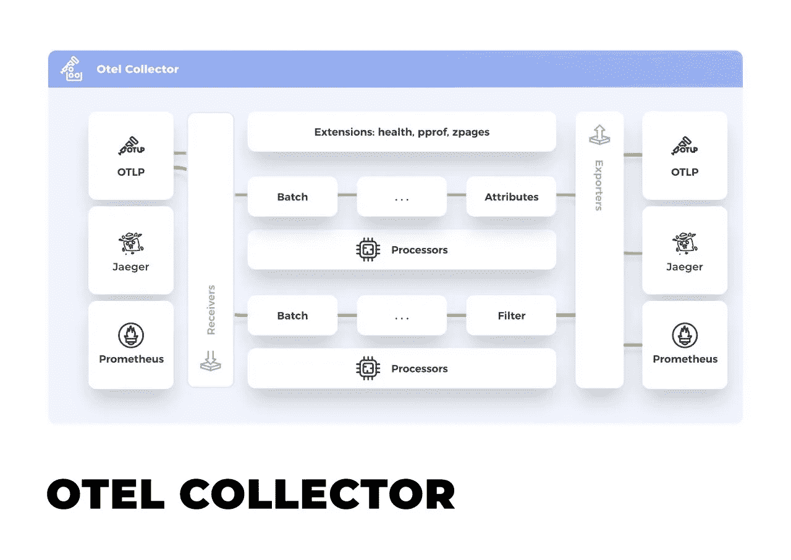
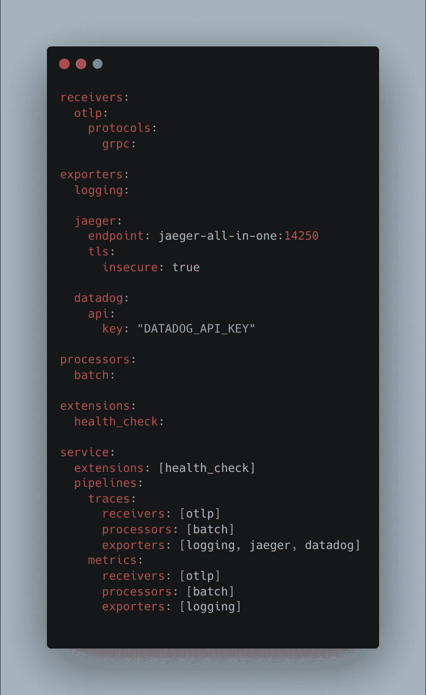
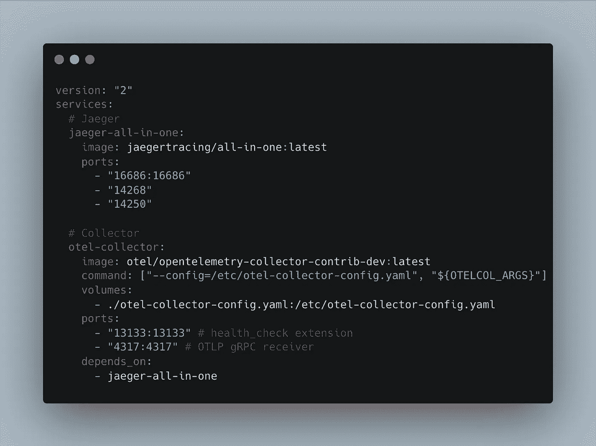
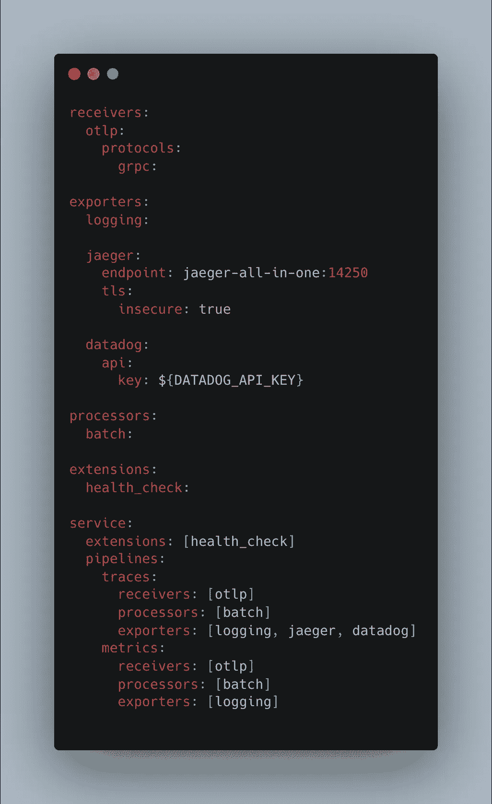
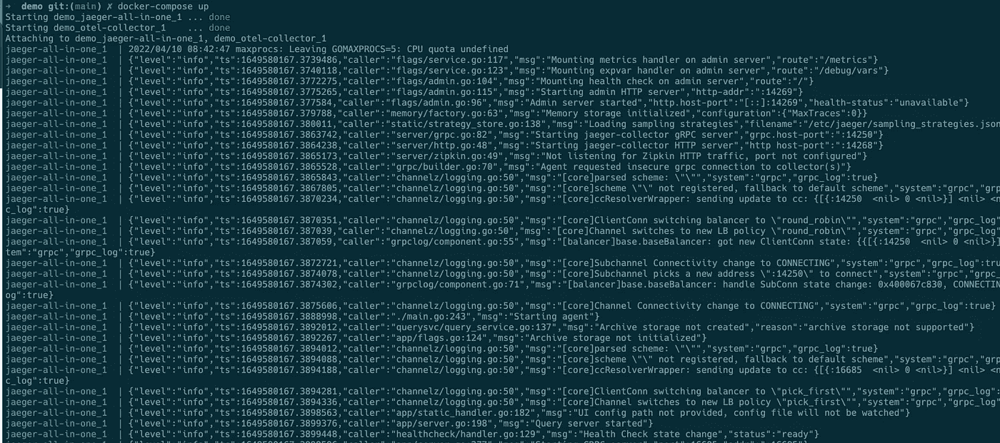
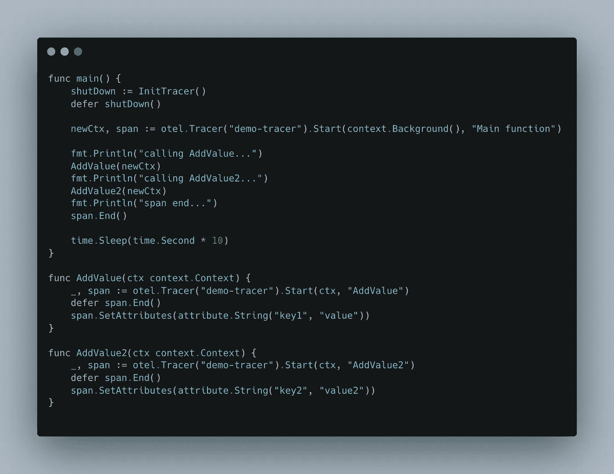
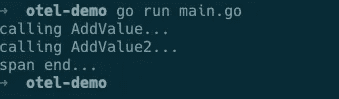
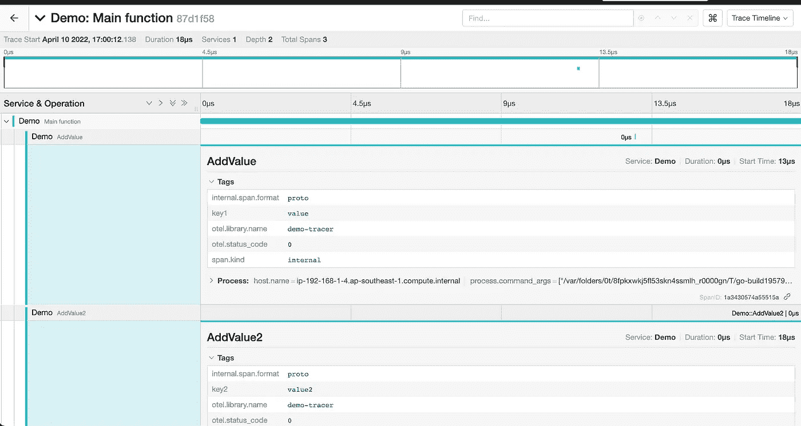
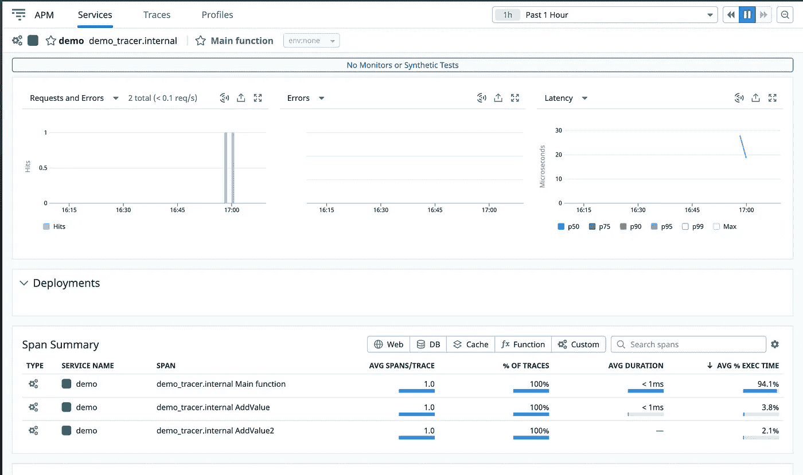
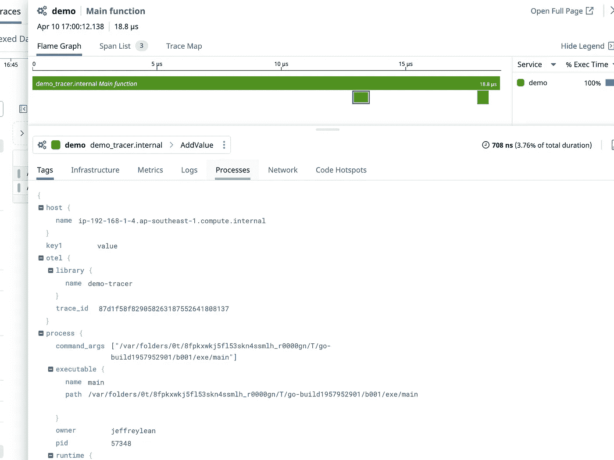

# OpenTelemetry，每个人的标准化可观察性框架

> 原文：<https://blog.devgenius.io/opentelemetry-the-standardized-observability-framework-for-everyone-76b10c4148f7?source=collection_archive---------2----------------------->

## 理解 OpenTelemetry 中的分布式跟踪概念以及在 Golang 中的实现

# TL；速度三角形定位法(dead reckoning)

最近，我被分配到一个项目中，在这个项目中，我需要与 **datadog** 集成以实现可观察性。该项目本身已经使用 **jaeger** 进行分布式追踪，由于某种原因，我们也需要与 datadog 集成。整个设置应该跟踪任何交易，并将其发送给**数据狗和耶格。**当然，我实现这一目标的直接方式是直接实现 datadog 提供的 SDK，但当我在收集更多信息以查看是否有其他更好的方式来实现这一目标时，我遇到了 al-mighty**open telemetry(OTel)**。

跟踪分布式系统可能会很复杂，尤其是当你有这么多的服务，以及多个遥测供应商，如 Jaeger，Prometheus，Datadog 等。棘手的问题是，您必须处理所有这些供应商使用的特定协议或格式，缺乏标准化会给仪器维护带来负担，并且缺乏数据可移植性。这就是为什么 **OpenTelemetry(OTel)** 被创建为[**CNCF(云本地计算基金会)**](https://www.cncf.io/) 项目，以标准化遥测数据模型、架构和可观测软件的实现。

## 开放式遥测

**OpenTelemetry** 是为您的应用程序实现遥测的标准化工具。它由一系列的**工具**、**API、**和**SDK**组成，你可以用各种主要的编程语言来实现它们。它实际上是其他 **CNCF 项目**中的 **top 2** 主动开源项目。你可以看到社区在这个项目上投入了很多努力，以真正解决我们目前面临的问题。

对于那些已经在使用其他遥测标准如[**open tracing**](https://opentracing.io/)**/**[**open census**](https://opencensus.io/)的人来说，你可能会注意到这两个项目已经合并为 **OpenTelemetry** 以实现标准化，不再需要在一个标准或其他标准之间做出决定。 **OpenTelemetry** 也为这两个项目提供了**向后兼容性**。

**OpenTelemetry** 提供单一的、**厂商无关的**仪器库，这要感谢 **Otel Collector、**支持不同的语言和后端厂商，如 **Jaeger、Datadog、Prometheus 等。**你基本上不用担心仅仅为了应付不同的供应商而修改仪器。它甚至让您能够通过一些简单的配置，以并行方式将数据发送到多个目的地。甚至从一个供应商到另一个供应商的迁移也可以毫不费力，只是您必须改变配置的问题，仅此而已。

在使用 OpenTelemetry 实现分布式跟踪之前，我们需要理解一些概念，现在让我们深入了解一下。

# 收藏者

图片来源，[https://opentelemetry.io/docs/collector/](https://opentelemetry.io/docs/collector/)

**收集器**可以说是接收、处理和输出遥测数据的机构的单点。只需配置 **Otel collector** 配置 YAML 文件，就可以操作和维护多个支持 **Jaeger、Prometheus、datadog 等**不同数据格式的代理/出口商。

otel 收集器 yaml

以上是 otel collector yaml 文件的一个例子，这里有几个 otel collector 配置的组件。这些组件是接收器、处理器、导出器、扩展和服务。

*   **接收器**:配置如何从源端获取数据到采集器。
*   **处理器**:这是一个可选配置，代表接收数据和导出数据之间的过程中介。您可以执行数据过滤、数据转换，甚至在发送数据之前对其进行批处理。
*   **导出器**:决定如何将数据发送到一个或多个卖方目的地。你可以发送数据给耶格，普罗米修斯，数据狗，卡夫卡等。所有数据导出都是并行完成的。
*   **扩展**:提供收集器主要功能之上的功能。主要用于管理和监控 otel 收集器。
*   **服务**:该部分帮助启用配置中指定的所有组件。扩展由所有启用的扩展列表组成，管道由接收器、处理器和导出器组成。每个组件都必须在服务之外定义，以便将其包含在管道中。

如果通读 otel 收集器配置文件，您会注意到配置中指定了 **OTLP** 。 **OTLP** 代表 **OpenTelemetry 协议**，该协议定义了客户端和服务器之间用于交换数据的**编码**、**传输、**和**交付机制**。想象一下，您必须将数据导出到不同的遥测供应商，如 datadog 和 jaeger，那么您如何迎合每个平台所需的不同格式呢？当然，您可以手动将原始数据转换为每个平台所需的格式，或者您可以只使用 **OTLP** 格式，这是当今大多数遥测供应商支持的通用标准化格式。使用 **OTLP** 作为接收器，采集器接收的数据将为 **OTLP** 格式。

**OTLP** 是一个**请求/响应协议**，你可以通过 **HTTP/JSON** 或者 **gRPC** 接收跟踪。要了解更多关于什么是 **gRPC，**你可以参考我的另一篇博客，它主要讲述了 **gRPC** 是什么，以及与 **REST API** 的区别。下面是文章的链接，[https://medium . com/@ Jeffrey lean/grpc-the-alternative-to-rest-API-a 585 de 4 aeaf](https://medium.com/@JeffreyLean/grpc-the-alternative-to-rest-api-a585de4aeaf)。

# 演示

为了理解在分布式跟踪中使用**开放式遥测**的可用性和好处，您必须亲自看到它。因此，让我们看看如何检测一个 **Go** 应用程序。在这个例子中，我将向您展示我们如何检测一个 go 应用程序，并将跟踪信息分发给 **datadog** 和 **jaeger** 。在我们跟踪之前，让我们先设置环境。本文展示的所有代码都可以在我的 [**github repo**](https://github.com/jeffreylean/otel-demo) 中找到。

## 环境设置

**Jaeger** 官方提供了一个 docker 镜像，[**jaegertracing/all-in-one**](https://hub.docker.com/r/jaegertracing/all-in-one)在一个容器中运行所有 Jaeger 后端组件以及 UI。因此，我们将使用这个 docker 映像在本地环境中运行 jaeger。我们需要运行的另一个图像是[**otel collector**](https://hub.docker.com/r/otel/opentelemetry-collector-contrib-dev)，这是我们在这个演示中只需要运行的两个图像。datadog 呢？你可能会问，对于 datadog 来说，你所需要的只是一个 API 密钥，一旦你注册了一个帐户，他们就会提供给你。

我们还需要定义 **otel 收集器配置。**配置为 yaml 格式。在 yaml 文件中，您定义了本文前面提到的所有收集器组件，包括接收器、导出器、处理器、扩展和服务。

docker-compose.yaml

otel-collector-config.yaml

以上是我们在 docker 中设置环境所需的两个 yaml 文件。现在在文件夹目录中，你需要做的就是`docker-compose up`然后一切都设置好了！

docker 映像运行

## 找到；查出

随着 otel 收集器的运行，现在让我们开始跟踪吧！我写了一个非常简单的 go 应用程序，在我的应用程序中插入了一些函数。

在我们开始跟踪我们的应用程序之前，我们需要初始化我们的跟踪器，但是为了演示的目的，我直接跳到主函数，不要担心，完整的代码在我的存储库中，你可以随时去那里，看看如何初始化它。

初始化之后，我们可以开始跟踪我们的应用程序，正如你所看到的，我跟踪了两个不同的函数`Addvalue`和`AddValue2`。两个函数都将在自己的范围内设置各自的属性，如此而已。让我们运行我们的主函数，看看最终结果。按理说，在我们运行应用程序之后，跟踪应该由 **otel** 收集器发送给 jaeger 和 **datadog** 。

## 贼鸥

耶格结果

跨度

Tadaaaa！这是我们在 jaeger 中得到的，我们有 1 个轨迹，在这个轨迹中，有 3 个跨度，`Main function`，`AddValue`和`AddValue2`。您还可以在 span 的标签中找到我们设置的属性。

## 数据狗

数据狗结果

跨度

在 data dog 中，我们看到了与 jaeger 完全相同的东西。很神奇吧？在我们的 golang 应用程序中，我们所做的只是设置 otel tracer，而跟踪结果来自两个不同的供应商。我们不必专门使用供应商的 SDK，也不必维护多套不同的跟踪器来跟踪同一件事情。

# 结论

我们已经见证了当我们想要执行追踪时,**开放式遥测**是多么方便和有用。前一天你还在用**普罗米修斯**，第二天你想换成 jaeger，你需要做的只是把 **otel 收集器导出器**从**普罗米修斯**换成 **jaeger** 就这样，你不用修改你的代码库，或者你像我一样，你的应用程序需要向多个厂商广播你的踪迹，**打开遥测**让你得到掩护！

如果你觉得这篇文章有用，请随时关注我以获取更多内容，并帮助我达到 100 个追随者的里程碑！

# 参考

*   [**打开遥测文档**](https://opentelemetry.io/docs/)
*   [**打开遥测示例**](https://github.com/uds5501/sentry-opentelemetry-example/blob/main/main.go)